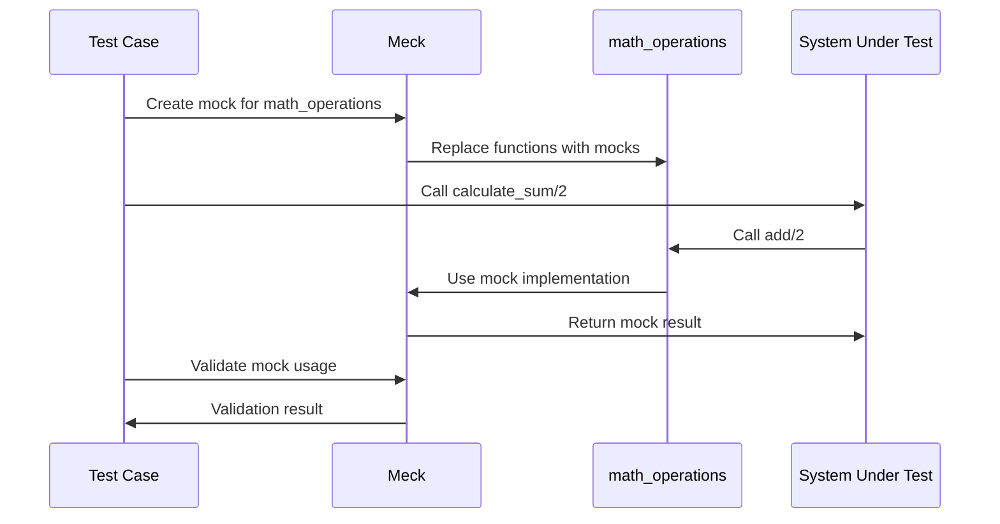

## 18.4 Mocks and Stubs with Meck

In the realm of software testing, ensuring that each component of your application functions correctly in isolation is crucial. This is where mocks and stubs come into play. They allow developers to simulate parts of the system that are not under test, enabling a focus on the specific functionality of the unit being tested. In this section, we will delve into the use of mocks and stubs in Erlang, with a particular focus on the Meck library, a powerful tool for creating mocks in Erlang.

### Understanding Mocks and Stubs

Before we dive into Meck, let's clarify what mocks and stubs are and why they are essential in testing.

- **Mocks**: These are objects that simulate the behavior of real objects. They are used to verify interactions between objects and ensure that the correct methods are called with the expected parameters. Mocks are often used in unit testing to isolate the unit of work being tested.

- **Stubs**: These are simplified implementations of an interface that return predefined responses. Unlike mocks, stubs do not verify interactions; they are used to provide controlled responses to method calls.

### The Purpose of Mocking in Tests

Mocking serves several purposes in testing:

1. **Isolation**: By replacing real objects with mocks, you can isolate the unit of work and test it independently of its dependencies.

2. **Control**: Mocks allow you to control the behavior of dependencies, making it easier to test edge cases and error conditions.

3. **Verification**: Mocks can verify that certain methods are called with the expected parameters, ensuring that the unit under test interacts correctly with its dependencies.

4. **Performance**: Mocks can improve test performance by eliminating the need for expensive operations, such as database access or network calls.

### Introducing Meck

[Meck](https://github.com/eproxus/meck) is a popular Erlang library for creating mocks. It provides a simple API for replacing modules with mock implementations, allowing you to control and verify the behavior of dependencies in your tests.

#### Key Features of Meck

- **Dynamic Mocking**: Meck allows you to create mocks at runtime, providing flexibility in your tests.
- **Function Replacement**: You can replace specific functions in a module with mock implementations.
- **Call Verification**: Meck can verify that functions are called with the expected arguments.
- **Fallback to Original Functions**: You can configure mocks to fall back to the original function if no mock implementation is provided.

### Using Meck to Create Mocks

Let's explore how to use Meck to create mocks in Erlang. We'll start with a simple example of replacing a dependency with a mock.

#### Example: Replacing a Dependency with a Mock

Suppose we have a module `math_operations` with a function `add/2` that we want to mock in our tests.

```erlang
-module(math_operations).
-export([add/2]).

add(A, B) ->
    A + B.
```

We want to test a module `calculator` that depends on `math_operations:add/2`.

```erlang
-module(calculator).
-export([calculate_sum/2]).

calculate_sum(A, B) ->
    math_operations:add(A, B).
```

To test `calculate_sum/2` in isolation, we can use Meck to mock `math_operations:add/2`.

```erlang
-module(calculator_test).
-include_lib("eunit/include/eunit.hrl").

setup() ->
    meck:new(math_operations),
    ok.

teardown() ->
    meck:unload(math_operations).

calculate_sum_test() ->
    meck:expect(math_operations, add, fun(A, B) -> A + B end),
    ?assertEqual(5, calculator:calculate_sum(2, 3)),
    meck:validate(math_operations).
```

In this example, we:

1. **Set Up the Mock**: Use `meck:new/1` to create a mock for `math_operations`.
2. **Define Expectations**: Use `meck:expect/3` to define the behavior of `add/2`.
3. **Run the Test**: Call `calculate_sum/2` and assert the expected result.
4. **Validate the Mock**: Use `meck:validate/1` to ensure that the mock was used as expected.
5. **Tear Down the Mock**: Use `meck:unload/1` to remove the mock after the test.

### Best Practices for Using Mocks

While mocks are powerful, they should be used judiciously. Here are some best practices to consider:

- **Avoid Over-Reliance**: Use mocks only when necessary. Over-reliance on mocks can lead to brittle tests that are tightly coupled to implementation details.
- **Focus on Behavior**: Use mocks to verify behavior rather than implementation details. This ensures that your tests remain robust in the face of implementation changes.
- **Combine with Other Testing Techniques**: Use mocks in conjunction with other testing techniques, such as integration tests, to ensure comprehensive test coverage.
- **Keep Tests Simple**: Avoid complex mock setups that make tests difficult to understand and maintain.

### How Mocking Aids in Testing Units in Isolation

Mocking is particularly useful in unit testing, where the goal is to test a single unit of work in isolation. By replacing dependencies with mocks, you can:

- **Isolate the Unit**: Ensure that the unit under test is not affected by the behavior of its dependencies.
- **Simulate Edge Cases**: Easily simulate edge cases and error conditions by controlling the behavior of mocks.
- **Verify Interactions**: Ensure that the unit interacts correctly with its dependencies by verifying method calls and parameters.

### Visualizing Mocking with Meck

To better understand how mocking works with Meck, let's visualize the process using a sequence diagram.



In this diagram, we see how the test case interacts with Meck to create a mock, replace functions, and validate mock usage.

### Try It Yourself

Now that we've explored the basics of mocking with Meck, try experimenting with the code examples. Here are some suggestions:

- **Modify the Mock Implementation**: Change the behavior of the mock to simulate different scenarios.
- **Add More Tests**: Create additional tests to verify different aspects of `calculate_sum/2`.
- **Mock Additional Functions**: Use Meck to mock other functions in `math_operations` and test their interactions.

### References and Further Reading

- [Meck GitHub Repository](https://github.com/eproxus/meck): Explore the official Meck repository for more information and examples.
- [Erlang Testing Guide](https://erlang.org/doc/apps/eunit/chapter.html): Learn more about testing in Erlang with EUnit.

### Knowledge Check

To reinforce your understanding of mocks and stubs with Meck, consider the following questions:

- What is the primary difference between mocks and stubs?
- How does Meck help in isolating units during testing?
- What are some best practices for using mocks in tests?

### Embrace the Journey

Remember, mastering mocks and stubs is just one step in your journey to becoming an expert in Erlang testing. Keep experimenting, stay curious, and enjoy the process of learning and improving your testing skills!

## Quiz: Mocks and Stubs with Meck



### What is the primary purpose of using mocks in testing?

- [x] To isolate the unit of work and test it independently of its dependencies.
- [ ] To replace the entire system with a mock implementation.
- [ ] To ensure that the system is tested in a production environment.
- [ ] To simulate user interactions with the system.

> **Explanation:** Mocks are used to isolate the unit of work and test it independently of its dependencies by simulating the behavior of real objects.

### Which Erlang library is commonly used for creating mocks?

- [x] Meck
- [ ] EUnit
- [ ] PropEr
- [ ] QuickCheck

> **Explanation:** Meck is a popular Erlang library for creating mocks, providing a simple API for replacing modules with mock implementations.

### What is a key feature of Meck?

- [x] Dynamic Mocking
- [ ] Static Analysis
- [ ] Code Compilation
- [ ] Performance Optimization

> **Explanation:** Meck allows for dynamic mocking, enabling the creation of mocks at runtime for flexibility in tests.

### How does Meck verify that functions are called with expected arguments?

- [x] By using the `meck:validate/1` function.
- [ ] By compiling the code with debug flags.
- [ ] By running the code in a production environment.
- [ ] By using static analysis tools.

> **Explanation:** Meck uses the `meck:validate/1` function to verify that functions are called with the expected arguments.

### What is a best practice when using mocks in tests?

- [x] Avoid over-reliance on mocks.
- [ ] Use mocks for all dependencies.
- [ ] Replace the entire system with mocks.
- [ ] Focus on implementation details.

> **Explanation:** Avoid over-reliance on mocks to prevent brittle tests and ensure that tests remain robust in the face of implementation changes.

### What is the difference between mocks and stubs?

- [x] Mocks verify interactions, while stubs provide controlled responses.
- [ ] Mocks provide controlled responses, while stubs verify interactions.
- [ ] Mocks and stubs are the same.
- [ ] Mocks are used for performance testing, while stubs are used for unit testing.

> **Explanation:** Mocks verify interactions between objects, while stubs provide controlled responses to method calls.

### How can you simulate edge cases using mocks?

- [x] By controlling the behavior of mocks to simulate different scenarios.
- [ ] By running tests in a production environment.
- [ ] By using static analysis tools.
- [ ] By replacing the entire system with mocks.

> **Explanation:** Mocks allow you to control the behavior of dependencies, making it easier to simulate edge cases and error conditions.

### What is the role of `meck:new/1` in Meck?

- [x] To create a mock for a module.
- [ ] To compile the code with debug flags.
- [ ] To run the code in a production environment.
- [ ] To perform static analysis.

> **Explanation:** The `meck:new/1` function is used to create a mock for a module, allowing for function replacement and behavior control.

### How does mocking aid in testing units in isolation?

- [x] By replacing dependencies with mocks, ensuring that the unit under test is not affected by the behavior of its dependencies.
- [ ] By running tests in a production environment.
- [ ] By using static analysis tools.
- [ ] By replacing the entire system with mocks.

> **Explanation:** Mocking aids in testing units in isolation by replacing dependencies with mocks, ensuring that the unit under test is not affected by the behavior of its dependencies.

### True or False: Mocks can improve test performance by eliminating the need for expensive operations.

- [x] True
- [ ] False

> **Explanation:** Mocks can improve test performance by eliminating the need for expensive operations, such as database access or network calls, by simulating the behavior of real objects.


