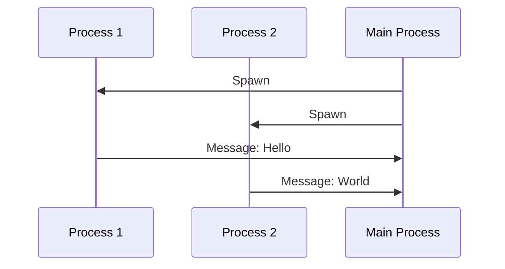

## 18.5 Testing Concurrent and Distributed Systems

Testing concurrent and distributed systems presents unique challenges that require specialized strategies and tools. In this section, we will delve into the complexities of testing such systems in Erlang, a language renowned for its concurrency and fault-tolerance capabilities. We will explore issues like non-determinism, race conditions, and timing, and provide strategies for simulating concurrent environments. Additionally, we will discuss the use of tools like [Concuerror](https://github.com/parapluu/Concuerror) for systematic testing, highlight the importance of stress testing and fault injection, and encourage rigorous testing to ensure reliability.

### Understanding the Challenges

#### Non-Determinism

Non-determinism in concurrent systems arises from the unpredictable order of events, such as message passing between processes. This can lead to different outcomes in different runs of the same program, making it difficult to reproduce bugs.

#### Race Conditions

Race conditions occur when the behavior of a system depends on the relative timing of events, such as the order in which processes access shared resources. These conditions can lead to inconsistent states and are notoriously difficult to detect and debug.

#### Timing Issues

Timing issues in distributed systems can arise from network latency, process scheduling, and other factors that affect the timing of events. These issues can lead to unexpected behavior and failures.

### Strategies for Testing Concurrent Systems

#### Systematic Testing with Concuerror

Concuerror is a tool designed for systematic testing of concurrent Erlang programs. It explores different interleavings of concurrent processes to detect race conditions and other concurrency-related bugs.

```erlang
-module(example).
-export([start/0, process/1]).

start() ->
    Pid1 = spawn(fun() -> process(1) end),
    Pid2 = spawn(fun() -> process(2) end),
    Pid1 ! {self(), "Hello"},
    Pid2 ! {self(), "World"}.

process(Id) ->
    receive
        {From, Msg} ->
            io:format("Process ~p received message: ~p~n", [Id, Msg]),
            From ! {self(), ok}
    end.
```

To test this module with Concuerror, run:

```shell
$ concuerror --module example --entry start
```

Concuerror systematically explores different execution paths to identify potential race conditions.

#### Stress Testing

Stress testing involves subjecting the system to high loads to evaluate its performance and stability. This can help identify bottlenecks and ensure the system can handle peak loads.

#### Fault Injection

Fault injection involves deliberately introducing errors into the system to test its fault tolerance and recovery mechanisms. This can help ensure the system behaves correctly under adverse conditions.

### Simulating Concurrent Environments

Simulating concurrent environments can help identify issues that may not be apparent in a single-threaded context. This involves creating test scenarios that mimic real-world concurrent interactions.

#### Using Erlang's Built-in Tools

Erlang provides several built-in tools for testing concurrent systems, such as EUnit and Common Test. These tools can be used to create test cases that simulate concurrent interactions.

```erlang
-module(example_test).
-include_lib("eunit/include/eunit.hrl").

start_test() ->
    Pid1 = spawn(fun() -> example:process(1) end),
    Pid2 = spawn(fun() -> example:process(2) end),
    Pid1 ! {self(), "Hello"},
    Pid2 ! {self(), "World"},
    receive
        {Pid1, ok} -> ok;
        {Pid2, ok} -> ok
    end.
```

### Importance of Rigorous Testing

Rigorous testing is essential to ensure the reliability of concurrent and distributed systems. This involves not only testing for functional correctness but also for performance, scalability, and fault tolerance.

#### Key Considerations

- **Test Coverage**: Ensure that all possible execution paths are tested.
- **Reproducibility**: Use tools like Concuerror to reproduce bugs consistently.
- **Scalability**: Test the system under different loads to ensure it scales effectively.
- **Fault Tolerance**: Use fault injection to test the system's ability to recover from failures.

### Visualizing Concurrency and Distribution

To better understand the flow of messages and interactions in a concurrent system, we can use diagrams to visualize the process interactions.



This sequence diagram illustrates the interactions between processes in the example module.

### Try It Yourself

Experiment with the provided code examples by modifying the messages or the number of processes. Observe how these changes affect the behavior of the system and the results of the Concuerror tests.

### References and Further Reading

- [Concuerror GitHub Repository](https://github.com/parapluu/Concuerror)
- [Erlang's EUnit Documentation](https://erlang.org/doc/apps/eunit/chapter.html)
- [Common Test User's Guide](https://erlang.org/doc/apps/common_test/users_guide.html)

### Knowledge Check

- What are the main challenges in testing concurrent systems?
- How does Concuerror help in detecting race conditions?
- Why is fault injection important in testing distributed systems?

### Embrace the Journey

Remember, testing concurrent and distributed systems is a complex but rewarding process. As you progress, you'll gain a deeper understanding of the intricacies of concurrency and distribution. Keep experimenting, stay curious, and enjoy the journey!

## Quiz: Testing Concurrent and Distributed Systems



### What is a common challenge in testing concurrent systems?

- [x] Non-determinism
- [ ] Determinism
- [ ] Static typing
- [ ] Lack of concurrency

> **Explanation:** Non-determinism is a common challenge in testing concurrent systems due to the unpredictable order of events.

### Which tool is used for systematic testing of concurrent Erlang programs?

- [x] Concuerror
- [ ] EUnit
- [ ] Dialyzer
- [ ] Tsung

> **Explanation:** Concuerror is specifically designed for systematic testing of concurrent Erlang programs.

### What is the purpose of fault injection in testing?

- [x] To test fault tolerance and recovery mechanisms
- [ ] To increase system performance
- [ ] To reduce code complexity
- [ ] To improve user interface

> **Explanation:** Fault injection is used to test a system's fault tolerance and recovery mechanisms by deliberately introducing errors.

### How can stress testing benefit a distributed system?

- [x] By identifying bottlenecks and ensuring stability under load
- [ ] By simplifying the codebase
- [ ] By reducing network latency
- [ ] By increasing code readability

> **Explanation:** Stress testing helps identify bottlenecks and ensures the system remains stable under high loads.

### What does Concuerror systematically explore?

- [x] Different interleavings of concurrent processes
- [ ] Static code analysis
- [ ] User interface design
- [ ] Database schema

> **Explanation:** Concuerror systematically explores different interleavings of concurrent processes to detect race conditions.

### Why is reproducibility important in testing concurrent systems?

- [x] To consistently reproduce bugs for debugging
- [ ] To increase code execution speed
- [ ] To improve user experience
- [ ] To enhance graphical design

> **Explanation:** Reproducibility is crucial for consistently reproducing bugs, which aids in debugging concurrent systems.

### What is a race condition?

- [x] A situation where the behavior depends on the timing of events
- [ ] A type of data structure
- [ ] A method for optimizing algorithms
- [ ] A network protocol

> **Explanation:** A race condition occurs when the behavior of a system depends on the timing of events, such as access to shared resources.

### How can diagrams help in understanding concurrent systems?

- [x] By visualizing process interactions and message flows
- [ ] By simplifying code syntax
- [ ] By reducing execution time
- [ ] By enhancing color schemes

> **Explanation:** Diagrams help visualize process interactions and message flows, aiding in understanding concurrent systems.

### What is the role of EUnit in Erlang?

- [x] To provide a framework for unit testing
- [ ] To optimize database queries
- [ ] To design user interfaces
- [ ] To manage network connections

> **Explanation:** EUnit is a framework for unit testing in Erlang, allowing developers to write and run test cases.

### True or False: Stress testing is only useful for identifying performance issues.

- [ ] True
- [x] False

> **Explanation:** Stress testing is useful not only for identifying performance issues but also for ensuring system stability under load.


