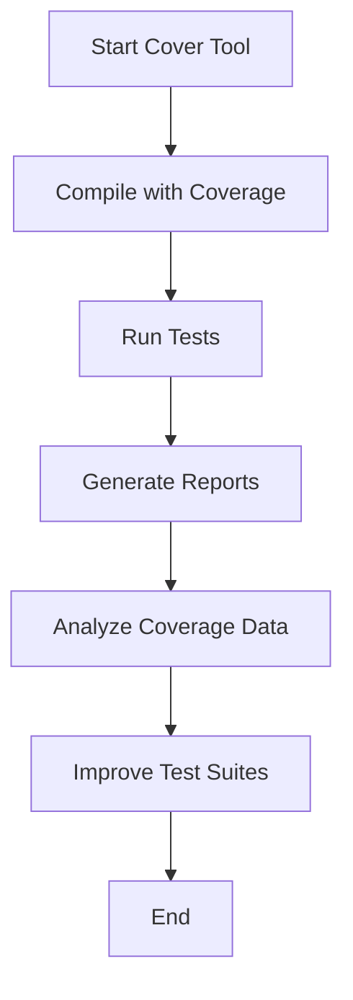

## 18.6 Code Coverage Analysis with Cover

In the realm of software development, ensuring that your code is thoroughly tested is crucial for maintaining high-quality applications. Code coverage analysis is a powerful technique that helps developers understand which parts of their codebase are exercised by tests. In Erlang, the Cover tool provides a robust solution for analyzing code coverage, allowing developers to identify untested code and improve their test suites. This section will guide you through the process of using the Cover tool, interpreting coverage data, and leveraging this information to enhance your testing strategy.

### Introduction to the Cover Tool

The Cover tool is an integral part of the Erlang/OTP suite, designed to measure code coverage in Erlang applications. It provides insights into which lines of code are executed during test runs, helping developers identify gaps in their test coverage. By using Cover, you can ensure that your tests are comprehensive and that your application behaves as expected in various scenarios.

#### Key Features of the Cover Tool

- **Line and Function Coverage**: Cover provides detailed reports on which lines and functions have been executed during tests.
- **HTML Reports**: The tool can generate human-readable HTML reports that visualize coverage data.
- **Integration with EUnit**: Cover seamlessly integrates with EUnit, Erlang's unit testing framework, to provide coverage analysis during test execution.
- **Customizable Analysis**: Developers can configure Cover to focus on specific modules or functions, tailoring the analysis to their needs.

### Setting Up Cover for Your Project

Before diving into coverage analysis, you need to set up Cover for your Erlang project. This involves compiling your code with coverage information and running your tests with the Cover tool enabled.

#### Step-by-Step Setup

1. **Compile with Coverage Information**: Use the `cover:compile/1` function to compile your modules with coverage information. This step is crucial as it prepares your code for coverage analysis.

   ```erlang
   % Compile the module with coverage information
   cover:compile_module(my_module).
   ```

2. **Start the Cover Tool**: Initialize the Cover tool using `cover:start/0`. This step is necessary to begin the coverage analysis process.

   ```erlang
   % Start the Cover tool
   cover:start().
   ```

3. **Run Your Tests**: Execute your tests using EUnit or any other testing framework. Ensure that the tests are comprehensive and cover various scenarios.

   ```erlang
   % Run EUnit tests
   eunit:test(my_module).
   ```

4. **Generate Coverage Reports**: After running your tests, generate coverage reports using `cover:analyze/1`. This function produces detailed reports that highlight which parts of your code were executed.

   ```erlang
   % Generate coverage reports
   cover:analyze(my_module).
   ```

### Generating and Interpreting Coverage Reports

Once you have set up Cover and run your tests, the next step is to generate and interpret the coverage reports. These reports provide valuable insights into your test coverage and help you identify areas that require additional testing.

#### Generating HTML Reports

Cover can generate HTML reports that visualize coverage data in a user-friendly format. These reports highlight covered and uncovered lines, making it easy to identify gaps in your test coverage.

```erlang
% Generate an HTML report
cover:export(my_module, "coverage_report.html").
```

#### Interpreting Coverage Data

When interpreting coverage data, it's essential to focus on meaningful coverage rather than striving for 100% coverage. Here are some key points to consider:

- **Identify Untested Code**: Look for lines or functions that are not covered by tests. These areas may contain bugs or unhandled edge cases.
- **Assess Test Quality**: High coverage does not necessarily mean high-quality tests. Ensure that your tests are meaningful and cover various scenarios.
- **Prioritize Critical Code**: Focus on covering critical parts of your application, such as business logic and error handling.

### Improving Test Suites with Coverage Analysis

Coverage analysis is not just about identifying untested code; it's also a tool for improving your test suites. By analyzing coverage data, you can enhance your tests and ensure that your application is robust and reliable.

#### Strategies for Improving Test Coverage

1. **Add Tests for Untested Code**: Use coverage reports to identify untested code and add tests to cover these areas. Focus on edge cases and error handling.

2. **Refactor Tests for Clarity**: Ensure that your tests are clear and concise. Refactor complex tests to improve readability and maintainability.

3. **Use Property-Based Testing**: Consider using property-based testing frameworks like PropEr to generate a wide range of test cases automatically.

4. **Leverage Mocks and Stubs**: Use mocks and stubs to isolate components and test them independently. This approach can help you achieve higher coverage for complex systems.

### Visualizing Coverage with Diagrams

To better understand the coverage analysis process, let's visualize it using a flowchart. This diagram illustrates the steps involved in setting up and running coverage analysis with the Cover tool.



**Diagram Description**: This flowchart represents the process of using the Cover tool for coverage analysis. It starts with initializing the Cover tool, compiling code with coverage information, running tests, generating reports, analyzing coverage data, and improving test suites.

### Try It Yourself: Experiment with Coverage Analysis

To deepen your understanding of coverage analysis, try experimenting with the Cover tool in your projects. Here are some suggestions:

- **Modify Test Cases**: Add or remove test cases and observe how coverage reports change. This exercise will help you understand the impact of tests on coverage.
- **Focus on Specific Modules**: Use Cover to analyze specific modules or functions. This approach can help you target critical areas of your application.
- **Explore Property-Based Testing**: Integrate property-based testing frameworks like PropEr into your test suite and observe how they affect coverage.

### References and Further Reading

- [Erlang Cover Tool Documentation](https://erlang.org/doc/man/cover.html)
- [EUnit Testing Framework](https://erlang.org/doc/apps/eunit/chapter.html)
- [Property-Based Testing with PropEr](https://proper-testing.github.io/)

### Knowledge Check

Before we conclude, let's reinforce what we've learned with a few questions:

- What is the primary purpose of the Cover tool in Erlang?
- How can you generate HTML reports using the Cover tool?
- Why is it important to focus on meaningful coverage rather than 100% coverage?
- What strategies can you use to improve your test suites based on coverage analysis?

### Embrace the Journey

Remember, code coverage analysis is a journey, not a destination. As you continue to refine your test suites and improve coverage, you'll build more robust and reliable applications. Keep experimenting, stay curious, and enjoy the process of continuous improvement!

## Quiz: Code Coverage Analysis with Cover



### What is the primary purpose of the Cover tool in Erlang?

- [x] To measure code coverage in Erlang applications
- [ ] To compile Erlang code
- [ ] To deploy Erlang applications
- [ ] To manage Erlang dependencies

> **Explanation:** The Cover tool is designed to measure code coverage, helping developers understand which parts of their code are exercised by tests.

### How can you generate HTML reports using the Cover tool?

- [x] By using the `cover:export/2` function
- [ ] By using the `cover:start/0` function
- [ ] By using the `cover:compile/1` function
- [ ] By using the `cover:analyze/1` function

> **Explanation:** The `cover:export/2` function is used to generate HTML reports that visualize coverage data.

### Why is it important to focus on meaningful coverage rather than 100% coverage?

- [x] Because high coverage does not necessarily mean high-quality tests
- [ ] Because 100% coverage is always achievable
- [ ] Because coverage analysis is not important
- [ ] Because tests are not necessary

> **Explanation:** Meaningful coverage ensures that tests are comprehensive and cover various scenarios, rather than just achieving a high percentage.

### What strategies can you use to improve your test suites based on coverage analysis?

- [x] Add tests for untested code
- [x] Refactor tests for clarity
- [ ] Remove all tests
- [ ] Ignore coverage reports

> **Explanation:** Adding tests for untested code and refactoring tests for clarity are effective strategies for improving test suites.

### Which function is used to compile modules with coverage information?

- [x] `cover:compile_module/1`
- [ ] `cover:start/0`
- [ ] `cover:analyze/1`
- [ ] `cover:export/2`

> **Explanation:** The `cover:compile_module/1` function is used to compile modules with coverage information, preparing them for analysis.

### What is the first step in setting up the Cover tool?

- [x] Start the Cover tool using `cover:start/0`
- [ ] Run tests using EUnit
- [ ] Generate coverage reports
- [ ] Compile modules with coverage information

> **Explanation:** Starting the Cover tool with `cover:start/0` is the first step in setting up coverage analysis.

### How does the Cover tool integrate with EUnit?

- [x] It provides coverage analysis during test execution
- [ ] It replaces EUnit as a testing framework
- [ ] It compiles EUnit tests
- [ ] It deploys EUnit tests

> **Explanation:** The Cover tool integrates with EUnit to provide coverage analysis during test execution, enhancing the testing process.

### What is a benefit of using property-based testing?

- [x] It generates a wide range of test cases automatically
- [ ] It reduces test coverage
- [ ] It eliminates the need for tests
- [ ] It simplifies code compilation

> **Explanation:** Property-based testing frameworks like PropEr automatically generate a wide range of test cases, improving test coverage and quality.

### What is the purpose of generating coverage reports?

- [x] To identify untested code and improve test suites
- [ ] To deploy applications
- [ ] To compile code
- [ ] To manage dependencies

> **Explanation:** Generating coverage reports helps identify untested code and improve test suites, ensuring comprehensive testing.

### True or False: Achieving 100% code coverage guarantees high-quality tests.

- [ ] True
- [x] False

> **Explanation:** Achieving 100% code coverage does not guarantee high-quality tests. It's important to focus on meaningful coverage that ensures comprehensive testing.


