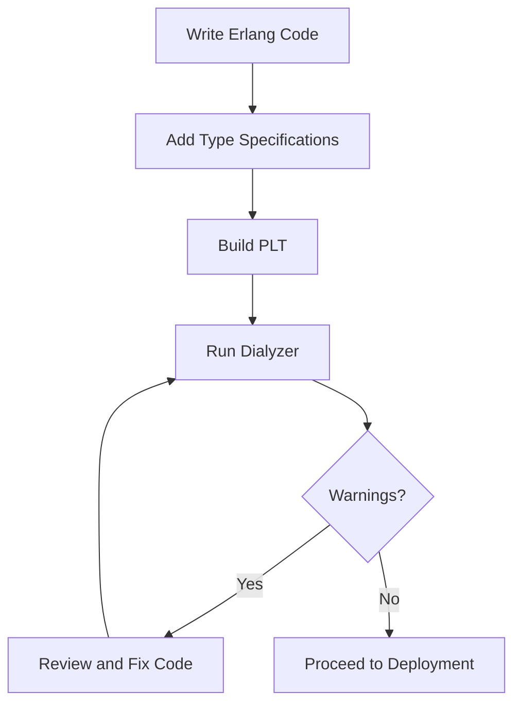

## 18.7 Static Code Analysis with Dialyzer

In the world of software development, ensuring code quality is paramount. Erlang, with its robust concurrency and fault-tolerance features, is no exception. One of the most powerful tools in the Erlang ecosystem for static code analysis is Dialyzer. This tool helps developers identify type discrepancies and potential errors in their code, leading to more reliable and maintainable applications. In this section, we will explore how Dialyzer works, how to configure it for your projects, and the benefits of integrating it into your development process.

### Understanding Dialyzer

Dialyzer, short for DIscrepancy AnaLYZer for ERlang programs, is a static analysis tool that identifies software discrepancies such as type errors, unreachable code, and unnecessary tests. Unlike traditional type checkers, Dialyzer uses a concept called "success typing," which is more flexible and less intrusive.

#### How Dialyzer Works

Dialyzer analyzes Erlang code to detect:

- **Type Discrepancies**: It identifies places where the code does not behave as expected due to type mismatches.
- **Unreachable Code**: It flags code that can never be executed.
- **Redundant Tests**: It detects tests that are always true or false, indicating potential logical errors.

Dialyzer does not require explicit type annotations, but it can leverage them if provided, making it a versatile tool for both new and existing codebases.

### Adding Type Specifications

Type specifications, or typespecs, are annotations that describe the expected types of function arguments and return values. They are optional in Erlang but can significantly enhance Dialyzer's ability to detect discrepancies.

#### Example of Adding Type Specifications

Let's consider a simple module that performs arithmetic operations:

```erlang
-module(math_ops).
-export([add/2, subtract/2]).

-spec add(integer(), integer()) -> integer().
add(X, Y) ->
    X + Y.

-spec subtract(integer(), integer()) -> integer().
subtract(X, Y) ->
    X - Y.
```

In this example, we use the `-spec` attribute to specify that both `add/2` and `subtract/2` functions take two integers and return an integer. This helps Dialyzer verify that the functions are used correctly throughout the codebase.

### Configuring Dialyzer for Projects

To use Dialyzer effectively, you need to configure it for your project. This involves creating a PLT (Persistent Lookup Table) and running Dialyzer with the appropriate options.

#### Creating a PLT

A PLT is a file that contains information about the types used in your project and its dependencies. To create a PLT, use the following command:

```shell
dialyzer --build_plt --apps erts kernel stdlib
```

This command builds a PLT for the core Erlang applications. You can add more applications as needed.

#### Running Dialyzer

Once the PLT is ready, you can run Dialyzer on your project:

```shell
dialyzer --plt my_project.plt --src src/
```

This command analyzes the source files in the `src/` directory using the specified PLT.

### Interpreting Dialyzer Warnings

Dialyzer produces warnings that indicate potential issues in your code. Understanding these warnings is crucial for addressing them effectively.

#### Common Dialyzer Warnings

- **Function has no local return**: Indicates that a function cannot complete successfully.
- **The call will never return since it differs in the 1st argument from the success typing**: Suggests a type mismatch in function calls.
- **The pattern can never match the type**: Points out unreachable code due to type constraints.

#### Addressing Warnings

To address Dialyzer warnings, review the code in question and ensure that the types align with the specifications. Sometimes, warnings may indicate deeper logical issues that need to be resolved.

### Benefits of Early Detection

Integrating Dialyzer into your development process offers several benefits:

- **Early Bug Detection**: Catching type discrepancies early prevents them from causing runtime errors.
- **Improved Code Quality**: Ensures that code adheres to expected types and logic.
- **Enhanced Maintainability**: Clear type specifications make the code easier to understand and modify.

### Integrating Dialyzer into Development

To maximize the benefits of Dialyzer, integrate it into your continuous integration (CI) pipeline. This ensures that code is analyzed regularly, and discrepancies are caught before they reach production.

#### Example CI Configuration

Here's an example of how you might configure a CI pipeline to include Dialyzer:

```yaml
steps:
  - name: Checkout code
    uses: actions/checkout@v2

  - name: Set up Erlang
    uses: erlef/setup-beam@v1
    with:
      otp-version: 24.x

  - name: Build PLT
    run: dialyzer --build_plt --apps erts kernel stdlib

  - name: Run Dialyzer
    run: dialyzer --plt my_project.plt --src src/
```

### Encouragement for Developers

Remember, integrating Dialyzer into your workflow is an investment in your project's future. By catching issues early and ensuring code quality, you pave the way for more robust and maintainable applications. Keep experimenting with typespecs and configurations to tailor Dialyzer to your project's needs.

### Try It Yourself

To get hands-on experience with Dialyzer, try modifying the `math_ops` module:

- Add a new function, `multiply/2`, and specify its types.
- Introduce a deliberate type error and observe how Dialyzer detects it.
- Experiment with different typespecs and see how they affect Dialyzer's analysis.

### Visualizing Dialyzer's Workflow

To better understand how Dialyzer fits into the development process, let's visualize its workflow:



**Diagram Description**: This flowchart illustrates the process of using Dialyzer in an Erlang project. It starts with writing code and adding type specifications, followed by building a PLT, running Dialyzer, and addressing any warnings before proceeding to deployment.

### References and Further Reading

- [Erlang Dialyzer User's Guide](https://www.erlang.org/doc/man/dialyzer.html)
- [Erlang Type Specifications](https://www.erlang.org/doc/reference_manual/typespec.html)
- [Static Code Analysis](https://en.wikipedia.org/wiki/Static_program_analysis)

### Knowledge Check

Before we wrap up, let's reinforce what we've learned:

- What is the primary purpose of Dialyzer in Erlang?
- How do type specifications enhance Dialyzer's analysis?
- What are some common Dialyzer warnings, and how should they be addressed?
- Why is it beneficial to integrate Dialyzer into a CI pipeline?

### Summary

In this section, we've explored the powerful capabilities of Dialyzer for static code analysis in Erlang. By identifying type discrepancies and potential errors early, Dialyzer helps developers maintain high code quality and reliability. Integrating Dialyzer into your development process is a proactive step towards building robust Erlang applications.

## Quiz: Static Code Analysis with Dialyzer



### What is the primary purpose of Dialyzer in Erlang?

- [x] To identify type discrepancies and potential errors
- [ ] To compile Erlang code into machine code
- [ ] To manage dependencies in Erlang projects
- [ ] To provide a runtime environment for Erlang applications

> **Explanation:** Dialyzer is a static analysis tool used to identify type discrepancies and potential errors in Erlang code.

### How does Dialyzer differ from traditional type checkers?

- [x] It uses success typing instead of requiring explicit type annotations
- [ ] It requires explicit type annotations for all functions
- [ ] It only checks for syntax errors
- [ ] It compiles code into bytecode

> **Explanation:** Dialyzer uses success typing, which is more flexible and does not require explicit type annotations.

### What is a PLT in the context of Dialyzer?

- [x] A file containing information about types used in a project
- [ ] A tool for compiling Erlang code
- [ ] A library for managing dependencies
- [ ] A runtime environment for Erlang applications

> **Explanation:** A PLT (Persistent Lookup Table) is a file that contains information about the types used in a project and its dependencies.

### Which of the following is a common Dialyzer warning?

- [x] Function has no local return
- [ ] Syntax error
- [ ] Compilation failed
- [ ] Dependency not found

> **Explanation:** "Function has no local return" is a common warning indicating that a function cannot complete successfully.

### How can type specifications enhance Dialyzer's analysis?

- [x] By providing expected types for function arguments and return values
- [ ] By increasing the execution speed of the code
- [ ] By reducing the size of the compiled code
- [ ] By managing dependencies more effectively

> **Explanation:** Type specifications provide expected types for function arguments and return values, enhancing Dialyzer's ability to detect discrepancies.

### Why is it beneficial to integrate Dialyzer into a CI pipeline?

- [x] To catch type discrepancies early and ensure code quality
- [ ] To compile code faster
- [ ] To manage dependencies automatically
- [ ] To provide a runtime environment for testing

> **Explanation:** Integrating Dialyzer into a CI pipeline helps catch type discrepancies early, ensuring code quality before deployment.

### What does the warning "The pattern can never match the type" indicate?

- [x] Unreachable code due to type constraints
- [ ] A syntax error in the code
- [ ] A missing dependency
- [ ] A runtime error

> **Explanation:** This warning indicates unreachable code due to type constraints, suggesting a logical error in the code.

### What is the role of type specifications in Erlang?

- [x] To describe the expected types of function arguments and return values
- [ ] To compile Erlang code into machine code
- [ ] To manage project dependencies
- [ ] To provide a runtime environment for Erlang applications

> **Explanation:** Type specifications describe the expected types of function arguments and return values, aiding in static analysis.

### What is the benefit of early bug detection with Dialyzer?

- [x] Prevents runtime errors and improves code quality
- [ ] Increases the execution speed of the code
- [ ] Reduces the size of the compiled code
- [ ] Manages dependencies more effectively

> **Explanation:** Early bug detection with Dialyzer prevents runtime errors and improves code quality by catching issues early.

### True or False: Dialyzer requires explicit type annotations for all functions.

- [ ] True
- [x] False

> **Explanation:** False. Dialyzer does not require explicit type annotations, but it can leverage them if provided.



Remember, this is just the beginning. As you progress, you'll build more robust and reliable Erlang applications. Keep experimenting, stay curious, and enjoy the journey!
