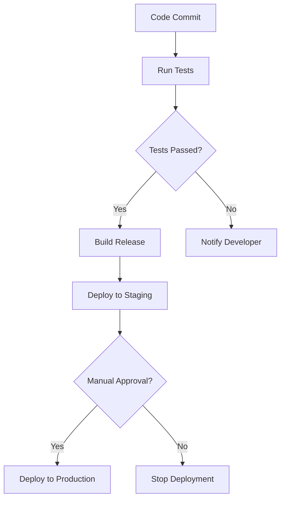

## 18.8 Continuous Integration and Deployment

In the fast-paced world of software development, ensuring that your code is always in a deployable state is crucial. Continuous Integration (CI) and Continuous Deployment (CD) are practices that help achieve this by automating the testing and deployment processes. In this section, we will explore how to set up CI/CD pipelines for Erlang projects, discuss the importance of these practices, and provide examples of popular tools and configurations.

### Understanding Continuous Integration and Deployment

**Continuous Integration (CI)** is the practice of automatically integrating code changes from multiple contributors into a shared repository several times a day. Each integration is verified by an automated build and test process, allowing teams to detect problems early.

**Continuous Deployment (CD)** extends CI by automatically deploying code changes to production after passing the CI pipeline. This ensures that new features, bug fixes, and improvements are delivered to users quickly and reliably.

### Importance of Automated Testing and Deployment

Automated testing and deployment are critical components of modern software development for several reasons:

- **Consistency**: Automated processes ensure that every code change is tested and deployed in the same way, reducing the risk of human error.
- **Speed**: Automation speeds up the testing and deployment processes, allowing teams to deliver features faster.
- **Feedback**: Automated tests provide immediate feedback to developers, helping them identify and fix issues quickly.
- **Reliability**: Automated deployments reduce the risk of errors during the deployment process, increasing the reliability of the software.

### Popular CI/CD Tools

There are several tools available for setting up CI/CD pipelines. Here are some of the most popular ones:

- **Jenkins**: An open-source automation server that supports building, deploying, and automating any project.
- **GitLab CI**: A built-in CI/CD tool in GitLab that allows you to run tests and deploy applications.
- **GitHub Actions**: A CI/CD tool integrated with GitHub that allows you to automate workflows directly from your repository.
- **Travis CI**: A hosted continuous integration service used to build and test software projects hosted on GitHub.
- **CircleCI**: A cloud-based CI/CD tool that automates the build, test, and deployment processes.

### Setting Up a CI/CD Pipeline for Erlang Projects

Let's walk through the process of setting up a CI/CD pipeline for an Erlang project using GitHub Actions as an example. The principles discussed here can be applied to other CI/CD tools as well.

#### Step 1: Create a GitHub Repository

First, create a GitHub repository for your Erlang project. This will serve as the central location for your code and CI/CD configurations.

#### Step 2: Write Tests for Your Erlang Project

Before setting up the CI/CD pipeline, ensure that your Erlang project has a comprehensive suite of automated tests. You can use tools like EUnit or Common Test for writing tests in Erlang.

```erlang
-module(my_module_tests).
-include_lib("eunit/include/eunit.hrl").

my_test() ->
    ?assertEqual(4, my_module:add(2, 2)).
```

#### Step 3: Configure GitHub Actions

Create a `.github/workflows` directory in your repository and add a YAML file for your CI/CD pipeline configuration.

```yaml
name: Erlang CI/CD

on:
  push:
    branches: [ main ]
  pull_request:
    branches: [ main ]

jobs:
  build:
    runs-on: ubuntu-latest

    steps:
    - name: Checkout code
      uses: actions/checkout@v2

    - name: Set up Erlang
      uses: erlef/setup-beam@v1
      with:
        otp-version: 24.x

    - name: Install dependencies
      run: |
        rebar3 get-deps

    - name: Run tests
      run: |
        rebar3 eunit
```

#### Step 4: Build and Deploy

Extend your GitHub Actions configuration to include build and deployment steps. For deployment, you might use a service like AWS, Heroku, or a custom server.

```yaml
    - name: Build release
      run: |
        rebar3 release

    - name: Deploy to server
      env:
        SERVER_IP: ${{ secrets.SERVER_IP }}
        SSH_KEY: ${{ secrets.SSH_KEY }}
      run: |
        scp -i $SSH_KEY _build/default/rel/my_app/releases/0.1.0/my_app.tar.gz user@$SERVER_IP:/path/to/deploy
        ssh -i $SSH_KEY user@$SERVER_IP 'cd /path/to/deploy && tar -xzf my_app.tar.gz && ./bin/my_app start'
```

### Best Practices for Maintaining Pipeline Reliability

- **Keep Pipelines Simple**: Avoid complex configurations that are hard to maintain. Use scripts and tools to automate repetitive tasks.
- **Use Secrets for Sensitive Information**: Store sensitive information like API keys and passwords in environment variables or secret management tools.
- **Monitor Pipeline Performance**: Regularly review pipeline performance and optimize steps that take too long.
- **Fail Fast**: Configure your pipeline to fail quickly when errors are detected, providing immediate feedback to developers.
- **Regularly Update Dependencies**: Keep your dependencies up to date to avoid security vulnerabilities and compatibility issues.

### Encouraging CI/CD Adoption

Adopting CI/CD practices can significantly improve the efficiency and consistency of your development process. Here are some tips to encourage adoption:

- **Educate Your Team**: Provide training and resources to help your team understand the benefits and best practices of CI/CD.
- **Start Small**: Begin with a simple pipeline and gradually add more complexity as your team becomes more comfortable with the process.
- **Celebrate Successes**: Highlight the positive impact of CI/CD on your development process, such as faster release cycles and fewer bugs in production.

### Visualizing a CI/CD Pipeline

Below is a diagram representing a typical CI/CD pipeline workflow using Mermaid.js:



This diagram illustrates the flow of a CI/CD pipeline, from code commit to deployment, highlighting decision points and actions taken at each step.

### Try It Yourself

To get hands-on experience with CI/CD, try setting up a pipeline for a simple Erlang project. Experiment with different CI/CD tools and configurations to find what works best for your team. Consider adding additional steps, such as static code analysis or performance testing, to your pipeline.

### Knowledge Check

- What are the main benefits of using CI/CD in software development?
- How does automated testing contribute to the reliability of a CI/CD pipeline?
- What are some common CI/CD tools, and how do they differ?
- How can you ensure the security of sensitive information in a CI/CD pipeline?
- What are some best practices for maintaining a reliable CI/CD pipeline?

### Summary

In this section, we've explored the importance of Continuous Integration and Deployment in Erlang projects. We've discussed how to set up a CI/CD pipeline using GitHub Actions, provided best practices for maintaining pipeline reliability, and encouraged the adoption of CI/CD practices. Remember, adopting CI/CD is a journey, and it's important to continuously improve and adapt your processes to meet the needs of your team and project.

## Quiz: Continuous Integration and Deployment



### What is the primary goal of Continuous Integration?

- [x] To integrate code changes frequently and automatically test them
- [ ] To deploy code changes to production immediately
- [ ] To manually test code changes before integration
- [ ] To write code without testing

> **Explanation:** Continuous Integration aims to integrate code changes frequently and automatically test them to catch issues early.

### Which of the following is a popular CI/CD tool?

- [x] Jenkins
- [ ] Microsoft Word
- [ ] Adobe Photoshop
- [ ] Google Sheets

> **Explanation:** Jenkins is a popular CI/CD tool used for automating the build, test, and deployment processes.

### What is the benefit of automated testing in a CI/CD pipeline?

- [x] It provides immediate feedback to developers
- [ ] It eliminates the need for code reviews
- [ ] It slows down the deployment process
- [ ] It increases the complexity of the code

> **Explanation:** Automated testing provides immediate feedback to developers, helping them identify and fix issues quickly.

### How can sensitive information be securely managed in a CI/CD pipeline?

- [x] By using environment variables or secret management tools
- [ ] By hardcoding it into the source code
- [ ] By sharing it in public repositories
- [ ] By storing it in plain text files

> **Explanation:** Sensitive information should be managed securely using environment variables or secret management tools.

### What should a CI/CD pipeline do when a test fails?

- [x] Fail fast and notify the developer
- [ ] Continue with the deployment
- [ ] Ignore the failure
- [ ] Restart the entire pipeline

> **Explanation:** A CI/CD pipeline should fail fast and notify the developer when a test fails to provide immediate feedback.

### Which step is typically included in a CI/CD pipeline?

- [x] Running automated tests
- [ ] Writing documentation
- [ ] Designing user interfaces
- [ ] Conducting market research

> **Explanation:** Running automated tests is a crucial step in a CI/CD pipeline to ensure code quality.

### What is the purpose of the "Deploy to Staging" step in a CI/CD pipeline?

- [x] To test the application in a production-like environment
- [ ] To deploy the application directly to production
- [ ] To write new features
- [ ] To remove bugs from the code

> **Explanation:** Deploying to staging allows testing the application in a production-like environment before going live.

### What is a key benefit of using CI/CD practices?

- [x] Faster release cycles and fewer bugs in production
- [ ] Increased manual testing
- [ ] Slower development process
- [ ] More complex code

> **Explanation:** CI/CD practices lead to faster release cycles and fewer bugs in production by automating testing and deployment.

### What is the role of GitHub Actions in a CI/CD pipeline?

- [x] To automate workflows directly from a GitHub repository
- [ ] To design user interfaces
- [ ] To conduct market research
- [ ] To write documentation

> **Explanation:** GitHub Actions automate workflows directly from a GitHub repository, facilitating CI/CD processes.

### True or False: Continuous Deployment automatically deploys code changes to production after passing the CI pipeline.

- [x] True
- [ ] False

> **Explanation:** Continuous Deployment automatically deploys code changes to production after they pass the CI pipeline, ensuring quick delivery to users.



Remember, this is just the beginning. As you progress, you'll build more complex and interactive CI/CD pipelines. Keep experimenting, stay curious, and enjoy the journey!
