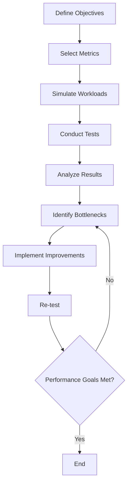

## 18.9 Performance Testing and Benchmarking

Performance testing and benchmarking are critical components of the software development lifecycle, especially in a language like Erlang, known for its concurrency and fault-tolerance capabilities. In this section, we will delve into the goals of performance testing, explore tools like Basho Bench and Performer, and discuss strategies for designing meaningful tests. We will also cover interpreting results, identifying bottlenecks, and iteratively optimizing applications based on findings.

### Goals of Performance Testing and Benchmarking

Performance testing aims to ensure that an application meets its performance requirements under expected and peak loads. The primary goals include:

- **Assessing System Behavior**: Understand how the system behaves under various conditions, including normal and peak loads.
- **Identifying Bottlenecks**: Detect areas where performance degrades, such as slow database queries or inefficient algorithms.
- **Ensuring Scalability**: Verify that the application can scale to accommodate increased loads without significant performance degradation.
- **Validating Reliability**: Confirm that the system remains stable and reliable under stress.
- **Optimizing Resource Usage**: Ensure efficient use of resources like CPU, memory, and network bandwidth.

### Tools for Performance Testing in Erlang

#### Basho Bench

[Basho Bench](https://github.com/basho/basho_bench) is a popular open-source benchmarking tool designed for testing the performance of distributed systems. It is highly configurable and supports various workloads, making it suitable for Erlang applications.

- **Features**:
  - Supports custom workload generation.
  - Provides detailed statistical analysis of test results.
  - Allows for easy integration with Erlang applications.

- **Example Usage**:
  ```erlang
  %% Define a simple workload for Basho Bench
  {ok, _} = basho_bench:start([{duration, 60}, {concurrent, 10}, {driver, my_driver}]).
  ```

#### Performer

[Performer](https://github.com/Feuerlabs/Performer) is another tool for performance testing in Erlang. It focuses on providing a framework for defining and executing performance tests.

- **Features**:
  - Offers a flexible framework for test definition.
  - Supports various metrics collection and analysis.
  - Integrates with existing Erlang projects.

- **Example Usage**:
  ```erlang
  %% Define a performance test using Performer
  performer:start([{test, my_test}, {duration, 120}, {metrics, [latency, throughput]}]).
  ```

### Designing Meaningful Performance Tests

To design effective performance tests, follow these guidelines:

1. **Define Clear Objectives**: Establish what you want to achieve with the tests, such as identifying bottlenecks or validating scalability.

2. **Select Appropriate Metrics**: Choose metrics that align with your objectives, such as response time, throughput, and resource utilization.

3. **Simulate Realistic Workloads**: Create workloads that mimic real-world usage patterns to obtain meaningful results.

4. **Consider Different Scenarios**: Test under various conditions, including normal, peak, and stress scenarios, to understand system behavior.

5. **Automate Tests**: Use automation tools to run tests consistently and efficiently, allowing for regular performance assessments.

### Interpreting Results and Identifying Bottlenecks

Once performance tests are conducted, interpreting the results is crucial for identifying areas for improvement:

- **Analyze Metrics**: Examine metrics like response time, throughput, and error rates to assess performance.
- **Identify Patterns**: Look for patterns or anomalies in the data that may indicate bottlenecks or inefficiencies.
- **Use Visualization Tools**: Employ graphs and charts to visualize performance trends and pinpoint issues.

#### Example: Identifying a Bottleneck

Consider a scenario where response times increase significantly under load. By analyzing the metrics, you might discover that a specific database query is causing delays. Optimizing this query could alleviate the bottleneck and improve overall performance.

### Iterative Optimization Based on Findings

Performance optimization is an iterative process. Based on the findings from your tests, take the following steps:

1. **Prioritize Issues**: Focus on the most critical bottlenecks that impact performance.
2. **Implement Improvements**: Make changes to the code, architecture, or configuration to address identified issues.
3. **Re-test**: Conduct performance tests again to evaluate the impact of the changes.
4. **Repeat**: Continue this cycle until performance goals are met.

### Try It Yourself

To gain hands-on experience, try modifying the provided code examples to simulate different workloads or test scenarios. Experiment with changing parameters like duration or concurrency to see how they affect performance.

### Visualizing Performance Testing Workflow

Below is a diagram illustrating the workflow of performance testing and benchmarking in Erlang:



### References and Further Reading

- [Basho Bench GitHub Repository](https://github.com/basho/basho_bench)
- [Performer GitHub Repository](https://github.com/Feuerlabs/Performer)
- [Erlang Performance Testing Guide](https://erlang.org/doc/performance.html)

### Knowledge Check

- What are the primary goals of performance testing?
- How can Basho Bench be used to simulate workloads?
- What metrics are important for performance testing?
- How do you identify bottlenecks from test results?
- What is the importance of iterative optimization?

### Embrace the Journey

Remember, performance testing and benchmarking are ongoing processes. As you continue to develop and optimize your Erlang applications, keep experimenting with different tools and techniques. Stay curious, and enjoy the journey of making your applications faster and more efficient!

## Quiz: Performance Testing and Benchmarking



### What is the primary goal of performance testing?

- [x] To ensure the application meets performance requirements under various loads
- [ ] To find bugs in the application
- [ ] To test the user interface
- [ ] To validate security features

> **Explanation:** Performance testing focuses on assessing how well an application performs under different conditions, ensuring it meets specified performance criteria.

### Which tool is commonly used for benchmarking distributed systems in Erlang?

- [x] Basho Bench
- [ ] JMeter
- [ ] Selenium
- [ ] Postman

> **Explanation:** Basho Bench is a popular tool for benchmarking distributed systems, particularly in the Erlang ecosystem.

### What is an essential step in designing meaningful performance tests?

- [x] Simulating realistic workloads
- [ ] Writing unit tests
- [ ] Designing user interfaces
- [ ] Conducting security audits

> **Explanation:** Simulating realistic workloads is crucial for obtaining meaningful and relevant performance test results.

### How can bottlenecks be identified from performance test results?

- [x] By analyzing metrics and identifying patterns
- [ ] By reviewing code comments
- [ ] By conducting user surveys
- [ ] By checking version control history

> **Explanation:** Analyzing performance metrics and identifying patterns or anomalies helps in pinpointing bottlenecks.

### What is the significance of iterative optimization in performance testing?

- [x] It allows for continuous improvement based on test findings
- [ ] It ensures code readability
- [ ] It simplifies deployment processes
- [ ] It enhances security features

> **Explanation:** Iterative optimization involves making improvements based on test findings and re-testing to achieve optimal performance.

### Which of the following is NOT a feature of Basho Bench?

- [ ] Custom workload generation
- [ ] Detailed statistical analysis
- [x] User interface testing
- [ ] Integration with Erlang applications

> **Explanation:** Basho Bench is focused on performance testing and does not provide features for user interface testing.

### What is a key benefit of automating performance tests?

- [x] Consistent and efficient execution of tests
- [ ] Improved user interface design
- [ ] Enhanced security features
- [ ] Simplified code structure

> **Explanation:** Automating performance tests ensures they are executed consistently and efficiently, allowing for regular assessments.

### What type of scenarios should be considered in performance testing?

- [x] Normal, peak, and stress scenarios
- [ ] Only normal scenarios
- [ ] Only peak scenarios
- [ ] Only stress scenarios

> **Explanation:** Considering various scenarios, including normal, peak, and stress, provides a comprehensive understanding of system behavior.

### How does Performer differ from Basho Bench?

- [x] Performer provides a framework for defining and executing performance tests
- [ ] Performer is used for user interface testing
- [ ] Performer is a security testing tool
- [ ] Performer is a database management tool

> **Explanation:** Performer offers a framework for defining and executing performance tests, focusing on flexibility and integration with Erlang projects.

### True or False: Performance testing is a one-time activity.

- [ ] True
- [x] False

> **Explanation:** Performance testing is an ongoing process, requiring regular assessments and optimizations to ensure applications meet performance goals.


