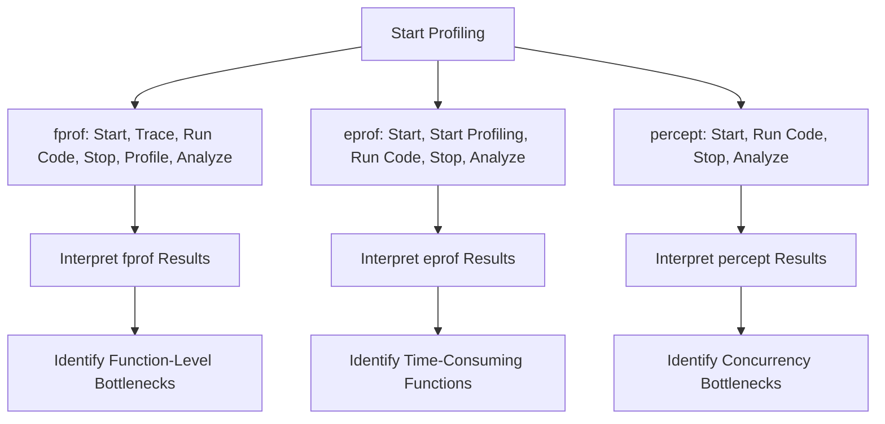

## 19.1 Profiling Tools and Techniques (`fprof`, `eprof`, `percept`)

In the world of software development, performance optimization is a crucial aspect that can significantly impact the efficiency and scalability of applications. Profiling is a key technique used to analyze the performance of an application, identify bottlenecks, and guide optimization efforts. In Erlang, a language renowned for its concurrency and fault-tolerance, profiling becomes even more critical due to the complex interactions between processes. This section will introduce you to three powerful profiling tools in Erlang: `fprof`, `eprof`, and `percept`. We will explore how to use these tools to gain insights into your application's performance and make informed optimization decisions.

### Importance of Profiling in Performance Optimization

Profiling is the process of measuring the space (memory) and time complexity of a program, identifying the parts of the code that consume the most resources. It helps developers understand where the application spends most of its time and which functions are called most frequently. By identifying these hotspots, developers can focus their optimization efforts on the areas that will yield the most significant performance improvements.

In Erlang, profiling is particularly important due to the language's concurrent nature. With numerous processes running simultaneously, it can be challenging to pinpoint performance issues without the aid of profiling tools. Profiling allows developers to visualize process interactions, measure execution times, and understand the impact of concurrency on performance.

### Introducing Erlang's Profiling Tools

Erlang provides several tools for profiling applications, each with its unique focus and capabilities:

- **`fprof`**: A function-level profiler that provides detailed information about function calls and execution times.
- **`eprof`**: A time profiler that measures the time spent in each function, helping identify time-consuming operations.
- **`percept`**: A concurrency profiler that visualizes process interactions and helps identify bottlenecks in concurrent systems.

Let's delve into each of these tools, exploring their features, usage, and how to interpret their results.

### `fprof`: Function-Level Profiling

`fprof` is a powerful tool for function-level profiling in Erlang. It provides detailed information about function calls, including the number of calls, execution time, and time spent in child functions. This granularity makes `fprof` an excellent choice for identifying specific functions that are performance bottlenecks.

#### Using `fprof`

To use `fprof`, follow these steps:

1. **Start the Profiler**: Begin by starting the `fprof` profiler in your Erlang shell or script.

   ```erlang
   fprof:start().
   ```

2. **Trace the Function Calls**: Use `fprof:trace/0` to start tracing function calls. This will record all function calls made during the profiling session.

   ```erlang
   fprof:trace([start]).
   ```

3. **Run Your Code**: Execute the code you want to profile. This could be a specific function or a series of operations.

   ```erlang
   my_module:my_function().
   ```

4. **Stop the Tracing**: Once the code execution is complete, stop the tracing.

   ```erlang
   fprof:trace([stop]).
   ```

5. **Analyze the Results**: Use `fprof:profile/1` to analyze the trace data and generate a report.

   ```erlang
   fprof:profile([]).
   ```

6. **View the Results**: Finally, use `fprof:analyse/1` to view the profiling results.

   ```erlang
   fprof:analyse([totals]).
   ```

#### Interpreting `fprof` Results

The `fprof` report provides detailed information about each function call, including:

- **Function Name**: The name of the function being profiled.
- **Calls**: The number of times the function was called.
- **Time**: The total time spent in the function.
- **Own Time**: The time spent in the function excluding time spent in child functions.

By examining these metrics, you can identify functions that are consuming the most time and focus your optimization efforts accordingly.

### `eprof`: Time Profiling

`eprof` is a time profiler that measures the time spent in each function during program execution. It is particularly useful for identifying functions that are time-consuming and may benefit from optimization.

#### Using `eprof`

To use `eprof`, follow these steps:

1. **Start the Profiler**: Begin by starting the `eprof` profiler.

   ```erlang
   eprof:start().
   ```

2. **Start Profiling**: Use `eprof:start_profiling/1` to start profiling the processes you are interested in. You can specify a list of process IDs or use `all` to profile all processes.

   ```erlang
   eprof:start_profiling([all]).
   ```

3. **Run Your Code**: Execute the code you want to profile.

   ```erlang
   my_module:my_function().
   ```

4. **Stop Profiling**: Once the code execution is complete, stop the profiling.

   ```erlang
   eprof:stop_profiling().
   ```

5. **Analyze the Results**: Use `eprof:analyze/0` to generate a report of the profiling results.

   ```erlang
   eprof:analyze().
   ```

#### Interpreting `eprof` Results

The `eprof` report provides a breakdown of the time spent in each function, including:

- **Function Name**: The name of the function being profiled.
- **Time**: The total time spent in the function.
- **Percentage**: The percentage of total execution time spent in the function.

This information helps you identify functions that are consuming the most time and may require optimization.

### `percept`: Concurrency Profiling

`percept` is a concurrency profiler that provides insights into process interactions and helps identify bottlenecks in concurrent systems. It visualizes process activity over time, making it easier to understand how processes interact and where delays occur.

#### Using `percept`

To use `percept`, follow these steps:

1. **Start the Profiler**: Begin by starting the `percept` profiler.

   ```erlang
   percept:start().
   ```

2. **Run Your Code**: Execute the code you want to profile.

   ```erlang
   my_module:my_function().
   ```

3. **Stop the Profiler**: Once the code execution is complete, stop the profiler.

   ```erlang
   percept:stop().
   ```

4. **Generate the Report**: Use `percept:analyze/1` to generate a report of the profiling results.

   ```erlang
   percept:analyze("output_file").
   ```

5. **View the Report**: Open the generated report in a web browser to visualize process interactions.

#### Interpreting `percept` Results

The `percept` report provides a visual representation of process activity, including:

- **Process Timeline**: A timeline showing when each process was active.
- **Process Interactions**: Visualizations of message passing and process interactions.
- **Bottlenecks**: Identification of processes that are causing delays or blocking other processes.

By analyzing these visualizations, you can identify concurrency issues and optimize process interactions.

### Best Practices for Profiling in Development and Production

Profiling is a powerful tool, but it must be used judiciously to avoid impacting application performance. Here are some best practices for profiling in development and production environments:

- **Profile in Development**: Perform most of your profiling in a development environment to avoid impacting production performance.
- **Use Sampling**: When possible, use sampling techniques to reduce the overhead of profiling.
- **Focus on Hotspots**: Concentrate your profiling efforts on areas of the code that are known or suspected to be performance bottlenecks.
- **Iterate**: Profiling is an iterative process. Profile, optimize, and then profile again to measure the impact of your changes.
- **Monitor Production**: Use lightweight monitoring tools in production to identify performance issues without the overhead of full profiling.

### Try It Yourself

To get hands-on experience with Erlang's profiling tools, try the following exercises:

1. **Modify the Code**: Use the provided code examples and modify them to include additional functions or processes. Profile the modified code to see how the changes impact performance.

2. **Experiment with Different Scenarios**: Profile different scenarios, such as varying the number of concurrent processes or changing the input data size, to see how these factors affect performance.

3. **Analyze Real-World Applications**: Apply the profiling techniques to a real-world Erlang application and identify potential areas for optimization.

### Visualizing Profiling Data

To enhance your understanding of profiling data, let's visualize the process using a flowchart that represents the profiling workflow with `fprof`, `eprof`, and `percept`.



This flowchart illustrates the steps involved in profiling with each tool and the insights you can gain from the results.

### References and Further Reading

For more information on Erlang's profiling tools, refer to the official documentation:

- [`fprof` Documentation](http://erlang.org/doc/man/fprof.html)
- [`eprof` Documentation](http://erlang.org/doc/man/eprof.html)
- [`percept` Documentation](http://erlang.org/doc/man/percept_cli.html)

### Knowledge Check

To reinforce your understanding of Erlang's profiling tools, consider the following questions:

1. What are the main differences between `fprof`, `eprof`, and `percept`?
2. How can profiling help identify performance bottlenecks in concurrent systems?
3. What are some best practices for profiling in production environments?

### Embrace the Journey

Remember, profiling is just the beginning of your performance optimization journey. As you gain experience with these tools, you'll develop a deeper understanding of your application's performance characteristics and become more adept at identifying and resolving bottlenecks. Keep experimenting, stay curious, and enjoy the journey!

## Quiz: Profiling Tools and Techniques (`fprof`, `eprof`, `percept`)



### Which Erlang profiling tool is best suited for function-level profiling?

- [x] fprof
- [ ] eprof
- [ ] percept
- [ ] None of the above

> **Explanation:** `fprof` is designed for function-level profiling, providing detailed information about function calls and execution times.

### What is the primary focus of `eprof`?

- [ ] Concurrency profiling
- [x] Time profiling
- [ ] Memory profiling
- [ ] Function call tracing

> **Explanation:** `eprof` focuses on time profiling, measuring the time spent in each function during program execution.

### Which tool provides a visual representation of process interactions?

- [ ] fprof
- [ ] eprof
- [x] percept
- [ ] None of the above

> **Explanation:** `percept` provides a visual representation of process interactions, helping identify concurrency bottlenecks.

### What is a key benefit of using profiling tools in Erlang?

- [x] Identifying performance bottlenecks
- [ ] Increasing code complexity
- [ ] Reducing code readability
- [ ] None of the above

> **Explanation:** Profiling tools help identify performance bottlenecks, allowing developers to focus optimization efforts effectively.

### Which of the following is a best practice for profiling in production environments?

- [x] Use lightweight monitoring tools
- [ ] Profile all functions
- [ ] Avoid profiling altogether
- [ ] Use full profiling tools extensively

> **Explanation:** In production environments, it's best to use lightweight monitoring tools to minimize performance impact.

### What does `fprof:analyse([totals])` do?

- [x] Analyzes and displays the total execution time for each function
- [ ] Starts the profiling session
- [ ] Stops the profiling session
- [ ] Generates a visual report

> **Explanation:** `fprof:analyse([totals])` analyzes and displays the total execution time for each function.

### How can `percept` help in optimizing concurrent systems?

- [x] By visualizing process interactions
- [ ] By measuring memory usage
- [ ] By tracing function calls
- [ ] By reducing code size

> **Explanation:** `percept` helps optimize concurrent systems by visualizing process interactions and identifying bottlenecks.

### What is the first step in using `eprof`?

- [x] Start the profiler with `eprof:start()`
- [ ] Run the code to be profiled
- [ ] Analyze the results
- [ ] Stop the profiler

> **Explanation:** The first step in using `eprof` is to start the profiler with `eprof:start()`.

### What type of profiling does `fprof` perform?

- [x] Function-level profiling
- [ ] Time profiling
- [ ] Concurrency profiling
- [ ] Memory profiling

> **Explanation:** `fprof` performs function-level profiling, providing detailed information about function calls.

### True or False: Profiling should be done only once during the development process.

- [ ] True
- [x] False

> **Explanation:** Profiling is an iterative process and should be done multiple times to measure the impact of optimizations.




