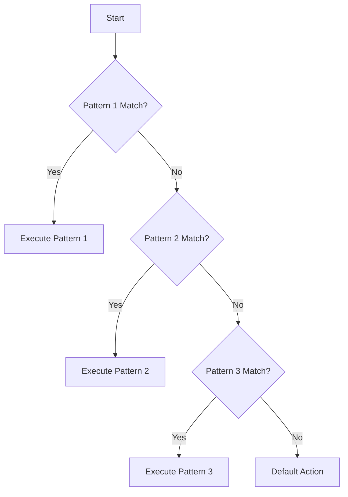

## 19.10 Optimizing Pattern Matching

Pattern matching is a powerful feature in Erlang that allows developers to write concise and expressive code. However, to leverage its full potential, it's essential to understand how pattern matching is processed by the BEAM VM and how to optimize it for performance. In this section, we will explore various strategies for writing efficient pattern matching expressions, including ordering patterns, avoiding redundancy, and understanding the impact of guards.

### Understanding Pattern Matching in Erlang

Pattern matching in Erlang is a mechanism that allows you to compare a value against a pattern. If the value fits the pattern, the match succeeds, and any variables in the pattern are bound to corresponding parts of the value. This feature is integral to Erlang's functional programming paradigm and is used extensively in function clauses, case expressions, and receive statements.

#### How the BEAM VM Processes Pattern Matching

The BEAM VM, Erlang's virtual machine, processes pattern matching by evaluating patterns from top to bottom. It attempts to match the given value with each pattern in sequence until a match is found. This sequential evaluation means that the order of patterns can significantly impact performance.

### Tips for Optimizing Pattern Matching

#### 1. Order Patterns from Most to Least Specific

When writing pattern matching expressions, always order patterns from the most specific to the least specific. This approach minimizes the number of comparisons the BEAM VM must perform before finding a match.

```erlang
% Example of ordering patterns
handle_message({error, Reason}) ->
    io:format("Error occurred: ~p~n", [Reason]);
handle_message({ok, Result}) ->
    io:format("Operation successful: ~p~n", [Result]);
handle_message(_) ->
    io:format("Unknown message~n").
```

In this example, the `{error, Reason}` pattern is more specific than the `{ok, Result}` pattern, and both are more specific than the catch-all `_` pattern. By ordering them this way, we ensure that the most common or critical cases are handled first, reducing unnecessary checks.

#### 2. Avoid Redundant or Overlapping Patterns

Redundant or overlapping patterns can lead to unnecessary computations and make the code harder to read and maintain. Ensure that each pattern is distinct and necessary.

```erlang
% Avoid overlapping patterns
process({ok, _} = Msg) ->
    handle_ok(Msg);
process({error, _} = Msg) ->
    handle_error(Msg);
process(_) ->
    handle_other().
```

In this example, each pattern is distinct, ensuring that the BEAM VM does not perform redundant checks.

#### 3. Use Guards Wisely

Guards are additional conditions that can be used in pattern matching to further refine matches. While guards are powerful, they can also impact performance if overused or used inefficiently. Use guards only when necessary and ensure they are simple and efficient.

```erlang
% Example of using guards
is_even(N) when N rem 2 == 0 -> true;
is_even(_) -> false.
```

In this example, the guard `N rem 2 == 0` is simple and efficient, providing a clear condition for the pattern match.

### The Impact of Guards on Performance

Guards can significantly impact performance, especially if they involve complex computations or are used excessively. When using guards, consider the following:

- **Keep Guards Simple**: Use simple expressions that can be evaluated quickly.
- **Minimize Side Effects**: Guards should be free of side effects to ensure predictable behavior.
- **Avoid Redundant Guards**: Ensure that guards add value to the pattern matching process and are not redundant.

### Writing Clear and Efficient Pattern Matching Code

Clear and efficient pattern matching code is not only about performance but also about readability and maintainability. Here are some best practices:

- **Use Descriptive Variable Names**: Use meaningful names for variables in patterns to make the code self-explanatory.
- **Document Complex Patterns**: If a pattern is complex, provide comments to explain its purpose and logic.
- **Refactor Large Patterns**: Break down large or complex patterns into smaller, more manageable functions or expressions.

### Code Examples and Exercises

Let's explore some code examples to illustrate these concepts.

```erlang
% Example of optimized pattern matching
-module(pattern_optimization).
-export([process_message/1]).

process_message({error, Reason}) ->
    io:format("Error: ~p~n", [Reason]);
process_message({ok, Result}) ->
    io:format("Success: ~p~n", [Result]);
process_message({warning, Info}) ->
    io:format("Warning: ~p~n", [Info]);
process_message(_) ->
    io:format("Unhandled message~n").
```

In this example, we have ordered the patterns from most specific to least specific, ensuring efficient pattern matching.

### Try It Yourself

To reinforce your understanding, try modifying the code examples above. For instance, add a new pattern for handling `{info, Data}` messages and observe how the order of patterns affects performance.

### Visualizing Pattern Matching

To better understand how pattern matching works, let's visualize the process using a flowchart.



**Figure 1: Pattern Matching Flowchart**

This flowchart illustrates how the BEAM VM evaluates patterns sequentially until a match is found.

### References and Further Reading

For more information on pattern matching and performance optimization in Erlang, consider the following resources:

- [Erlang Documentation on Pattern Matching](https://www.erlang.org/doc/reference_manual/patterns.html)
- [Learn You Some Erlang for Great Good!](http://learnyousomeerlang.com/)
- [Erlang Efficiency Guide](https://www.erlang.org/doc/efficiency_guide/introduction.html)

### Knowledge Check

Before we conclude, let's test your understanding with a few questions.

1. Why is it important to order patterns from most to least specific?
2. How can redundant patterns affect performance?
3. What is the impact of complex guards on pattern matching performance?

### Embrace the Journey

Remember, optimizing pattern matching is just one aspect of writing efficient Erlang code. As you continue to explore Erlang, you'll discover many more opportunities to enhance performance and write clean, maintainable code. Keep experimenting, stay curious, and enjoy the journey!

## Quiz: Optimizing Pattern Matching



### Why is it important to order patterns from most to least specific?

- [x] To minimize the number of comparisons needed to find a match
- [ ] To make the code more readable
- [ ] To ensure all patterns are checked
- [ ] To avoid syntax errors

> **Explanation:** Ordering patterns from most to least specific reduces the number of comparisons the BEAM VM must perform, enhancing performance.

### What is a potential downside of using complex guards?

- [x] They can negatively impact performance
- [ ] They make the code more readable
- [ ] They simplify pattern matching
- [ ] They are always necessary

> **Explanation:** Complex guards can slow down pattern matching because they require additional computations.

### How can redundant patterns affect performance?

- [x] They lead to unnecessary computations
- [ ] They improve code readability
- [ ] They make pattern matching faster
- [ ] They have no effect on performance

> **Explanation:** Redundant patterns result in unnecessary checks, which can degrade performance.

### What is the role of guards in pattern matching?

- [x] To refine matches with additional conditions
- [ ] To replace patterns
- [ ] To simplify code
- [ ] To ensure all patterns are checked

> **Explanation:** Guards provide additional conditions to refine pattern matches, allowing for more precise control.

### Which of the following is a best practice for writing pattern matching code?

- [x] Use descriptive variable names
- [ ] Use complex guards
- [ ] Write large patterns
- [ ] Avoid comments

> **Explanation:** Descriptive variable names enhance code readability and maintainability.

### What should you avoid when using guards?

- [x] Complex computations
- [ ] Simple conditions
- [ ] Descriptive variable names
- [ ] Pattern matching

> **Explanation:** Complex computations in guards can slow down pattern matching.

### How does the BEAM VM process pattern matching?

- [x] Sequentially from top to bottom
- [ ] Randomly
- [ ] In parallel
- [ ] Based on pattern complexity

> **Explanation:** The BEAM VM evaluates patterns sequentially from top to bottom until a match is found.

### What is the benefit of refactoring large patterns?

- [x] Improved readability and maintainability
- [ ] Increased complexity
- [ ] Faster execution
- [ ] More redundancy

> **Explanation:** Refactoring large patterns into smaller functions improves readability and maintainability.

### What is a common mistake when writing pattern matching code?

- [x] Using redundant patterns
- [ ] Using descriptive variable names
- [ ] Writing simple guards
- [ ] Ordering patterns correctly

> **Explanation:** Redundant patterns lead to unnecessary checks and can degrade performance.

### True or False: Guards should always be used in pattern matching.

- [ ] True
- [x] False

> **Explanation:** Guards should be used only when necessary, as they can impact performance if overused.


