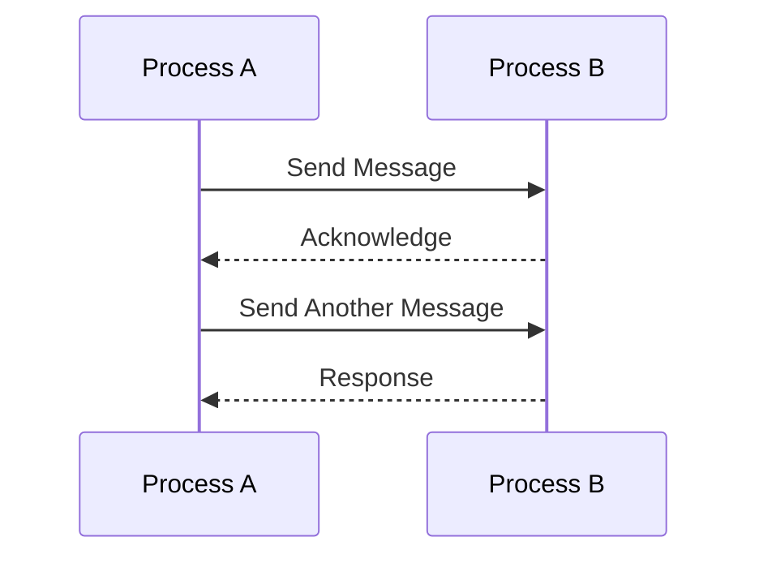

## 19.12 Best Practices for High-Performance Erlang Code

In this section, we delve into best practices for writing high-performance Erlang code. We'll explore key principles, emphasize the importance of profiling, and discuss the significance of understanding the BEAM VM and system architecture. Let's embark on this journey to optimize your Erlang applications effectively.

### Understanding the BEAM VM

The BEAM VM is the heart of Erlang's performance capabilities. Understanding its architecture is crucial for writing efficient code. The BEAM VM is designed for concurrency, fault tolerance, and distributed computing, which are the core strengths of Erlang.

#### Key Features of the BEAM VM

- **Lightweight Processes**: Erlang processes are lightweight and can be created in large numbers without significant overhead. This allows for massive concurrency.
- **Preemptive Scheduling**: The BEAM VM uses preemptive scheduling to ensure that no single process can monopolize the CPU, providing fairness and responsiveness.
- **Garbage Collection**: Each Erlang process has its own heap, allowing for efficient garbage collection without affecting other processes.
- **Hot Code Swapping**: The BEAM VM supports hot code swapping, enabling updates to running systems without downtime.

### Profiling and Data-Driven Decisions

Before optimizing, it's essential to identify bottlenecks through profiling. Profiling provides insights into where your application spends most of its time, allowing you to make informed decisions.

#### Tools for Profiling Erlang Code

- **fprof**: A profiling tool that provides detailed information about function calls and execution time.
- **eprof**: Focuses on time spent in each function, helping identify slow functions.
- **percept**: Visualizes process scheduling and message passing, useful for understanding concurrency issues.

```erlang
% Example of using fprof to profile a function
fprof:apply(Mod, Fun, Args).
fprof:profile().
fprof:analyse([totals, {sort, time}]).
```

### Writing Clean and Maintainable Code

Clean code is not only easier to maintain but also often more performant. Avoid premature optimization, which can lead to complex and unreadable code. Instead, focus on clarity and simplicity.

#### Key Principles for Clean Code

- **Modular Design**: Break down your application into smaller, reusable modules. This improves maintainability and can lead to performance gains by isolating changes.
- **Immutability**: Embrace immutability to avoid side effects and improve predictability.
- **Pattern Matching**: Use pattern matching effectively to simplify code and improve performance.

### Efficient Data Structures and Algorithms

Choosing the right data structures and algorithms is crucial for performance. Erlang provides several built-in data structures, each with its own performance characteristics.

#### Common Data Structures in Erlang

- **Lists**: Suitable for sequential access but can be inefficient for random access.
- **Tuples**: Fixed-size collections with fast access times.
- **Maps**: Key-value stores with efficient lookup and update operations.
- **ETS (Erlang Term Storage)**: In-memory storage for large datasets, offering fast access and updates.

```erlang
% Example of using ETS for fast data access
Table = ets:new(my_table, [set, public]).
ets:insert(Table, {key, value}).
Value = ets:lookup(Table, key).
```

### Concurrency and Parallelism

Erlang's concurrency model is one of its greatest strengths. Leveraging concurrency effectively can lead to significant performance improvements.

#### Best Practices for Concurrency

- **Avoid Blocking Operations**: Ensure that processes do not block, as this can lead to performance bottlenecks.
- **Use Asynchronous Messaging**: Prefer asynchronous message passing to synchronous calls to improve responsiveness.
- **Process Supervision**: Use OTP supervisors to manage process lifecycles and recover from failures gracefully.

### Memory Management and Garbage Collection

Understanding memory management in Erlang can help you write more efficient code. Each process has its own heap, and garbage collection is performed independently for each process.

#### Tips for Efficient Memory Usage

- **Minimize Process Heap Size**: Keep process heaps small to reduce garbage collection overhead.
- **Avoid Large Binaries in Processes**: Use binary references to avoid copying large binaries between processes.

### Continuous Learning and Staying Updated

The Erlang ecosystem is constantly evolving. Staying updated with the latest performance techniques and tools is crucial for maintaining high-performance applications.

#### Resources for Continuous Learning

- **Erlang Forums and Communities**: Engage with the Erlang community to learn from others' experiences.
- **Official Documentation**: Regularly review the official Erlang documentation for updates and best practices.
- **Workshops and Conferences**: Attend Erlang workshops and conferences to stay informed about the latest developments.

### Try It Yourself

Experiment with the code examples provided in this section. Modify them to see how changes affect performance. For instance, try using different data structures or profiling different parts of your application to identify bottlenecks.

### Visualizing Erlang's Concurrency Model

To better understand Erlang's concurrency model, let's visualize the process communication using a sequence diagram.



This diagram illustrates the asynchronous message passing between two Erlang processes, highlighting the non-blocking nature of communication.

### Key Takeaways

- **Profile Before Optimizing**: Use profiling tools to identify bottlenecks before making optimizations.
- **Understand the BEAM VM**: Leverage the strengths of the BEAM VM, such as lightweight processes and preemptive scheduling.
- **Write Clean Code**: Focus on clarity and simplicity to improve maintainability and performance.
- **Leverage Concurrency**: Use Erlang's concurrency model to build responsive and scalable applications.
- **Stay Updated**: Continuously learn and adapt to new performance techniques and tools.

### Embrace the Journey

Remember, optimizing Erlang code is an ongoing journey. As you gain experience, you'll develop a deeper understanding of performance nuances. Keep experimenting, stay curious, and enjoy the process of building high-performance Erlang applications.

## Quiz: Best Practices for High-Performance Erlang Code



### What is the primary benefit of using lightweight processes in Erlang?

- [x] They allow for massive concurrency with minimal overhead.
- [ ] They provide built-in security features.
- [ ] They simplify error handling.
- [ ] They enhance the readability of code.

> **Explanation:** Lightweight processes in Erlang enable massive concurrency, allowing thousands of processes to run simultaneously with minimal overhead.

### Which tool is used for profiling function calls and execution time in Erlang?

- [ ] eprof
- [x] fprof
- [ ] percept
- [ ] dialyzer

> **Explanation:** fprof is used for profiling function calls and execution time, providing detailed insights into where time is spent in your application.

### What is the advantage of using pattern matching in Erlang?

- [x] It simplifies code and improves performance.
- [ ] It allows for dynamic typing.
- [ ] It provides better error messages.
- [ ] It enables hot code swapping.

> **Explanation:** Pattern matching simplifies code by providing a concise way to destructure data and can improve performance by reducing the need for explicit condition checks.

### Why is it important to avoid premature optimization?

- [x] It can lead to complex and unreadable code.
- [ ] It always results in slower code.
- [ ] It is not supported by Erlang.
- [ ] It increases the risk of syntax errors.

> **Explanation:** Premature optimization can lead to complex and unreadable code, making it harder to maintain and understand.

### What is the role of OTP supervisors in Erlang?

- [x] They manage process lifecycles and recover from failures.
- [ ] They optimize memory usage.
- [ ] They handle network communication.
- [ ] They provide security features.

> **Explanation:** OTP supervisors manage process lifecycles, ensuring that processes are restarted in case of failures, contributing to fault tolerance.

### How does the BEAM VM handle garbage collection?

- [x] Each process has its own heap, allowing independent garbage collection.
- [ ] It uses a global heap for all processes.
- [ ] It requires manual memory management.
- [ ] It does not support garbage collection.

> **Explanation:** The BEAM VM allocates a separate heap for each process, allowing garbage collection to occur independently for each process.

### What is the benefit of using ETS for data storage?

- [x] It offers fast access and updates for large datasets.
- [ ] It provides built-in encryption.
- [ ] It simplifies code readability.
- [ ] It enhances error handling.

> **Explanation:** ETS (Erlang Term Storage) provides fast access and updates for large datasets, making it suitable for high-performance applications.

### Why is it important to stay updated with the latest performance techniques?

- [x] The Erlang ecosystem is constantly evolving.
- [ ] It ensures backward compatibility.
- [ ] It reduces the need for testing.
- [ ] It simplifies code syntax.

> **Explanation:** Staying updated with the latest performance techniques is crucial as the Erlang ecosystem evolves, providing new tools and methods for optimization.

### What is the primary focus of clean code in Erlang?

- [x] Clarity and simplicity.
- [ ] Security and encryption.
- [ ] Dynamic typing.
- [ ] Network communication.

> **Explanation:** Clean code focuses on clarity and simplicity, making it easier to maintain and often more performant.

### True or False: Erlang's concurrency model relies on shared memory for communication.

- [ ] True
- [x] False

> **Explanation:** Erlang's concurrency model relies on message passing, not shared memory, for communication between processes.


