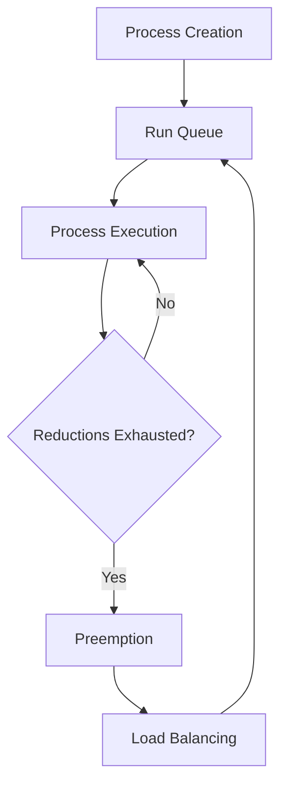

## 19.2 Understanding the BEAM Scheduler and Load Balancing

The BEAM virtual machine, which powers Erlang, is renowned for its ability to handle massive concurrency with ease. At the heart of this capability lies the BEAM scheduler, a sophisticated system designed to efficiently manage thousands of lightweight processes. Understanding how the BEAM scheduler operates and how to optimize your code for it is crucial for developing high-performance Erlang applications. In this section, we will delve into the design of the BEAM scheduler, explore concepts such as run queues, reductions, and priority levels, and discuss strategies for achieving optimal load balancing.

### The BEAM Scheduler: An Overview

The BEAM scheduler is responsible for managing Erlang processes, which are lightweight and isolated. Unlike operating system threads, Erlang processes are managed entirely by the BEAM VM, allowing for efficient scheduling and context switching. The scheduler's primary goal is to ensure that all processes get a fair share of CPU time while minimizing overhead.

#### Key Concepts of the BEAM Scheduler

1. **Run Queues**: Each scheduler in the BEAM VM has its own run queue, which is a list of processes ready to execute. The number of schedulers typically matches the number of CPU cores, allowing for parallel execution.

2. **Reductions**: A reduction is a unit of work performed by a process. Each process is allowed a certain number of reductions before it is preempted, ensuring that no single process monopolizes the CPU.

3. **Priority Levels**: Processes can have different priority levels: `low`, `normal`, `high`, and `max`. The scheduler gives preference to higher-priority processes, but it ensures that lower-priority processes still receive CPU time.

4. **Load Balancing**: The BEAM scheduler dynamically balances the load across all available schedulers, moving processes between run queues to optimize CPU utilization.

### How the BEAM Scheduler Works

The BEAM scheduler operates in a loop, repeatedly selecting processes from its run queue to execute. Each process runs for a fixed number of reductions before being preempted and placed back in the queue. This preemptive scheduling ensures that all processes get a chance to run, even if some are computationally intensive.

#### Process Scheduling and Execution

- **Process Creation**: When a new process is spawned, it is added to the run queue of the scheduler that created it.
- **Process Execution**: The scheduler picks the next process from its run queue and executes it for a specified number of reductions.
- **Preemption**: After a process exhausts its reduction quota, it is preempted and placed back in the run queue.
- **Load Balancing**: If a scheduler's run queue becomes too long, processes may be migrated to other schedulers to balance the load.

### Writing Code for the BEAM Scheduler

To write code that cooperates well with the BEAM scheduler, consider the following strategies:

1. **Avoid Long-Running Processes**: Break down long-running tasks into smaller, manageable chunks to prevent any single process from monopolizing the CPU.

2. **Use Asynchronous Operations**: Leverage Erlang's message-passing capabilities to perform asynchronous operations, allowing processes to continue executing while waiting for responses.

3. **Prioritize Processes Appropriately**: Assign appropriate priority levels to processes based on their importance and urgency.

4. **Monitor and Optimize Reductions**: Keep an eye on the number of reductions used by processes and optimize code to minimize unnecessary work.

### Detecting and Avoiding Scheduler Contention

Scheduler contention occurs when multiple processes compete for CPU time, leading to performance degradation. To detect and avoid contention:

- **Monitor System Metrics**: Use tools like `observer` and `etop` to monitor system metrics and identify bottlenecks.
- **Analyze Process Load**: Examine the load on each scheduler and identify processes that consume excessive reductions.
- **Optimize Process Distribution**: Ensure that processes are evenly distributed across schedulers to prevent any single scheduler from becoming overloaded.

### Achieving Optimal Load Balancing

Optimal load balancing ensures that all CPU cores are utilized efficiently, maximizing throughput and minimizing latency. Here are some strategies to achieve this:

1. **Dynamic Process Migration**: Allow the BEAM scheduler to dynamically migrate processes between schedulers to balance the load.

2. **Use of Work-Stealing**: Implement work-stealing algorithms to redistribute work from overloaded schedulers to underutilized ones.

3. **Fine-Tune Scheduler Settings**: Adjust scheduler settings based on the application's workload and performance requirements.

4. **Leverage Erlang's Concurrency Model**: Design applications to take full advantage of Erlang's concurrency model, using lightweight processes to handle concurrent tasks.

### Code Example: Optimizing Process Scheduling

Let's look at a simple example to illustrate how to optimize process scheduling in Erlang:

```erlang
-module(scheduler_example).
-export([start/0, worker/1]).

start() ->
    %% Spawn multiple worker processes
    lists:foreach(fun(_) -> spawn(?MODULE, worker, [self()]) end, lists:seq(1, 10)),
    %% Wait for all workers to finish
    receive_results(10).

worker(Parent) ->
    %% Simulate work by sleeping for a random time
    timer:sleep(random:uniform(1000)),
    %% Send a message back to the parent process
    Parent ! done.

receive_results(0) ->
    io:format("All workers completed~n");
receive_results(N) ->
    receive
        done ->
            receive_results(N - 1)
    end.
```

In this example, we spawn multiple worker processes that perform some work and then notify the parent process upon completion. By breaking down tasks into smaller processes, we allow the BEAM scheduler to efficiently manage CPU time and balance the load across available cores.

### Visualizing the BEAM Scheduler

To better understand how the BEAM scheduler operates, let's visualize the process scheduling and load balancing:



This diagram illustrates the lifecycle of a process in the BEAM scheduler, from creation to execution, preemption, and load balancing.

### Knowledge Check

- **Question**: What is a reduction in the context of the BEAM scheduler?
- **Question**: How does the BEAM scheduler achieve load balancing across CPU cores?
- **Question**: Why is it important to avoid long-running processes in Erlang applications?

### Summary

In this section, we've explored the inner workings of the BEAM scheduler and how it manages process scheduling and load balancing. By understanding these concepts, you can write Erlang applications that are optimized for performance and scalability. Remember to monitor system metrics, prioritize processes appropriately, and leverage Erlang's concurrency model to achieve optimal load balancing.

## Quiz: Understanding the BEAM Scheduler and Load Balancing



### What is the primary goal of the BEAM scheduler?

- [x] To ensure fair CPU time distribution among processes
- [ ] To maximize memory usage
- [ ] To prioritize I/O operations
- [ ] To minimize process creation time

> **Explanation:** The BEAM scheduler aims to distribute CPU time fairly among processes while minimizing overhead.

### How does the BEAM scheduler handle long-running processes?

- [x] By preempting them after a fixed number of reductions
- [ ] By increasing their priority
- [ ] By terminating them
- [ ] By moving them to a separate queue

> **Explanation:** Long-running processes are preempted after a fixed number of reductions to ensure fair scheduling.

### What is a reduction in the BEAM scheduler?

- [x] A unit of work performed by a process
- [ ] A measure of memory usage
- [ ] A priority level
- [ ] A type of process

> **Explanation:** A reduction is a unit of work that a process performs before being preempted.

### How can you achieve optimal load balancing in Erlang applications?

- [x] By allowing dynamic process migration
- [ ] By increasing the number of processes
- [ ] By reducing the number of schedulers
- [ ] By using only high-priority processes

> **Explanation:** Dynamic process migration helps balance the load across schedulers.

### What tool can be used to monitor system metrics in Erlang?

- [x] `observer`
- [ ] `erl`
- [ ] `rebar3`
- [ ] `edoc`

> **Explanation:** The `observer` tool is used to monitor system metrics and identify bottlenecks.

### Why is it important to avoid long-running processes?

- [x] To prevent any single process from monopolizing the CPU
- [ ] To reduce memory usage
- [ ] To increase process creation time
- [ ] To minimize I/O operations

> **Explanation:** Avoiding long-running processes ensures that no single process monopolizes the CPU, allowing fair scheduling.

### What is the role of priority levels in the BEAM scheduler?

- [x] To determine the order in which processes are scheduled
- [ ] To allocate memory to processes
- [ ] To manage I/O operations
- [ ] To handle process creation

> **Explanation:** Priority levels determine the order in which processes are scheduled, with higher-priority processes receiving preference.

### How does the BEAM scheduler achieve load balancing?

- [x] By dynamically migrating processes between schedulers
- [ ] By increasing the number of reductions
- [ ] By reducing the number of processes
- [ ] By using only low-priority processes

> **Explanation:** The BEAM scheduler dynamically migrates processes between schedulers to balance the load.

### What is the purpose of preemption in the BEAM scheduler?

- [x] To ensure fair CPU time distribution
- [ ] To increase memory usage
- [ ] To prioritize I/O operations
- [ ] To minimize process creation time

> **Explanation:** Preemption ensures that all processes receive a fair share of CPU time.

### True or False: The BEAM scheduler uses cooperative scheduling.

- [ ] True
- [x] False

> **Explanation:** The BEAM scheduler uses preemptive scheduling, not cooperative scheduling.



Remember, understanding the BEAM scheduler is just the beginning. As you continue to explore Erlang, you'll discover more ways to optimize your applications for performance and scalability. Keep experimenting, stay curious, and enjoy the journey!
