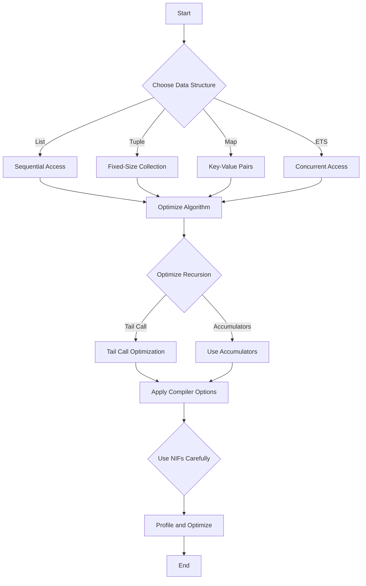

## 19.3 Optimizing Code for the BEAM VM

In this section, we delve into the art of optimizing Erlang code to fully harness the power of the BEAM virtual machine. The BEAM VM is renowned for its ability to handle massive concurrency and fault tolerance, but writing efficient code is crucial to maximizing these strengths. Let's explore various techniques and best practices for optimizing your Erlang applications.

### Efficient Use of Data Structures and Algorithms

#### Choosing the Right Data Structures

Erlang provides several data structures, each with its own strengths and weaknesses. Choosing the right one can significantly impact performance.

- **Lists**: Ideal for sequential access and operations like map, filter, and fold. However, they are not suitable for random access due to their linear time complexity.
  
- **Tuples**: Best for fixed-size collections where elements are accessed by index. They offer constant time access but are immutable, meaning any modification requires creating a new tuple.
  
- **Maps**: Useful for key-value pairs with average constant time complexity for lookups, insertions, and deletions. They are more flexible than tuples for dynamic data.

- **ETS (Erlang Term Storage)**: Provides in-memory storage for large datasets with support for concurrent access. It's suitable for scenarios requiring fast read and write operations.

#### Algorithmic Considerations

- **Avoiding Unnecessary Computations**: Use guards and pattern matching to filter out unnecessary computations early in the function call.

- **Divide and Conquer**: Break down complex problems into smaller, manageable parts. This approach can improve both readability and performance.

- **Memoization**: Cache results of expensive function calls to avoid redundant calculations. This is particularly useful for recursive functions.

### Optimizing Recursion and Avoiding Unnecessary Computations

#### Tail Call Optimization

Erlang's tail call optimization allows recursive functions to execute without growing the call stack, making them as efficient as loops in imperative languages.

```erlang
% Tail-recursive factorial function
factorial(N) -> factorial(N, 1).

factorial(0, Acc) -> Acc;
factorial(N, Acc) -> factorial(N - 1, N * Acc).
```

#### Avoiding Deep Recursion

For non-tail-recursive functions, deep recursion can lead to stack overflow. Consider restructuring the function to be tail-recursive or using iterative solutions.

#### Using Accumulators

Accumulators can help transform recursive functions into tail-recursive ones by carrying the result through each recursive call.

```erlang
% Tail-recursive sum of a list
sum(List) -> sum(List, 0).

sum([], Acc) -> Acc;
sum([H|T], Acc) -> sum(T, Acc + H).
```

### Compiler Options for Better Performance

Erlang's compiler offers several options to optimize code performance. Use these options judiciously to enhance your application's efficiency.

#### Common Compiler Options

- **`+native`**: Compiles modules to native code, which can significantly improve performance for compute-intensive tasks. However, it may increase compilation time and binary size.

- **`+inline`**: Inlines small functions to reduce function call overhead. This can be beneficial for frequently called functions.

- **`+warn_unused_vars`**: Helps identify unused variables, which can be a sign of redundant computations or logic errors.

#### Using `HiPE` (High-Performance Erlang)

HiPE is an extension of the Erlang compiler that generates native code for certain architectures. It can provide substantial performance improvements but may not be suitable for all applications due to increased complexity and potential compatibility issues.

### Interacting with Native Code or NIFs

#### Native Implemented Functions (NIFs)

NIFs allow you to write performance-critical code in C or other languages. While they can offer significant speedups, they also introduce risks such as crashing the VM if not handled carefully.

- **Minimize NIF Execution Time**: Keep NIFs short and avoid blocking operations. Long-running NIFs can block the scheduler and degrade performance.

- **Error Handling**: Ensure robust error handling in NIFs to prevent crashes.

- **Use Dirty Schedulers**: For long-running operations, consider using dirty schedulers to offload work from the main scheduler.

#### Ports and C Nodes

Ports and C nodes provide alternative ways to interface with native code. They offer better isolation than NIFs but may introduce communication overhead.

### Profiling and Iterative Optimization

#### Profiling Tools

Erlang provides several tools to profile and analyze your code's performance.

- **`fprof`**: A profiling tool that provides detailed information about function calls and execution time.

- **`eprof`**: Similar to `fprof`, but with a focus on time spent in each function.

- **`percept`**: A concurrency profiling tool that helps identify bottlenecks in concurrent applications.

#### Iterative Optimization

Optimization is an iterative process. Use profiling tools to identify bottlenecks, apply optimizations, and measure the impact. Repeat this process to achieve the desired performance.

### Visualizing Erlang's Execution on the BEAM VM

To better understand how Erlang code executes on the BEAM VM, let's visualize the process using a flowchart.



### Try It Yourself

Experiment with the following code examples to see how different optimizations affect performance. Try modifying the data structures, recursion strategies, and compiler options to observe their impact.

### Knowledge Check

- What are the trade-offs between using lists and maps in Erlang?
- How does tail call optimization improve recursion performance?
- What are the risks associated with using NIFs?
- How can profiling tools help in optimizing Erlang code?

### Summary

Optimizing Erlang code for the BEAM VM involves a combination of choosing the right data structures, optimizing recursion, using compiler options, and carefully interacting with native code. Profiling and iterative optimization are key to achieving the best performance. Remember, optimization is an ongoing process that requires careful analysis and testing.

## Quiz: Optimizing Code for the BEAM VM



### What is the primary advantage of using tail call optimization in Erlang?

- [x] It allows recursive functions to execute without growing the call stack.
- [ ] It improves the readability of the code.
- [ ] It increases the speed of function calls.
- [ ] It reduces memory usage by eliminating variables.

> **Explanation:** Tail call optimization allows recursive functions to execute without growing the call stack, making them as efficient as loops.

### Which data structure is best suited for key-value pairs in Erlang?

- [ ] List
- [ ] Tuple
- [x] Map
- [ ] ETS

> **Explanation:** Maps are best suited for key-value pairs with average constant time complexity for lookups, insertions, and deletions.

### What is a potential risk of using NIFs in Erlang?

- [x] They can crash the VM if not handled carefully.
- [ ] They are slower than Erlang functions.
- [ ] They cannot interact with external libraries.
- [ ] They are not supported on all platforms.

> **Explanation:** NIFs can crash the VM if not handled carefully, as they run in the same process as the Erlang VM.

### How can you minimize the execution time of a NIF?

- [x] Keep NIFs short and avoid blocking operations.
- [ ] Use long-running operations to maximize efficiency.
- [ ] Avoid error handling to reduce overhead.
- [ ] Use NIFs for all performance-critical code.

> **Explanation:** Keeping NIFs short and avoiding blocking operations helps minimize their execution time and impact on the VM.

### What is the purpose of the `+native` compiler option?

- [x] It compiles modules to native code for improved performance.
- [ ] It enables tail call optimization.
- [ ] It reduces the size of the compiled binary.
- [ ] It provides better error messages during compilation.

> **Explanation:** The `+native` compiler option compiles modules to native code, which can significantly improve performance.

### Which profiling tool is focused on concurrency bottlenecks?

- [ ] fprof
- [ ] eprof
- [x] percept
- [ ] dialyzer

> **Explanation:** `percept` is a concurrency profiling tool that helps identify bottlenecks in concurrent applications.

### What is the benefit of using accumulators in recursive functions?

- [x] They help transform recursive functions into tail-recursive ones.
- [ ] They increase the readability of the code.
- [ ] They reduce the number of function calls.
- [ ] They eliminate the need for pattern matching.

> **Explanation:** Accumulators help transform recursive functions into tail-recursive ones by carrying the result through each recursive call.

### Why is iterative optimization important in Erlang?

- [x] It allows for continuous improvement of code performance.
- [ ] It simplifies the codebase.
- [ ] It reduces the need for testing.
- [ ] It eliminates the need for profiling.

> **Explanation:** Iterative optimization allows for continuous improvement of code performance by identifying and addressing bottlenecks.

### What is a key consideration when using ETS for data storage?

- [x] It provides in-memory storage with support for concurrent access.
- [ ] It is best suited for sequential access.
- [ ] It requires manual memory management.
- [ ] It cannot be used with maps.

> **Explanation:** ETS provides in-memory storage with support for concurrent access, making it suitable for scenarios requiring fast read and write operations.

### True or False: HiPE can generate native code for all architectures.

- [ ] True
- [x] False

> **Explanation:** HiPE can generate native code for certain architectures, but not all, and may introduce compatibility issues.



Remember, this is just the beginning. As you progress, you'll build more complex and efficient Erlang applications. Keep experimenting, stay curious, and enjoy the journey!

---
