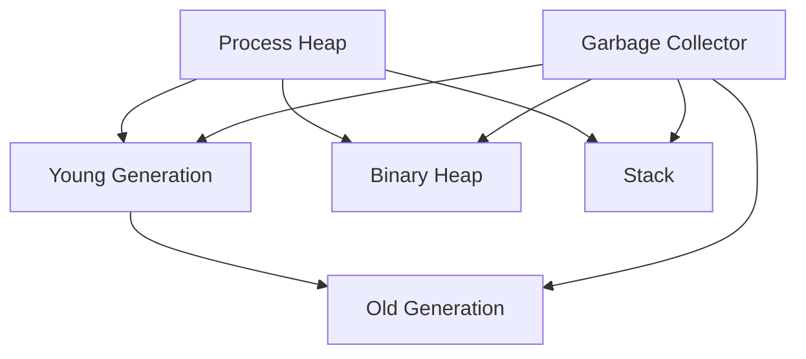

## 19.4 Managing Memory Usage and Garbage Collection

In this section, we delve into the intricacies of memory management and garbage collection in Erlang. Understanding these concepts is crucial for optimizing the performance of your Erlang applications. We will explore how memory is allocated and managed, how garbage collection works, and provide practical tips for reducing memory footprint and avoiding memory leaks. Additionally, we will highlight tools for monitoring memory usage and emphasize writing memory-efficient code.

### Memory Allocation in Erlang

Memory management in Erlang is designed to support its concurrent and functional nature. Let's explore how memory is allocated and managed in Erlang:

#### Process-Based Memory Model

Erlang employs a process-based memory model, where each Erlang process has its own heap. This isolation ensures that processes do not interfere with each other's memory, promoting fault tolerance and scalability. Memory allocation for processes is dynamic, allowing them to grow as needed.

#### Memory Segments

Erlang's memory is divided into several segments:

- **Heap**: Each process has its own heap for storing data. The heap size can grow dynamically, but it starts with a small initial size.
- **Stack**: Used for function calls and local variables.
- **Binary Heap**: Used for storing large binaries, which are shared across processes to save memory.
- **Atom Table**: A global table for storing atoms, which are unique and immutable.

#### Memory Allocation Strategies

Erlang uses a combination of strategies for memory allocation:

- **First-Fit**: Allocates the first block of memory that is large enough.
- **Best-Fit**: Allocates the smallest block of memory that is large enough.
- **Buddy System**: Used for binary allocation, where memory is divided into blocks of power-of-two sizes.

### Garbage Collection in Erlang

Garbage collection is a critical aspect of memory management in Erlang. It automatically reclaims memory that is no longer in use, preventing memory leaks and optimizing resource usage.

#### How Garbage Collection Works

Erlang uses a per-process garbage collection strategy, which means each process collects its own garbage independently. This approach minimizes pause times and ensures that garbage collection does not impact the entire system.

- **Generational Garbage Collection**: Erlang employs a generational garbage collection strategy, where memory is divided into young and old generations. Most objects are short-lived and are collected in the young generation, while long-lived objects are promoted to the old generation.
- **Stop-the-World Collection**: When a process's heap becomes full, garbage collection is triggered, and the process is paused. The garbage collector identifies and reclaims memory that is no longer reachable.
- **Incremental Collection**: Erlang also supports incremental garbage collection, which spreads the collection work over multiple steps to reduce pause times.

#### Impact on Performance

Garbage collection can impact performance, especially in systems with high memory usage or many processes. Understanding how it works and optimizing your code can mitigate these effects.

### Tips for Reducing Memory Footprint

Efficient memory usage is crucial for high-performance Erlang applications. Here are some tips to reduce memory footprint:

#### Use Atoms Wisely

Atoms are stored in a global table and are never garbage collected. Use them sparingly to avoid exhausting the atom table.

#### Optimize Data Structures

Choose the right data structures for your needs. For example, use tuples for fixed-size collections and lists for variable-size collections. Consider using maps for key-value pairs.

#### Avoid Large Binaries

Large binaries are stored in a separate heap and shared across processes. Avoid creating unnecessary large binaries, and use binary pattern matching to process them efficiently.

#### Minimize Process Count

While Erlang is designed for concurrency, creating too many processes can lead to high memory usage. Use processes judiciously and consider pooling strategies.

#### Use ETS and DETS

Erlang Term Storage (ETS) and Disk Erlang Term Storage (DETS) provide efficient in-memory and disk-based storage. Use them for large datasets to reduce process heap usage.

### Avoiding Memory Leaks

Memory leaks occur when memory that is no longer needed is not reclaimed. Here are strategies to avoid memory leaks in Erlang:

#### Properly Handle Process Termination

Ensure that processes terminate cleanly and release resources. Use `exit/1` and `exit/2` functions to terminate processes gracefully.

#### Monitor Long-Lived Processes

Long-lived processes can accumulate memory over time. Monitor their memory usage and consider restarting them periodically.

#### Use Reference Counting

For shared resources, use reference counting to track usage and release resources when they are no longer needed.

### Tools for Monitoring Memory Usage

Erlang provides several tools for monitoring memory usage and identifying potential issues:

#### Observer

The `observer` tool provides a graphical interface for monitoring system performance, including memory usage. It displays information about processes, memory allocation, and garbage collection.

#### Recon

`Recon` is a powerful library for inspecting and debugging Erlang systems. It provides functions for analyzing memory usage, identifying large processes, and detecting memory leaks.

#### Etop

`Etop` is a command-line tool for monitoring Erlang system performance. It provides real-time information about process memory usage and garbage collection.

### Writing Memory-Efficient Code

Writing memory-efficient code is essential for optimizing Erlang applications. Here are some best practices:

#### Use Tail Recursion

Tail recursion is a technique where the recursive call is the last operation in a function. It allows the Erlang compiler to optimize memory usage by reusing stack frames.

```erlang
% Tail-recursive factorial function
factorial(N) -> factorial(N, 1).

factorial(0, Acc) -> Acc;
factorial(N, Acc) -> factorial(N - 1, N * Acc).
```

#### Avoid Deep Recursion

Deep recursion can lead to stack overflow errors. Use iterative solutions or tail recursion to avoid deep recursion.

#### Minimize Intermediate Data Structures

Avoid creating unnecessary intermediate data structures. Use list comprehensions and binary pattern matching to process data efficiently.

#### Use Binaries for String Manipulation

Binaries are more memory-efficient than lists for string manipulation. Use binary pattern matching to process strings.

```erlang
% Binary pattern matching example
parse_binary(<<A:8, B:8, Rest/binary>>) -> {A, B, Rest}.
```

### Visualizing Memory Management in Erlang

To better understand memory management in Erlang, let's visualize the process using a diagram:



**Diagram Description**: This diagram illustrates the memory segments in an Erlang process, including the heap, stack, and binary heap. The garbage collector manages memory in the young and old generations, as well as the binary heap and stack.

### Knowledge Check

Let's reinforce our understanding with a few questions:

- What is the impact of using too many atoms in an Erlang application?
- How does Erlang's garbage collector handle short-lived and long-lived objects?
- What are some strategies for reducing memory footprint in Erlang applications?

### Embrace the Journey

Remember, mastering memory management and garbage collection in Erlang is a journey. As you continue to explore these concepts, you'll gain a deeper understanding of how to optimize your applications for performance and scalability. Keep experimenting, stay curious, and enjoy the process!

## Quiz: Managing Memory Usage and Garbage Collection



### What is the primary benefit of Erlang's process-based memory model?

- [x] Isolation of memory between processes
- [ ] Faster memory allocation
- [ ] Reduced memory usage
- [ ] Simplified garbage collection

> **Explanation:** Erlang's process-based memory model isolates memory between processes, promoting fault tolerance and scalability.

### How does Erlang's garbage collector handle short-lived objects?

- [x] Collects them in the young generation
- [ ] Promotes them to the old generation
- [ ] Ignores them
- [ ] Collects them in the binary heap

> **Explanation:** Short-lived objects are collected in the young generation, which is optimized for frequent garbage collection.

### What is a potential risk of using too many atoms in an Erlang application?

- [x] Exhausting the atom table
- [ ] Increased memory usage
- [ ] Slower garbage collection
- [ ] Reduced performance

> **Explanation:** Atoms are stored in a global table and are never garbage collected, so using too many can exhaust the atom table.

### Which tool provides a graphical interface for monitoring Erlang system performance?

- [x] Observer
- [ ] Recon
- [ ] Etop
- [ ] Dialyzer

> **Explanation:** The `observer` tool provides a graphical interface for monitoring system performance, including memory usage.

### What is the advantage of using tail recursion in Erlang?

- [x] Optimizes memory usage by reusing stack frames
- [ ] Simplifies code
- [ ] Increases performance
- [ ] Reduces memory allocation

> **Explanation:** Tail recursion allows the Erlang compiler to optimize memory usage by reusing stack frames.

### How can you avoid deep recursion in Erlang?

- [x] Use iterative solutions or tail recursion
- [ ] Increase stack size
- [ ] Use more processes
- [ ] Optimize garbage collection

> **Explanation:** Avoid deep recursion by using iterative solutions or tail recursion to prevent stack overflow errors.

### What is a benefit of using binaries for string manipulation in Erlang?

- [x] More memory-efficient than lists
- [ ] Easier to read
- [ ] Faster processing
- [ ] Simplified code

> **Explanation:** Binaries are more memory-efficient than lists for string manipulation, reducing memory usage.

### Which memory segment is used for storing large binaries in Erlang?

- [x] Binary Heap
- [ ] Process Heap
- [ ] Stack
- [ ] Atom Table

> **Explanation:** Large binaries are stored in the binary heap, which is shared across processes.

### What is the purpose of the `recon` library in Erlang?

- [x] Inspecting and debugging Erlang systems
- [ ] Monitoring system performance
- [ ] Analyzing memory usage
- [ ] Detecting memory leaks

> **Explanation:** `Recon` is a powerful library for inspecting and debugging Erlang systems, including analyzing memory usage.

### True or False: Erlang's garbage collector uses a global collection strategy.

- [ ] True
- [x] False

> **Explanation:** Erlang uses a per-process garbage collection strategy, where each process collects its own garbage independently.



By understanding and applying these concepts, you can effectively manage memory usage and optimize the performance of your Erlang applications. Keep exploring and refining your skills, and you'll be well-equipped to tackle any memory-related challenges that come your way!
