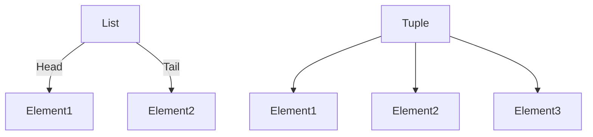

## 19.5 Efficient Data Structures and Algorithms

In the realm of Erlang programming, selecting the right data structures and algorithms is crucial for building efficient and scalable applications. This section delves into the performance characteristics of various data structures available in Erlang, discusses the use of ETS and DETS for data storage, and provides insights into algorithm optimizations. We will also highlight the importance of understanding algorithmic complexity and encourage testing different approaches to identify the most efficient solutions.

### Understanding Erlang's Data Structures

Erlang offers a variety of data structures, each with its own performance characteristics. Understanding these characteristics is key to making informed decisions about which data structure to use in different scenarios.

#### Lists

Lists in Erlang are linked lists, which means they are efficient for operations that involve adding or removing elements from the front. However, accessing elements by index is an O(n) operation, making lists less suitable for scenarios where random access is frequent.

```erlang
% Example: Creating and manipulating a list
List = [1, 2, 3, 4],
NewList = [0 | List], % Adding an element to the front
```

#### Tuples

Tuples are fixed-size collections of elements. They are efficient for accessing elements by index, as this is an O(1) operation. However, modifying a tuple requires creating a new tuple, which can be costly for large tuples.

```erlang
% Example: Creating and accessing a tuple
Tuple = {a, b, c},
Element = element(2, Tuple), % Accessing the second element
```

#### Maps

Maps are key-value stores that provide efficient access, insertion, and deletion operations. They are ideal for scenarios where you need to associate values with keys and perform frequent lookups.

```erlang
% Example: Creating and using a map
Map = #{key1 => value1, key2 => value2},
Value = maps:get(key1, Map), % Accessing a value by key
```

#### Binaries

Binaries are used for handling large amounts of binary data efficiently. They are particularly useful for operations involving file I/O or network communication.

```erlang
% Example: Creating and manipulating a binary
Binary = <<1, 2, 3, 4>>,
Size = byte_size(Binary), % Getting the size of the binary
```

### Choosing Between ETS and DETS

ETS (Erlang Term Storage) and DETS (Disk Erlang Term Storage) are powerful tools for data storage in Erlang. Choosing between them depends on your application's requirements.

#### ETS

ETS is an in-memory storage system that provides fast access to large amounts of data. It is suitable for scenarios where data needs to be accessed frequently and quickly.

```erlang
% Example: Creating and using an ETS table
Table = ets:new(my_table, [set, public]),
ets:insert(Table, {key, value}),
Value = ets:lookup(Table, key),
```

#### DETS

DETS is a disk-based storage system that persists data across application restarts. It is suitable for scenarios where data persistence is required, but it comes with a performance trade-off compared to ETS.

```erlang
% Example: Creating and using a DETS table
{ok, Table} = dets:open_file(my_dets, [type => set]),
dets:insert(Table, {key, value}),
Value = dets:lookup(Table, key),
```

### Algorithm Optimizations

Optimizing algorithms is as important as choosing the right data structures. Here are some strategies for algorithm optimization in Erlang.

#### Tail Recursion

Tail recursion is a technique where the recursive call is the last operation in a function. Erlang's compiler can optimize tail-recursive functions to avoid growing the call stack, making them more efficient.

```erlang
% Example: Tail-recursive function to calculate factorial
factorial(N) -> factorial(N, 1).

factorial(0, Acc) -> Acc;
factorial(N, Acc) -> factorial(N - 1, N * Acc).
```

#### Divide and Conquer

Divide and conquer is a strategy that involves breaking a problem into smaller subproblems, solving each subproblem independently, and combining the results. This approach can lead to more efficient algorithms.

```erlang
% Example: Merge sort using divide and conquer
merge_sort([]) -> [];
merge_sort([X]) -> [X];
merge_sort(List) ->
    {Left, Right} = lists:split(length(List) div 2, List),
    merge(merge_sort(Left), merge_sort(Right)).

merge([], Right) -> Right;
merge(Left, []) -> Left;
merge([H1 | T1] = Left, [H2 | T2] = Right) ->
    if H1 =< H2 -> [H1 | merge(T1, Right)];
       true -> [H2 | merge(Left, T2)]
    end.
```

### Importance of Algorithmic Complexity

Understanding algorithmic complexity is crucial for writing efficient code. The complexity of an algorithm determines how its performance scales with the size of the input.

- **O(1)**: Constant time complexity, independent of input size.
- **O(n)**: Linear time complexity, performance scales linearly with input size.
- **O(log n)**: Logarithmic time complexity, performance scales logarithmically with input size.
- **O(n^2)**: Quadratic time complexity, performance scales quadratically with input size.

### Testing Different Approaches

To identify the most efficient solution, it's important to test different approaches. Erlang's benchmarking tools, such as `timer:tc/3`, can help measure the performance of different implementations.

```erlang
% Example: Measuring execution time of a function
{Time, Result} = timer:tc(my_module, my_function, [Arg1, Arg2]),
io:format("Execution time: ~p microseconds~n", [Time]),
```

### Visualizing Data Structures and Algorithms

To better understand the relationships and operations within data structures and algorithms, visualizations can be extremely helpful. Below is a diagram illustrating the structure of a list and a tuple in Erlang.



**Diagram Description:** This diagram shows how a list is composed of a head and a tail, while a tuple contains a fixed number of elements.

### Try It Yourself

Experiment with the code examples provided in this section. Try modifying the list, tuple, and map examples to add more elements or change the data types. Implement your own tail-recursive functions and measure their performance using `timer:tc/3`. 

### Key Takeaways

- Choose data structures based on their performance characteristics and your application's requirements.
- Use ETS for fast, in-memory data storage and DETS for persistent, disk-based storage.
- Optimize algorithms using techniques like tail recursion and divide and conquer.
- Understand algorithmic complexity to write efficient code.
- Test different approaches to identify the most efficient solution.

Remember, this is just the beginning. As you progress, you'll build more complex and efficient Erlang applications. Keep experimenting, stay curious, and enjoy the journey!

## Quiz: Efficient Data Structures and Algorithms



### Which data structure is most efficient for frequent random access in Erlang?

- [ ] List
- [x] Tuple
- [ ] Map
- [ ] Binary

> **Explanation:** Tuples provide O(1) access time for elements, making them efficient for random access.


### What is the primary advantage of using ETS over DETS?

- [x] Faster access to data
- [ ] Data persistence
- [ ] Lower memory usage
- [ ] Built-in encryption

> **Explanation:** ETS provides in-memory storage, which allows for faster data access compared to disk-based DETS.


### Which algorithmic technique involves breaking a problem into smaller subproblems?

- [ ] Tail recursion
- [x] Divide and conquer
- [ ] Dynamic programming
- [ ] Greedy algorithms

> **Explanation:** Divide and conquer involves breaking a problem into smaller subproblems, solving them independently, and combining the results.


### What is the time complexity of accessing an element in a map by key?

- [x] O(1)
- [ ] O(n)
- [ ] O(log n)
- [ ] O(n^2)

> **Explanation:** Maps provide O(1) average time complexity for accessing elements by key.


### Which Erlang tool can be used to measure the execution time of a function?

- [ ] observer
- [ ] dialyzer
- [x] timer:tc/3
- [ ] fprof

> **Explanation:** `timer:tc/3` is used to measure the execution time of a function in Erlang.


### What is the main disadvantage of using lists for random access?

- [ ] High memory usage
- [x] O(n) access time
- [ ] Complexity in implementation
- [ ] Lack of built-in functions

> **Explanation:** Lists have O(n) access time for random access, making them inefficient for this purpose.


### Which data structure is best suited for handling large binary data efficiently?

- [ ] List
- [ ] Tuple
- [ ] Map
- [x] Binary

> **Explanation:** Binaries are designed for efficient handling of large binary data in Erlang.


### What is the complexity of inserting an element into a tuple?

- [ ] O(1)
- [ ] O(log n)
- [x] O(n)
- [ ] O(n^2)

> **Explanation:** Inserting an element into a tuple requires creating a new tuple, which is an O(n) operation.


### Which of the following is a characteristic of tail-recursive functions?

- [x] The recursive call is the last operation
- [ ] They use more memory
- [ ] They are slower than non-tail-recursive functions
- [ ] They cannot be optimized by the compiler

> **Explanation:** Tail-recursive functions have the recursive call as the last operation, allowing the compiler to optimize them.


### True or False: DETS is suitable for scenarios where data needs to be accessed frequently and quickly.

- [ ] True
- [x] False

> **Explanation:** DETS is disk-based and not as fast as ETS, which is in-memory and suitable for frequent and quick data access.


