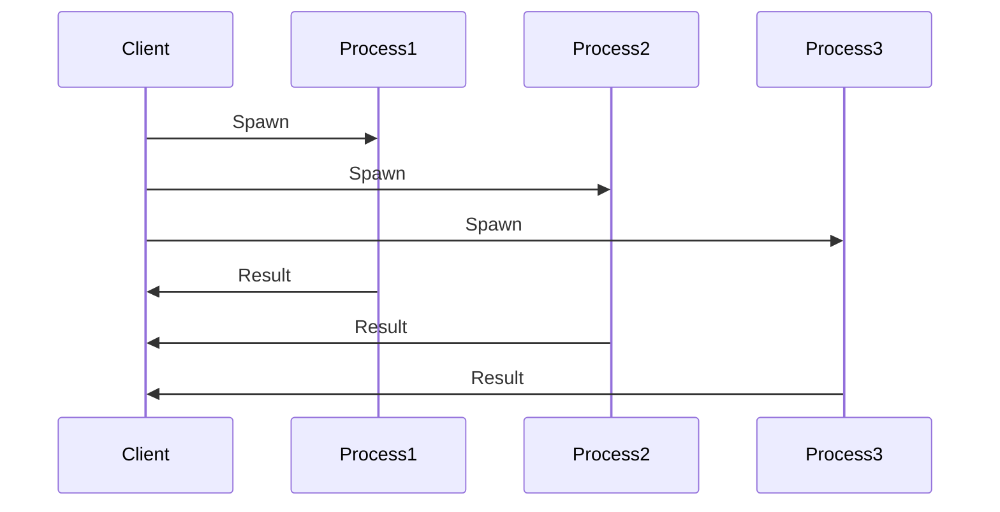

## 19.6 Parallel Processing and Work Distribution

In the realm of concurrent programming, Erlang stands out with its robust concurrency model, making it an ideal choice for building scalable and fault-tolerant systems. This section delves into the intricacies of parallel processing and work distribution in Erlang, providing you with the tools and knowledge to harness the full potential of Erlang's capabilities.

### Understanding Parallel Processing in Erlang

Parallel processing involves dividing a task into smaller, independent units that can be executed simultaneously. Erlang's lightweight processes and message-passing model make it particularly well-suited for parallel processing. Here's how you can effectively divide tasks into parallelizable units:

1. **Task Decomposition**: Break down complex tasks into smaller, manageable units that can be processed independently. This is crucial for maximizing concurrency and minimizing dependencies between tasks.

2. **Identifying Independent Tasks**: Analyze your application to identify tasks that do not depend on each other. These tasks can be executed in parallel, leading to improved performance.

3. **Granularity of Tasks**: Determine the appropriate granularity for your tasks. Fine-grained tasks may lead to higher overhead due to process management, while coarse-grained tasks may not fully utilize available resources.

### Process Pools and Dynamic Spawning

Erlang provides two primary mechanisms for managing processes: process pools and dynamic spawning. Each has its advantages and use cases.

#### Process Pools

A process pool is a collection of worker processes that can be reused to perform tasks. This approach is beneficial when you have a fixed number of tasks or when task creation overhead is significant.

- **Advantages**:
  - Reduces the overhead of creating and destroying processes.
  - Provides a controlled environment for managing resources.

- **Implementation**:
  Here's a simple example of a process pool in Erlang:

  ```erlang
  -module(process_pool).
  -export([start_pool/2, execute_task/2]).

  start_pool(Name, Size) ->
      Pool = [spawn_link(fun worker/0) || _ <- lists:seq(1, Size)],
      register(Name, Pool).

  worker() ->
      receive
          {task, Fun} ->
              Fun(),
              worker()
      end.

  execute_task(PoolName, Task) ->
      Pool = whereis(PoolName),
      case lists:keyfind(idle, 1, Pool) of
          {idle, Pid} ->
              Pid ! {task, Task};
          false ->
              io:format("No idle workers available~n")
      end.
  ```

  In this example, `start_pool/2` initializes a pool of worker processes, and `execute_task/2` sends tasks to idle workers.

#### Dynamic Spawning

Dynamic spawning involves creating processes on-the-fly as tasks arrive. This approach is suitable for applications with unpredictable workloads or when tasks are highly variable in nature.

- **Advantages**:
  - Flexibility to handle varying workloads.
  - No need to manage a fixed pool of processes.

- **Implementation**:
  Here's an example of dynamic spawning in Erlang:

  ```erlang
  -module(dynamic_spawning).
  -export([execute_task/1]).

  execute_task(Task) ->
      spawn(fun() -> Task() end).
  ```

  This simple function spawns a new process for each task, allowing for dynamic scaling based on workload.

### Load Balancing Strategies

Efficient load balancing is crucial for maximizing resource utilization and ensuring that no single process becomes a bottleneck. Here are some strategies for load balancing in Erlang:

1. **Round Robin**: Distribute tasks evenly across available processes. This is a simple and effective strategy for uniform workloads.

2. **Least Loaded**: Assign tasks to the process with the least load. This requires monitoring process load, which can introduce overhead.

3. **Random Assignment**: Randomly assign tasks to processes. This can be effective for highly variable workloads.

4. **Adaptive Load Balancing**: Dynamically adjust task distribution based on real-time performance metrics. This approach can optimize resource utilization but may require more complex monitoring and control mechanisms.

### Minimizing Synchronization Overhead

Synchronization overhead can significantly impact the performance of parallel systems. Here are some considerations for minimizing synchronization overhead in Erlang:

- **Avoid Shared State**: Erlang's message-passing model naturally avoids shared state, reducing the need for synchronization.

- **Use Asynchronous Communication**: Whenever possible, use asynchronous message passing to avoid blocking processes.

- **Batch Processing**: Process tasks in batches to reduce the frequency of synchronization events.

- **Optimize Message Passing**: Ensure that messages are small and efficiently serialized to minimize communication overhead.

### Designing Scalable Systems

Scalability is a key consideration when designing parallel systems. Here are some tips for designing systems that scale with available resources:

- **Horizontal Scaling**: Design your system to scale horizontally by adding more nodes or processes as needed.

- **Fault Tolerance**: Implement fault-tolerant mechanisms to ensure that your system can recover from failures without impacting performance.

- **Resource Monitoring**: Continuously monitor resource usage and adjust your system's configuration to optimize performance.

- **Performance Testing**: Regularly test your system's performance under different loads to identify bottlenecks and optimize resource allocation.

### Code Example: Parallel Processing with Task Decomposition

Let's consider a practical example of parallel processing in Erlang. We'll implement a simple system that calculates the sum of a list of numbers using parallel processing.

```erlang
-module(parallel_sum).
-export([sum/1]).

sum(List) ->
    NumProcesses = length(List),
    Pids = [spawn(fun() -> sum_worker(Num) end) || Num <- List],
    Results = [receive {result, Res} -> Res end || _ <- Pids],
    lists:sum(Results).

sum_worker(Num) ->
    Result = Num,
    self() ! {result, Result}.
```

In this example, we spawn a process for each number in the list, calculate the sum in parallel, and collect the results.

### Try It Yourself

Experiment with the code example by modifying the list of numbers or changing the number of processes. Observe how the performance changes with different configurations.

### Visualizing Parallel Processing

To better understand the flow of parallel processing in Erlang, let's visualize the process using a sequence diagram.



This diagram illustrates how a client spawns multiple processes to perform tasks in parallel and collects the results.

### Further Reading

For more information on parallel processing and work distribution in Erlang, consider exploring the following resources:

- [Erlang Documentation](https://www.erlang.org/doc/)
- [Learn You Some Erlang for Great Good!](http://learnyousomeerlang.com/)
- [Erlang and OTP in Action](https://www.manning.com/books/erlang-and-otp-in-action)

### Knowledge Check

- What are the advantages of using process pools in Erlang?
- How does dynamic spawning differ from process pools?
- What are some strategies for load balancing in Erlang?
- How can you minimize synchronization overhead in parallel systems?
- What are some considerations for designing scalable systems in Erlang?

### Embrace the Journey

Remember, mastering parallel processing and work distribution in Erlang is a journey. As you continue to explore and experiment, you'll gain a deeper understanding of how to build efficient, scalable systems. Keep pushing the boundaries, stay curious, and enjoy the process!

## Quiz: Parallel Processing and Work Distribution



### What is the primary advantage of using process pools in Erlang?

- [x] Reduces the overhead of creating and destroying processes.
- [ ] Increases the number of processes available.
- [ ] Simplifies the code structure.
- [ ] Enhances message-passing speed.

> **Explanation:** Process pools reduce the overhead associated with creating and destroying processes by reusing existing ones.

### How does dynamic spawning differ from process pools?

- [x] Dynamic spawning creates processes on-the-fly as tasks arrive.
- [ ] Dynamic spawning uses a fixed number of processes.
- [ ] Dynamic spawning is only used for synchronous tasks.
- [ ] Dynamic spawning requires more memory.

> **Explanation:** Dynamic spawning involves creating processes as needed, unlike process pools which use a fixed set of processes.

### Which load balancing strategy assigns tasks to the process with the least load?

- [ ] Round Robin
- [x] Least Loaded
- [ ] Random Assignment
- [ ] Adaptive Load Balancing

> **Explanation:** The Least Loaded strategy assigns tasks to the process with the least current load.

### What is a key consideration for minimizing synchronization overhead in Erlang?

- [x] Avoid shared state.
- [ ] Use synchronous communication.
- [ ] Increase the number of processes.
- [ ] Decrease message size.

> **Explanation:** Avoiding shared state reduces the need for synchronization, minimizing overhead.

### What is a benefit of horizontal scaling in Erlang systems?

- [x] Allows adding more nodes or processes as needed.
- [ ] Reduces the number of processes.
- [ ] Simplifies code maintenance.
- [ ] Enhances message-passing speed.

> **Explanation:** Horizontal scaling allows systems to add more nodes or processes to handle increased load.

### Which of the following is a strategy for load balancing in Erlang?

- [x] Round Robin
- [ ] Vertical Scaling
- [ ] Process Pooling
- [ ] Dynamic Spawning

> **Explanation:** Round Robin is a common load balancing strategy that distributes tasks evenly across processes.

### How can you optimize message passing in Erlang?

- [x] Ensure messages are small and efficiently serialized.
- [ ] Use large messages to reduce the number of messages.
- [ ] Increase the number of processes.
- [ ] Use synchronous communication.

> **Explanation:** Small and efficiently serialized messages reduce communication overhead.

### What is a key feature of Erlang's concurrency model?

- [x] Lightweight processes and message-passing model.
- [ ] Shared memory and locks.
- [ ] Synchronous communication.
- [ ] Fixed number of processes.

> **Explanation:** Erlang's concurrency model is based on lightweight processes and message-passing.

### Which of the following is NOT a load balancing strategy?

- [ ] Round Robin
- [ ] Least Loaded
- [ ] Random Assignment
- [x] Process Pooling

> **Explanation:** Process Pooling is a method for managing processes, not a load balancing strategy.

### True or False: Erlang's message-passing model naturally avoids shared state.

- [x] True
- [ ] False

> **Explanation:** Erlang's message-passing model is designed to avoid shared state, reducing synchronization needs.


