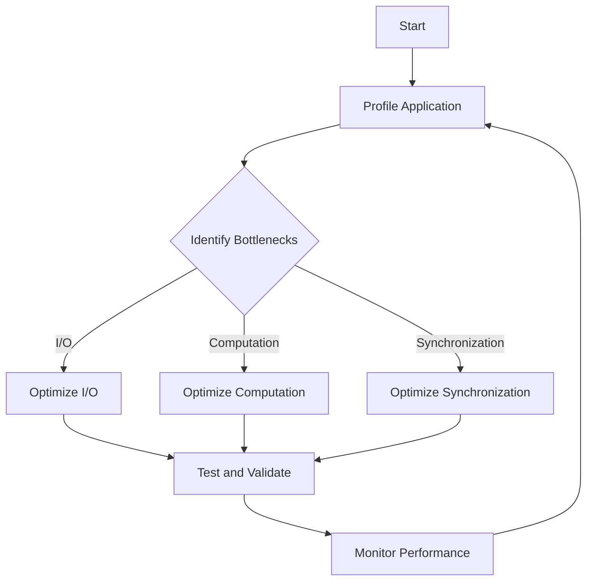

## 19.7 Identifying and Resolving Bottlenecks

In the world of software development, performance bottlenecks can significantly impact the efficiency and responsiveness of applications. In Erlang, a language renowned for its concurrency and fault tolerance, identifying and resolving these bottlenecks is crucial for maintaining high-performance systems. This section delves into the common sources of bottlenecks, methods for identifying them using profiling tools, and strategies for resolving them effectively.

### Understanding Bottlenecks

A bottleneck in software is a point in the system where the performance is limited, causing delays and reducing overall throughput. In Erlang applications, bottlenecks can arise from various sources, including:

- **I/O Operations**: Disk and network I/O can be slow, leading to delays.
- **Computation**: Intensive calculations can consume CPU resources.
- **Synchronization**: Contention for shared resources can cause delays.

### Common Sources of Bottlenecks

#### I/O Operations

I/O operations, such as reading from or writing to a disk or network, are often slower than in-memory operations. In Erlang, processes waiting for I/O can become bottlenecks if not managed properly.

#### Computation

Heavy computational tasks can monopolize CPU resources, leading to performance degradation. In Erlang, this can be exacerbated by the single-threaded nature of the BEAM VM's processes.

#### Synchronization

Erlang's concurrency model relies on message passing between processes. If processes are frequently waiting for messages or contending for shared resources, it can lead to synchronization bottlenecks.

### Identifying Bottlenecks

To effectively resolve bottlenecks, we must first identify them. Profiling tools are invaluable for this task, providing insights into where time and resources are being spent.

#### Using Profiling Tools

Erlang offers several profiling tools to help identify bottlenecks:

- **`fprof`**: A profiling tool that provides detailed information about function calls and execution times.
- **`eprof`**: A time profiler that measures the time spent in each function.
- **`percept`**: A tool for visualizing concurrency and identifying process bottlenecks.

**Example: Profiling with `fprof`**

```erlang
% Start profiling
fprof:apply(Mod, Fun, Args).

% Analyze the results
fprof:profile().

% Print the results
fprof:analyse([totals]).
```

In this example, `fprof` is used to profile a specific function call. The results can help identify which functions are consuming the most time.

#### Analyzing Profiling Data

Once profiling data is collected, analyze it to pinpoint bottlenecks. Look for functions with high execution times or processes that are frequently waiting.

### Prioritizing Bottlenecks

Not all bottlenecks have the same impact on performance. Prioritize them based on:

- **Impact on User Experience**: Focus on bottlenecks that affect critical user interactions.
- **Frequency**: Address bottlenecks that occur frequently.
- **Resource Consumption**: Target bottlenecks that consume significant resources.

### Resolving Bottlenecks

Once bottlenecks are identified and prioritized, employ strategies to resolve them.

#### Optimizing I/O Operations

- **Asynchronous I/O**: Use asynchronous operations to avoid blocking processes.
- **Batch Processing**: Process data in batches to reduce the number of I/O operations.

#### Improving Computation Efficiency

- **Algorithm Optimization**: Optimize algorithms to reduce computational complexity.
- **Parallel Processing**: Distribute computational tasks across multiple processes.

#### Enhancing Synchronization

- **Reduce Contention**: Minimize shared resources to reduce contention.
- **Optimize Message Passing**: Ensure efficient message passing between processes.

### Iterative Approach to Optimization

Performance tuning is an iterative process. Follow these steps:

1. **Profile**: Use profiling tools to identify bottlenecks.
2. **Analyze**: Examine profiling data to understand the root cause.
3. **Optimize**: Implement changes to resolve bottlenecks.
4. **Test**: Test the application to ensure performance improvements.
5. **Repeat**: Continue profiling and optimizing as needed.

### Systematic Method for Performance Tuning

Adopt a systematic approach to performance tuning:

1. **Define Performance Goals**: Establish clear performance objectives.
2. **Measure Baseline Performance**: Use profiling tools to measure current performance.
3. **Identify Bottlenecks**: Analyze profiling data to identify bottlenecks.
4. **Prioritize Bottlenecks**: Focus on the most impactful bottlenecks.
5. **Implement Solutions**: Apply optimization techniques to resolve bottlenecks.
6. **Validate Improvements**: Test the application to confirm performance gains.
7. **Monitor Performance**: Continuously monitor performance to detect new bottlenecks.

### Visualizing Bottlenecks

Visualizing bottlenecks can aid in understanding and resolving them. Use diagrams to represent process interactions and resource usage.



*Diagram: Iterative Process for Identifying and Resolving Bottlenecks*

### Try It Yourself

Experiment with the provided code examples by modifying the functions being profiled. Observe how changes impact performance and identify new bottlenecks.

### Knowledge Check

- What are the common sources of bottlenecks in Erlang applications?
- How can profiling tools help identify bottlenecks?
- Why is it important to prioritize bottlenecks based on impact?
- What are some strategies for optimizing I/O operations?

### Summary

Identifying and resolving bottlenecks is crucial for maintaining high-performance Erlang applications. By using profiling tools, prioritizing bottlenecks, and employing optimization strategies, we can enhance application performance. Remember, performance tuning is an iterative process, and continuous monitoring is key to sustaining improvements.

### Embrace the Journey

Remember, this is just the beginning. As you progress, you'll build more efficient and responsive applications. Keep experimenting, stay curious, and enjoy the journey!

## Quiz: Identifying and Resolving Bottlenecks



### What is a common source of bottlenecks in Erlang applications?

- [x] I/O Operations
- [ ] Memory Allocation
- [ ] Garbage Collection
- [ ] Syntax Errors

> **Explanation:** I/O operations, such as disk and network access, are common sources of bottlenecks due to their slower nature compared to in-memory operations.

### Which Erlang tool is used for profiling function calls and execution times?

- [x] `fprof`
- [ ] `dialyzer`
- [ ] `observer`
- [ ] `rebar3`

> **Explanation:** `fprof` is a profiling tool in Erlang that provides detailed information about function calls and execution times.

### Why is it important to prioritize bottlenecks based on impact?

- [x] To focus on the most critical performance issues
- [ ] To avoid unnecessary code changes
- [ ] To reduce the number of profiling sessions
- [ ] To simplify the codebase

> **Explanation:** Prioritizing bottlenecks based on impact ensures that the most critical performance issues are addressed first, improving overall application performance.

### What is a strategy for optimizing I/O operations?

- [x] Use asynchronous I/O
- [ ] Increase memory allocation
- [ ] Reduce function calls
- [ ] Simplify algorithms

> **Explanation:** Using asynchronous I/O operations can help avoid blocking processes, thus optimizing I/O performance.

### What is the first step in a systematic method for performance tuning?

- [x] Define Performance Goals
- [ ] Implement Solutions
- [ ] Monitor Performance
- [ ] Test and Validate

> **Explanation:** Defining performance goals is the first step in a systematic method for performance tuning, providing a clear target for optimization efforts.

### Which tool can be used to visualize concurrency and identify process bottlenecks?

- [x] `percept`
- [ ] `eprof`
- [ ] `fprof`
- [ ] `dialyzer`

> **Explanation:** `percept` is a tool in Erlang used for visualizing concurrency and identifying process bottlenecks.

### What should be done after implementing solutions to resolve bottlenecks?

- [x] Validate Improvements
- [ ] Identify New Bottlenecks
- [ ] Increase Resource Allocation
- [ ] Simplify Codebase

> **Explanation:** After implementing solutions, it's important to validate improvements to ensure that the changes have positively impacted performance.

### What is a benefit of using batch processing for I/O operations?

- [x] Reduces the number of I/O operations
- [ ] Increases CPU usage
- [ ] Simplifies code logic
- [ ] Enhances memory allocation

> **Explanation:** Batch processing reduces the number of I/O operations, which can help optimize performance by minimizing the time spent on I/O.

### How can message passing be optimized in Erlang?

- [x] Ensure efficient message passing between processes
- [ ] Increase process priority
- [ ] Reduce the number of processes
- [ ] Simplify process logic

> **Explanation:** Ensuring efficient message passing between processes can help optimize synchronization and reduce bottlenecks.

### True or False: Performance tuning is a one-time process.

- [ ] True
- [x] False

> **Explanation:** Performance tuning is an iterative process that requires continuous monitoring and optimization to sustain improvements.


