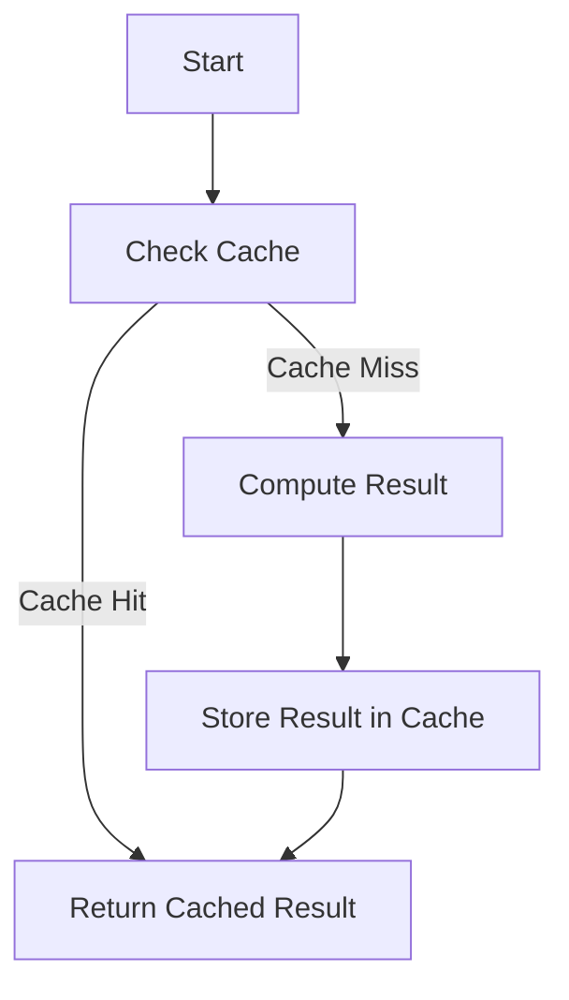

## 19.8 Caching Strategies with ETS and Memoization

In the realm of software development, performance optimization is a crucial aspect, especially when dealing with large-scale applications. Caching is a powerful technique that helps improve performance by storing results of expensive function calls and reusing them when the same inputs occur again. In Erlang, we can leverage ETS (Erlang Term Storage) and memoization to implement efficient caching strategies. This section will guide you through the concepts of caching and memoization, demonstrate how to use ETS for caching, discuss cache invalidation strategies, and highlight the trade-offs involved.

### Understanding Caching and Memoization

**Caching** is the process of storing data in a temporary storage area, or cache, so that future requests for that data can be served faster. It reduces the need to recompute or fetch data from a slower storage medium. Caching is particularly useful in scenarios where data retrieval or computation is expensive in terms of time or resources.

**Memoization** is a specific form of caching that involves storing the results of expensive function calls and returning the cached result when the same inputs occur again. It is a technique used to optimize recursive functions by caching previously computed results.

### Using ETS for Caching in Erlang

ETS (Erlang Term Storage) is a powerful in-memory storage system provided by Erlang. It allows concurrent read and write access, making it ideal for caching purposes. ETS tables can store large amounts of data and are highly efficient for lookups.

#### Creating and Using ETS Tables

To use ETS for caching, you first need to create an ETS table. Here's a simple example:

```erlang
% Create an ETS table named 'cache' with set type
CacheTable = ets:new(cache, [set, public, named_table]).

% Insert a key-value pair into the ETS table
ets:insert(cache, {key, value}).

% Retrieve a value from the ETS table
case ets:lookup(cache, key) of
    [{_, Value}] -> Value;
    [] -> undefined
end.
```

In this example, we create a named ETS table called `cache` with a `set` type, allowing unique keys. We then insert a key-value pair and retrieve a value using `ets:lookup/2`.

#### Example: Caching Computed Results

Consider a function that computes the factorial of a number. We can use ETS to cache the results of this computation:

```erlang
-module(factorial_cache).
-export([factorial/1]).

% Create an ETS table for caching factorial results
init_cache() ->
    ets:new(factorial_cache, [set, public, named_table]).

% Compute factorial with caching
factorial(N) when N >= 0 ->
    case ets:lookup(factorial_cache, N) of
        [{_, Result}] ->
            Result; % Return cached result
        [] ->
            Result = compute_factorial(N),
            ets:insert(factorial_cache, {N, Result}),
            Result
    end.

% Helper function to compute factorial
compute_factorial(0) -> 1;
compute_factorial(N) -> N * compute_factorial(N - 1).
```

In this module, we initialize an ETS table for caching factorial results. The `factorial/1` function checks if the result is already cached; if not, it computes the factorial and stores the result in the cache.

### Cache Invalidation Strategies

Cache invalidation is a critical aspect of caching strategies. It involves removing or updating cached data when it becomes stale or invalid. Here are some common cache invalidation strategies:

1. **Time-Based Invalidation**: Invalidate cache entries after a specific time period. This is useful for data that changes frequently.

2. **Event-Based Invalidation**: Invalidate cache entries based on specific events, such as data updates or deletions.

3. **Manual Invalidation**: Provide mechanisms to manually invalidate cache entries when necessary.

4. **Size-Based Invalidation**: Limit the cache size and remove the least recently used (LRU) entries when the cache exceeds its size.

Implementing cache invalidation requires careful consideration of the application's data consistency requirements.

### Memoization in Erlang

Memoization is particularly useful for optimizing recursive functions. In Erlang, we can implement memoization using ETS or process dictionaries.

#### Example: Memoizing a Fibonacci Function

Let's memoize a recursive Fibonacci function using ETS:

```erlang
-module(fibonacci_memo).
-export([fibonacci/1]).

% Create an ETS table for caching Fibonacci results
init_cache() ->
    ets:new(fibonacci_cache, [set, public, named_table]).

% Compute Fibonacci with memoization
fibonacci(N) when N >= 0 ->
    case ets:lookup(fibonacci_cache, N) of
        [{_, Result}] ->
            Result; % Return cached result
        [] ->
            Result = compute_fibonacci(N),
            ets:insert(fibonacci_cache, {N, Result}),
            Result
    end.

% Helper function to compute Fibonacci
compute_fibonacci(0) -> 0;
compute_fibonacci(1) -> 1;
compute_fibonacci(N) -> fibonacci(N - 1) + fibonacci(N - 2).
```

In this example, we use an ETS table to cache Fibonacci results. The `fibonacci/1` function checks the cache before computing the result, ensuring that each Fibonacci number is computed only once.

### Trade-offs Between Memory Usage and Performance Gains

Caching and memoization can significantly improve performance by reducing redundant computations and data retrievals. However, they come with trade-offs:

- **Memory Usage**: Caching consumes memory, which can be a concern in memory-constrained environments. It's essential to balance memory usage with performance gains.

- **Consistency**: Cached data can become stale, leading to consistency issues. Implementing effective cache invalidation strategies is crucial.

- **Complexity**: Adding caching logic can increase code complexity. It's important to ensure that caching mechanisms are well-documented and maintainable.

### Visualizing Caching with ETS

To better understand how caching with ETS works, let's visualize the process using a flowchart:



**Figure 1**: This flowchart illustrates the caching process with ETS. The system first checks the cache for a result. If a cache hit occurs, the cached result is returned. Otherwise, the result is computed, stored in the cache, and then returned.

### Try It Yourself

Experiment with the provided code examples by modifying the cache size, invalidation strategies, or the functions being cached. Observe how these changes impact performance and memory usage.

### References and Further Reading

- [ETS Documentation](https://erlang.org/doc/man/ets.html)
- [Memoization in Functional Programming](https://en.wikipedia.org/wiki/Memoization)
- [Erlang Efficiency Guide](https://erlang.org/doc/efficiency_guide/introduction.html)

### Knowledge Check

- What is the primary purpose of caching?
- How does memoization differ from general caching?
- What are some common cache invalidation strategies?
- What are the trade-offs of using caching in Erlang applications?

### Embrace the Journey

Remember, caching is a powerful tool in your performance optimization toolkit. As you experiment with different caching strategies, you'll gain a deeper understanding of how to balance performance gains with resource usage. Keep exploring, stay curious, and enjoy the journey of optimizing your Erlang applications!

## Quiz: Caching Strategies with ETS and Memoization



### What is the primary purpose of caching?

- [x] To improve performance by reducing redundant computations or data retrievals
- [ ] To increase memory usage
- [ ] To simplify code complexity
- [ ] To ensure data consistency

> **Explanation:** Caching is used to improve performance by storing results of expensive operations and reusing them.

### How does memoization differ from general caching?

- [x] Memoization specifically caches function results
- [ ] Memoization caches database queries
- [ ] Memoization is a form of time-based invalidation
- [ ] Memoization is unrelated to caching

> **Explanation:** Memoization is a specific form of caching that stores results of function calls.

### Which of the following is a common cache invalidation strategy?

- [x] Time-Based Invalidation
- [ ] Memory-Based Invalidation
- [ ] Code-Based Invalidation
- [ ] User-Based Invalidation

> **Explanation:** Time-based invalidation involves removing cache entries after a specific time period.

### What is a trade-off of using caching in Erlang applications?

- [x] Increased memory usage
- [ ] Decreased code complexity
- [ ] Improved data consistency
- [ ] Reduced performance

> **Explanation:** Caching consumes memory, which can be a concern in memory-constrained environments.

### What is ETS in Erlang?

- [x] Erlang Term Storage
- [ ] Erlang Transaction System
- [ ] Erlang Testing Suite
- [ ] Erlang Time Scheduler

> **Explanation:** ETS stands for Erlang Term Storage, a powerful in-memory storage system.

### What is the role of cache invalidation?

- [x] To remove or update stale cache entries
- [ ] To increase cache size
- [ ] To simplify cache logic
- [ ] To ensure cache entries are never removed

> **Explanation:** Cache invalidation involves removing or updating cached data when it becomes stale.

### Which function is used to insert data into an ETS table?

- [x] ets:insert/2
- [ ] ets:store/2
- [ ] ets:add/2
- [ ] ets:put/2

> **Explanation:** `ets:insert/2` is used to insert data into an ETS table.

### What is a benefit of memoization?

- [x] Reduces redundant computations
- [ ] Increases memory usage
- [ ] Simplifies code complexity
- [ ] Ensures data consistency

> **Explanation:** Memoization reduces redundant computations by caching function results.

### Which of the following is a disadvantage of caching?

- [x] Potential for stale data
- [ ] Decreased performance
- [ ] Increased code complexity
- [ ] Reduced memory usage

> **Explanation:** Cached data can become stale, leading to consistency issues.

### True or False: Caching always improves performance.

- [ ] True
- [x] False

> **Explanation:** Caching can improve performance, but it also introduces trade-offs such as increased memory usage and potential consistency issues.


