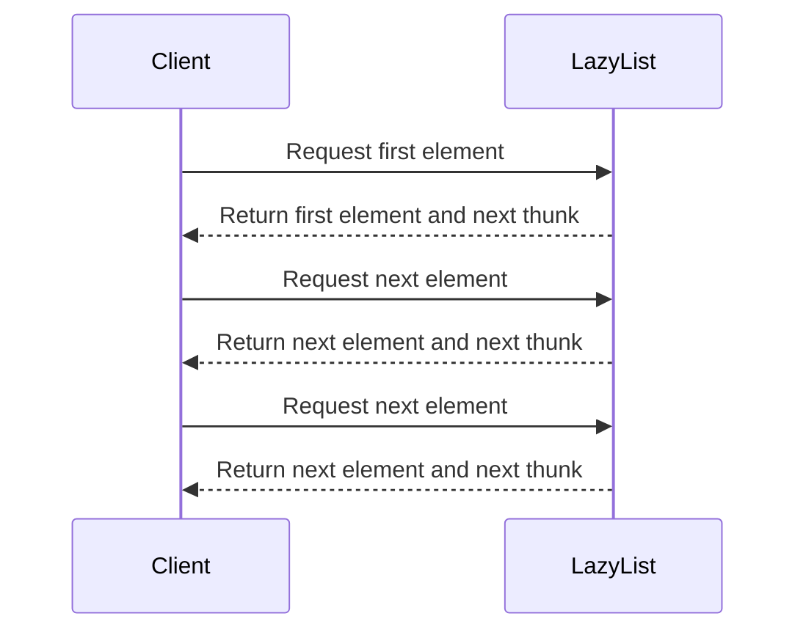

## 19.9 Lazy Evaluation Patterns

Lazy evaluation is a powerful technique in functional programming that can significantly enhance performance by deferring computations until their results are actually needed. In this section, we will delve into the concept of lazy evaluation, explore its benefits and potential pitfalls, and provide practical examples of how to implement lazy evaluation patterns in Erlang.

### Understanding Lazy Evaluation

Lazy evaluation is a strategy that delays the evaluation of an expression until its value is required. This can lead to performance improvements by avoiding unnecessary calculations, reducing memory usage, and enabling the creation of infinite data structures.

#### Key Concepts

- **Deferred Computation**: Computations are not performed until their results are needed.
- **Thunks**: A thunk is a deferred computation that can be evaluated when required.
- **Infinite Data Structures**: Lazy evaluation allows the creation of data structures that can conceptually be infinite, as only the necessary parts are computed.

### Benefits of Lazy Evaluation

1. **Performance Optimization**: By deferring computations, we can avoid unnecessary processing, which can lead to faster execution times.
2. **Memory Efficiency**: Lazy evaluation can reduce memory usage by only storing values that are actually needed.
3. **Modularity**: It allows for more modular code, as computations can be defined independently of their execution context.
4. **Infinite Data Structures**: Enables the use of infinite lists or streams, which can be processed incrementally.

### Implementing Lazy Evaluation in Erlang

Erlang, being a strict language, does not natively support lazy evaluation. However, we can simulate lazy behavior using functions and closures. Let's explore how to implement lazy evaluation patterns in Erlang.

#### Example: Lazy List

A lazy list is a list where elements are computed on demand. We can implement a lazy list in Erlang using functions that return the next element and the rest of the list as a closure.

```erlang
-module(lazy_list).
-export([lazy_range/2, take/2]).

% Create a lazy list representing a range of numbers
lazy_range(From, To) when From =< To ->
    fun() -> {From, lazy_range(From + 1, To)} end;
lazy_range(_, _) ->
    fun() -> nil end.

% Take N elements from a lazy list
take(_, 0) -> [];
take(LazyList, N) ->
    case LazyList() of
        nil -> [];
        {Head, Tail} -> [Head | take(Tail, N - 1)]
    end.
```

In this example, `lazy_range/2` creates a lazy list of numbers from `From` to `To`. The `take/2` function retrieves the first `N` elements from the lazy list.

### Use Cases for Lazy Evaluation

Lazy evaluation can be particularly beneficial in scenarios where:

- **Large Data Sets**: Processing large data sets where only a subset of the data is needed.
- **Complex Calculations**: Deferring complex calculations until necessary to save computational resources.
- **Infinite Streams**: Working with streams of data that are potentially infinite, such as sensor data or user input.

### Potential Downsides of Lazy Evaluation

While lazy evaluation offers many benefits, it also comes with potential downsides:

1. **Delayed Errors**: Errors in deferred computations may not be detected until the computation is evaluated.
2. **Increased Complexity**: Managing lazy computations can add complexity to the codebase.
3. **Resource Management**: Careful management of resources is required to avoid memory leaks or excessive resource consumption.

### Visualizing Lazy Evaluation

To better understand lazy evaluation, let's visualize the process of evaluating a lazy list using a sequence diagram.



This diagram illustrates how a client interacts with a lazy list, requesting elements one at a time. Each request returns the next element and a thunk for the subsequent element.

### Design Considerations

When implementing lazy evaluation patterns, consider the following:

- **When to Use**: Use lazy evaluation when dealing with large or infinite data sets, or when deferring computations can lead to performance gains.
- **Error Handling**: Implement robust error handling to manage delayed errors effectively.
- **Resource Management**: Ensure that resources are managed efficiently to prevent memory leaks.

### Erlang Unique Features

Erlang's concurrency model can complement lazy evaluation by allowing computations to be deferred and executed concurrently. This can lead to further performance improvements in concurrent systems.

### Differences and Similarities

Lazy evaluation is often compared to eager evaluation, where computations are performed immediately. Understanding the differences between these approaches can help in choosing the right strategy for a given problem.

### Try It Yourself

Experiment with the lazy list example by modifying the range or the number of elements to take. Observe how the lazy evaluation pattern affects performance and resource usage.

### Knowledge Check

- **Question**: What is a thunk in the context of lazy evaluation?
- **Exercise**: Implement a lazy Fibonacci sequence generator in Erlang.

### Summary

Lazy evaluation is a powerful pattern that can optimize performance by deferring computations. While it offers significant benefits, it also requires careful consideration of potential downsides. By understanding and applying lazy evaluation patterns, you can build more efficient and scalable Erlang applications.

Remember, this is just the beginning. As you progress, you'll discover more ways to leverage lazy evaluation to optimize your applications. Keep experimenting, stay curious, and enjoy the journey!

## Quiz: Lazy Evaluation Patterns



### What is lazy evaluation?

- [x] A strategy that delays the evaluation of an expression until its value is needed.
- [ ] A method of evaluating expressions immediately.
- [ ] A way to optimize memory usage by pre-computing values.
- [ ] A technique to parallelize computations.

> **Explanation:** Lazy evaluation defers computations until their results are required, optimizing performance and memory usage.

### What is a thunk in lazy evaluation?

- [x] A deferred computation that can be evaluated when needed.
- [ ] A type of data structure used in Erlang.
- [ ] A function that immediately computes a value.
- [ ] A method of error handling in lazy evaluation.

> **Explanation:** A thunk is a deferred computation, encapsulated as a function, that can be evaluated when its result is needed.

### Which of the following is a benefit of lazy evaluation?

- [x] Performance optimization by avoiding unnecessary calculations.
- [ ] Immediate error detection.
- [ ] Increased code complexity.
- [ ] Reduced modularity.

> **Explanation:** Lazy evaluation optimizes performance by deferring computations, avoiding unnecessary calculations.

### What is a potential downside of lazy evaluation?

- [x] Delayed errors that may not be detected until evaluation.
- [ ] Immediate computation of all expressions.
- [ ] Increased memory usage.
- [ ] Reduced performance.

> **Explanation:** Errors in deferred computations may not be detected until the computation is evaluated, leading to delayed errors.

### In which scenario is lazy evaluation particularly beneficial?

- [x] Processing large data sets where only a subset is needed.
- [ ] When all data must be processed immediately.
- [ ] In scenarios with no computational constraints.
- [ ] When memory usage is not a concern.

> **Explanation:** Lazy evaluation is beneficial when processing large data sets, as it allows for computations to be deferred until needed.

### How can lazy evaluation be implemented in Erlang?

- [x] Using functions and closures to defer computations.
- [ ] By using built-in lazy evaluation features.
- [ ] Through immediate evaluation of all expressions.
- [ ] By avoiding the use of functions.

> **Explanation:** Erlang does not natively support lazy evaluation, but it can be implemented using functions and closures to defer computations.

### What is the role of a lazy list in Erlang?

- [x] A list where elements are computed on demand.
- [ ] A list that pre-computes all elements.
- [ ] A list that cannot be modified.
- [ ] A list that is always empty.

> **Explanation:** A lazy list in Erlang computes its elements on demand, deferring computations until needed.

### What is the primary advantage of using infinite data structures with lazy evaluation?

- [x] They can be processed incrementally, as only necessary parts are computed.
- [ ] They require all elements to be computed immediately.
- [ ] They are always stored in memory.
- [ ] They cannot be used in Erlang.

> **Explanation:** Infinite data structures with lazy evaluation allow for incremental processing, as only necessary parts are computed.

### What should be considered when applying lazy evaluation patterns?

- [x] Error handling, resource management, and when to use lazy evaluation.
- [ ] Immediate computation of all expressions.
- [ ] Avoiding the use of functions and closures.
- [ ] Ensuring all data is processed immediately.

> **Explanation:** When applying lazy evaluation patterns, consider error handling, resource management, and when to use lazy evaluation for optimal performance.

### True or False: Lazy evaluation can lead to performance improvements by deferring computations.

- [x] True
- [ ] False

> **Explanation:** Lazy evaluation can improve performance by deferring computations until their results are needed, avoiding unnecessary calculations.


