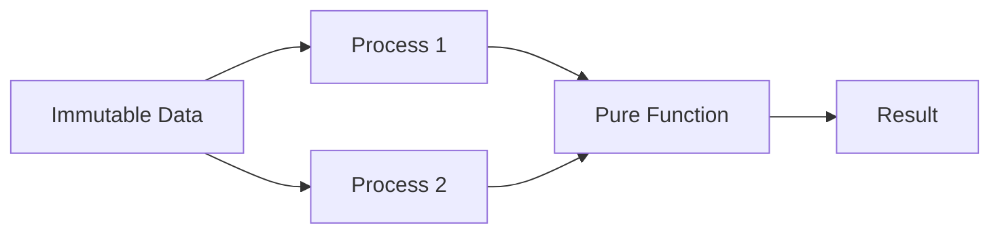

## 2.1 Immutability and Pure Functions

In the realm of functional programming, immutability and pure functions stand as cornerstones, particularly in a language like Erlang, which is designed for building robust, concurrent systems. This section delves into these concepts, explaining their significance and demonstrating their application in Erlang.

### Understanding Immutability

**Immutability** refers to the inability to change an object after it has been created. In Erlang, once a variable is assigned a value, that value cannot be altered. This characteristic is crucial for several reasons:

1. **Predictability**: Immutability ensures that data remains consistent throughout the program's execution, making it easier to reason about the code.
2. **Concurrency**: In concurrent systems, immutability eliminates the risks associated with shared mutable state, such as race conditions and deadlocks.
3. **Simplified Debugging**: With immutable data, the state of the program is more predictable, simplifying the debugging process.

#### Code Example: Immutability in Erlang

Let's illustrate immutability with a simple Erlang example:

```erlang
-module(immutability_example).
-export([demo/0]).

demo() ->
    X = 5,
    io:format("Initial value of X: ~p~n", [X]),
    % Attempting to change X will result in an error
    % X = 10, % Uncommenting this line will cause a compilation error
    io:format("Final value of X: ~p~n", [X]).
```

In this example, `X` is assigned the value `5`. Any attempt to reassign `X` will result in a compilation error, demonstrating Erlang's commitment to immutability.

### The Role of Pure Functions

**Pure functions** are functions that, given the same input, will always produce the same output and have no side effects. This means they do not alter any state or interact with the outside world (e.g., modifying a global variable or performing I/O operations).

#### Characteristics of Pure Functions

1. **Deterministic**: The output is solely determined by the input values.
2. **No Side Effects**: They do not modify any external state or variables.
3. **Referential Transparency**: They can be replaced with their output value without changing the program's behavior.

#### Code Example: Pure Functions in Erlang

Here's an example of a pure function in Erlang:

```erlang
-module(pure_function_example).
-export([add/2]).

add(A, B) ->
    A + B.
```

The `add/2` function is pure because it always returns the sum of `A` and `B` without modifying any external state or producing side effects.

### Immutability and Pure Functions in Concurrent Execution

Immutability and pure functions are particularly beneficial in concurrent programming, which is a core aspect of Erlang. Here's how they contribute:

- **Safe Concurrency**: Since immutable data cannot be changed, multiple processes can safely read the same data without the risk of interference.
- **Simplified Synchronization**: With no mutable state, there's no need for complex synchronization mechanisms, reducing the potential for errors.
- **Scalability**: Pure functions can be easily parallelized, as they do not depend on shared state.

#### Code Example: Concurrent Execution with Immutability

Consider a scenario where multiple processes need to calculate the sum of numbers concurrently:

```erlang
-module(concurrent_example).
-export([start/0, sum/1]).

start() ->
    Pid1 = spawn(fun() -> io:format("Sum: ~p~n", [sum([1, 2, 3, 4, 5])]) end),
    Pid2 = spawn(fun() -> io:format("Sum: ~p~n", [sum([6, 7, 8, 9, 10])]) end),
    Pid1 ! stop,
    Pid2 ! stop.

sum(List) ->
    lists:foldl(fun(X, Acc) -> X + Acc end, 0, List).
```

In this example, two processes are spawned to calculate the sum of different lists. The `sum/1` function is pure and operates on immutable data, ensuring that the processes can execute concurrently without interference.

### Visualizing Immutability and Pure Functions

To better understand these concepts, let's visualize how immutability and pure functions interact in a concurrent system:



**Diagram Description**: This diagram illustrates how immutable data is accessed by multiple processes, each utilizing pure functions to compute results independently, ensuring safe and predictable concurrent execution.

### Try It Yourself

Experiment with the following modifications to deepen your understanding:

- **Modify the `sum/1` function** to include a side effect, such as printing each number, and observe how it affects purity.
- **Attempt to change a variable's value** within a function and note the compiler's response.
- **Spawn additional processes** to see how Erlang handles increased concurrency with immutable data.

### Further Reading

For more in-depth exploration of these concepts, consider the following resources:

- [Erlang Programming Language](https://www.erlang.org/)
- [Functional Programming Principles](https://www.functionalprogramming.org/)
- [Concurrency in Erlang](https://erlang.org/doc/reference_manual/processes.html)

### Key Takeaways

- **Immutability** ensures data consistency and simplifies concurrent programming.
- **Pure functions** provide predictability and ease of reasoning in code.
- Together, they form the backbone of reliable and scalable concurrent systems in Erlang.

### Embrace the Journey

Remember, mastering these concepts is a journey. As you continue to explore Erlang, you'll find that immutability and pure functions are not just theoretical ideas but practical tools that enhance your ability to build robust applications. Keep experimenting, stay curious, and enjoy the process!

## Quiz: Immutability and Pure Functions



### What is immutability in Erlang?

- [x] The inability to change a variable's value once assigned
- [ ] The ability to modify data structures freely
- [ ] A feature that allows dynamic typing
- [ ] A mechanism for error handling

> **Explanation:** Immutability in Erlang means that once a variable is assigned a value, it cannot be changed.

### Which of the following is a characteristic of pure functions?

- [x] No side effects
- [ ] Modifies global state
- [ ] Depends on external input
- [ ] Produces different outputs for the same inputs

> **Explanation:** Pure functions have no side effects and always produce the same output for the same inputs.

### How does immutability benefit concurrent programming?

- [x] Eliminates risks of race conditions
- [ ] Increases the need for synchronization
- [ ] Allows mutable shared state
- [ ] Complicates debugging

> **Explanation:** Immutability eliminates the risks associated with shared mutable state, such as race conditions.

### What happens if you try to reassign a value to a variable in Erlang?

- [x] Compilation error
- [ ] Runtime error
- [ ] The value changes successfully
- [ ] The program crashes

> **Explanation:** Erlang enforces immutability, so reassigning a variable results in a compilation error.

### Which of the following is NOT a benefit of pure functions?

- [x] Modifying external state
- [ ] Predictable outputs
- [ ] Easier testing
- [ ] Simplified reasoning

> **Explanation:** Pure functions do not modify external state, which is a key benefit.

### What is referential transparency?

- [x] The ability to replace a function call with its result
- [ ] The ability to modify variables directly
- [ ] A feature of impure functions
- [ ] A type of error handling

> **Explanation:** Referential transparency means a function call can be replaced with its result without changing the program's behavior.

### How do pure functions contribute to scalability?

- [x] They can be easily parallelized
- [ ] They require complex synchronization
- [ ] They depend on shared state
- [ ] They increase memory usage

> **Explanation:** Pure functions do not depend on shared state, making them easy to parallelize and thus contributing to scalability.

### What is a side effect in the context of functions?

- [x] An observable effect outside the function's scope
- [ ] A change in the function's input parameters
- [ ] A modification of the function's local variables
- [ ] A return value of the function

> **Explanation:** A side effect is an observable effect outside the function's scope, such as modifying a global variable or performing I/O.

### Why is immutability important in Erlang?

- [x] It ensures data consistency and simplifies concurrency
- [ ] It allows dynamic typing
- [ ] It complicates error handling
- [ ] It increases the need for synchronization

> **Explanation:** Immutability ensures data consistency and simplifies concurrent programming by eliminating shared mutable state.

### True or False: Pure functions in Erlang can modify global variables.

- [ ] True
- [x] False

> **Explanation:** Pure functions do not modify global variables; they have no side effects.


