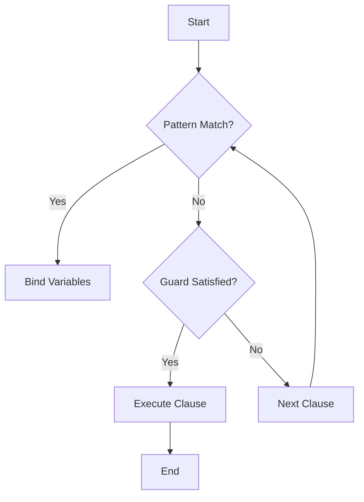

## 2.3 Pattern Matching and Guards

Pattern matching and guards are fundamental features in Erlang that empower developers to write clear, concise, and expressive code. These features are integral to Erlang's functional programming paradigm, allowing for elegant solutions to complex problems. In this section, we will explore how pattern matching works in Erlang, how guards enhance pattern matching with conditional logic, and how to use these features effectively in your code.

### Understanding Pattern Matching in Erlang

Pattern matching in Erlang is a mechanism for checking a value against a pattern. It is used extensively in variable assignments, function clauses, and control structures. Unlike traditional conditional statements, pattern matching allows you to destructure data and bind variables in a single operation.

#### Pattern Matching in Variable Assignments

In Erlang, pattern matching is used to bind variables to values. This is done using the `=` operator, which checks if the pattern on the left matches the value on the right. If the match is successful, variables in the pattern are bound to corresponding values.

```erlang
% Simple pattern matching with a tuple
{X, Y} = {1, 2}.
% X is now 1, Y is now 2

% Pattern matching with a list
[Head | Tail] = [1, 2, 3, 4].
% Head is 1, Tail is [2, 3, 4]
```

In the examples above, the patterns `{X, Y}` and `[Head | Tail]` are matched against the values `{1, 2}` and `[1, 2, 3, 4]`, respectively. The variables `X`, `Y`, `Head`, and `Tail` are bound to the corresponding values.

#### Pattern Matching in Function Clauses

Pattern matching is also used in function clauses to select the appropriate function body based on the arguments provided. This allows for concise and expressive function definitions.

```erlang
% Function with pattern matching in clauses
factorial(0) -> 1;
factorial(N) when N > 0 -> N * factorial(N - 1).
```

In this example, the `factorial` function uses pattern matching to define two clauses. The first clause matches when the argument is `0`, returning `1`. The second clause matches when the argument is a positive integer, recursively calculating the factorial.

### Enhancing Pattern Matching with Guards

Guards in Erlang are used to add conditional logic to pattern matching. They allow you to specify additional constraints that must be satisfied for a pattern to match. Guards are written after the `when` keyword and can include a variety of expressions, such as comparisons and type checks.

#### Using Guards in Function Clauses

Guards are often used in function clauses to refine pattern matching and ensure that only specific cases are handled.

```erlang
% Function with guards
is_even(N) when N rem 2 == 0 -> true;
is_even(_) -> false.
```

In this example, the `is_even` function uses a guard to check if a number is even. The guard `N rem 2 == 0` ensures that the function returns `true` only for even numbers.

#### Combining Pattern Matching and Guards

Pattern matching and guards can be combined to create powerful and expressive function definitions. This combination allows you to handle complex conditions with ease.

```erlang
% Function with pattern matching and guards
describe_number(N) when N > 0 -> "Positive";
describe_number(N) when N < 0 -> "Negative";
describe_number(0) -> "Zero".
```

Here, the `describe_number` function uses both pattern matching and guards to classify numbers as positive, negative, or zero.

### Best Practices for Pattern Matching and Guards

To use pattern matching and guards effectively, consider the following best practices:

- **Use Pattern Matching for Clarity**: Pattern matching can make your code more readable by clearly expressing the structure of data. Use it to destructure complex data types and bind variables concisely.
- **Leverage Guards for Precision**: Guards allow you to add precision to pattern matching by specifying additional conditions. Use them to handle edge cases and ensure that your functions behave correctly.
- **Avoid Overusing Guards**: While guards are powerful, overusing them can make your code harder to read. Use them judiciously and prefer pattern matching when possible.
- **Handle All Cases**: Ensure that your pattern matching and guards cover all possible cases. This prevents runtime errors and makes your code more robust.

### Common Mistakes to Avoid

When using pattern matching and guards, be mindful of the following common mistakes:

- **Ignoring Unmatched Patterns**: Failing to handle all possible patterns can lead to runtime errors. Always include a catch-all pattern or guard to handle unexpected cases.
- **Complex Guards**: Guards should be simple and easy to understand. Avoid complex expressions that can obscure the logic of your code.
- **Misusing Pattern Matching**: Pattern matching is not suitable for all situations. Use it where it enhances clarity and avoid forcing it into contexts where it doesn't fit naturally.

### Code Examples and Exercises

Let's explore some code examples to solidify our understanding of pattern matching and guards.

#### Example 1: Pattern Matching with Lists

```erlang
% Function to sum a list of numbers
sum_list([]) -> 0;
sum_list([Head | Tail]) -> Head + sum_list(Tail).
```

In this example, the `sum_list` function uses pattern matching to recursively sum the elements of a list. The base case matches an empty list, returning `0`. The recursive case matches a list with a head and tail, adding the head to the sum of the tail.

#### Example 2: Guards with Type Checks

```erlang
% Function to check if a value is an integer
is_integer(Value) when is_integer(Value) -> true;
is_integer(_) -> false.
```

This function uses a guard to check if a value is an integer. The guard `is_integer(Value)` ensures that the function returns `true` only for integer values.

#### Example 3: Combining Pattern Matching and Guards

```erlang
% Function to classify a number
classify_number(N) when N > 0, N rem 2 == 0 -> "Positive Even";
classify_number(N) when N > 0 -> "Positive Odd";
classify_number(N) when N < 0, N rem 2 == 0 -> "Negative Even";
classify_number(N) when N < 0 -> "Negative Odd";
classify_number(0) -> "Zero".
```

In this example, the `classify_number` function uses both pattern matching and guards to classify numbers based on their sign and parity.

### Try It Yourself

To deepen your understanding, try modifying the code examples above. For instance, you can:

- Extend the `sum_list` function to handle lists of tuples, summing the first element of each tuple.
- Modify the `is_integer` function to check for other types, such as floats or atoms.
- Experiment with the `classify_number` function by adding new classifications, such as "Prime" or "Composite".

### Visualizing Pattern Matching and Guards

To better understand how pattern matching and guards work, let's visualize the process using a flowchart.



**Figure 1**: This flowchart illustrates the process of pattern matching and guards in Erlang. The process begins with a pattern match. If the match is successful, variables are bound, and the guard is evaluated. If the guard is satisfied, the clause is executed. Otherwise, the next clause is considered.

### References and Further Reading

For more information on pattern matching and guards in Erlang, consider the following resources:

- [Erlang Documentation on Pattern Matching](https://www.erlang.org/doc/reference_manual/patterns.html)
- [Erlang Guards](https://www.erlang.org/doc/reference_manual/expressions.html#guards)
- [Learn You Some Erlang for Great Good!](http://learnyousomeerlang.com/syntax-in-functions#pattern-matching)

### Knowledge Check

To reinforce your understanding, consider the following questions:

- What is the role of pattern matching in Erlang?
- How do guards enhance pattern matching?
- What are some best practices for using pattern matching and guards effectively?

### Embrace the Journey

Remember, mastering pattern matching and guards is a journey. As you continue to explore Erlang, you'll find these features invaluable for writing clean, efficient, and expressive code. Keep experimenting, stay curious, and enjoy the journey!

## Quiz: Pattern Matching and Guards



### What is the primary purpose of pattern matching in Erlang?

- [x] To destructure data and bind variables
- [ ] To perform arithmetic operations
- [ ] To manage concurrency
- [ ] To handle errors

> **Explanation:** Pattern matching is used to destructure data and bind variables in Erlang.

### How do guards enhance pattern matching in Erlang?

- [x] By adding conditional logic
- [ ] By improving performance
- [ ] By simplifying syntax
- [ ] By managing memory

> **Explanation:** Guards add conditional logic to pattern matching, allowing for more precise control over which patterns match.

### Which keyword is used to introduce guards in Erlang?

- [x] when
- [ ] if
- [ ] case
- [ ] match

> **Explanation:** The `when` keyword is used to introduce guards in Erlang.

### What happens if a pattern match fails in Erlang?

- [x] An error is raised
- [ ] The program continues with the next statement
- [ ] The variables are set to `undefined`
- [ ] The program terminates

> **Explanation:** If a pattern match fails, an error is raised in Erlang.

### Can guards include type checks in Erlang?

- [x] Yes
- [ ] No

> **Explanation:** Guards can include type checks, such as `is_integer(Value)`.

### What is a common mistake when using pattern matching?

- [x] Ignoring unmatched patterns
- [ ] Using too many variables
- [ ] Overusing arithmetic operations
- [ ] Avoiding recursion

> **Explanation:** Ignoring unmatched patterns can lead to runtime errors.

### What is the result of the following pattern match: `[Head | Tail] = [1, 2, 3]`?

- [x] Head is 1, Tail is [2, 3]
- [ ] Head is 1, Tail is 2
- [ ] Head is [1, 2], Tail is 3
- [ ] Head is [1], Tail is [2, 3]

> **Explanation:** The pattern `[Head | Tail]` matches the head of the list to `1` and the tail to `[2, 3]`.

### How can you ensure all cases are handled in pattern matching?

- [x] Include a catch-all pattern
- [ ] Use more variables
- [ ] Avoid using guards
- [ ] Use complex expressions

> **Explanation:** Including a catch-all pattern ensures that all cases are handled.

### What is the purpose of the `=` operator in pattern matching?

- [x] To check if a pattern matches a value
- [ ] To assign a value to a variable
- [ ] To compare two values
- [ ] To concatenate strings

> **Explanation:** The `=` operator checks if a pattern matches a value and binds variables accordingly.

### True or False: Guards can only be used in function clauses.

- [x] True
- [ ] False

> **Explanation:** Guards are primarily used in function clauses to refine pattern matching.


