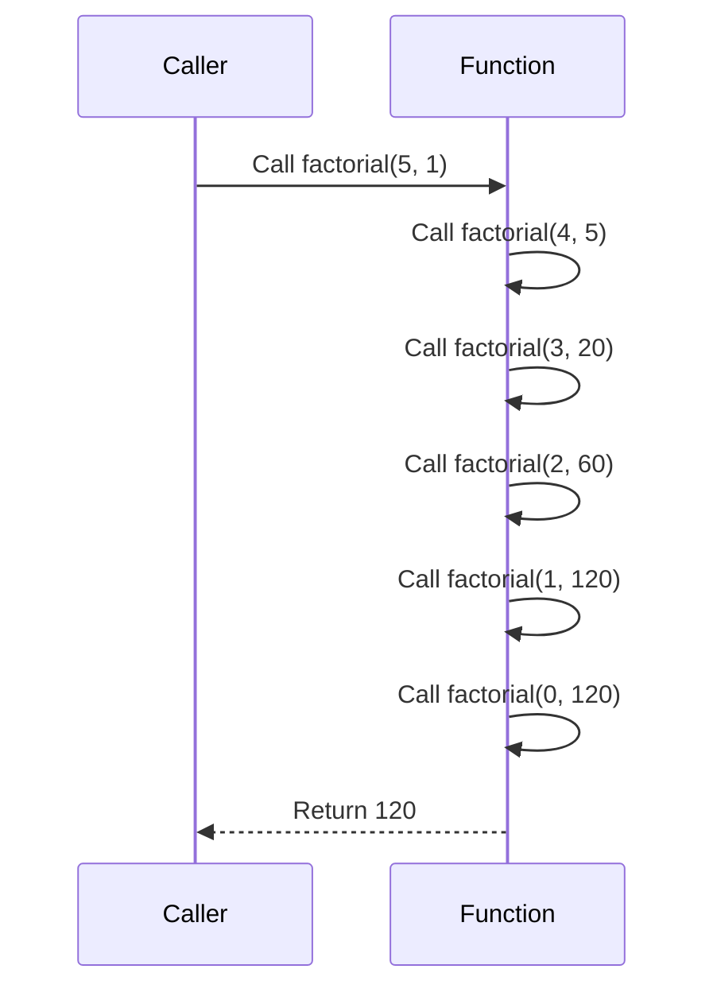

## 2.4 Recursion and Tail Call Optimization

In the realm of functional programming, recursion is a fundamental concept that replaces traditional iterative loops found in imperative languages. Erlang, a language designed for concurrency and fault tolerance, embraces recursion as a primary mechanism for looping. This section delves into recursion, tail call optimization, and their significance in Erlang programming.

### Understanding Recursion

**Recursion** is a technique where a function calls itself to solve a problem. A recursive function typically consists of two parts: a base case and a recursive case. The base case provides a condition under which the recursion stops, preventing infinite loops. The recursive case breaks down the problem into smaller instances, eventually reaching the base case.

#### Example of a Simple Recursive Function

Let's consider a simple example of calculating the factorial of a number using recursion:

```erlang
-module(factorial).
-export([factorial/1]).

% Base case: factorial of 0 is 1
factorial(0) -> 1;

% Recursive case: n * factorial of (n-1)
factorial(N) when N > 0 -> N * factorial(N - 1).
```

In this example, the base case is `factorial(0) -> 1`, and the recursive case is `N * factorial(N - 1)`. The function continues to call itself with decremented values of `N` until it reaches 0.

### Tail Call Optimization

**Tail Call Optimization (TCO)** is a crucial feature in functional programming languages like Erlang. It allows recursive functions to execute in constant stack space, preventing stack overflow errors and improving performance.

A **tail call** occurs when a function call is the last action in a function. In such cases, the current function's stack frame can be replaced with the called function's stack frame, optimizing memory usage.

#### Importance of Tail Call Optimization

- **Prevents Stack Overflow**: Without TCO, each recursive call would add a new frame to the call stack, potentially leading to stack overflow for deep recursions.
- **Improves Performance**: By reusing stack frames, TCO reduces the overhead of function calls, making recursive functions as efficient as loops.
- **Enables Infinite Recursion**: With TCO, functions can recurse indefinitely without exhausting stack space, useful for long-running processes.

### Recursive Functions with and without Tail Recursion

#### Non-Tail Recursive Example

Consider the previous factorial example. It is not tail-recursive because the multiplication operation occurs after the recursive call:

```erlang
factorial(N) when N > 0 -> N * factorial(N - 1).
```

Here, the result of `factorial(N - 1)` must be multiplied by `N` before returning, requiring additional stack space for each call.

#### Tail-Recursive Example

To make the factorial function tail-recursive, we can introduce an accumulator parameter:

```erlang
-module(factorial).
-export([factorial/1]).

% Public API
factorial(N) -> factorial(N, 1).

% Tail-recursive helper function
factorial(0, Acc) -> Acc;
factorial(N, Acc) when N > 0 -> factorial(N - 1, N * Acc).
```

In this version, the multiplication is performed before the recursive call, and the result is passed as an accumulator. The recursive call is now the last operation, allowing TCO to optimize the stack usage.

### Strategies for Refactoring to Tail Recursion

1. **Use Accumulators**: Introduce additional parameters to carry results through recursive calls.
2. **Perform Operations Before Recursion**: Ensure that any operations on the result are done before making the recursive call.
3. **Simplify Base Cases**: Clearly define base cases to terminate recursion efficiently.

#### Example: Refactoring a Sum Function

Consider a function that sums a list of numbers:

```erlang
% Non-tail-recursive version
sum([]) -> 0;
sum([H|T]) -> H + sum(T).
```

This version is not tail-recursive because the addition occurs after the recursive call. Let's refactor it:

```erlang
% Tail-recursive version
sum(List) -> sum(List, 0).

sum([], Acc) -> Acc;
sum([H|T], Acc) -> sum(T, H + Acc).
```

Here, the accumulator `Acc` carries the running total, and the addition is performed before the recursive call.

### Performance Implications and Stack Usage

Tail call optimization has significant performance implications:

- **Reduced Stack Usage**: By reusing stack frames, TCO minimizes memory consumption, allowing functions to handle larger inputs without crashing.
- **Improved Execution Speed**: With fewer stack operations, tail-recursive functions execute faster, especially for deep recursions.
- **Scalability**: Tail-recursive functions can scale to handle large datasets or long-running processes efficiently.

### Visualizing Tail Call Optimization

To better understand how tail call optimization works, let's visualize the stack usage in a tail-recursive function:



In this diagram, each call to `factorial` replaces the previous call's stack frame, demonstrating constant stack usage.

### Try It Yourself

Experiment with the provided examples by modifying the base cases or changing the operations performed before recursion. Observe how these changes affect the function's behavior and performance.

### Knowledge Check

- What is recursion, and how is it used in Erlang?
- Why is tail call optimization important in functional programming?
- How can you refactor a non-tail-recursive function to be tail-recursive?
- What are the performance benefits of tail call optimization?

### Summary

Recursion and tail call optimization are fundamental concepts in Erlang, enabling efficient and scalable solutions to complex problems. By understanding and applying these techniques, you can write robust, high-performance Erlang applications.

Remember, this is just the beginning. As you progress, you'll build more complex and interactive Erlang applications. Keep experimenting, stay curious, and enjoy the journey!

## Quiz: Recursion and Tail Call Optimization



### What is recursion in Erlang?

- [x] A technique where a function calls itself to solve a problem
- [ ] A method of iterating over a list using loops
- [ ] A way to optimize memory usage in functions
- [ ] A process of compiling Erlang code

> **Explanation:** Recursion is a technique where a function calls itself to solve a problem, commonly used in functional programming languages like Erlang.

### What is the primary benefit of tail call optimization?

- [x] It prevents stack overflow by reusing stack frames
- [ ] It increases the speed of non-recursive functions
- [ ] It allows functions to compile faster
- [ ] It simplifies the syntax of recursive functions

> **Explanation:** Tail call optimization prevents stack overflow by reusing stack frames, allowing recursive functions to execute in constant stack space.

### How can you refactor a non-tail-recursive function to be tail-recursive?

- [x] Introduce an accumulator parameter
- [ ] Use more complex data structures
- [ ] Add more base cases
- [ ] Increase the recursion depth

> **Explanation:** Introducing an accumulator parameter helps carry results through recursive calls, making the function tail-recursive.

### What is a base case in a recursive function?

- [x] A condition that stops the recursion
- [ ] The first call to the recursive function
- [ ] A parameter passed to the function
- [ ] A loop that iterates over the function

> **Explanation:** A base case is a condition that stops the recursion, preventing infinite loops.

### Which of the following is a tail-recursive function?

- [x] A function where the recursive call is the last operation
- [ ] A function that uses loops to iterate
- [ ] A function that calls itself multiple times
- [ ] A function with multiple base cases

> **Explanation:** A tail-recursive function is one where the recursive call is the last operation, allowing for tail call optimization.

### What happens if a recursive function lacks a base case?

- [x] It may result in an infinite loop
- [ ] It will execute faster
- [ ] It will become tail-recursive
- [ ] It will compile without errors

> **Explanation:** Without a base case, a recursive function may result in an infinite loop, as there is no condition to stop the recursion.

### Why is tail call optimization particularly important in Erlang?

- [x] It allows for efficient handling of large datasets
- [ ] It simplifies the syntax of Erlang code
- [ ] It reduces the need for error handling
- [ ] It enhances the graphical user interface

> **Explanation:** Tail call optimization allows for efficient handling of large datasets by minimizing stack usage and preventing stack overflow.

### What is the role of an accumulator in a tail-recursive function?

- [x] To carry results through recursive calls
- [ ] To increase the recursion depth
- [ ] To simplify the function's syntax
- [ ] To compile the function faster

> **Explanation:** An accumulator carries results through recursive calls, enabling tail recursion by performing operations before the recursive call.

### How does tail call optimization affect stack usage?

- [x] It reduces stack usage by reusing stack frames
- [ ] It increases stack usage by adding more frames
- [ ] It has no effect on stack usage
- [ ] It doubles the stack usage

> **Explanation:** Tail call optimization reduces stack usage by reusing stack frames, allowing recursive functions to execute in constant stack space.

### True or False: Tail call optimization allows functions to recurse indefinitely without stack overflow.

- [x] True
- [ ] False

> **Explanation:** True. Tail call optimization allows functions to recurse indefinitely without stack overflow by reusing stack frames.


