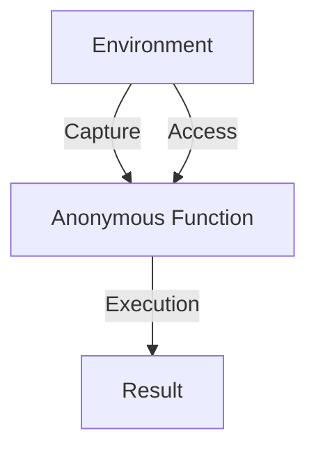

## 2.5 Anonymous Functions and Closures

In the world of functional programming, anonymous functions and closures play a pivotal role in creating flexible, modular, and reusable code. Erlang, being a functional language, leverages these concepts to enhance its concurrency and fault-tolerance capabilities. In this section, we will delve into the intricacies of anonymous functions, also known as "funs," and closures in Erlang, exploring their syntax, usage, and practical applications.

### Understanding Anonymous Functions in Erlang

Anonymous functions, or "funs," are functions that are defined without a name. They are first-class citizens in Erlang, meaning they can be passed as arguments, returned from other functions, and assigned to variables. This makes them incredibly versatile and powerful tools in functional programming.

#### Syntax of Anonymous Functions

In Erlang, anonymous functions are defined using the `fun` keyword. Here is the basic syntax:

```erlang
% Define an anonymous function that adds two numbers
Add = fun(X, Y) -> X + Y end.

% Call the anonymous function
Result = Add(5, 3).
% Result is 8
```

In this example, `Add` is an anonymous function that takes two arguments, `X` and `Y`, and returns their sum. The function is then called with the arguments `5` and `3`, resulting in `8`.

#### Key Characteristics of Anonymous Functions

- **No Name**: As the name suggests, anonymous functions do not have a name. They are often used for short-lived operations or as arguments to higher-order functions.
- **First-Class Citizens**: They can be assigned to variables, passed as arguments, and returned from other functions.
- **Scope**: Anonymous functions have access to variables in their scope, which leads us to the concept of closures.

### Exploring Closures in Erlang

Closures are a natural extension of anonymous functions. A closure is an anonymous function that captures variables from its surrounding environment. This allows the function to "remember" the context in which it was created, even when it is executed outside that context.

#### How Closures Work

When an anonymous function is defined, it can capture and retain access to variables from its lexical scope. This is what makes closures powerful and flexible.

```erlang
% Define a function that returns an anonymous function (closure)
make_multiplier(Factor) ->
    fun(X) -> X * Factor end.

% Create a closure that multiplies by 3
Triple = make_multiplier(3).

% Use the closure
Result = Triple(10).
% Result is 30
```

In this example, `make_multiplier/1` returns an anonymous function that multiplies its argument by `Factor`. The variable `Factor` is captured by the closure, allowing `Triple` to multiply any given number by `3`.

### Practical Applications of Anonymous Functions and Closures

Anonymous functions and closures are particularly useful in scenarios where you need to:

- **Pass Functions as Arguments**: Many Erlang functions, such as those in the `lists` module, accept anonymous functions as arguments for operations like mapping, filtering, and folding.

```erlang
% Use an anonymous function to double each element in a list
DoubledList = lists:map(fun(X) -> X * 2 end, [1, 2, 3, 4]).
% DoubledList is [2, 4, 6, 8]
```

- **Create Higher-Order Functions**: Functions that return other functions can be easily implemented using closures.

```erlang
% Define a higher-order function that returns a closure
adder(N) ->
    fun(X) -> X + N end.

% Create a closure that adds 5
AddFive = adder(5).

% Use the closure
Result = AddFive(10).
% Result is 15
```

- **Encapsulate State**: Closures can be used to encapsulate state in a functional way, avoiding the need for mutable state.

```erlang
% Define a counter using closures
counter(Start) ->
    fun() ->
        Start = Start + 1,
        Start
    end.

% Create a counter starting at 0
Next = counter(0).

% Use the counter
NextValue1 = Next().
% NextValue1 is 1
NextValue2 = Next().
% NextValue2 is 2
```

### Scenarios Where Anonymous Functions and Closures Shine

Anonymous functions and closures are particularly useful in the following scenarios:

- **Event Handling**: In concurrent systems, anonymous functions can be used to define event handlers dynamically.
- **Callbacks**: When working with asynchronous operations, closures can be used to define callbacks that retain context.
- **Functional Composition**: Combining multiple functions into a single operation is made easier with anonymous functions.

### Visualizing Anonymous Functions and Closures

To better understand how anonymous functions and closures work, let's visualize their relationship with the surrounding environment.



**Diagram Description**: This diagram illustrates how an anonymous function captures variables from its environment, retains access to them, and produces a result upon execution.

### Try It Yourself

Experiment with the following code examples to deepen your understanding of anonymous functions and closures:

1. Modify the `make_multiplier/1` function to create a closure that divides by a given factor.
2. Implement a function that takes a list of numbers and an anonymous function, applying the function to each element.
3. Create a closure that maintains a running total of numbers passed to it.

### Further Reading

For more information on anonymous functions and closures in Erlang, consider exploring the following resources:

- [Erlang Documentation on Anonymous Functions](https://www.erlang.org/doc/reference_manual/functions.html#anonymous-functions)
- [Functional Programming Concepts](https://en.wikipedia.org/wiki/Functional_programming)

### Knowledge Check

- What is an anonymous function, and how is it defined in Erlang?
- How do closures capture variables from their environment?
- In what scenarios are anonymous functions and closures particularly useful?

### Summary

Anonymous functions and closures are fundamental concepts in Erlang, enabling developers to write flexible, modular, and reusable code. By understanding how to define and use these constructs, you can harness the full power of functional programming in Erlang.

Remember, this is just the beginning. As you progress, you'll build more complex and interactive applications. Keep experimenting, stay curious, and enjoy the journey!

## Quiz: Anonymous Functions and Closures



### What is an anonymous function in Erlang?

- [x] A function defined without a name
- [ ] A function that is always recursive
- [ ] A function that cannot be passed as an argument
- [ ] A function that is only used in modules

> **Explanation:** Anonymous functions are defined without a name and can be used as first-class citizens in Erlang.

### How do closures capture variables?

- [x] By retaining access to variables from their lexical scope
- [ ] By copying variables into the function body
- [ ] By using global variables
- [ ] By creating new variables

> **Explanation:** Closures capture variables from their lexical scope, allowing them to retain access to these variables even when executed outside their original context.

### Which of the following is a use case for anonymous functions?

- [x] Passing as arguments to higher-order functions
- [ ] Defining global constants
- [ ] Creating modules
- [ ] Managing file I/O

> **Explanation:** Anonymous functions are often used as arguments to higher-order functions for operations like mapping and filtering.

### What is a closure in Erlang?

- [x] An anonymous function that captures variables from its environment
- [ ] A named function that is recursive
- [ ] A function that does not return a value
- [ ] A function that only operates on lists

> **Explanation:** A closure is an anonymous function that captures and retains access to variables from its environment.

### Which keyword is used to define anonymous functions in Erlang?

- [x] fun
- [ ] def
- [ ] lambda
- [ ] fn

> **Explanation:** The `fun` keyword is used to define anonymous functions in Erlang.

### What is the result of the following code: `Add = fun(X, Y) -> X + Y end. Result = Add(2, 3).`?

- [x] 5
- [ ] 2
- [ ] 3
- [ ] 6

> **Explanation:** The anonymous function `Add` adds two numbers, so `Result` is `5`.

### How can closures be used in Erlang?

- [x] To encapsulate state
- [ ] To define global variables
- [ ] To create modules
- [ ] To manage file I/O

> **Explanation:** Closures can encapsulate state by capturing and retaining access to variables from their environment.

### What is the purpose of the `fun` keyword in Erlang?

- [x] To define anonymous functions
- [ ] To define modules
- [ ] To create records
- [ ] To handle exceptions

> **Explanation:** The `fun` keyword is used to define anonymous functions in Erlang.

### Which of the following is true about closures?

- [x] They can capture variables from their environment
- [ ] They cannot be passed as arguments
- [ ] They must be named
- [ ] They are only used for recursion

> **Explanation:** Closures can capture and retain access to variables from their environment, making them versatile and powerful.

### True or False: Anonymous functions in Erlang can be returned from other functions.

- [x] True
- [ ] False

> **Explanation:** Anonymous functions are first-class citizens in Erlang, meaning they can be returned from other functions.




