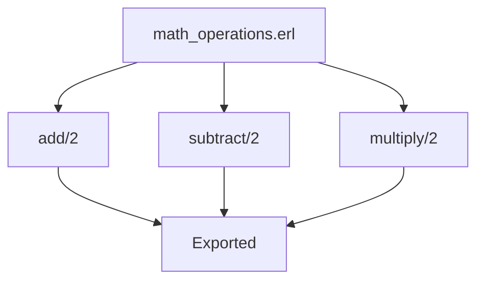

## 2.6 Modules and Functions: Scope and Organization

In Erlang, the organization of code into modules and functions is a fundamental aspect of writing clean, maintainable, and scalable applications. This section delves into the structure of Erlang modules, how functions are defined and exported, the scope rules governing variables and functions, and best practices for organizing code logically across modules. By the end of this section, you will have a comprehensive understanding of how to effectively structure your Erlang codebase.

### Understanding Erlang Modules

Erlang modules are the building blocks of an Erlang application. A module is essentially a file that contains a collection of functions, and it serves as a namespace for these functions. Modules help in organizing code logically and provide a way to encapsulate functionality.

#### Structure of an Erlang Module

An Erlang module is defined in a `.erl` file, and the module name must match the filename. The basic structure of a module includes:

1. **Module Declaration**: This is the first line in the module and uses the `-module` attribute.
2. **Export Declaration**: This specifies which functions are accessible from outside the module.
3. **Function Definitions**: These are the actual implementations of the functions.

Here is a simple example of an Erlang module:

```erlang
-module(math_operations).
-export([add/2, subtract/2]).

% Function to add two numbers
add(X, Y) ->
    X + Y.

% Function to subtract two numbers
subtract(X, Y) ->
    X - Y.
```

- **Module Declaration**: The `-module(math_operations).` line declares the module name as `math_operations`.
- **Export Declaration**: The `-export([add/2, subtract/2]).` line specifies that the `add` and `subtract` functions are accessible from outside the module. The `/2` indicates that these functions take two arguments.

### Defining and Exporting Functions

Functions in Erlang are defined using the `->` operator and are terminated with a period (`.`). Functions can be either exported or kept private within the module.

#### Exporting Functions

To make a function available outside its module, you must export it using the `-export` attribute. The export list contains tuples of function names and their arity (number of arguments).

```erlang
-export([function_name/arity, another_function/arity]).
```

#### Private Functions

Functions not listed in the export attribute are private to the module. Private functions are useful for encapsulating helper functions that should not be accessible from other modules.

### Scope Rules in Erlang

Understanding scope rules is crucial for writing effective Erlang code. Erlang has a lexical scoping mechanism, meaning the scope of variables is determined by their position in the source code.

#### Variable Scope

Variables in Erlang are immutable and have a single assignment rule. Once a variable is bound to a value, it cannot be changed. The scope of a variable is limited to the function or block in which it is defined.

```erlang
-module(scope_example).
-export([example/0]).

example() ->
    X = 10,
    Y = 20,
    Result = X + Y,
    io:format("Result: ~p~n", [Result]).
```

In the above example, `X`, `Y`, and `Result` are local to the `example` function.

#### Function Scope

Functions have module-level scope. This means that a function defined in a module can be called by other functions within the same module, regardless of its position in the file.

### Organizing Code Across Modules

Organizing code logically across modules is essential for maintainability and scalability. Here are some guidelines to follow:

1. **Single Responsibility Principle**: Each module should have a clear responsibility. Group related functions together in a module.
2. **Consistent Naming Conventions**: Use descriptive names for modules and functions that reflect their purpose.
3. **Modularization**: Break down large modules into smaller, more manageable ones. This makes the code easier to understand and maintain.
4. **Documentation**: Use comments and documentation to explain the purpose of modules and functions.

### Best Practices for Code Organization

- **Use Descriptive Names**: Choose meaningful names for modules and functions to make the code self-explanatory.
- **Keep Functions Short**: Aim for functions that do one thing well. This makes them easier to test and reuse.
- **Encapsulate Functionality**: Use private functions to encapsulate functionality that is not needed outside the module.
- **Consistent Style**: Follow a consistent coding style throughout the codebase. This includes indentation, naming conventions, and documentation.

### Try It Yourself

Experiment with the following code example by adding new functions or modifying existing ones. Try creating a new module with related functionality and see how you can organize your code effectively.

```erlang
-module(math_operations).
-export([add/2, subtract/2, multiply/2]).

% Function to add two numbers
add(X, Y) ->
    X + Y.

% Function to subtract two numbers
subtract(X, Y) ->
    X - Y.

% Function to multiply two numbers
multiply(X, Y) ->
    X * Y.
```

### Visualizing Module and Function Organization

To better understand how modules and functions are organized, let's visualize the structure using a diagram.



**Caption**: This diagram illustrates the `math_operations` module with its functions `add`, `subtract`, and `multiply`, all of which are exported.

### Further Reading

For more information on Erlang modules and functions, consider exploring the following resources:

- [Erlang Documentation](https://www.erlang.org/doc/)
- [Learn You Some Erlang for Great Good!](http://learnyousomeerlang.com/)

### Knowledge Check

- What is the purpose of the `-module` attribute in an Erlang file?
- How do you make a function accessible from outside its module?
- What is the scope of a variable in Erlang?
- Why is it important to organize code logically across modules?

### Summary

In this section, we explored the structure and organization of modules and functions in Erlang. We discussed how to define and export functions, the scope rules for variables and functions, and best practices for organizing code. Remember, organizing your code effectively is crucial for building maintainable and scalable applications. Keep experimenting, stay curious, and enjoy the journey!

## Quiz: Modules and Functions: Scope and Organization



### What is the purpose of the `-module` attribute in an Erlang file?

- [x] To declare the name of the module
- [ ] To export functions from the module
- [ ] To define the scope of variables
- [ ] To specify the file path

> **Explanation:** The `-module` attribute is used to declare the name of the module, which must match the filename.

### How do you make a function accessible from outside its module?

- [x] By listing it in the `-export` attribute
- [ ] By using the `-module` attribute
- [ ] By declaring it as public
- [ ] By using the `-import` attribute

> **Explanation:** Functions are made accessible from outside their module by listing them in the `-export` attribute with their arity.

### What is the scope of a variable in Erlang?

- [x] Limited to the function or block in which it is defined
- [ ] Global across the entire module
- [ ] Limited to the module
- [ ] Limited to the file

> **Explanation:** Variables in Erlang have a local scope, limited to the function or block in which they are defined.

### Why is it important to organize code logically across modules?

- [x] For maintainability and scalability
- [ ] To increase execution speed
- [ ] To reduce memory usage
- [ ] To improve syntax highlighting

> **Explanation:** Organizing code logically across modules is important for maintainability and scalability, making it easier to understand and manage.

### What is the single responsibility principle in module design?

- [x] Each module should have a clear responsibility
- [ ] Each module should handle multiple tasks
- [ ] Each module should be as large as possible
- [ ] Each module should contain only one function

> **Explanation:** The single responsibility principle states that each module should have a clear responsibility, grouping related functions together.

### How can you encapsulate functionality that is not needed outside a module?

- [x] By keeping functions private
- [ ] By exporting all functions
- [ ] By using the `-module` attribute
- [ ] By using global variables

> **Explanation:** Functions that are not needed outside a module can be kept private by not listing them in the `-export` attribute.

### What is the benefit of using descriptive names for modules and functions?

- [x] It makes the code self-explanatory
- [ ] It reduces the file size
- [ ] It increases execution speed
- [ ] It improves syntax highlighting

> **Explanation:** Using descriptive names for modules and functions makes the code self-explanatory and easier to understand.

### What is the role of the `-export` attribute in an Erlang module?

- [x] To specify which functions are accessible from outside the module
- [ ] To declare the name of the module
- [ ] To define the scope of variables
- [ ] To specify the file path

> **Explanation:** The `-export` attribute specifies which functions are accessible from outside the module.

### What is the significance of the `/2` in the `-export([add/2])` declaration?

- [x] It indicates the function takes two arguments
- [ ] It specifies the return type of the function
- [ ] It defines the scope of the function
- [ ] It sets the execution priority

> **Explanation:** The `/2` in the `-export([add/2])` declaration indicates that the `add` function takes two arguments.

### True or False: Functions in Erlang can be redefined within the same module.

- [ ] True
- [x] False

> **Explanation:** Functions in Erlang cannot be redefined within the same module. Each function name and arity combination must be unique.


