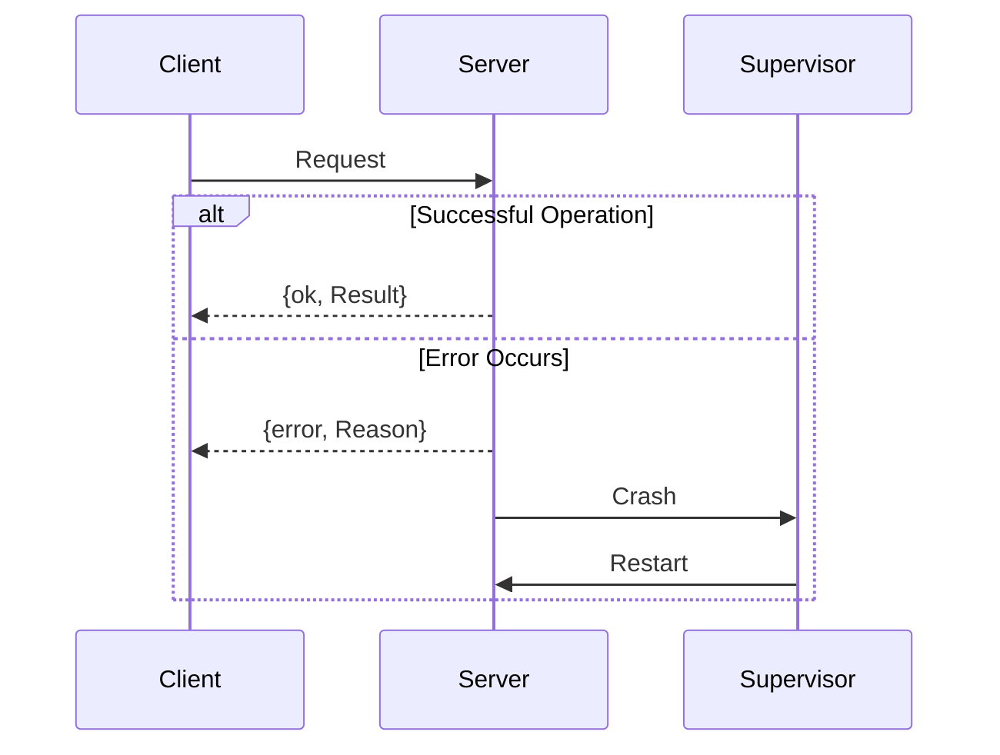

## 2.7 Error Handling the Erlang Way

Erlang is renowned for its robust error handling capabilities, which are integral to building fault-tolerant systems. In this section, we will delve into Erlang's unique approach to error handling, focusing on the use of tuples for error returns, the `try...catch` construct, and robust error handling patterns. We will also discuss the philosophy of letting processes crash versus handling errors explicitly, emphasizing the importance of clear and consistent error signaling.

### Understanding Erlang's Error Handling Philosophy

Erlang's error handling philosophy is deeply rooted in its design for building concurrent, distributed, and fault-tolerant systems. The language encourages developers to embrace errors as part of the system's natural behavior and to design systems that can recover gracefully from failures.

#### The "Let It Crash" Philosophy

One of the core tenets of Erlang's error handling philosophy is the "let it crash" approach. This means that instead of trying to handle every possible error within a process, it's often better to let the process crash and rely on a supervisor to restart it in a clean state. This approach simplifies code by reducing the need for defensive programming and allows the system to recover from unexpected errors automatically.

### Error Signaling with Tuples

In Erlang, a common convention for signaling errors is to use tuples. Functions typically return tuples of the form `{ok, Result}` or `{error, Reason}`. This pattern provides a clear and consistent way to handle success and failure cases.

#### Example: Using Tuples for Error Returns

Let's consider a simple function that reads a file and returns its contents:

```erlang
-module(file_reader).
-export([read_file/1]).

read_file(FileName) ->
    case file:read_file(FileName) of
        {ok, Content} ->
            {ok, Content};
        {error, Reason} ->
            {error, Reason}
    end.
```

In this example, the `read_file/1` function uses a case expression to handle the result of `file:read_file/1`. If the file is read successfully, it returns `{ok, Content}`. If an error occurs, it returns `{error, Reason}`.

### Exception Handling with `try...catch`

While tuples are useful for signaling expected errors, Erlang also provides the `try...catch` construct for handling exceptions. This construct allows you to catch and handle unexpected errors that occur during the execution of a block of code.

#### Example: Using `try...catch` for Exception Handling

Consider the following example, which demonstrates how to use `try...catch` to handle exceptions:

```erlang
-module(math_operations).
-export([divide/2]).

divide(Numerator, Denominator) ->
    try
        Result = Numerator / Denominator,
        {ok, Result}
    catch
        error:badarith ->
            {error, division_by_zero}
    end.
```

In this example, the `divide/2` function attempts to divide the `Numerator` by the `Denominator`. If a division by zero occurs, an exception is raised, and the `catch` block handles it by returning `{error, division_by_zero}`.

### Robust Error Handling Patterns

Erlang provides several patterns for robust error handling, allowing developers to build systems that can gracefully recover from failures.

#### Pattern: Using Supervisors for Fault Tolerance

Supervisors are a key component of Erlang's fault-tolerant design. They monitor worker processes and restart them if they crash. This pattern allows you to isolate errors and ensure that the system remains operational even when individual components fail.

```erlang
-module(supervisor_example).
-behaviour(supervisor).

init([]) ->
    {ok, {{one_for_one, 5, 10},
          [{worker, worker_module, []}]}}.
```

In this example, a supervisor is configured to monitor a worker process. If the worker crashes, the supervisor will restart it, ensuring that the system continues to function.

#### Pattern: Using `try...catch` for Resource Cleanup

When working with resources such as files or network connections, it's important to ensure that resources are properly cleaned up, even in the event of an error. The `try...catch` construct can be used to achieve this.

```erlang
-module(resource_manager).
-export([process_file/1]).

process_file(FileName) ->
    {ok, File} = file:open(FileName, [read]),
    try
        % Perform operations on the file
        {ok, file:read(File, 1024)}
    catch
        _:_ ->
            {error, file_error}
    after
        file:close(File)
    end.
```

In this example, the `process_file/1` function opens a file and performs operations on it. The `after` block ensures that the file is closed, even if an error occurs during processing.

### When to Let a Process Crash

Deciding when to let a process crash versus handling errors explicitly is an important consideration in Erlang development. The "let it crash" philosophy is well-suited for scenarios where:

- The error is unexpected and cannot be easily recovered from.
- The process can be restarted in a clean state by a supervisor.
- The system is designed to handle process crashes gracefully.

However, there are situations where explicit error handling is necessary, such as:

- When dealing with external resources that require cleanup.
- When providing user feedback or logging detailed error information.
- When performing critical operations that must not fail silently.

### Importance of Clear and Consistent Error Signaling

Clear and consistent error signaling is crucial for building maintainable and reliable systems. By adhering to conventions such as returning `{ok, Result}` and `{error, Reason}` tuples, you can ensure that errors are handled consistently across your codebase.

### Visualizing Error Handling in Erlang

To better understand Erlang's error handling mechanisms, let's visualize the flow of error handling using a sequence diagram.



In this diagram, the client sends a request to the server. If the operation is successful, the server returns `{ok, Result}`. If an error occurs, the server returns `{error, Reason}` and crashes. The supervisor then restarts the server, ensuring that the system remains operational.

### Try It Yourself

To reinforce your understanding of Erlang's error handling, try modifying the code examples provided in this section. Experiment with different error scenarios and observe how the system behaves. Consider implementing a simple supervisor to monitor a worker process and handle crashes.

### References and Further Reading

- [Erlang Documentation: Error Handling](https://www.erlang.org/doc/reference_manual/errors.html)
- [Learn You Some Erlang for Great Good! - Error Handling](http://learnyousomeerlang.com/errors-and-exceptions)
- [Erlang and OTP in Action](https://www.manning.com/books/erlang-and-otp-in-action)

### Knowledge Check

Before moving on, take a moment to reflect on what you've learned about error handling in Erlang. Consider the following questions:

- How does the "let it crash" philosophy simplify error handling in Erlang?
- What are the benefits of using tuples for error signaling?
- How can supervisors enhance the fault tolerance of an Erlang system?

### Summary

In this section, we've explored Erlang's approach to error handling, focusing on the use of tuples for error returns, the `try...catch` construct, and robust error handling patterns. We've discussed the philosophy of letting processes crash versus handling errors explicitly and emphasized the importance of clear and consistent error signaling. By mastering these concepts, you'll be well-equipped to build robust, fault-tolerant systems in Erlang.

Remember, this is just the beginning. As you progress, you'll build more complex and resilient systems. Keep experimenting, stay curious, and enjoy the journey!

## Quiz: Error Handling the Erlang Way



### What is the primary philosophy behind Erlang's error handling approach?

- [x] Let it crash
- [ ] Catch all errors
- [ ] Use defensive programming
- [ ] Ignore errors

> **Explanation:** Erlang's error handling philosophy is based on the "let it crash" approach, which simplifies code and relies on supervisors to handle process crashes.

### How are errors typically signaled in Erlang functions?

- [x] Using tuples like `{ok, Result}` and `{error, Reason}`
- [ ] By raising exceptions
- [ ] By returning `null`
- [ ] By logging errors

> **Explanation:** Erlang functions commonly use tuples to signal errors, providing a clear and consistent way to handle success and failure cases.

### What construct is used in Erlang for handling exceptions?

- [x] try...catch
- [ ] if...else
- [ ] switch...case
- [ ] while...do

> **Explanation:** The `try...catch` construct is used in Erlang for handling exceptions and managing unexpected errors.

### When should you let a process crash in Erlang?

- [x] When the error is unexpected and the process can be restarted by a supervisor
- [ ] When the error is critical and requires immediate attention
- [ ] When the error is minor and can be ignored
- [ ] When the error is related to user input

> **Explanation:** Letting a process crash is appropriate when the error is unexpected and the system is designed to handle process crashes gracefully through supervision.

### What is the purpose of using supervisors in Erlang?

- [x] To monitor and restart crashed processes
- [ ] To log errors
- [ ] To handle user input
- [ ] To manage memory

> **Explanation:** Supervisors monitor worker processes and restart them if they crash, ensuring the system remains operational.

### What is a common pattern for resource cleanup in Erlang?

- [x] Using `try...catch` with an `after` block
- [ ] Using `if...else` statements
- [ ] Using `switch...case` statements
- [ ] Using `while...do` loops

> **Explanation:** The `try...catch` construct with an `after` block is commonly used for resource cleanup, ensuring resources are properly released even in the event of an error.

### How can you ensure consistent error handling across an Erlang codebase?

- [x] By adhering to conventions like returning `{ok, Result}` and `{error, Reason}` tuples
- [ ] By using global error handlers
- [ ] By logging all errors
- [ ] By ignoring minor errors

> **Explanation:** Adhering to conventions like returning `{ok, Result}` and `{error, Reason}` tuples ensures consistent error handling across the codebase.

### What is the benefit of using the "let it crash" philosophy?

- [x] It simplifies code by reducing the need for defensive programming
- [ ] It increases the complexity of error handling
- [ ] It requires more error handling code
- [ ] It makes the system less reliable

> **Explanation:** The "let it crash" philosophy simplifies code by reducing the need for defensive programming and allows the system to recover from unexpected errors automatically.

### What should you consider when deciding whether to let a process crash or handle errors explicitly?

- [x] The nature of the error and the system's ability to recover
- [ ] The size of the codebase
- [ ] The number of developers on the team
- [ ] The programming language used

> **Explanation:** When deciding whether to let a process crash or handle errors explicitly, consider the nature of the error and the system's ability to recover from it.

### True or False: Erlang encourages handling every possible error within a process.

- [ ] True
- [x] False

> **Explanation:** Erlang encourages letting processes crash and relying on supervisors to handle errors, rather than handling every possible error within a process.


