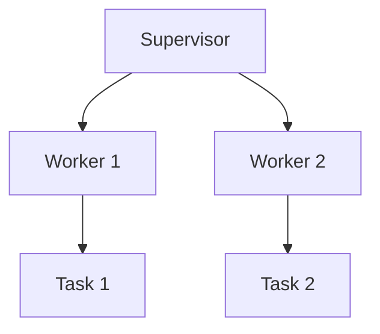

## 2.8 The "Let It Crash" Philosophy

In the world of software development, building robust and fault-tolerant systems is a paramount goal. Erlang, a language designed for building concurrent, distributed, and fault-tolerant systems, embraces a unique approach to error handling known as the "Let It Crash" philosophy. This approach simplifies error handling by allowing processes to fail and relying on supervision trees to manage these failures. In this section, we will delve into the rationale behind this philosophy, its contribution to robust system design, and how supervisors manage failing processes. We will also provide examples of designing systems that embrace this approach, address misconceptions, and discuss potential drawbacks.

### The Rationale Behind "Let It Crash"

The "Let It Crash" philosophy is rooted in the idea that complex error handling logic can often lead to more errors and increased system complexity. Instead of attempting to handle every possible error within a process, Erlang encourages developers to allow processes to fail and rely on a robust supervision mechanism to recover from these failures. This approach is based on several key principles:

1. **Simplicity**: By allowing processes to crash, developers can focus on writing straightforward code without convoluted error handling logic. This leads to simpler and more maintainable codebases.

2. **Isolation**: Each Erlang process is isolated, meaning that a failure in one process does not directly affect others. This isolation allows for safe process termination and restart without impacting the overall system.

3. **Fault Tolerance**: Supervision trees provide a structured way to manage process failures. Supervisors monitor child processes and can automatically restart them when they fail, ensuring that the system remains operational.

4. **Resilience**: By embracing failure as a natural part of system operation, developers can build systems that are inherently resilient to unexpected conditions and errors.

### How "Let It Crash" Contributes to Robust System Design

The "Let It Crash" philosophy contributes to robust system design in several ways:

- **Automatic Recovery**: Supervisors can automatically restart failed processes, reducing downtime and ensuring continuous operation.

- **Decoupled Error Handling**: By separating error handling from business logic, developers can focus on implementing core functionality without being bogged down by error management.

- **Scalability**: The simplicity and isolation of processes make it easier to scale systems horizontally, as each process can be managed independently.

- **Predictable Behavior**: Systems designed with "Let It Crash" in mind exhibit predictable behavior in the face of failures, as the supervision strategy dictates how processes are restarted.

### Supervisors and Process Management

Supervisors play a crucial role in the "Let It Crash" philosophy. They are responsible for monitoring child processes and taking appropriate actions when a process fails. Here's how supervisors manage failing processes:

- **Supervision Trees**: Supervisors are organized into trees, where each supervisor can have multiple child processes or other supervisors. This hierarchical structure allows for complex supervision strategies.

- **Restart Strategies**: Supervisors can be configured with different restart strategies, such as one-for-one (restart only the failed process), one-for-all (restart all child processes), or rest-for-one (restart the failed process and any processes started after it).

- **Error Logging**: Supervisors can log errors and failures, providing valuable insights into system behavior and potential issues.

- **Custom Actions**: Developers can define custom actions for supervisors to take when a process fails, such as sending alerts or executing recovery scripts.

### Designing Systems with "Let It Crash"

To design systems that embrace the "Let It Crash" philosophy, developers should follow these guidelines:

1. **Use Supervision Trees**: Organize processes into supervision trees to manage failures effectively.

2. **Focus on Core Logic**: Write processes that focus on core business logic, leaving error handling to supervisors.

3. **Define Clear Restart Strategies**: Choose appropriate restart strategies for each supervisor based on the system's requirements.

4. **Monitor and Log Failures**: Implement logging and monitoring to track process failures and gain insights into system behavior.

5. **Test Failure Scenarios**: Regularly test failure scenarios to ensure that the system behaves as expected under different conditions.

### Code Example: Implementing a Simple Supervision Tree

Let's look at a simple example of implementing a supervision tree in Erlang:

```erlang
-module(my_supervisor).
-behaviour(supervisor).

%% API
-export([start_link/0]).

%% Supervisor callbacks
-export([init/1]).

start_link() ->
    supervisor:start_link({local, ?MODULE}, ?MODULE, []).

init([]) ->
    {ok, {{one_for_one, 5, 10},
          [{worker1, {worker1, start_link, []}, permanent, brutal_kill, worker, [worker1]},
           {worker2, {worker2, start_link, []}, permanent, brutal_kill, worker, [worker2]}]}}.
```

In this example, we define a supervisor module `my_supervisor` that starts two worker processes, `worker1` and `worker2`. The supervisor uses a `one_for_one` restart strategy, meaning that if one worker fails, only that worker will be restarted.

### Addressing Misconceptions and Potential Drawbacks

While the "Let It Crash" philosophy offers many benefits, there are some misconceptions and potential drawbacks to be aware of:

- **Misconception: Ignoring Errors**: Some may misconstrue "Let It Crash" as ignoring errors. In reality, it involves handling errors at a higher level through supervision.

- **Potential Drawback: Resource Consumption**: Frequent process restarts can lead to resource consumption issues if not managed properly.

- **Misconception: Lack of Control**: Developers may feel they lack control over error handling. However, supervisors provide a structured way to manage failures.

- **Potential Drawback: Complexity in Supervision Trees**: Designing complex supervision trees can be challenging and requires careful planning.

### Visualizing the "Let It Crash" Philosophy

To better understand the "Let It Crash" philosophy, let's visualize a simple supervision tree using Mermaid.js:



In this diagram, the supervisor oversees two workers, each responsible for different tasks. If a worker fails, the supervisor can restart it without affecting the other worker.

### Knowledge Check

- **Question**: What is the primary benefit of the "Let It Crash" philosophy?
  - **Answer**: It simplifies error handling and enhances system robustness through supervision.

- **Question**: How does a supervisor handle a failing process?
  - **Answer**: It restarts the process based on the configured restart strategy.

### Exercises

1. **Modify the Code Example**: Change the restart strategy to `one_for_all` and observe how the system behaves when a worker fails.

2. **Design a Supervision Tree**: Create a supervision tree with three levels and implement it in Erlang.

### Summary

The "Let It Crash" philosophy is a powerful approach to building robust, fault-tolerant systems in Erlang. By allowing processes to fail and relying on supervision trees, developers can simplify error handling and focus on core functionality. While there are potential drawbacks and misconceptions, understanding and applying this philosophy can lead to more resilient and maintainable systems.

Remember, this is just the beginning. As you progress, you'll build more complex and interactive systems. Keep experimenting, stay curious, and enjoy the journey!

## Quiz: The "Let It Crash" Philosophy



### What is the primary benefit of the "Let It Crash" philosophy?

- [x] Simplifies error handling and enhances system robustness
- [ ] Eliminates the need for error handling
- [ ] Increases system complexity
- [ ] Reduces the number of processes

> **Explanation:** The "Let It Crash" philosophy simplifies error handling by allowing processes to fail and relying on supervision trees for robustness.

### How does a supervisor handle a failing process?

- [x] Restarts the process based on the configured strategy
- [ ] Ignores the failure
- [ ] Logs the error and does nothing
- [ ] Shuts down the entire system

> **Explanation:** Supervisors restart failing processes based on their configured restart strategy, ensuring system continuity.

### Which restart strategy restarts only the failed process?

- [x] One-for-one
- [ ] One-for-all
- [ ] Rest-for-one
- [ ] All-for-one

> **Explanation:** The one-for-one strategy restarts only the failed process, leaving others unaffected.

### What is a potential drawback of the "Let It Crash" philosophy?

- [x] Resource consumption due to frequent restarts
- [ ] Complete lack of error handling
- [ ] Increased system complexity
- [ ] Reduced system performance

> **Explanation:** Frequent restarts can lead to resource consumption issues if not managed properly.

### What is a common misconception about the "Let It Crash" philosophy?

- [x] It means ignoring errors
- [ ] It requires complex error handling
- [ ] It eliminates the need for supervision
- [ ] It simplifies system design

> **Explanation:** A common misconception is that "Let It Crash" means ignoring errors, but it actually involves handling them through supervision.

### What role do supervisors play in the "Let It Crash" philosophy?

- [x] They manage process failures and restarts
- [ ] They eliminate the need for error handling
- [ ] They increase system complexity
- [ ] They reduce the number of processes

> **Explanation:** Supervisors manage process failures and restarts, ensuring system robustness.

### Which restart strategy restarts all child processes when one fails?

- [x] One-for-all
- [ ] One-for-one
- [ ] Rest-for-one
- [ ] All-for-one

> **Explanation:** The one-for-all strategy restarts all child processes when one fails.

### How can developers test failure scenarios in a system?

- [x] By simulating process failures and observing behavior
- [ ] By ignoring potential errors
- [ ] By increasing system complexity
- [ ] By reducing the number of processes

> **Explanation:** Developers can test failure scenarios by simulating process failures and observing how the system responds.

### What is the purpose of error logging in supervision?

- [x] To track process failures and gain insights
- [ ] To ignore errors
- [ ] To increase system complexity
- [ ] To reduce the number of processes

> **Explanation:** Error logging helps track process failures and provides insights into system behavior.

### True or False: The "Let It Crash" philosophy eliminates the need for error handling.

- [ ] True
- [x] False

> **Explanation:** False. The "Let It Crash" philosophy does not eliminate error handling; it manages errors through supervision.


