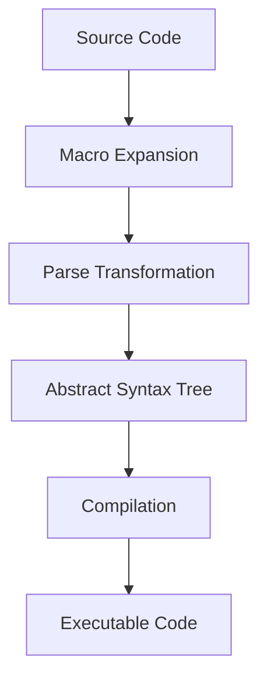

## 2.9 Introduction to Macros and Parse Transformations

In this section, we delve into the advanced features of Erlang: macros and parse transformations. These tools allow developers to generate and manipulate code at compile time, providing powerful capabilities for optimizing and extending Erlang applications. We'll explore what macros are, how to create them, the purpose of parse transformations, and best practices for their use.

### What Are Macros in Erlang?

Macros in Erlang are a way to define reusable code snippets that can be inserted into your program during compilation. They are similar to macros in other programming languages, such as C, and are defined using the `-define` directive.

#### Creating Macros with `-define`

To create a macro in Erlang, use the `-define` directive. A macro can take parameters, allowing for more flexible code generation. Here's a simple example:

```erlang
%% Define a macro without parameters
-define(PI, 3.14159).

%% Define a macro with parameters
-define(SQUARE(X), (X) * (X)).

%% Usage in a function
area_of_circle(Radius) ->
    ?PI * ?SQUARE(Radius).
```

In this example, `PI` is a macro that represents the value of π, and `SQUARE(X)` is a macro that calculates the square of a given number `X`. Macros are expanded at compile time, replacing occurrences of `?PI` and `?SQUARE(Radius)` with their respective definitions.

### Purpose of Parse Transformations

Parse transformations are a more advanced feature in Erlang that allow you to manipulate the abstract syntax tree (AST) of your code during compilation. This means you can modify how your code is interpreted and executed, enabling powerful metaprogramming capabilities.

#### How Parse Transformations Work

A parse transformation is a module that implements a specific function, `parse_transform/2`, which takes the current AST and returns a modified version. This transformation is applied during the compilation process.

Here's a basic example of a parse transformation:

```erlang
-module(my_transform).
-export([parse_transform/2]).

parse_transform(Forms, _Options) ->
    %% Modify the AST here
    Forms.
```

To apply a parse transformation, specify it in your module with the `-compile` attribute:

```erlang
-module(my_module).
-compile({parse_transform, my_transform}).

%% Your module code here
```

### Simple Macro Examples and Usage

Let's explore some practical examples of macros and how they can be used in Erlang applications.

#### Example 1: Logging Macros

Define a macro for logging messages, which can be easily enabled or disabled:

```erlang
-define(LOG(Level, Message), io:format("~p: ~s~n", [Level, Message])).

log_info(Message) ->
    ?LOG(info, Message).

log_error(Message) ->
    ?LOG(error, Message).
```

#### Example 2: Conditional Compilation

Use macros to include or exclude code based on conditions:

```erlang
-ifdef(DEBUG).
-define(DEBUG_LOG(Message), io:format("DEBUG: ~s~n", [Message])).
-else.
-define(DEBUG_LOG(Message), ok).
-endif.

do_something() ->
    ?DEBUG_LOG("This is a debug message").
```

### Risks and Complexities

While macros and parse transformations are powerful, they come with risks and complexities:

- **Readability**: Macros can make code harder to read and understand, especially if overused or poorly documented.
- **Debugging**: Errors in macros can be difficult to trace, as they occur during compilation.
- **Complexity**: Parse transformations require a deep understanding of Erlang's AST and can introduce significant complexity.

### Best Practices for Macros and Parse Transformations

- **Use Sparingly**: Only use macros and parse transformations when necessary. Prefer regular functions for simple code reuse.
- **Document Thoroughly**: Clearly document the purpose and usage of macros and transformations to aid readability and maintenance.
- **Test Extensively**: Ensure thorough testing of code that uses macros or parse transformations to catch errors early.
- **Consider Alternatives**: Evaluate whether other language features, such as higher-order functions or modules, can achieve the same goals with less complexity.

### When to Use Macros and Parse Transformations

Consider using macros and parse transformations in scenarios where:

- **Code Generation**: You need to generate repetitive code patterns.
- **Compile-Time Optimization**: You want to optimize code paths based on compile-time information.
- **Domain-Specific Languages**: You're implementing a DSL within Erlang that requires custom syntax or behavior.

### Visualizing Macros and Parse Transformations

To better understand how macros and parse transformations fit into the Erlang compilation process, let's visualize it:



**Diagram Description**: This flowchart illustrates the Erlang compilation process, highlighting where macro expansion and parse transformations occur. Source code is first expanded with macros, then transformed by parse transformations, resulting in an abstract syntax tree that is compiled into executable code.

### Try It Yourself

Experiment with the examples provided by modifying the macros and parse transformations:

- **Modify the `SQUARE` macro** to calculate the cube of a number.
- **Create a new parse transformation** that adds logging to every function call in a module.

### References and Further Reading

- [Erlang Documentation on Macros](https://www.erlang.org/doc/reference_manual/macros.html)
- [Erlang Documentation on Parse Transformations](https://www.erlang.org/doc/man/compile.html#parse_transform-2)

### Knowledge Check

- **What is the primary purpose of macros in Erlang?**
- **How do parse transformations differ from macros?**
- **What are some risks associated with using macros?**

### Embrace the Journey

Remember, mastering macros and parse transformations is a journey. These tools can greatly enhance your Erlang programming capabilities, but they require careful consideration and practice. Keep experimenting, stay curious, and enjoy the process of learning and applying these advanced techniques!

## Quiz: Introduction to Macros and Parse Transformations



### What is the primary purpose of macros in Erlang?

- [x] To define reusable code snippets that can be inserted during compilation
- [ ] To execute code at runtime
- [ ] To manage memory allocation
- [ ] To handle concurrency

> **Explanation:** Macros in Erlang are used to define reusable code snippets that are expanded at compile time.

### How are macros defined in Erlang?

- [x] Using the `-define` directive
- [ ] Using the `-macro` directive
- [ ] Using the `-module` directive
- [ ] Using the `-export` directive

> **Explanation:** Macros are defined in Erlang using the `-define` directive.

### What is a parse transformation in Erlang?

- [x] A module that manipulates the abstract syntax tree during compilation
- [ ] A function that executes at runtime
- [ ] A tool for debugging code
- [ ] A library for handling errors

> **Explanation:** Parse transformations are modules that manipulate the AST during the compilation process.

### Which of the following is a risk of using macros?

- [x] Reduced code readability
- [ ] Increased execution speed
- [ ] Simplified debugging
- [ ] Enhanced memory management

> **Explanation:** Macros can reduce code readability, making it harder to understand and maintain.

### When should you consider using parse transformations?

- [x] When implementing a domain-specific language
- [ ] When managing runtime errors
- [ ] When optimizing memory usage
- [ ] When handling user input

> **Explanation:** Parse transformations are useful for implementing DSLs and custom syntax within Erlang.

### How do you apply a parse transformation to a module?

- [x] Using the `-compile` attribute with the transformation module
- [ ] Using the `-define` directive
- [ ] Using the `-export` attribute
- [ ] Using the `-import` directive

> **Explanation:** Parse transformations are applied to a module using the `-compile` attribute.

### What is a common best practice when using macros?

- [x] Document thoroughly and use sparingly
- [ ] Use as many macros as possible
- [ ] Avoid testing code with macros
- [ ] Ignore readability concerns

> **Explanation:** It's important to document macros thoroughly and use them sparingly to maintain code readability.

### What does the `parse_transform/2` function do?

- [x] Modifies the abstract syntax tree during compilation
- [ ] Executes code at runtime
- [ ] Handles errors in the code
- [ ] Manages memory allocation

> **Explanation:** The `parse_transform/2` function modifies the AST during the compilation process.

### True or False: Macros in Erlang can take parameters.

- [x] True
- [ ] False

> **Explanation:** Macros in Erlang can take parameters, allowing for more flexible code generation.

### True or False: Parse transformations are applied at runtime.

- [ ] True
- [x] False

> **Explanation:** Parse transformations are applied during the compilation process, not at runtime.


