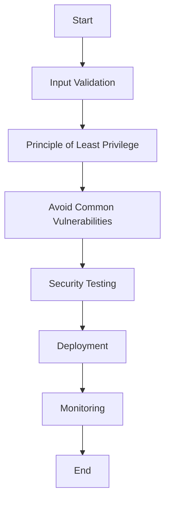

## 20.1 Secure Coding Practices in Erlang

Security is a cornerstone of modern software development. As applications become more interconnected and complex, the need for robust security practices becomes paramount. In this section, we will delve into secure coding practices specifically tailored for Erlang, a language renowned for its concurrency and fault-tolerance capabilities. Our goal is to equip you with the knowledge to write secure Erlang code, focusing on input validation, the principle of least privilege, and avoiding common vulnerabilities.

### Importance of Security in Software Development

Security is not just a feature; it's a fundamental aspect of software development. A single vulnerability can compromise an entire system, leading to data breaches, financial loss, and reputational damage. Therefore, adopting a security-first mindset is crucial from the outset of any project.

### Guidelines for Writing Secure Code in Erlang

#### 1. Input Validation

Input validation is the first line of defense against malicious attacks. In Erlang, this involves ensuring that all inputs to your functions are checked for validity before processing.

- **Sanitize Inputs**: Always sanitize inputs to remove any potentially harmful data. This is especially important for inputs that will be used in system commands or database queries.

```erlang
sanitize_input(Input) when is_binary(Input) ->
    % Remove any non-alphanumeric characters
    binary:replace(Input, <<"\n">>, <<>>, [global]).
```

- **Use Pattern Matching**: Leverage Erlang's powerful pattern matching to enforce input constraints.

```erlang
process_input({ok, Data}) when is_list(Data) ->
    % Process the list data
    process_list(Data);
process_input({error, Reason}) ->
    % Handle the error
    handle_error(Reason).
```

- **Limit Input Size**: Prevent buffer overflow attacks by limiting the size of inputs.

```erlang
validate_size(Input) when byte_size(Input) =< 1024 ->
    {ok, Input};
validate_size(_) ->
    {error, too_large}.
```

#### 2. Principle of Least Privilege

The principle of least privilege dictates that a system should operate with the minimum privileges necessary to complete its tasks. This minimizes the potential damage from a security breach.

- **Limit Process Capabilities**: Ensure that Erlang processes have only the permissions they need.

```erlang
start_process() ->
    spawn(fun() -> restricted_function() end).

restricted_function() ->
    % Perform actions with limited privileges
    ok.
```

- **Use Role-Based Access Control (RBAC)**: Implement RBAC to manage permissions effectively.

```erlang
check_permission(User, Action) ->
    case user_role(User) of
        admin -> allow;
        user -> deny;
        _ -> deny
    end.
```

#### 3. Avoiding Common Vulnerabilities

Understanding and avoiding common vulnerabilities is essential for secure coding.

- **Prevent SQL Injection**: Use parameterized queries to avoid SQL injection attacks.

```erlang
execute_query(Query, Params) ->
    % Use parameterized queries
    pgsql:equery(Query, Params).
```

- **Secure Communication**: Use SSL/TLS for secure communication between nodes.

```erlang
start_ssl_server() ->
    ssl:start(),
    ssl:listen(Port, [{certfile, "server.crt"}, {keyfile, "server.key"}]).
```

- **Handle Errors Gracefully**: Avoid exposing sensitive information through error messages.

```erlang
handle_error({error, Reason}) ->
    % Log the error internally
    log_error(Reason),
    % Return a generic error message to the user
    {error, "An error occurred"}.
```

### Common Vulnerabilities and How to Avoid Them

#### 1. Buffer Overflow

Buffer overflow occurs when data exceeds the buffer's storage capacity, potentially leading to arbitrary code execution. In Erlang, this is less common due to its memory management, but it's still important to validate input sizes.

#### 2. Race Conditions

Race conditions occur when multiple processes access shared resources concurrently, leading to unpredictable behavior. Use Erlang's process isolation to avoid race conditions.

```erlang
access_shared_resource() ->
    % Use message passing to synchronize access
    ResourcePid ! {request, self()},
    receive
        {response, Data} -> Data
    end.
```

#### 3. Insecure Deserialization

Deserialization of untrusted data can lead to code execution vulnerabilities. Always validate and sanitize data before deserialization.

```erlang
deserialize_data(Binary) when is_binary(Binary) ->
    % Ensure the binary is safe to deserialize
    safe_deserialize(Binary).
```

### Adopting a Security-First Mindset

Security should be integrated into every stage of the development lifecycle. Here are some practices to adopt:

- **Threat Modeling**: Identify potential threats and vulnerabilities early in the development process.
- **Code Reviews**: Conduct regular code reviews with a focus on security.
- **Security Testing**: Implement automated security testing to catch vulnerabilities early.
- **Continuous Learning**: Stay updated with the latest security practices and vulnerabilities.

### Visualizing Secure Coding Practices

To better understand the flow of secure coding practices, let's visualize the process using a flowchart.



**Diagram Description**: This flowchart illustrates the secure coding process, starting from input validation, applying the principle of least privilege, avoiding common vulnerabilities, conducting security testing, deploying the application, and finally monitoring it in production.

### Try It Yourself

Experiment with the code examples provided. Try modifying the input validation function to handle different types of data or implement a simple role-based access control system. Remember, practice is key to mastering secure coding practices.

### Knowledge Check

- What is the principle of least privilege, and why is it important?
- How can you prevent SQL injection in Erlang applications?
- Why is input validation crucial for security?

### Summary

In this section, we've explored secure coding practices in Erlang, focusing on input validation, the principle of least privilege, and avoiding common vulnerabilities. By adopting a security-first mindset and integrating these practices into your development process, you can build robust and secure applications.

Remember, security is an ongoing journey. Stay curious, keep learning, and continue to refine your skills.

## Quiz: Secure Coding Practices in Erlang



### What is the principle of least privilege?

- [x] Ensuring that a system operates with the minimum privileges necessary to complete its tasks.
- [ ] Granting all permissions to all users.
- [ ] Allowing processes to access any resource.
- [ ] Disabling all security features.

> **Explanation:** The principle of least privilege ensures that a system operates with the minimum privileges necessary to complete its tasks, reducing the potential damage from a security breach.

### How can you prevent SQL injection in Erlang applications?

- [x] Use parameterized queries.
- [ ] Use plain SQL strings.
- [ ] Disable database logging.
- [ ] Increase database timeout.

> **Explanation:** Using parameterized queries prevents SQL injection by ensuring that user inputs are treated as data, not executable code.

### Why is input validation crucial for security?

- [x] It prevents malicious data from being processed.
- [ ] It increases application speed.
- [ ] It reduces code complexity.
- [ ] It allows for more user inputs.

> **Explanation:** Input validation is crucial for security because it prevents malicious data from being processed, reducing the risk of attacks.

### What is a common vulnerability that can occur due to improper input validation?

- [x] Buffer overflow
- [ ] Increased performance
- [ ] Enhanced user experience
- [ ] Faster data processing

> **Explanation:** Improper input validation can lead to buffer overflow, where data exceeds the buffer's storage capacity, potentially leading to arbitrary code execution.

### Which of the following is a secure communication practice?

- [x] Use SSL/TLS for communication.
- [ ] Use plain text for communication.
- [ ] Disable encryption.
- [ ] Use a single shared password.

> **Explanation:** Using SSL/TLS for communication ensures that data is encrypted and secure during transmission.

### What is a race condition?

- [x] When multiple processes access shared resources concurrently, leading to unpredictable behavior.
- [ ] A condition where processes run faster.
- [ ] A situation where resources are never accessed.
- [ ] A method to speed up execution.

> **Explanation:** A race condition occurs when multiple processes access shared resources concurrently, leading to unpredictable behavior.

### How can you handle errors gracefully in Erlang?

- [x] Log errors internally and return a generic message to the user.
- [ ] Display detailed error messages to users.
- [ ] Ignore errors and continue execution.
- [ ] Terminate the application immediately.

> **Explanation:** Handling errors gracefully involves logging errors internally and returning a generic message to the user to avoid exposing sensitive information.

### What is the purpose of threat modeling?

- [x] To identify potential threats and vulnerabilities early in the development process.
- [ ] To increase application speed.
- [ ] To reduce development time.
- [ ] To enhance user interface design.

> **Explanation:** Threat modeling helps identify potential threats and vulnerabilities early in the development process, allowing for proactive security measures.

### Why is continuous learning important in security?

- [x] To stay updated with the latest security practices and vulnerabilities.
- [ ] To reduce application size.
- [ ] To increase code complexity.
- [ ] To limit user access.

> **Explanation:** Continuous learning is important in security to stay updated with the latest security practices and vulnerabilities, ensuring robust protection.

### True or False: Security should be integrated into every stage of the development lifecycle.

- [x] True
- [ ] False

> **Explanation:** Security should be integrated into every stage of the development lifecycle to ensure comprehensive protection against vulnerabilities.


