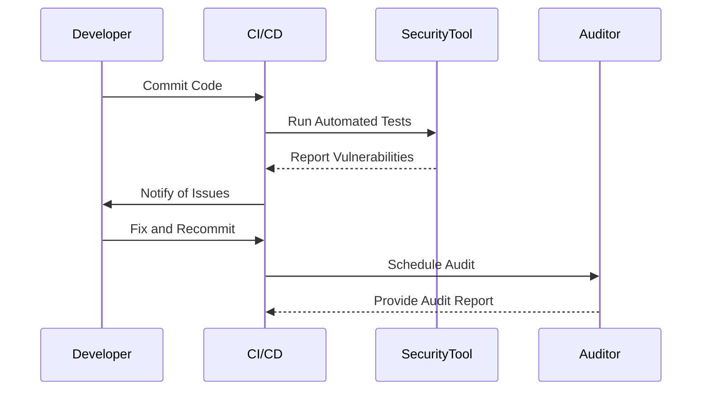

## 20.10 Security Testing and Auditing

In today's digital landscape, ensuring the security of applications is paramount. Erlang, with its robust concurrency and fault-tolerance features, is no exception. This section delves into the essential practices of security testing and auditing in Erlang applications, providing a comprehensive guide to safeguarding your systems.

### Introduction to Security Testing and Auditing

Security testing and auditing are critical components of the software development lifecycle. They help identify vulnerabilities, ensure compliance with security standards, and protect against potential threats. In Erlang applications, these practices are vital due to the language's use in building scalable and distributed systems.

#### Key Concepts

- **Security Testing**: The process of evaluating an application to identify security vulnerabilities and weaknesses.
- **Auditing**: A systematic examination of code and processes to ensure compliance with security policies and standards.

### Methods of Security Testing

Security testing encompasses various methods, each with its unique focus and approach. Let's explore some of the most effective techniques for Erlang applications.

#### Penetration Testing

Penetration testing, or ethical hacking, involves simulating attacks on an application to identify vulnerabilities. It helps uncover weaknesses that could be exploited by malicious actors.

- **Tools**: Tools like Metasploit and Burp Suite can be used for penetration testing. While these are not Erlang-specific, they can be adapted to test Erlang applications.
- **Process**: The process typically involves reconnaissance, scanning, gaining access, maintaining access, and analysis.

```erlang
% Example of a simple Erlang function that could be a target for penetration testing
-module(security_example).
-export([authenticate/2]).

authenticate(User, Password) ->
    case {User, Password} of
        {"admin", "secret"} -> {ok, "Access granted"};
        _ -> {error, "Access denied"}
    end.
```

> **Note**: The above code snippet is a simplified example. In a real-world scenario, passwords should never be hardcoded.

#### Code Reviews

Code reviews are a collaborative process where developers examine each other's code to identify potential security issues. This practice not only improves code quality but also enhances security awareness among team members.

- **Checklist**: Use a security checklist to guide the review process. This may include checks for input validation, error handling, and secure coding practices.
- **Tools**: Tools like Gerrit and GitHub's code review features can facilitate this process.

#### Automated Scanning

Automated scanning tools can quickly identify common vulnerabilities in code. These tools are essential for continuous integration and deployment pipelines.

- **Static Analysis**: Tools like Dialyzer can be used for static analysis in Erlang, helping to identify type errors and potential security issues.
- **Dynamic Analysis**: Tools that simulate runtime environments to detect vulnerabilities during execution.

```erlang
% Example of using Dialyzer for static analysis
% Run Dialyzer on the module to check for type errors and potential issues
```

### Handling and Remediating Vulnerabilities

Discovering vulnerabilities is only the first step. Effective remediation strategies are crucial to maintaining a secure application.

#### Prioritization

- **Severity Levels**: Classify vulnerabilities based on their severity and potential impact.
- **Risk Assessment**: Evaluate the risk associated with each vulnerability to prioritize remediation efforts.

#### Remediation Strategies

- **Patching**: Apply patches to fix identified vulnerabilities. This may involve updating dependencies or modifying code.
- **Code Refactoring**: Refactor code to eliminate security weaknesses and improve maintainability.
- **Security Updates**: Regularly update libraries and frameworks to incorporate the latest security patches.

### The Role of Third-Party Audits

Third-party audits provide an unbiased assessment of an application's security posture. These audits can uncover issues that internal teams might overlook.

#### Benefits of Third-Party Audits

- **Unbiased Perspective**: External auditors bring a fresh perspective and expertise.
- **Compliance**: Ensure compliance with industry standards and regulations.
- **Trust**: Enhance trust with stakeholders by demonstrating a commitment to security.

### Tools for Security Testing in Erlang

While Erlang-specific security tools are limited, several general-purpose tools can be adapted for use with Erlang applications.

#### Erlang-Specific Tools

- **Dialyzer**: A static analysis tool for detecting type errors and discrepancies in Erlang code.
- **PropEr**: A property-based testing tool that can be used to test Erlang applications for unexpected behavior.

#### General Security Tools

- **Metasploit**: A penetration testing framework that can be adapted for Erlang applications.
- **Burp Suite**: A web vulnerability scanner that can be used to test Erlang-based web applications.

### Best Practices for Security Testing and Auditing

Implementing best practices ensures a comprehensive approach to security testing and auditing.

#### Continuous Integration and Deployment

- **Automate Security Tests**: Integrate security tests into CI/CD pipelines to catch vulnerabilities early.
- **Regular Audits**: Schedule regular audits to maintain a strong security posture.

#### Security Awareness

- **Training**: Provide security training for developers to raise awareness and improve coding practices.
- **Documentation**: Maintain comprehensive documentation of security policies and procedures.

### Visualizing the Security Testing Process

To better understand the security testing process, let's visualize the workflow using a sequence diagram.



> **Diagram Description**: This sequence diagram illustrates the integration of security testing into the CI/CD pipeline, highlighting the roles of developers, security tools, and auditors.

### Try It Yourself

Encourage experimentation by modifying the provided code examples. For instance, try implementing additional security checks in the `authenticate/2` function or integrating Dialyzer into your CI/CD pipeline.

### Knowledge Check

- **Question**: What are the key differences between static and dynamic analysis in security testing?
- **Exercise**: Set up a simple Erlang project and run Dialyzer to identify potential issues.

### Conclusion

Security testing and auditing are indispensable for maintaining the integrity and trustworthiness of Erlang applications. By implementing the strategies and practices outlined in this guide, you can effectively safeguard your systems against potential threats.

Remember, security is an ongoing journey. Stay vigilant, keep learning, and continuously improve your security practices.

## Quiz: Security Testing and Auditing



### What is the primary goal of penetration testing?

- [x] To identify vulnerabilities by simulating attacks
- [ ] To improve code readability
- [ ] To enhance application performance
- [ ] To automate deployment processes

> **Explanation:** Penetration testing aims to identify vulnerabilities by simulating attacks on an application.

### Which tool is commonly used for static analysis in Erlang?

- [x] Dialyzer
- [ ] Metasploit
- [ ] Burp Suite
- [ ] Jenkins

> **Explanation:** Dialyzer is a static analysis tool used to detect type errors and potential issues in Erlang code.

### What is the benefit of third-party audits?

- [x] They provide an unbiased assessment of security
- [ ] They automate code deployment
- [ ] They improve application speed
- [ ] They reduce code complexity

> **Explanation:** Third-party audits offer an unbiased assessment of an application's security posture.

### How can vulnerabilities be prioritized?

- [x] By assessing their severity and potential impact
- [ ] By the number of lines of code affected
- [ ] By the developer who wrote the code
- [ ] By the programming language used

> **Explanation:** Vulnerabilities are prioritized based on their severity and potential impact on the application.

### What is a key component of continuous integration for security?

- [x] Automating security tests
- [ ] Increasing code complexity
- [ ] Reducing code readability
- [ ] Delaying deployment

> **Explanation:** Automating security tests is a key component of continuous integration to catch vulnerabilities early.

### What is the role of code reviews in security testing?

- [x] To identify potential security issues collaboratively
- [ ] To automate code deployment
- [ ] To improve application speed
- [ ] To reduce code complexity

> **Explanation:** Code reviews help identify potential security issues through collaborative examination of code.

### What is the purpose of using tools like Metasploit?

- [x] To conduct penetration testing
- [ ] To automate code deployment
- [ ] To improve application speed
- [ ] To reduce code complexity

> **Explanation:** Metasploit is used for penetration testing to identify vulnerabilities by simulating attacks.

### What should be included in a security checklist for code reviews?

- [x] Input validation and error handling checks
- [ ] Code formatting guidelines
- [ ] Deployment scripts
- [ ] Performance benchmarks

> **Explanation:** A security checklist should include checks for input validation and error handling to identify potential security issues.

### What is the benefit of integrating security tests into CI/CD pipelines?

- [x] To catch vulnerabilities early in the development process
- [ ] To increase code complexity
- [ ] To delay deployment
- [ ] To improve application speed

> **Explanation:** Integrating security tests into CI/CD pipelines helps catch vulnerabilities early in the development process.

### True or False: Security testing is a one-time process.

- [ ] True
- [x] False

> **Explanation:** Security testing is an ongoing process that requires regular updates and audits to maintain a secure application.


