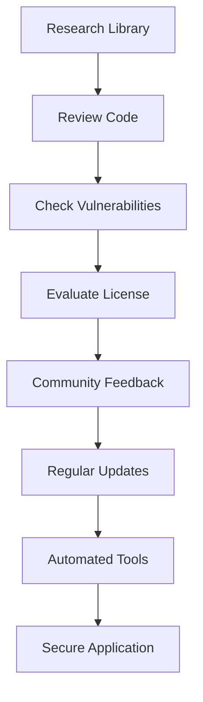

## 20.11 Using Secure Third-Party Dependencies

In today's software development landscape, leveraging third-party libraries is a common practice that accelerates development and enhances functionality. However, it also introduces potential security risks. In this section, we will explore the importance of managing third-party dependencies securely in Erlang applications, the risks associated with them, and strategies to mitigate these risks.

### Understanding the Risks of Third-Party Dependencies

Third-party dependencies can introduce vulnerabilities into your application, which can be exploited by malicious actors. These risks include:

- **Outdated Libraries**: Older versions of libraries may have known vulnerabilities that have been patched in newer releases.
- **Malicious Code**: Some libraries may contain intentionally harmful code.
- **License Compliance**: Using libraries without understanding their licenses can lead to legal issues.
- **Dependency Chains**: A library may depend on other libraries, which can also introduce vulnerabilities.

### Strategies for Vetting and Selecting Secure Libraries

To minimize the risks associated with third-party dependencies, it is crucial to carefully vet and select libraries. Here are some strategies:

1. **Research the Library**: Investigate the library's history, community support, and maintenance activity. A well-maintained library with active contributors is less likely to have unresolved vulnerabilities.

2. **Review the Code**: If possible, review the library's source code for any obvious security issues or malicious intent.

3. **Check for Known Vulnerabilities**: Use tools and databases like the [National Vulnerability Database (NVD)](https://nvd.nist.gov/) to check for known vulnerabilities in the library.

4. **Evaluate the License**: Ensure that the library's license is compatible with your project's license and that you comply with its terms.

5. **Community Feedback**: Look for feedback from other developers who have used the library. This can provide insights into potential issues or benefits.

### Keeping Dependencies Updated

Keeping your dependencies up-to-date is crucial for security. Here are some best practices:

- **Regular Updates**: Regularly check for updates to your dependencies and apply them promptly.
- **Automated Tools**: Use tools like [Dependabot](https://dependabot.com/) or [Snyk](https://snyk.io/) to automate the process of checking for updates and vulnerabilities.
- **Changelog Review**: Before updating, review the changelog to understand what changes have been made and how they might affect your application.

### Tools for Dependency Scanning and Vulnerability Alerts

Several tools can help you manage and secure your dependencies:

- **Rebar3**: Erlang's build tool, Rebar3, can be used to manage dependencies. It supports plugins that can help with security scanning.
- **Hex**: The package manager for Erlang and Elixir, Hex, provides information about package versions and dependencies.
- **Vulnerability Scanners**: Tools like [OWASP Dependency-Check](https://owasp.org/www-project-dependency-check/) can scan your project for known vulnerabilities.

### Code Example: Managing Dependencies with Rebar3

Let's look at a simple example of managing dependencies in an Erlang project using Rebar3.

```erlang
% rebar.config
{deps, [
    {cowboy, "2.9.0"},
    {jsx, "2.11.0"}
]}.
```

In this configuration file, we specify the dependencies for our project. Rebar3 will fetch these libraries and their dependencies, ensuring they are included in our project.

### Try It Yourself

Experiment with adding a new dependency to your project. Use Rebar3 to fetch it and explore its source code to understand its functionality and potential security implications.

### Visualizing Dependency Management

Below is a diagram illustrating the process of managing dependencies securely.



This flowchart represents the steps involved in ensuring the security of third-party dependencies, from initial research to maintaining regular updates.

### Knowledge Check

- **What are the potential risks of using third-party dependencies?**
- **How can you verify the security of a library before using it?**
- **Why is it important to keep dependencies updated?**

### Summary

Managing third-party dependencies securely is a critical aspect of software development. By following best practices for vetting, selecting, and updating libraries, you can mitigate the risks associated with these dependencies and ensure the security of your Erlang applications.

### Embrace the Journey

Remember, managing dependencies is an ongoing process. Stay vigilant, keep learning, and continue to refine your approach to ensure the security of your applications. As you progress, you'll become more adept at identifying and mitigating potential risks. Keep experimenting, stay curious, and enjoy the journey!

## Quiz: Using Secure Third-Party Dependencies



### What is a potential risk of using outdated third-party libraries?

- [x] They may have known vulnerabilities.
- [ ] They are always more efficient.
- [ ] They are easier to integrate.
- [ ] They have better documentation.

> **Explanation:** Outdated libraries may have known vulnerabilities that can be exploited by attackers.

### Which tool can automate the process of checking for updates and vulnerabilities in dependencies?

- [x] Dependabot
- [ ] GitHub
- [ ] Jenkins
- [ ] Docker

> **Explanation:** Dependabot is a tool that automates the process of checking for updates and vulnerabilities in dependencies.

### What should you do before updating a dependency?

- [x] Review the changelog.
- [ ] Ignore the update.
- [ ] Delete the dependency.
- [ ] Rewrite the dependency.

> **Explanation:** Reviewing the changelog helps you understand what changes have been made and how they might affect your application.

### Which of the following is a tool for managing Erlang dependencies?

- [x] Rebar3
- [ ] Maven
- [ ] Gradle
- [ ] NPM

> **Explanation:** Rebar3 is a build tool for Erlang that can manage dependencies.

### What is an important step in vetting a third-party library?

- [x] Research the library's history and community support.
- [ ] Use it without checking.
- [ ] Assume it's secure.
- [ ] Ignore its license.

> **Explanation:** Researching the library's history and community support helps ensure it's well-maintained and secure.

### How can you check for known vulnerabilities in a library?

- [x] Use the National Vulnerability Database (NVD).
- [ ] Guess based on its name.
- [ ] Assume there are none.
- [ ] Ignore the possibility.

> **Explanation:** The National Vulnerability Database (NVD) provides information on known vulnerabilities in libraries.

### Why is it important to evaluate a library's license?

- [x] To ensure compatibility with your project's license.
- [ ] To ignore it.
- [ ] To assume it's free.
- [ ] To avoid using it.

> **Explanation:** Evaluating a library's license ensures that it is compatible with your project's license and that you comply with its terms.

### What is a benefit of using community feedback when selecting a library?

- [x] It provides insights into potential issues or benefits.
- [ ] It is always negative.
- [ ] It is irrelevant.
- [ ] It is always positive.

> **Explanation:** Community feedback can provide valuable insights into potential issues or benefits of using a library.

### What is a key practice for maintaining secure dependencies?

- [x] Regular updates.
- [ ] Ignoring updates.
- [ ] Deleting dependencies.
- [ ] Avoiding libraries.

> **Explanation:** Regular updates help ensure that dependencies are secure and free from known vulnerabilities.

### True or False: Dependency chains can introduce vulnerabilities.

- [x] True
- [ ] False

> **Explanation:** Dependency chains can introduce vulnerabilities as a library may depend on other libraries, which can also have vulnerabilities.


