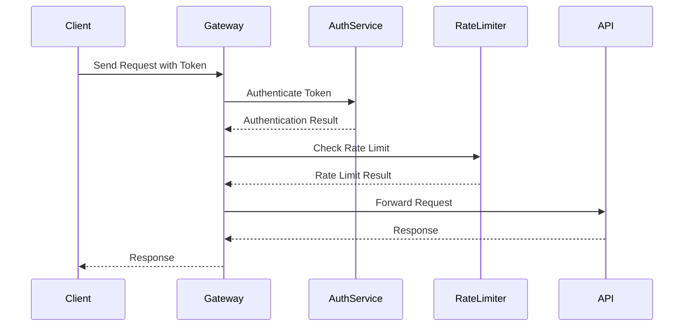

## 20.12 Building Secure APIs and Services

In today's interconnected world, building secure APIs and services is crucial for protecting sensitive data and ensuring the integrity of applications. Erlang, with its robust concurrency model and fault-tolerant design, provides a solid foundation for developing secure systems. In this section, we will explore best practices for designing and implementing secure APIs and services in Erlang, focusing on authentication, authorization, input validation, and more.

### Understanding the Basics of API Security

Before diving into specific patterns and practices, let's establish a foundational understanding of API security. Secure APIs are designed to protect data from unauthorized access and ensure that only authenticated and authorized users can perform specific actions. Key components of API security include:

- **Authentication**: Verifying the identity of a user or system.
- **Authorization**: Determining what an authenticated user is allowed to do.
- **Input Validation**: Ensuring that data received by the API is safe and expected.
- **Rate Limiting**: Preventing abuse by limiting the number of requests a user can make.
- **Logging and Monitoring**: Keeping track of API usage and detecting potential security threats.

### Authentication and Authorization

Authentication and authorization are critical components of API security. They ensure that only legitimate users can access the API and perform actions they are permitted to do.

#### Authentication

Authentication is the process of verifying the identity of a user or system. Common methods include:

- **Basic Authentication**: Uses a username and password. It's simple but not very secure unless combined with HTTPS.
- **Token-Based Authentication**: Involves issuing a token after successful login, which is then used for subsequent requests.
- **OAuth**: A widely-used protocol for token-based authentication, allowing third-party applications to access user data without exposing credentials.

##### Example: Implementing Token-Based Authentication in Erlang

```erlang
-module(auth).
-export([login/2, authenticate/1]).

% Simulate a user database
-spec login(string(), string()) -> {ok, string()} | {error, string()}.
login(Username, Password) ->
    case {Username, Password} of
        {"user", "pass"} -> 
            {ok, generate_token(Username)};
        _ -> 
            {error, "Invalid credentials"}
    end.

-spec authenticate(string()) -> boolean().
authenticate(Token) ->
    % Validate the token (in a real application, check against a database or cache)
    Token == "valid_token".

-spec generate_token(string()) -> string().
generate_token(_Username) ->
    "valid_token".
```

In this example, we simulate a simple token-based authentication system. The `login/2` function checks credentials and returns a token if they are valid. The `authenticate/1` function verifies the token for subsequent requests.

#### Authorization

Authorization determines what an authenticated user is allowed to do. It often involves role-based access control (RBAC) or attribute-based access control (ABAC).

##### Example: Role-Based Access Control in Erlang

```erlang
-module(authz).
-export([authorize/2]).

-spec authorize(string(), string()) -> boolean().
authorize(Role, Action) ->
    case {Role, Action} of
        {"admin", _} -> true;
        {"user", "read"} -> true;
        {"user", "write"} -> false;
        _ -> false
    end.
```

Here, we define a simple RBAC system where an "admin" can perform any action, while a "user" can only perform "read" actions.

### Input Validation

Input validation is crucial for preventing injection attacks and ensuring that the data received by the API is safe and expected. Always validate and sanitize inputs before processing them.

#### Example: Input Validation in Erlang

```erlang
-module(input_validation).
-export([validate_input/1]).

-spec validate_input(map()) -> {ok, map()} | {error, string()}.
validate_input(Data) ->
    case maps:is_key("name", Data) andalso is_binary(maps:get("name", Data)) of
        true -> {ok, Data};
        false -> {error, "Invalid input"}
    end.
```

In this example, we validate that the input data contains a "name" key with a binary value. This simple check helps prevent unexpected data from causing issues.

### Rate Limiting and Abuse Prevention

Rate limiting is a technique used to control the number of requests a user can make to an API within a given timeframe. It helps prevent abuse and ensures fair usage of resources.

#### Example: Implementing Rate Limiting in Erlang

```erlang
-module(rate_limiter).
-export([allow_request/1]).

-spec allow_request(string()) -> boolean().
allow_request(UserId) ->
    % Simulate rate limiting logic
    case ets:lookup(rate_limit_table, UserId) of
        [{UserId, Count}] when Count < 100 -> 
            ets:update_element(rate_limit_table, UserId, {2, Count + 1}),
            true;
        _ -> 
            false
    end.
```

In this example, we use an ETS table to track the number of requests made by each user. If the user exceeds the limit, further requests are denied.

### Secure API Design Patterns

Design patterns provide reusable solutions to common problems. In the context of secure APIs, several patterns can enhance security:

- **Gateway Pattern**: Acts as a single entry point for API requests, handling authentication, authorization, and rate limiting.
- **Facade Pattern**: Provides a simplified interface to a complex subsystem, hiding internal details and reducing attack surfaces.
- **Decorator Pattern**: Adds additional behavior to an object dynamically, such as logging or input validation.

#### Example: Gateway Pattern in Erlang

```erlang
-module(api_gateway).
-export([handle_request/2]).

-spec handle_request(string(), map()) -> {ok, any()} | {error, string()}.
handle_request(Token, Request) ->
    case auth:authenticate(Token) of
        true ->
            case rate_limiter:allow_request(Token) of
                true -> process_request(Request);
                false -> {error, "Rate limit exceeded"}
            end;
        false -> {error, "Unauthorized"}
    end.

-spec process_request(map()) -> {ok, any()}.
process_request(Request) ->
    % Process the request
    {ok, "Request processed"}
```

In this example, the `handle_request/2` function acts as a gateway, handling authentication and rate limiting before processing the request.

### Documentation and Security Measures

Thorough documentation of security measures is essential for maintaining secure APIs. It helps developers understand the security architecture and ensures consistent implementation of security practices.

#### Key Points for Documentation

- **Authentication and Authorization**: Document the methods used and any roles or permissions defined.
- **Input Validation**: Describe the validation rules and any sanitization processes.
- **Rate Limiting**: Explain the limits and how they are enforced.
- **Logging and Monitoring**: Detail the logging mechanisms and how they are used to detect security threats.

### Visualizing Secure API Architecture

To better understand the flow of a secure API, let's visualize the architecture using a sequence diagram.



This diagram illustrates the interaction between the client, gateway, authentication service, rate limiter, and the API itself. It highlights the importance of each component in ensuring a secure API.

### Encouragement and Next Steps

Building secure APIs and services is an ongoing process that requires vigilance and continuous improvement. As you implement these practices, remember to stay informed about the latest security threats and updates in the Erlang ecosystem. Engage with the community, participate in discussions, and share your experiences to contribute to a safer digital world.

### Key Takeaways

- **Authentication and Authorization**: Ensure only legitimate users can access your API.
- **Input Validation**: Protect your API from injection attacks by validating inputs.
- **Rate Limiting**: Prevent abuse and ensure fair usage of resources.
- **Secure Design Patterns**: Use patterns like Gateway and Facade to enhance security.
- **Documentation**: Thoroughly document security measures for consistency and transparency.

### Try It Yourself

Experiment with the code examples provided in this section. Try modifying the authentication logic to use a different method, or implement a more complex rate limiting strategy. Consider adding logging to track API usage and detect potential security threats.

## Quiz: Building Secure APIs and Services



### What is the primary purpose of authentication in API security?

- [x] Verifying the identity of a user or system
- [ ] Determining what actions a user can perform
- [ ] Ensuring data integrity
- [ ] Preventing unauthorized access

> **Explanation:** Authentication is the process of verifying the identity of a user or system.

### Which of the following is a common method for token-based authentication?

- [x] OAuth
- [ ] Basic Authentication
- [ ] API Keys
- [ ] SSL Certificates

> **Explanation:** OAuth is a widely-used protocol for token-based authentication.

### What is the role of input validation in API security?

- [x] Ensuring that data received by the API is safe and expected
- [ ] Encrypting data before transmission
- [ ] Limiting the number of requests a user can make
- [ ] Logging API usage

> **Explanation:** Input validation ensures that data received by the API is safe and expected, preventing injection attacks.

### How does rate limiting help in API security?

- [x] Preventing abuse by limiting the number of requests a user can make
- [ ] Encrypting data before transmission
- [ ] Verifying the identity of a user
- [ ] Ensuring data integrity

> **Explanation:** Rate limiting helps prevent abuse by controlling the number of requests a user can make.

### Which design pattern acts as a single entry point for API requests?

- [x] Gateway Pattern
- [ ] Facade Pattern
- [ ] Decorator Pattern
- [ ] Singleton Pattern

> **Explanation:** The Gateway Pattern acts as a single entry point for API requests, handling authentication, authorization, and rate limiting.

### What should be documented in API security measures?

- [x] Authentication and Authorization methods
- [x] Input Validation rules
- [ ] User interface design
- [ ] Database schema

> **Explanation:** Documenting authentication, authorization, and input validation is crucial for maintaining secure APIs.

### What is the benefit of using the Facade Pattern in API security?

- [x] Provides a simplified interface to a complex subsystem
- [ ] Acts as a single entry point for API requests
- [ ] Adds additional behavior to an object dynamically
- [ ] Ensures data integrity

> **Explanation:** The Facade Pattern provides a simplified interface to a complex subsystem, reducing attack surfaces.

### Which component is responsible for verifying a user's identity?

- [x] Authentication Service
- [ ] Rate Limiter
- [ ] API Gateway
- [ ] Logging System

> **Explanation:** The Authentication Service is responsible for verifying a user's identity.

### What is the purpose of logging and monitoring in API security?

- [x] Detecting potential security threats
- [ ] Encrypting data before transmission
- [ ] Limiting the number of requests a user can make
- [ ] Ensuring data integrity

> **Explanation:** Logging and monitoring help detect potential security threats by keeping track of API usage.

### True or False: Rate limiting is only necessary for public APIs.

- [ ] True
- [x] False

> **Explanation:** Rate limiting is important for both public and private APIs to prevent abuse and ensure fair usage of resources.



Remember, this is just the beginning. As you progress, you'll build more complex and secure APIs. Keep experimenting, stay curious, and enjoy the journey!
