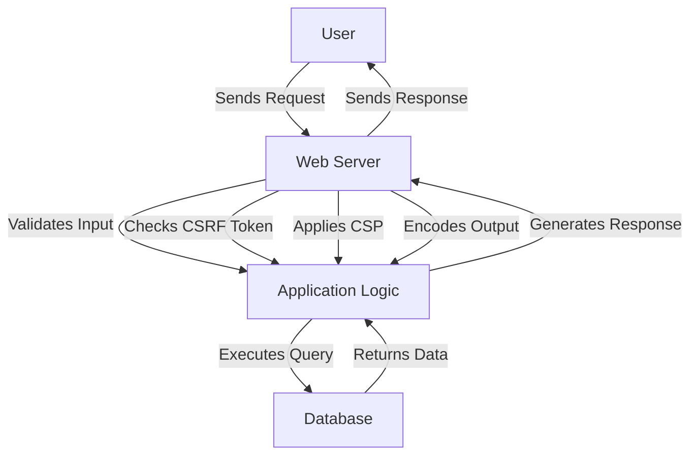

## 20.13 Mitigating XSS, CSRF, and Injection Attacks in Web Applications

In today's digital landscape, web applications are a prime target for various security threats. Among these, Cross-Site Scripting (XSS), Cross-Site Request Forgery (CSRF), and injection attacks are some of the most prevalent and dangerous. This section will guide you through understanding these threats and implementing strategies to mitigate them in Erlang web applications.

### Understanding Cross-Site Scripting (XSS)

Cross-Site Scripting (XSS) is a vulnerability that allows attackers to inject malicious scripts into web pages viewed by other users. These scripts can steal cookies, session tokens, or other sensitive information, and even manipulate the content displayed to users.

#### Types of XSS Attacks

1. **Stored XSS**: The malicious script is stored on the server (e.g., in a database) and is served to users when they request the affected page.
2. **Reflected XSS**: The script is reflected off a web server, such as in an error message or search result, and is immediately executed in the user's browser.
3. **DOM-based XSS**: The vulnerability exists in the client-side code, where the script is executed as a result of modifying the DOM environment.

#### Mitigation Strategies for XSS

- **Input Validation and Output Encoding**: Always validate and sanitize user inputs. Use libraries that automatically encode output to prevent scripts from being executed.
- **Content Security Policy (CSP)**: Implement CSP headers to restrict the sources from which scripts can be loaded.
- **HTTPOnly and Secure Cookies**: Use HTTPOnly and Secure flags for cookies to prevent them from being accessed via JavaScript.

```erlang
% Example of setting HTTPOnly and Secure flags in Erlang
set_cookie(CookieName, CookieValue) ->
    Cookie = {CookieName, CookieValue, [{http_only, true}, {secure, true}]},
    % Set the cookie in the response
    set_cookie_in_response(Cookie).
```

### Understanding Cross-Site Request Forgery (CSRF)

Cross-Site Request Forgery (CSRF) is an attack that tricks a user into performing actions they did not intend to perform. This is done by exploiting the user's authenticated session with a web application.

#### Mitigation Strategies for CSRF

- **Anti-CSRF Tokens**: Include unique tokens in forms and verify them on the server side to ensure the request is legitimate.
- **SameSite Cookies**: Use the SameSite attribute for cookies to prevent them from being sent along with cross-site requests.

```erlang
% Example of generating and validating CSRF tokens in Erlang
generate_csrf_token(UserId) ->
    Token = crypto:strong_rand_bytes(16),
    store_token_in_session(UserId, Token),
    Token.

validate_csrf_token(UserId, Token) ->
    case get_token_from_session(UserId) of
        Token -> true;
        _ -> false
    end.
```

### Understanding Injection Attacks

Injection attacks occur when untrusted data is sent to an interpreter as part of a command or query. SQL injection is the most common form, but similar vulnerabilities exist in other contexts, such as LDAP, XPath, and NoSQL databases.

#### Mitigation Strategies for Injection Attacks

- **Parameterized Queries**: Use parameterized queries to ensure user input is treated as data, not executable code.
- **Input Sanitization**: Sanitize inputs to remove or escape characters that could be interpreted as code.
- **Use of ORM Libraries**: Utilize Object-Relational Mapping (ORM) libraries that automatically handle input sanitization and query parameterization.

```erlang
% Example of using parameterized queries in Erlang with an SQL database
execute_query(UserInput) ->
    Query = "SELECT * FROM users WHERE username = ?",
    Params = [UserInput],
    % Execute the query with parameters
    execute_sql_query(Query, Params).
```

### Role of Secure Frameworks and Libraries

Leveraging secure frameworks and libraries can significantly reduce the risk of security vulnerabilities in your web applications. These tools often come with built-in protections against common threats.

- **Cowboy**: A small, fast, and modern HTTP server for Erlang/OTP that can be configured to handle security concerns.
- **Plug**: A specification for composable modules in web applications, often used with Elixir but applicable in Erlang contexts for handling requests and responses securely.

### Visualizing Security Threats and Mitigations

To better understand how these attacks work and how to prevent them, let's visualize the flow of a typical web request and the points at which these threats can be mitigated.



**Diagram Description**: This flowchart illustrates the typical flow of a web request, highlighting key points where security measures such as input validation, CSRF token checks, CSP application, and output encoding can be applied to mitigate XSS, CSRF, and injection attacks.

### Try It Yourself

To deepen your understanding, try modifying the code examples provided:

- **Experiment with different input validation techniques**: Implement additional checks for specific input types, such as email addresses or URLs.
- **Enhance the CSRF token mechanism**: Add expiration times to tokens and implement token rotation.
- **Test the impact of CSP**: Modify the CSP headers to allow or block different types of content and observe the effects on your application.

### Knowledge Check

- What are the key differences between stored, reflected, and DOM-based XSS?
- How do anti-CSRF tokens work, and why are they effective?
- Why is it important to use parameterized queries in database interactions?

### Summary

In this section, we've explored the nature of XSS, CSRF, and injection attacks, and discussed strategies to mitigate these threats in Erlang web applications. By understanding these vulnerabilities and implementing robust security measures, you can protect your applications and users from potential harm.

### References and Further Reading

- [OWASP XSS Prevention Cheat Sheet](https://owasp.org/www-project-cheat-sheets/cheatsheets/Cross_Site_Scripting_Prevention_Cheat_Sheet.html)
- [OWASP CSRF Prevention Cheat Sheet](https://owasp.org/www-project-cheat-sheets/cheatsheets/Cross-Site_Request_Forgery_Prevention_Cheat_Sheet.html)
- [OWASP SQL Injection Prevention Cheat Sheet](https://owasp.org/www-project-cheat-sheets/cheatsheets/SQL_Injection_Prevention_Cheat_Sheet.html)

## Quiz: Mitigating XSS, CSRF, and Injection Attacks in Web Applications



### What is the primary goal of a Cross-Site Scripting (XSS) attack?

- [x] To execute malicious scripts in a user's browser
- [ ] To steal server-side data directly
- [ ] To crash the web server
- [ ] To redirect users to a different website

> **Explanation:** XSS attacks aim to execute malicious scripts in the user's browser, potentially stealing sensitive information or altering the page content.

### Which of the following is a common mitigation strategy for CSRF attacks?

- [ ] Output encoding
- [x] Anti-CSRF tokens
- [ ] Parameterized queries
- [ ] Content Security Policy

> **Explanation:** Anti-CSRF tokens are used to verify the legitimacy of requests and prevent CSRF attacks.

### How do parameterized queries help prevent SQL injection attacks?

- [x] They treat user input as data, not executable code
- [ ] They encrypt all database queries
- [ ] They validate user input
- [ ] They log all database interactions

> **Explanation:** Parameterized queries ensure that user input is treated as data, preventing it from being executed as code.

### What is the purpose of the Content Security Policy (CSP)?

- [x] To restrict the sources from which scripts can be loaded
- [ ] To encrypt all web traffic
- [ ] To validate user input
- [ ] To manage user sessions

> **Explanation:** CSP is used to define which sources are allowed to load content, helping to prevent XSS attacks.

### Which type of XSS attack involves the script being stored on the server?

- [x] Stored XSS
- [ ] Reflected XSS
- [ ] DOM-based XSS
- [ ] Blind XSS

> **Explanation:** Stored XSS involves the malicious script being stored on the server and served to users.

### What attribute can be used to prevent cookies from being sent with cross-site requests?

- [x] SameSite
- [ ] Secure
- [ ] HTTPOnly
- [ ] Path

> **Explanation:** The SameSite attribute is used to prevent cookies from being sent with cross-site requests, mitigating CSRF attacks.

### Which of the following is a client-side XSS attack?

- [ ] Stored XSS
- [ ] Reflected XSS
- [x] DOM-based XSS
- [ ] Blind XSS

> **Explanation:** DOM-based XSS occurs on the client side, where the script is executed as a result of modifying the DOM environment.

### What is a key benefit of using HTTPOnly cookies?

- [x] They cannot be accessed via JavaScript
- [ ] They are encrypted
- [ ] They expire after a set time
- [ ] They are only sent over HTTPS

> **Explanation:** HTTPOnly cookies cannot be accessed via JavaScript, providing protection against XSS attacks.

### Why is input validation important in preventing injection attacks?

- [x] It ensures that user input is safe and expected
- [ ] It encrypts user input
- [ ] It logs user input
- [ ] It blocks all user input

> **Explanation:** Input validation ensures that user input is safe and conforms to expected formats, reducing the risk of injection attacks.

### True or False: Using secure frameworks and libraries can help mitigate web application security threats.

- [x] True
- [ ] False

> **Explanation:** Secure frameworks and libraries often include built-in protections against common security threats, helping to mitigate risks.



Remember, this is just the beginning. As you progress, you'll build more secure and robust web applications. Keep experimenting, stay curious, and enjoy the journey!
