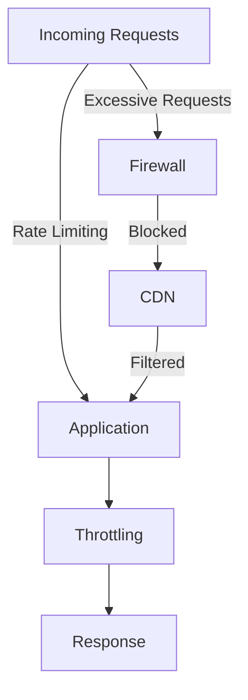

## 20.14 Rate Limiting, Throttling, and Denial-of-Service Protection

In today's digital landscape, ensuring the availability and reliability of applications is paramount. Rate limiting, throttling, and denial-of-service (DoS) protection are essential strategies for safeguarding applications against excessive use and malicious attacks. This section delves into these concepts, providing insights into their implementation in Erlang, a language renowned for its concurrency and fault-tolerance capabilities.

### Understanding Rate Limiting and Throttling

**Rate Limiting** is a technique used to control the amount of incoming and outgoing traffic to or from a network. By limiting the number of requests a user can make in a given time frame, rate limiting helps prevent abuse and ensures fair usage of resources.

**Throttling**, on the other hand, is a broader concept that involves controlling the rate of processing requests. While rate limiting focuses on rejecting excess requests, throttling can involve delaying or queuing requests to manage load.

#### Importance of Rate Limiting and Throttling

- **Preventing Abuse**: Rate limiting helps prevent users from overwhelming a system with too many requests, which can degrade performance for others.
- **Ensuring Fair Usage**: By controlling request rates, all users get a fair share of resources.
- **Protecting Against DoS Attacks**: Rate limiting can mitigate the impact of DoS attacks by limiting the number of requests an attacker can make.
- **Managing Resources**: Throttling helps manage server resources by controlling the flow of requests, ensuring the system remains responsive.

### Implementing Rate Limiting in Erlang

Erlang's concurrency model makes it well-suited for implementing rate limiting. Let's explore how we can achieve this using Erlang processes.

#### Basic Rate Limiting Example

```erlang
-module(rate_limiter).
-export([start/0, request/1]).

start() ->
    RateLimit = 5, % Allow 5 requests per second
    spawn(fun() -> loop(RateLimit, 0, erlang:system_time(second)) end).

loop(RateLimit, Count, LastTime) ->
    receive
        {request, Pid} ->
            CurrentTime = erlang:system_time(second),
            NewCount = if
                CurrentTime > LastTime -> 1;
                true -> Count + 1
            end,
            NewLastTime = if
                CurrentTime > LastTime -> CurrentTime;
                true -> LastTime
            end,
            if
                NewCount =< RateLimit ->
                    Pid ! {ok, "Request allowed"},
                    loop(RateLimit, NewCount, NewLastTime);
                true ->
                    Pid ! {error, "Rate limit exceeded"},
                    loop(RateLimit, Count, LastTime)
            end
    end.

request(Pid) ->
    Pid ! {request, self()},
    receive
        {ok, Message} -> io:format("~s~n", [Message]);
        {error, Message} -> io:format("~s~n", [Message])
    end.
```

In this example, we create a simple rate limiter that allows 5 requests per second. The `loop/3` function maintains the count of requests and the last time a request was processed. If the count exceeds the limit, the request is rejected.

#### Try It Yourself

Experiment with the rate limiter by modifying the `RateLimit` variable to see how it affects the number of allowed requests. You can also change the time unit from seconds to milliseconds for finer control.

### Advanced Rate Limiting Techniques

For more sophisticated rate limiting, consider using Erlang's ETS (Erlang Term Storage) for storing request counts and timestamps. ETS provides efficient in-memory storage, ideal for high-performance rate limiting.

#### Using ETS for Rate Limiting

```erlang
-module(advanced_rate_limiter).
-export([start/0, request/1]).

start() ->
    ets:new(rate_limit_table, [named_table, public, set]),
    spawn(fun() -> loop() end).

loop() ->
    receive
        {request, Pid, Key} ->
            case ets:lookup(rate_limit_table, Key) of
                [] ->
                    ets:insert(rate_limit_table, {Key, 1, erlang:system_time(second)}),
                    Pid ! {ok, "Request allowed"};
                [{Key, Count, LastTime}] ->
                    CurrentTime = erlang:system_time(second),
                    NewCount = if
                        CurrentTime > LastTime -> 1;
                        true -> Count + 1
                    end,
                    NewLastTime = if
                        CurrentTime > LastTime -> CurrentTime;
                        true -> LastTime
                    end,
                    if
                        NewCount =< 5 ->
                            ets:insert(rate_limit_table, {Key, NewCount, NewLastTime}),
                            Pid ! {ok, "Request allowed"};
                        true ->
                            Pid ! {error, "Rate limit exceeded"}
                    end
            end,
            loop()
    end.

request(Pid, Key) ->
    Pid ! {request, self(), Key},
    receive
        {ok, Message} -> io:format("~s~n", [Message]);
        {error, Message} -> io:format("~s~n", [Message])
    end.
```

In this example, we use an ETS table to store request counts and timestamps for each unique key (e.g., user ID or IP address). This approach allows for scalable and efficient rate limiting across multiple users.

### Detecting and Mitigating Denial-of-Service Attacks

Denial-of-service (DoS) attacks aim to make a service unavailable by overwhelming it with requests. Detecting and mitigating these attacks is crucial for maintaining service availability.

#### Detection Strategies

- **Traffic Analysis**: Monitor traffic patterns for unusual spikes or anomalies.
- **Rate Limiting**: Implement rate limiting to detect and block excessive requests.
- **Anomaly Detection**: Use machine learning models to identify abnormal behavior.

#### Mitigation Techniques

- **Rate Limiting and Throttling**: As discussed, these techniques can help mitigate DoS attacks by controlling request rates.
- **IP Blacklisting**: Block IP addresses that exhibit malicious behavior.
- **Load Balancing**: Distribute traffic across multiple servers to prevent overload.
- **CDNs and Firewalls**: Use content delivery networks (CDNs) and firewalls to filter and absorb attack traffic.

### Infrastructure's Role in Protection

While application-level protections are essential, infrastructure plays a critical role in defending against DoS attacks.

- **Firewalls**: Configure firewalls to block malicious traffic and allow only legitimate requests.
- **CDNs**: Leverage CDNs to cache content and absorb traffic spikes, reducing the load on origin servers.
- **Load Balancers**: Use load balancers to distribute traffic evenly across servers, preventing any single server from being overwhelmed.

### Visualizing Rate Limiting and DoS Protection

Below is a diagram illustrating the flow of requests through a rate limiter and the role of infrastructure in DoS protection.



**Diagram Description**: This flowchart shows how incoming requests are processed through rate limiting and throttling mechanisms before reaching the application. Excessive requests are blocked by the firewall and filtered by the CDN.

### Erlang's Unique Features for Security

Erlang's concurrency model and fault-tolerance capabilities make it uniquely suited for implementing security patterns like rate limiting and DoS protection. The ability to spawn lightweight processes and use ETS for efficient data storage are key advantages.

### Design Considerations

- **Scalability**: Ensure your rate limiting solution can scale with the number of users and requests.
- **Flexibility**: Design your system to allow for easy adjustments to rate limits and throttling policies.
- **Monitoring**: Implement monitoring to track the effectiveness of your rate limiting and DoS protection strategies.

### Differences and Similarities with Other Patterns

Rate limiting and throttling are often confused with load balancing. While both aim to manage traffic, rate limiting focuses on controlling request rates, whereas load balancing distributes traffic across multiple servers.

### Knowledge Check

- What is the primary purpose of rate limiting?
- How can ETS be used to implement rate limiting in Erlang?
- What are some common strategies for detecting DoS attacks?
- How do CDNs contribute to DoS protection?

### Embrace the Journey

Remember, implementing rate limiting and DoS protection is an ongoing process. As you refine your strategies, you'll build more resilient and secure applications. Keep experimenting, stay vigilant, and enjoy the journey!

## Quiz: Rate Limiting, Throttling, and Denial-of-Service Protection



### What is the primary purpose of rate limiting?

- [x] To control the number of requests a user can make in a given time frame
- [ ] To increase the speed of request processing
- [ ] To balance load across servers
- [ ] To encrypt data in transit

> **Explanation:** Rate limiting is used to control the number of requests a user can make in a given time frame to prevent abuse and ensure fair usage.

### How can ETS be used in rate limiting?

- [x] By storing request counts and timestamps for each user
- [ ] By encrypting user data
- [ ] By balancing load across servers
- [ ] By caching static content

> **Explanation:** ETS can be used to store request counts and timestamps for each user, allowing for efficient rate limiting.

### What is a common strategy for detecting DoS attacks?

- [x] Traffic analysis
- [ ] Data encryption
- [ ] Load balancing
- [ ] Content caching

> **Explanation:** Traffic analysis involves monitoring traffic patterns for unusual spikes or anomalies, which can indicate a DoS attack.

### How do CDNs contribute to DoS protection?

- [x] By caching content and absorbing traffic spikes
- [ ] By encrypting data
- [ ] By storing user credentials
- [ ] By balancing load across servers

> **Explanation:** CDNs cache content and absorb traffic spikes, reducing the load on origin servers and contributing to DoS protection.

### What is the difference between rate limiting and throttling?

- [x] Rate limiting focuses on rejecting excess requests, while throttling involves delaying or queuing requests
- [ ] Rate limiting encrypts data, while throttling decrypts data
- [ ] Rate limiting balances load, while throttling caches content
- [ ] Rate limiting stores data, while throttling deletes data

> **Explanation:** Rate limiting focuses on rejecting excess requests, while throttling involves delaying or queuing requests to manage load.

### Which Erlang feature is particularly useful for implementing rate limiting?

- [x] ETS (Erlang Term Storage)
- [ ] NIFs (Native Implemented Functions)
- [ ] Ports
- [ ] C Nodes

> **Explanation:** ETS provides efficient in-memory storage, ideal for storing request counts and timestamps for rate limiting.

### What role do firewalls play in DoS protection?

- [x] Blocking malicious traffic
- [ ] Encrypting data
- [ ] Caching content
- [ ] Balancing load

> **Explanation:** Firewalls block malicious traffic, allowing only legitimate requests to reach the application.

### What is a key advantage of Erlang for implementing security patterns?

- [x] Concurrency model and fault-tolerance capabilities
- [ ] Built-in encryption libraries
- [ ] Native support for HTTP
- [ ] High-level syntax

> **Explanation:** Erlang's concurrency model and fault-tolerance capabilities make it well-suited for implementing security patterns like rate limiting and DoS protection.

### What is the primary goal of throttling?

- [x] To manage server resources by controlling the flow of requests
- [ ] To encrypt data in transit
- [ ] To balance load across servers
- [ ] To store user data

> **Explanation:** Throttling manages server resources by controlling the flow of requests, ensuring the system remains responsive.

### True or False: Rate limiting and load balancing are the same.

- [ ] True
- [x] False

> **Explanation:** Rate limiting controls request rates, while load balancing distributes traffic across multiple servers.




