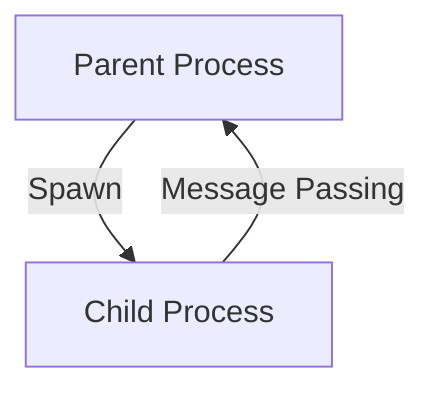
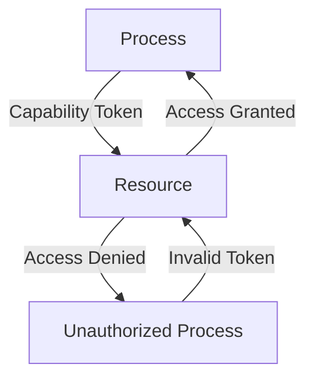

## 20.15 Sandboxing and Capability-Based Security Models

In today's world of distributed systems and cloud computing, security is paramount. As developers, we must ensure that our applications are not only functional but also secure against potential threats. Sandboxing and capability-based security models are two powerful techniques that can help us achieve this goal. In this section, we'll explore these concepts in the context of Erlang, a language known for its robustness and concurrency capabilities.

### Understanding Sandboxing

**Sandboxing** is a security mechanism used to execute programs in a restricted environment. The primary goal of sandboxing is to limit the access of a program to the system's resources, thereby preventing it from causing harm or accessing sensitive information. This is particularly useful in environments where untrusted code is executed, such as in multi-tenant systems or when running third-party plugins.

#### Key Concepts of Sandboxing

1. **Process Isolation**: Sandboxing relies heavily on isolating processes from each other. This ensures that even if one process is compromised, it cannot affect others.
2. **Resource Limitation**: By restricting the resources a process can access, we can prevent it from consuming excessive CPU, memory, or disk space.
3. **Controlled Execution**: Sandboxes often provide mechanisms to control the execution of code, such as limiting the number of instructions or execution time.

### Erlang's Approach to Sandboxing

Erlang's virtual machine (VM) inherently provides several features that align with the principles of sandboxing. Let's explore how Erlang achieves process isolation and resource limitation.

#### Process Isolation in Erlang

Erlang's concurrency model is based on lightweight processes that are isolated from each other. Each process has its own memory space and communicates with other processes through message passing. This isolation is a fundamental aspect of Erlang's design and provides a natural form of sandboxing.

```erlang
-module(sandbox_example).
-export([start/0, process/1]).

start() ->
    Pid = spawn(?MODULE, process, [self()]),
    Pid ! {self(), "Hello, sandbox!"},
    receive
        {Pid, Response} ->
            io:format("Received response: ~p~n", [Response])
    end.

process(Parent) ->
    receive
        {Parent, Message} ->
            Parent ! {self(), "Processed: " ++ Message}
    end.
```

In this example, we spawn a new process that receives a message, processes it, and sends a response back. The spawned process is isolated and cannot directly access the memory of the parent process.

#### Resource Limitation

Erlang provides mechanisms to limit the resources available to processes. For instance, you can set limits on the number of processes, memory usage, and execution time. This is particularly useful in preventing denial-of-service attacks where a malicious process attempts to exhaust system resources.

### Capability-Based Security Models

Capability-based security models focus on granting specific capabilities to processes or users, rather than relying on traditional access control lists (ACLs). A capability is a communicable, unforgeable token of authority that references an object along with an associated set of access rights.

#### Principles of Capability-Based Security

1. **Least Privilege**: Grant only the minimum capabilities necessary for a process to perform its function.
2. **Fine-Grained Control**: Capabilities allow for more granular control over what a process can do.
3. **Delegation**: Capabilities can be delegated to other processes, allowing for flexible security policies.

### Implementing Capability-Based Security in Erlang

In Erlang, we can implement capability-based security by carefully designing our processes and message-passing mechanisms. Let's consider an example where we restrict access to a sensitive resource.

```erlang
-module(capability_example).
-export([start/0, resource/1, access_resource/2]).

start() ->
    ResourcePid = spawn(?MODULE, resource, [self()]),
    Capability = {ResourcePid, "secret_token"},
    spawn(?MODULE, access_resource, [Capability, "secret_token"]).

resource(Parent) ->
    receive
        {Capability, "secret_token"} ->
            Parent ! {self(), "Access granted"}
    end.

access_resource({ResourcePid, Token}, ProvidedToken) ->
    if
        Token =:= ProvidedToken ->
            ResourcePid ! {self(), ProvidedToken},
            receive
                {ResourcePid, Response} ->
                    io:format("Resource response: ~p~n", [Response])
            end;
        true ->
            io:format("Access denied~n")
    end.
```

In this example, we create a resource process that only grants access if the correct capability (token) is provided. This demonstrates how capabilities can be used to control access to resources in Erlang.

### Benefits of Sandboxing and Capability-Based Security

1. **Enhanced Security**: By isolating processes and restricting capabilities, we reduce the attack surface of our applications.
2. **Fault Tolerance**: Isolated processes ensure that failures in one part of the system do not affect others.
3. **Scalability**: Sandboxing allows for safe execution of untrusted code, enabling multi-tenant architectures.
4. **Flexibility**: Capability-based models provide fine-grained control over resource access, allowing for dynamic security policies.

### Applying the Principle of Least Privilege

The principle of least privilege is a key tenet of both sandboxing and capability-based security. By granting only the minimum necessary permissions, we limit the potential damage that can be caused by a compromised process. In Erlang, this can be achieved by carefully designing process interactions and using capabilities to control access.

### Try It Yourself

Experiment with the provided examples by modifying the capabilities or resource access conditions. Try creating a scenario where a process attempts to access a resource without the correct capability and observe the behavior.

### Visualizing Sandboxing and Capability-Based Security

To better understand these concepts, let's visualize the process isolation and capability-based security model using Mermaid.js diagrams.

#### Process Isolation Diagram



*Caption*: This diagram illustrates the isolation of a child process from its parent, with communication occurring through message passing.

#### Capability-Based Security Diagram



*Caption*: This diagram shows how a process with the correct capability token can access a resource, while an unauthorized process is denied access.

### References and Further Reading

- [Erlang Documentation](https://www.erlang.org/docs)
- [Capability-Based Security on Wikipedia](https://en.wikipedia.org/wiki/Capability-based_security)
- [Sandboxing in Computer Security](https://en.wikipedia.org/wiki/Sandbox_(computer_security))

### Knowledge Check

- What is the primary goal of sandboxing?
- How does Erlang's VM provide process isolation?
- What is a capability in the context of security models?
- How can the principle of least privilege be applied in Erlang?

### Embrace the Journey

Remember, implementing security models is an ongoing process. As you continue to develop your applications, keep exploring new ways to enhance security. Stay curious, experiment with different approaches, and enjoy the journey of building secure and robust systems.

## Quiz: Sandboxing and Capability-Based Security Models



### What is the primary goal of sandboxing?

- [x] To limit the access of a program to the system's resources
- [ ] To enhance the performance of a program
- [ ] To increase the complexity of a program
- [ ] To provide a user-friendly interface

> **Explanation:** Sandboxing aims to limit the access of a program to the system's resources, thereby preventing it from causing harm or accessing sensitive information.

### How does Erlang achieve process isolation?

- [x] Through lightweight processes with separate memory spaces
- [ ] By using shared memory for all processes
- [ ] By running all processes in a single thread
- [ ] By using global variables for communication

> **Explanation:** Erlang achieves process isolation through lightweight processes that have their own memory spaces and communicate via message passing.

### What is a capability in capability-based security models?

- [x] A token of authority that references an object with access rights
- [ ] A list of users who can access a resource
- [ ] A password required to access a system
- [ ] A hardware component that enhances security

> **Explanation:** A capability is a communicable, unforgeable token of authority that references an object along with an associated set of access rights.

### Which principle is key to capability-based security?

- [x] Least Privilege
- [ ] Maximum Access
- [ ] Open Access
- [ ] Full Control

> **Explanation:** The principle of least privilege is key to capability-based security, ensuring that only the minimum necessary permissions are granted.

### What is the benefit of using sandboxing in multi-tenant environments?

- [x] It allows safe execution of untrusted code
- [ ] It increases the complexity of the system
- [ ] It reduces the number of processes
- [ ] It simplifies resource management

> **Explanation:** Sandboxing allows for the safe execution of untrusted code, which is particularly beneficial in multi-tenant environments.

### How can capabilities be used in Erlang?

- [x] By designing processes and message-passing mechanisms
- [ ] By using global variables
- [ ] By sharing memory between processes
- [ ] By using external libraries

> **Explanation:** In Erlang, capabilities can be implemented by carefully designing processes and message-passing mechanisms.

### What is the role of the Erlang VM in sandboxing?

- [x] It provides process isolation and resource limitation
- [ ] It compiles code into machine language
- [ ] It manages the user interface
- [ ] It handles network communication

> **Explanation:** The Erlang VM provides process isolation and resource limitation, which are key aspects of sandboxing.

### What is the principle of least privilege?

- [x] Granting only the minimum capabilities necessary
- [ ] Allowing maximum access to all resources
- [ ] Providing full control to all users
- [ ] Restricting access to a single user

> **Explanation:** The principle of least privilege involves granting only the minimum capabilities necessary for a process to perform its function.

### How does Erlang handle resource limitation?

- [x] By setting limits on processes, memory, and execution time
- [ ] By using global variables
- [ ] By sharing memory between processes
- [ ] By using external libraries

> **Explanation:** Erlang handles resource limitation by setting limits on the number of processes, memory usage, and execution time.

### True or False: Sandboxing can prevent denial-of-service attacks.

- [x] True
- [ ] False

> **Explanation:** True. Sandboxing can prevent denial-of-service attacks by limiting the resources available to processes, preventing them from consuming excessive system resources.


