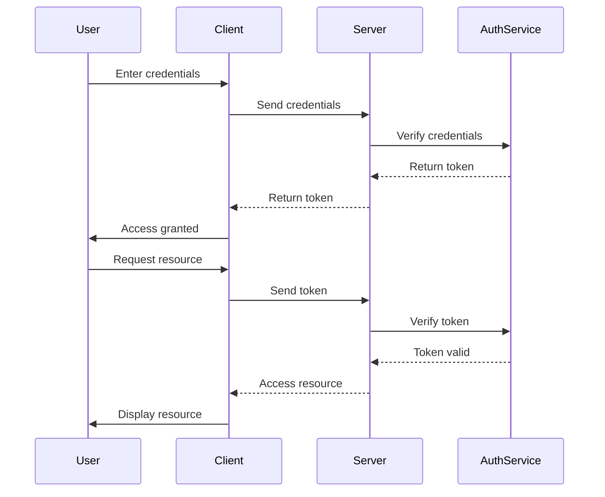

## 20.3 Authentication and Authorization Strategies

In the realm of software security, authentication and authorization are critical components that ensure the integrity and confidentiality of applications. In this section, we delve into various strategies for implementing robust authentication and authorization mechanisms in Erlang applications. We will explore different authentication methods, discuss authorization models like role-based access control (RBAC), and provide practical examples of implementing these strategies in Erlang. Additionally, we will emphasize the importance of securely handling credentials and encourage regular updates to authentication protocols to address emerging threats.

### Understanding Authentication and Authorization

Before diving into specific strategies, let's clarify the distinction between authentication and authorization:

- **Authentication** is the process of verifying the identity of a user or system. It answers the question, "Who are you?"
- **Authorization** determines what an authenticated user or system is allowed to do. It answers the question, "What are you allowed to do?"

### Authentication Methods

#### Password-Based Authentication

Password-based authentication is one of the most common methods used to verify a user's identity. While simple to implement, it requires careful handling to ensure security.

**Key Considerations:**

- **Hashing Passwords:** Always hash passwords using a strong algorithm like bcrypt, Argon2, or PBKDF2 before storing them in a database.
- **Salting:** Add a unique salt to each password before hashing to prevent rainbow table attacks.
- **Password Policies:** Enforce strong password policies, including minimum length, complexity, and expiration.

**Erlang Example:**

```erlang
-module(auth).
-export([hash_password/1, verify_password/2]).

hash_password(Password) ->
    Salt = crypto:strong_rand_bytes(16),
    Hashed = crypto:hash(sha256, <<Salt/binary, Password/binary>>),
    {Salt, Hashed}.

verify_password(Password, {Salt, Hashed}) ->
    crypto:hash(sha256, <<Salt/binary, Password/binary>>) =:= Hashed.
```

In this example, we use the `crypto` module to hash passwords with a salt. The `hash_password/1` function generates a salt and hashes the password, while `verify_password/2` checks if a given password matches the stored hash.

#### Token-Based Authentication

Token-based authentication is widely used in modern applications, especially for stateless communication between clients and servers. JSON Web Tokens (JWT) are a popular choice for this method.

**Key Considerations:**

- **Token Expiry:** Set an expiration time for tokens to limit their validity period.
- **Secure Storage:** Store tokens securely on the client side, such as in HTTP-only cookies or secure storage.
- **Revocation:** Implement a mechanism to revoke tokens if needed.

**Erlang Example:**

```erlang
-module(token_auth).
-export([generate_token/1, verify_token/1]).

generate_token(UserId) ->
    Header = base64:encode(<<"{\"alg\":\"HS256\",\"typ\":\"JWT\"}">>),
    Payload = base64:encode(<<"{\"sub\":\"", UserId/binary, "\"}">>),
    Signature = crypto:mac(hmac, sha256, <<"secret_key">>, <<Header/binary, ".", Payload/binary>>),
    <<Header/binary, ".", Payload/binary, ".", base64:encode(Signature)/binary>>.

verify_token(Token) ->
    [Header, Payload, Signature] = string:split(Token, ".", all),
    ExpectedSignature = crypto:mac(hmac, sha256, <<"secret_key">>, <<Header/binary, ".", Payload/binary>>),
    base64:decode(Signature) =:= ExpectedSignature.
```

This example demonstrates generating and verifying JWTs using Erlang's `crypto` module. The `generate_token/1` function creates a token with a header, payload, and signature, while `verify_token/1` checks the token's validity.

#### Multi-Factor Authentication (MFA)

Multi-factor authentication adds an extra layer of security by requiring users to provide multiple forms of verification. Common factors include something the user knows (password), something the user has (a mobile device), and something the user is (biometric data).

**Key Considerations:**

- **User Experience:** Ensure the MFA process is user-friendly and does not create unnecessary friction.
- **Fallback Options:** Provide alternative methods for users who cannot access their primary MFA device.
- **Regular Updates:** Continuously update MFA methods to address new security threats.

**Erlang Example:**

Implementing MFA in Erlang typically involves integrating with external services that provide MFA capabilities, such as sending SMS codes or using authenticator apps. Here's a conceptual example:

```erlang
-module(mfa).
-export([send_mfa_code/1, verify_mfa_code/2]).

send_mfa_code(UserId) ->
    Code = random:uniform(999999),
    %% Send code to user's registered device (e.g., via SMS or email)
    io:format("Sending MFA code ~p to user ~p~n", [Code, UserId]),
    Code.

verify_mfa_code(UserId, Code) ->
    %% Verify the code entered by the user
    io:format("Verifying MFA code ~p for user ~p~n", [Code, UserId]),
    true. %% Replace with actual verification logic
```

In this example, `send_mfa_code/1` generates a random code and simulates sending it to the user, while `verify_mfa_code/2` checks if the entered code is correct.

### Authorization Models

#### Role-Based Access Control (RBAC)

Role-Based Access Control (RBAC) is a widely used authorization model that assigns permissions to users based on their roles within an organization. This model simplifies permission management by grouping users with similar access needs.

**Key Considerations:**

- **Role Hierarchies:** Define role hierarchies to inherit permissions from parent roles.
- **Least Privilege Principle:** Assign the minimum necessary permissions to each role.
- **Dynamic Role Assignment:** Allow roles to be assigned and revoked dynamically based on user actions or changes in responsibilities.

**Erlang Example:**

```erlang
-module(rbac).
-export([assign_role/2, check_permission/3]).

-define(ROLES, #{admin => [read, write, delete], user => [read]}).

assign_role(UserId, Role) ->
    %% Assign role to user (store in database or in-memory data structure)
    io:format("Assigning role ~p to user ~p~n", [Role, UserId]).

check_permission(UserId, Action, Role) ->
    Permissions = maps:get(Role, ?ROLES, []),
    lists:member(Action, Permissions).
```

In this example, we define roles and their associated permissions using a map. The `assign_role/2` function assigns a role to a user, and `check_permission/3` verifies if a user has the necessary permission to perform an action.

### Secure Handling of Credentials

Securely handling credentials is paramount to preventing unauthorized access and data breaches. Here are some best practices:

- **Encryption:** Encrypt sensitive data, such as passwords and tokens, both in transit and at rest.
- **Environment Variables:** Store sensitive configuration data, such as API keys and database credentials, in environment variables rather than hardcoding them in source code.
- **Access Controls:** Restrict access to sensitive data and systems based on the principle of least privilege.

### Regular Updates to Authentication Protocols

The security landscape is constantly evolving, with new threats emerging regularly. To stay ahead of potential vulnerabilities, it's crucial to:

- **Monitor Security Bulletins:** Stay informed about the latest security advisories and patches for the libraries and frameworks you use.
- **Conduct Security Audits:** Regularly audit your authentication and authorization mechanisms to identify and address potential weaknesses.
- **Update Dependencies:** Keep your dependencies up to date to benefit from security patches and improvements.

### Visualizing Authentication and Authorization

To better understand the flow of authentication and authorization processes, let's visualize them using a sequence diagram.



This diagram illustrates the interaction between a user, client, server, and authentication service during the authentication and authorization process.

### Try It Yourself

To deepen your understanding, try modifying the code examples provided:

- **Password-Based Authentication:** Experiment with different hashing algorithms and salting techniques.
- **Token-Based Authentication:** Implement token revocation and refresh mechanisms.
- **Multi-Factor Authentication:** Integrate with an external service to send real SMS or email codes.

### Knowledge Check

- **Question:** What is the primary difference between authentication and authorization?
- **Exercise:** Implement a simple RBAC system in Erlang with at least three roles and associated permissions.

### Summary

In this section, we've explored various authentication and authorization strategies in Erlang, including password-based, token-based, and multi-factor authentication, as well as role-based access control. We've highlighted the importance of securely handling credentials and encouraged regular updates to authentication protocols to address new threats. Remember, implementing robust security measures is an ongoing process that requires vigilance and adaptation to evolving threats.

## Quiz: Authentication and Authorization Strategies



### What is the primary purpose of authentication in a system?

- [x] To verify the identity of a user or system
- [ ] To determine what actions a user can perform
- [ ] To encrypt sensitive data
- [ ] To manage user roles

> **Explanation:** Authentication is the process of verifying the identity of a user or system, answering the question, "Who are you?"

### Which of the following is a common method for password-based authentication?

- [x] Hashing passwords with a salt
- [ ] Storing passwords in plain text
- [ ] Using passwords as tokens
- [ ] Encrypting passwords with a symmetric key

> **Explanation:** Hashing passwords with a salt is a common method to securely store passwords, preventing attacks like rainbow table attacks.

### What is a key advantage of token-based authentication?

- [x] Stateless communication between clients and servers
- [ ] Requires storing session data on the server
- [ ] Tokens never expire
- [ ] Tokens are always encrypted

> **Explanation:** Token-based authentication allows for stateless communication, meaning the server does not need to store session data.

### In multi-factor authentication, which of the following is NOT a common factor?

- [ ] Something the user knows
- [ ] Something the user has
- [ ] Something the user is
- [x] Something the user wants

> **Explanation:** Multi-factor authentication typically involves something the user knows (e.g., password), has (e.g., mobile device), or is (e.g., biometric data).

### What is the main benefit of using Role-Based Access Control (RBAC)?

- [x] Simplifies permission management by grouping users with similar access needs
- [ ] Provides unlimited access to all users
- [ ] Eliminates the need for authentication
- [ ] Requires manual permission assignment for each user

> **Explanation:** RBAC simplifies permission management by assigning permissions to roles, which are then assigned to users.

### Why is it important to securely handle credentials?

- [x] To prevent unauthorized access and data breaches
- [ ] To improve application performance
- [ ] To reduce server load
- [ ] To simplify code maintenance

> **Explanation:** Securely handling credentials is crucial to prevent unauthorized access and data breaches, ensuring the security of sensitive information.

### What should be done to keep authentication protocols secure?

- [x] Regularly update protocols to address new threats
- [ ] Use outdated libraries for compatibility
- [ ] Avoid monitoring security bulletins
- [ ] Ignore security audits

> **Explanation:** Regularly updating authentication protocols and monitoring security bulletins helps address new threats and vulnerabilities.

### Which Erlang module is commonly used for cryptographic operations?

- [x] crypto
- [ ] ssl
- [ ] httpc
- [ ] os

> **Explanation:** The `crypto` module in Erlang is commonly used for cryptographic operations, such as hashing and encryption.

### What is the purpose of salting passwords before hashing?

- [x] To prevent rainbow table attacks
- [ ] To increase password length
- [ ] To encrypt passwords
- [ ] To simplify password storage

> **Explanation:** Salting passwords before hashing adds randomness, making it difficult for attackers to use precomputed tables (rainbow tables) to crack passwords.

### True or False: Tokens in token-based authentication should never expire.

- [ ] True
- [x] False

> **Explanation:** Tokens should have an expiration time to limit their validity period and reduce the risk of misuse.



Remember, this is just the beginning. As you progress, you'll build more complex and secure applications. Keep experimenting, stay curious, and enjoy the journey!
