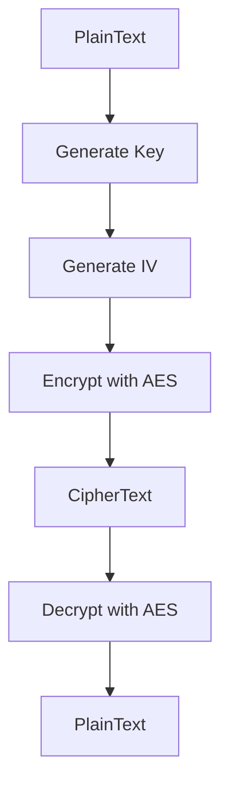

## 20.4 Data Encryption and Cryptography with the `crypto` Module

In today's digital landscape, ensuring the confidentiality, integrity, and authenticity of data is paramount. Cryptography provides the tools necessary to achieve these goals, and Erlang's `crypto` module is a powerful library that facilitates a wide range of cryptographic operations. In this section, we will delve into the capabilities of the `crypto` module, explore how to encrypt and decrypt data, manage cryptographic keys, and adhere to best practices for secure cryptographic implementations.

### Introduction to the `crypto` Module

The `crypto` module in Erlang is a comprehensive library that provides a suite of cryptographic functions. It is built on top of the OpenSSL library, which is widely used for secure communications over computer networks. The `crypto` module supports various cryptographic algorithms, including symmetric encryption, asymmetric encryption, hashing, and digital signatures.

#### Key Features of the `crypto` Module

- **Symmetric Encryption**: Algorithms like AES (Advanced Encryption Standard) and DES (Data Encryption Standard) for encrypting and decrypting data using the same key.
- **Asymmetric Encryption**: RSA (Rivest-Shamir-Adleman) for encrypting data with a public key and decrypting it with a private key.
- **Hashing**: Functions for generating cryptographic hashes using algorithms like SHA (Secure Hash Algorithm) and MD5 (Message-Digest Algorithm).
- **Digital Signatures**: Mechanisms for signing data and verifying signatures to ensure data integrity and authenticity.

### Encrypting and Decrypting Data

Encryption is the process of converting plaintext into ciphertext, making it unreadable to unauthorized parties. Decryption is the reverse process, converting ciphertext back into plaintext. Let's explore how to perform these operations using the `crypto` module.

#### Symmetric Encryption with AES

AES is a widely used symmetric encryption algorithm. Here's how you can encrypt and decrypt data using AES in the `crypto` module:

```erlang
-module(aes_example).
-export([encrypt/2, decrypt/2]).

% Encrypt data using AES
encrypt(Key, PlainText) ->
    Iv = crypto:strong_rand_bytes(16), % Generate a random initialization vector
    CipherText = crypto:block_encrypt(aes_cbc, Key, Iv, PlainText),
    {Iv, CipherText}.

% Decrypt data using AES
decrypt(Key, {Iv, CipherText}) ->
    PlainText = crypto:block_decrypt(aes_cbc, Key, Iv, CipherText),
    PlainText.
```

- **Key**: A secret key used for both encryption and decryption. It must be kept secure.
- **Initialization Vector (IV)**: A random value used to ensure that the same plaintext encrypts to different ciphertexts each time.

#### Asymmetric Encryption with RSA

RSA is an asymmetric encryption algorithm that uses a pair of keys: a public key for encryption and a private key for decryption.

```erlang
-module(rsa_example).
-export([generate_keys/0, encrypt/2, decrypt/2]).

% Generate RSA key pair
generate_keys() ->
    {PublicKey, PrivateKey} = crypto:generate_key(rsa, 2048),
    {PublicKey, PrivateKey}.

% Encrypt data using RSA
encrypt(PublicKey, PlainText) ->
    CipherText = crypto:public_encrypt(rsa, PlainText, PublicKey),
    CipherText.

% Decrypt data using RSA
decrypt(PrivateKey, CipherText) ->
    PlainText = crypto:private_decrypt(rsa, CipherText, PrivateKey),
    PlainText.
```

- **Public Key**: Used to encrypt data. It can be shared openly.
- **Private Key**: Used to decrypt data. It must be kept confidential.

### Generating and Managing Cryptographic Keys

Key management is a critical aspect of cryptography. Proper key generation, storage, and rotation are essential for maintaining security.

#### Generating Keys

The `crypto` module provides functions to generate cryptographic keys. For symmetric encryption, keys can be generated using random bytes:

```erlang
generate_symmetric_key(Length) ->
    crypto:strong_rand_bytes(Length).
```

For asymmetric encryption, keys are generated as shown in the RSA example above.

#### Storing Keys Securely

Keys should be stored securely to prevent unauthorized access. Consider the following practices:

- **Use Secure Storage**: Store keys in a secure environment, such as a hardware security module (HSM) or a secure key management service.
- **Access Control**: Limit access to keys to authorized personnel and applications only.
- **Encryption**: Encrypt keys at rest using a master key.

#### Key Rotation

Regularly rotating keys reduces the risk of key compromise. Implement key rotation policies and automate the process where possible.

### Best Practices for Using Cryptography Securely

To ensure the security of cryptographic implementations, adhere to the following best practices:

- **Use Strong Algorithms**: Choose cryptographic algorithms that are considered secure by the cryptographic community. Avoid deprecated algorithms like MD5 and SHA-1.
- **Keep Libraries Updated**: Regularly update the `crypto` module and underlying libraries like OpenSSL to protect against vulnerabilities.
- **Implement Proper Error Handling**: Handle errors gracefully to avoid leaking sensitive information.
- **Conduct Security Audits**: Regularly audit cryptographic implementations to identify and address potential weaknesses.

### Legal Considerations and Compliance Requirements

When implementing cryptography, be aware of legal and compliance requirements that may apply:

- **Export Controls**: Cryptographic software may be subject to export control regulations. Ensure compliance with applicable laws.
- **Data Protection Regulations**: Regulations like GDPR (General Data Protection Regulation) may impose specific requirements for data encryption and protection.
- **Industry Standards**: Adhere to industry standards and best practices, such as those outlined by NIST (National Institute of Standards and Technology).

### Visualizing Cryptographic Processes

To better understand the flow of cryptographic operations, let's visualize the process of symmetric encryption using a flowchart:



This flowchart illustrates the steps involved in encrypting and decrypting data using symmetric encryption.

### Try It Yourself

Now that we've covered the basics, it's time to experiment with the `crypto` module. Try modifying the code examples to:

- Use different encryption algorithms, such as DES or Blowfish.
- Implement additional security measures, like key derivation functions.
- Explore the use of digital signatures for data integrity and authenticity.

### Knowledge Check

To reinforce your understanding, consider the following questions:

1. What is the difference between symmetric and asymmetric encryption?
2. Why is it important to use a random initialization vector (IV) in encryption?
3. How can you ensure the secure storage of cryptographic keys?

### Conclusion

Cryptography is a powerful tool for securing data, and the `crypto` module in Erlang provides a robust set of functions for implementing cryptographic operations. By following best practices and staying informed about legal requirements, you can effectively protect sensitive information in your applications. Remember, this is just the beginning. As you continue to explore cryptography, you'll discover more advanced techniques and applications. Keep experimenting, stay curious, and enjoy the journey!

## Quiz: Data Encryption and Cryptography with the `crypto` Module



### What is the primary difference between symmetric and asymmetric encryption?

- [x] Symmetric encryption uses the same key for encryption and decryption, while asymmetric encryption uses a pair of keys.
- [ ] Symmetric encryption is faster than asymmetric encryption.
- [ ] Asymmetric encryption is more secure than symmetric encryption.
- [ ] Symmetric encryption is used for hashing.

> **Explanation:** Symmetric encryption uses the same key for both encryption and decryption, whereas asymmetric encryption uses a public key for encryption and a private key for decryption.

### Why is it important to use a random initialization vector (IV) in encryption?

- [x] To ensure that the same plaintext encrypts to different ciphertexts each time.
- [ ] To increase the speed of encryption.
- [ ] To reduce the size of the ciphertext.
- [ ] To make decryption faster.

> **Explanation:** A random IV ensures that the same plaintext will produce different ciphertexts each time it is encrypted, enhancing security by preventing pattern recognition.

### Which of the following is a best practice for storing cryptographic keys?

- [x] Use secure storage solutions like HSMs or key management services.
- [ ] Store keys in plain text files on the server.
- [ ] Share keys with all team members for easy access.
- [ ] Use the same key for all encryption operations.

> **Explanation:** Cryptographic keys should be stored securely using solutions like HSMs or key management services to prevent unauthorized access.

### What is the purpose of key rotation in cryptography?

- [x] To reduce the risk of key compromise by regularly changing keys.
- [ ] To increase the speed of encryption and decryption.
- [ ] To make the encryption process more complex.
- [ ] To reduce the size of the keys.

> **Explanation:** Key rotation involves regularly changing cryptographic keys to reduce the risk of key compromise and enhance security.

### Which cryptographic algorithm is considered deprecated and should be avoided?

- [x] MD5
- [ ] AES
- [ ] RSA
- [ ] SHA-256

> **Explanation:** MD5 is considered deprecated due to vulnerabilities and should be avoided in favor of more secure algorithms like SHA-256.

### What is the role of digital signatures in cryptography?

- [x] To ensure data integrity and authenticity.
- [ ] To encrypt data for confidentiality.
- [ ] To generate random numbers.
- [ ] To compress data.

> **Explanation:** Digital signatures are used to ensure the integrity and authenticity of data by allowing recipients to verify that the data has not been altered.

### How can you ensure compliance with data protection regulations like GDPR?

- [x] Implement encryption and secure key management practices.
- [ ] Ignore regulations if your application is secure.
- [ ] Use deprecated algorithms for faster performance.
- [ ] Share encryption keys with third parties.

> **Explanation:** Compliance with data protection regulations like GDPR involves implementing encryption and secure key management practices to protect sensitive data.

### What is the `crypto` module in Erlang built on top of?

- [x] OpenSSL
- [ ] Java Cryptography Extension (JCE)
- [ ] Bouncy Castle
- [ ] Microsoft CryptoAPI

> **Explanation:** The `crypto` module in Erlang is built on top of OpenSSL, a widely used library for secure communications.

### Which of the following is a legal consideration when implementing cryptography?

- [x] Export control regulations
- [ ] The speed of encryption algorithms
- [ ] The size of the ciphertext
- [ ] The color of the user interface

> **Explanation:** Cryptographic software may be subject to export control regulations, which must be considered when implementing cryptography.

### True or False: Asymmetric encryption uses the same key for encryption and decryption.

- [ ] True
- [x] False

> **Explanation:** Asymmetric encryption uses a pair of keys: a public key for encryption and a private key for decryption.


