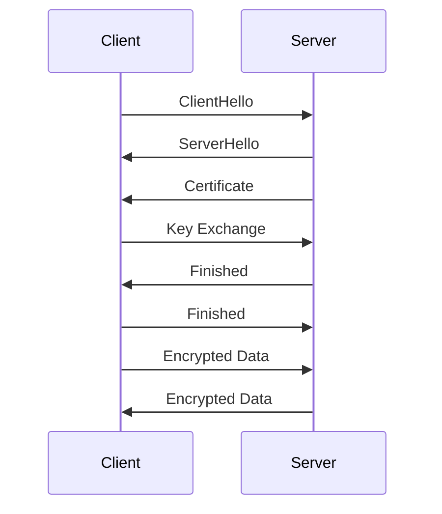

## 20.5 Secure Communication with SSL/TLS (`ssl` Module)

In today's digital landscape, securing communication channels is paramount. Erlang, with its robust concurrency and fault-tolerant capabilities, provides the `ssl` module to facilitate secure communication using SSL/TLS protocols. This section will guide you through the essentials of setting up SSL/TLS connections in Erlang, managing certificates, and ensuring secure data transmission.

### Introduction to the `ssl` Module

The `ssl` module in Erlang is a comprehensive library designed to implement secure communication using the Secure Sockets Layer (SSL) and Transport Layer Security (TLS) protocols. These protocols are essential for encrypting data transmitted over networks, ensuring privacy and data integrity.

#### Key Features of the `ssl` Module

- **Encryption**: Protects data from eavesdropping.
- **Authentication**: Verifies the identity of the communicating parties.
- **Data Integrity**: Ensures data has not been altered during transmission.

For more detailed documentation, you can refer to the [official Erlang `ssl` module documentation](http://erlang.org/doc/man/ssl.html).

### Setting Up SSL/TLS Connections

To establish secure connections using the `ssl` module, you need to configure both the client and server sides. Let's explore how to set up these connections.

#### Setting Up an SSL/TLS Server

To create an SSL/TLS server, you need to generate a private key and a certificate. These are used to authenticate the server to clients.

```erlang
% Generate a self-signed certificate and private key
openssl req -newkey rsa:2048 -nodes -keyout server.key -x509 -days 365 -out server.crt
```

Once you have your certificate and key, you can set up the server:

```erlang
-module(ssl_server).
-export([start/0]).

start() ->
    {ok, ListenSocket} = ssl:listen(8443, [
        {certfile, "server.crt"},
        {keyfile, "server.key"},
        {reuseaddr, true},
        {active, false}
    ]),
    accept_connections(ListenSocket).

accept_connections(ListenSocket) ->
    {ok, Socket} = ssl:transport_accept(ListenSocket),
    ssl:ssl_accept(Socket),
    spawn(fun() -> handle_connection(Socket) end),
    accept_connections(ListenSocket).

handle_connection(Socket) ->
    {ok, Data} = ssl:recv(Socket, 0),
    io:format("Received: ~p~n", [Data]),
    ssl:send(Socket, "Hello, secure world!"),
    ssl:close(Socket).
```

#### Setting Up an SSL/TLS Client

The client needs to trust the server's certificate. You can achieve this by using a trusted certificate authority (CA) or by adding the server's certificate to the client's trusted store.

```erlang
-module(ssl_client).
-export([connect/0]).

connect() ->
    {ok, Socket} = ssl:connect("localhost", 8443, [
        {verify, verify_peer},
        {cacertfile, "server.crt"},
        {active, false}
    ]),
    ssl:send(Socket, "Hello, server!"),
    {ok, Data} = ssl:recv(Socket, 0),
    io:format("Received: ~p~n", [Data]),
    ssl:close(Socket).
```

### Certificate Management and Verification

Managing certificates is crucial for maintaining secure communications. Certificates are used to verify the identity of the parties involved in the communication.

#### Generating Certificates

You can generate certificates using tools like OpenSSL. It's important to ensure that your certificates are signed by a trusted CA.

#### Verifying Certificates

The `ssl` module provides options to verify certificates. The `verify` option can be set to `verify_peer` to enforce certificate verification.

```erlang
{verify, verify_peer}
```

This option ensures that the client verifies the server's certificate against a list of trusted CAs.

### Preventing Man-in-the-Middle Attacks

Man-in-the-middle (MITM) attacks occur when an attacker intercepts communication between two parties. To prevent these attacks, it's essential to:

- **Use Strong Encryption**: Ensure that your SSL/TLS configuration uses strong encryption algorithms.
- **Verify Certificates**: Always verify the certificates of the communicating parties.
- **Keep Software Updated**: Regularly update your Erlang installation and the `ssl` module to protect against known vulnerabilities.

### Staying Updated on SSL/TLS Vulnerabilities

SSL/TLS protocols are continually evolving to address new security threats. It's crucial to stay informed about the latest vulnerabilities and patches. Regularly check resources like the [OpenSSL Security Advisory](https://www.openssl.org/news/secadv/) for updates.

### Try It Yourself

To deepen your understanding, try modifying the server and client code examples:

- **Change the Port**: Modify the port number and observe how the connection is affected.
- **Use Different Certificates**: Generate new certificates and test the connection.
- **Implement Mutual Authentication**: Configure both the server and client to verify each other's certificates.

### Visualizing SSL/TLS Communication

To better understand the flow of SSL/TLS communication, let's visualize the process using a sequence diagram.



This diagram illustrates the handshake process between a client and a server, highlighting the exchange of messages that establish a secure connection.

### Key Takeaways

- **SSL/TLS**: Essential for securing communications in Erlang applications.
- **`ssl` Module**: Provides robust tools for implementing SSL/TLS.
- **Certificate Management**: Crucial for verifying identities and preventing MITM attacks.
- **Stay Informed**: Regularly update your knowledge and software to protect against vulnerabilities.

### References and Further Reading

- [Erlang `ssl` Module Documentation](http://erlang.org/doc/man/ssl.html)
- [OpenSSL Security Advisory](https://www.openssl.org/news/secadv/)
- [MDN Web Docs on SSL/TLS](https://developer.mozilla.org/en-US/docs/Web/Security/Transport_Layer_Security)

## Quiz: Secure Communication with SSL/TLS (`ssl` Module)



### What is the primary purpose of the `ssl` module in Erlang?

- [x] To implement secure communication using SSL/TLS protocols
- [ ] To manage database connections
- [ ] To handle file I/O operations
- [ ] To perform mathematical calculations

> **Explanation:** The `ssl` module is specifically designed to facilitate secure communication using SSL/TLS protocols.

### Which option in the `ssl` module is used to enforce certificate verification?

- [x] {verify, verify_peer}
- [ ] {active, true}
- [ ] {reuseaddr, true}
- [ ] {certfile, "server.crt"}

> **Explanation:** The `{verify, verify_peer}` option ensures that the client verifies the server's certificate against a list of trusted CAs.

### What is a common tool used to generate SSL/TLS certificates?

- [x] OpenSSL
- [ ] Git
- [ ] Docker
- [ ] Node.js

> **Explanation:** OpenSSL is a widely used tool for generating SSL/TLS certificates.

### What type of attack does SSL/TLS help prevent?

- [x] Man-in-the-middle (MITM) attacks
- [ ] SQL injection
- [ ] Cross-site scripting (XSS)
- [ ] Buffer overflow

> **Explanation:** SSL/TLS protocols help prevent MITM attacks by encrypting data and verifying the identity of the communicating parties.

### How can you ensure that your SSL/TLS configuration uses strong encryption algorithms?

- [x] By configuring the `ssl` module to use strong ciphers
- [ ] By using weak passwords
- [ ] By disabling encryption
- [ ] By using outdated software

> **Explanation:** Configuring the `ssl` module to use strong ciphers ensures that your SSL/TLS configuration uses strong encryption algorithms.

### What should you do to stay informed about the latest SSL/TLS vulnerabilities?

- [x] Regularly check resources like the OpenSSL Security Advisory
- [ ] Ignore security updates
- [ ] Disable SSL/TLS
- [ ] Use outdated certificates

> **Explanation:** Regularly checking resources like the OpenSSL Security Advisory helps you stay informed about the latest SSL/TLS vulnerabilities.

### What is the role of a certificate in SSL/TLS communication?

- [x] To verify the identity of the communicating parties
- [ ] To store data
- [ ] To perform calculations
- [ ] To manage memory

> **Explanation:** Certificates are used in SSL/TLS communication to verify the identity of the communicating parties.

### What is a key feature of the `ssl` module?

- [x] Encryption
- [ ] File management
- [ ] Image processing
- [ ] Audio playback

> **Explanation:** Encryption is a key feature of the `ssl` module, protecting data from eavesdropping.

### What is the first step in the SSL/TLS handshake process?

- [x] ClientHello
- [ ] ServerHello
- [ ] Certificate
- [ ] Key Exchange

> **Explanation:** The SSL/TLS handshake process begins with the ClientHello message.

### True or False: The `ssl` module can be used to perform mathematical calculations.

- [ ] True
- [x] False

> **Explanation:** The `ssl` module is not designed for mathematical calculations; it is used for secure communication.



Remember, mastering SSL/TLS in Erlang is just the beginning. As you continue to explore, you'll build more secure and robust applications. Keep experimenting, stay curious, and enjoy the journey!
