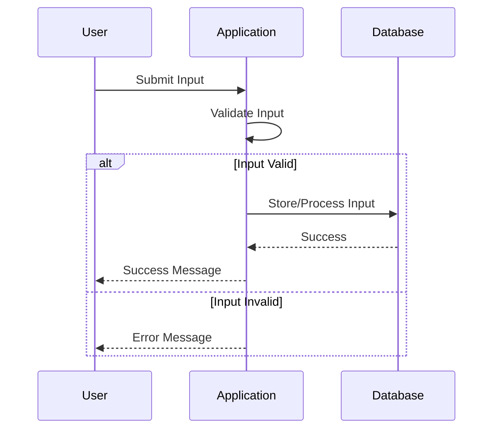

## 20.6 Input Validation and Sanitization

In the realm of software development, ensuring the security of applications is paramount. One of the most critical aspects of security is input validation and sanitization. This section delves into the importance of these practices in Erlang, a language renowned for its concurrency and fault tolerance, yet equally susceptible to input-based attacks if not properly safeguarded.

### Understanding Input-Based Attacks

Before we dive into the techniques and best practices for input validation and sanitization, it's essential to understand the common types of input-based attacks that can compromise an application:

1. **SQL Injection**: This attack occurs when an attacker is able to execute arbitrary SQL code on a database by manipulating input fields. This can lead to unauthorized data access and manipulation.

2. **Cross-Site Scripting (XSS)**: XSS attacks involve injecting malicious scripts into web pages viewed by other users. This can result in data theft, session hijacking, and other malicious activities.

3. **Command Injection**: Similar to SQL injection, command injection allows attackers to execute arbitrary commands on the host operating system via vulnerable applications.

4. **Buffer Overflow**: This occurs when an application writes more data to a buffer than it can hold, potentially leading to arbitrary code execution.

### Input Validation Techniques

Input validation is the first line of defense against input-based attacks. It involves verifying that the input received by an application is both expected and safe. Here are some techniques to effectively validate input in Erlang:

#### 1. **Type Checking**

Erlang's dynamic typing can be leveraged to perform type checks on input data. Use pattern matching to ensure that the data conforms to expected types.

```erlang
validate_integer(Input) when is_integer(Input) ->
    {ok, Input};
validate_integer(_) ->
    {error, "Invalid input: expected an integer"}.
```

#### 2. **Range Checking**

For numeric inputs, ensure that the values fall within an acceptable range.

```erlang
validate_age(Age) when is_integer(Age), Age >= 0, Age =< 120 ->
    {ok, Age};
validate_age(_) ->
    {error, "Invalid age: must be between 0 and 120"}.
```

#### 3. **Format Validation**

Use regular expressions to validate the format of strings, such as email addresses or phone numbers.

```erlang
validate_email(Email) ->
    case re:run(Email, "^[A-Za-z0-9._%+-]+@[A-Za-z0-9.-]+\.[A-Za-z]{2,}$") of
        {match, _} -> {ok, Email};
        nomatch -> {error, "Invalid email format"}
    end.
```

#### 4. **Whitelist and Blacklist Validation**

Define acceptable or unacceptable input values using whitelists and blacklists.

```erlang
validate_country(Country) ->
    Whitelist = ["USA", "Canada", "UK", "Australia"],
    case lists:member(Country, Whitelist) of
        true -> {ok, Country};
        false -> {error, "Country not allowed"}
    end.
```

### Input Sanitization Techniques

Sanitization involves cleaning input to remove or neutralize harmful elements. This is particularly important for inputs that will be rendered in a web page or executed as code.

#### 1. **Escaping Special Characters**

When dealing with HTML or SQL, escape special characters to prevent injection attacks.

```erlang
escape_html(Input) ->
    Input
    |> string:replace("&", "&amp;", all)
    |> string:replace("<", "&lt;", all)
    |> string:replace(">", "&gt;", all)
    |> string:replace("\"", "&quot;", all)
    |> string:replace("'", "&#x27;", all).
```

#### 2. **Using Libraries for Sanitization**

Leverage existing libraries to handle complex sanitization tasks. For example, the `xmerl` library can be used to sanitize XML inputs.

```erlang
sanitize_xml(XmlString) ->
    {ok, ParsedXml} = xmerl_scan:string(XmlString),
    xmerl:export_simple([ParsedXml], xmerl_xml).
```

### Best Practices for Input Validation and Sanitization

1. **Validate Early and Often**: Perform validation as soon as input is received, and at every layer of the application where input is processed.

2. **Fail Securely**: In case of validation failure, ensure that the application fails securely by providing minimal information to the user and logging detailed errors for developers.

3. **Use a Defensive Programming Approach**: Assume that all input is potentially malicious and validate accordingly.

4. **Provide User Feedback**: Offer clear and concise feedback to users when input validation fails, without revealing sensitive information.

5. **Regularly Update Libraries**: Keep sanitization libraries up to date to benefit from the latest security patches and improvements.

### Defensive Programming in Erlang

Defensive programming is a mindset that anticipates potential errors and vulnerabilities. In Erlang, this involves leveraging its robust error-handling capabilities and the "let it crash" philosophy to build resilient applications.

#### Error Handling with Pattern Matching

Use pattern matching to handle errors gracefully and provide meaningful feedback.

```erlang
process_input(Input) ->
    case validate_integer(Input) of
        {ok, ValidInput} -> process_valid_input(ValidInput);
        {error, Reason} -> handle_error(Reason)
    end.

handle_error(Reason) ->
    io:format("Error: ~s~n", [Reason]).
```

#### The "Let It Crash" Philosophy

Erlang's "let it crash" philosophy encourages developers to focus on building robust supervision trees that can recover from failures, rather than trying to prevent every possible error.

```erlang
start_link() ->
    spawn_link(fun() -> init() end).

init() ->
    %% Simulate a process that might crash
    receive
        {process, Data} ->
            case validate_data(Data) of
                {ok, ValidData} -> process_data(ValidData);
                {error, _} -> exit({error, invalid_data})
            end
    end.
```

### Visualizing Input Validation and Sanitization

To better understand the flow of input validation and sanitization, consider the following sequence diagram:



### References and Further Reading

- [OWASP Input Validation Cheat Sheet](https://cheatsheetseries.owasp.org/cheatsheets/Input_Validation_Cheat_Sheet.html)
- [Erlang Documentation](https://www.erlang.org/docs)
- [Regular Expressions in Erlang](https://erlang.org/doc/man/re.html)

### Knowledge Check

- Why is input validation crucial in preventing SQL injection attacks?
- How does Erlang's pattern matching aid in input validation?
- What are the benefits of using a library for input sanitization?

### Embrace the Journey

Remember, input validation and sanitization are just the beginning of building secure applications. As you continue to develop in Erlang, keep exploring and refining your security practices. Stay curious, and enjoy the journey of creating robust and secure software!

## Quiz: Input Validation and Sanitization



### What is the primary purpose of input validation?

- [x] To ensure that input data is both expected and safe
- [ ] To improve application performance
- [ ] To enhance user interface design
- [ ] To reduce code complexity

> **Explanation:** Input validation is crucial for ensuring that the data received by an application is both expected and safe, preventing potential security vulnerabilities.

### Which of the following is a common input-based attack?

- [x] SQL Injection
- [ ] Buffer Underflow
- [ ] Memory Leak
- [ ] Deadlock

> **Explanation:** SQL Injection is a common input-based attack where an attacker can execute arbitrary SQL code on a database.

### How can Erlang's pattern matching be used in input validation?

- [x] By ensuring data conforms to expected types
- [ ] By optimizing code execution
- [ ] By improving concurrency
- [ ] By reducing memory usage

> **Explanation:** Erlang's pattern matching allows developers to ensure that input data conforms to expected types, aiding in input validation.

### What is the "let it crash" philosophy in Erlang?

- [x] Encouraging robust supervision trees to recover from failures
- [ ] Preventing every possible error
- [ ] Avoiding the use of error handling
- [ ] Ensuring zero downtime

> **Explanation:** The "let it crash" philosophy encourages developers to focus on building robust supervision trees that can recover from failures.

### Which library can be used for XML sanitization in Erlang?

- [x] xmerl
- [ ] cowboy
- [ ] rebar3
- [ ] dialyzer

> **Explanation:** The `xmerl` library can be used for XML sanitization in Erlang.

### What is a key benefit of using regular expressions for input validation?

- [x] Validating the format of strings
- [ ] Improving application speed
- [ ] Enhancing code readability
- [ ] Reducing code size

> **Explanation:** Regular expressions are useful for validating the format of strings, such as email addresses or phone numbers.

### Why is it important to escape special characters in input data?

- [x] To prevent injection attacks
- [ ] To improve data storage efficiency
- [ ] To enhance user experience
- [ ] To reduce network latency

> **Explanation:** Escaping special characters is important to prevent injection attacks, such as SQL injection and XSS.

### What should be done when input validation fails?

- [x] Provide minimal information to the user and log detailed errors
- [ ] Display detailed error messages to the user
- [ ] Ignore the error and continue processing
- [ ] Automatically correct the input

> **Explanation:** When input validation fails, it's important to provide minimal information to the user and log detailed errors for developers.

### Which of the following is a best practice for input validation?

- [x] Validate early and often
- [ ] Validate only at the database level
- [ ] Validate only at the user interface level
- [ ] Validate only when errors occur

> **Explanation:** A best practice for input validation is to validate early and often, at every layer of the application where input is processed.

### True or False: Input validation and sanitization are only necessary for web applications.

- [ ] True
- [x] False

> **Explanation:** Input validation and sanitization are necessary for all types of applications, not just web applications, to ensure security and data integrity.


