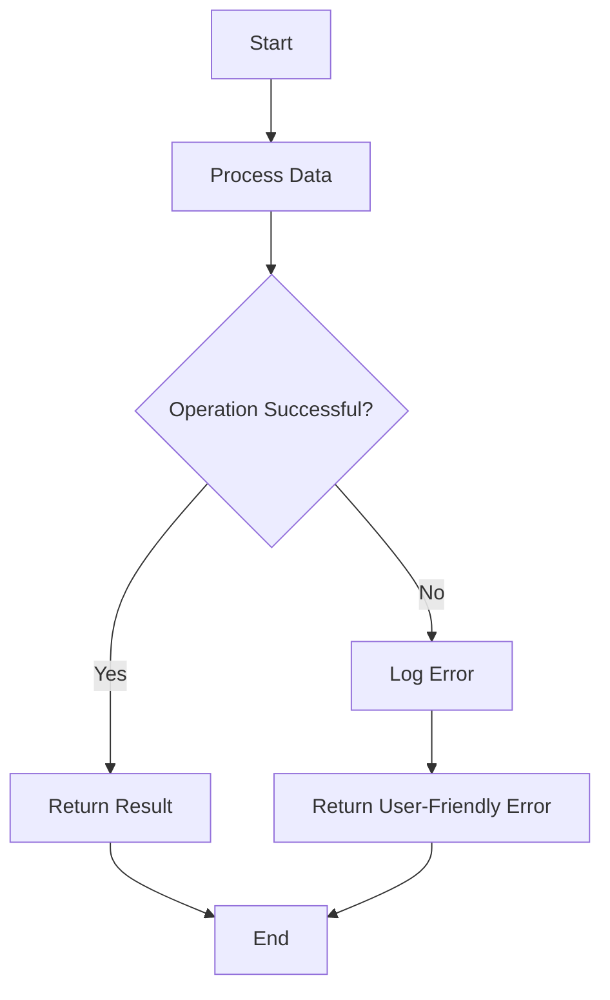

## 20.7 Error Handling and Avoiding Information Leakage

In the realm of software development, error handling is a critical aspect that ensures the robustness and reliability of applications. In Erlang, a language renowned for its concurrency and fault tolerance, error handling takes on an even more significant role. However, improper error handling can lead to information leakage, which can be exploited by malicious actors. This section delves into secure error handling practices in Erlang, emphasizing the prevention of information leakage.

### Understanding the Risks of Verbose Error Messages

Verbose error messages can inadvertently reveal sensitive information about an application's internal workings. This information can be leveraged by attackers to exploit vulnerabilities. For instance, error messages that include stack traces, database queries, or configuration details can provide insights into the application's architecture and potential weak points.

#### Example of a Verbose Error Message

```erlang
% A hypothetical error message that reveals too much information
{error, {badmatch, {ok, Result}}, [{module, function, 3}, {other_module, other_function, 2}]}
```

In this example, the error message exposes the function call stack, which can be used by an attacker to understand the application's flow and identify potential vulnerabilities.

### Strategies for Secure Error Logging

To mitigate the risks associated with verbose error messages, it is essential to implement secure error logging practices. Here are some strategies to consider:

1. **Sanitize Error Messages**: Ensure that error messages do not contain sensitive information such as passwords, API keys, or internal IP addresses. Use generic messages that convey the error without revealing specifics.

2. **Use Log Levels Appropriately**: Implement different log levels (e.g., debug, info, warning, error) and ensure that sensitive information is logged only at higher levels, which are not exposed in production environments.

3. **Centralized Logging**: Use centralized logging solutions to aggregate logs securely. This approach allows for better monitoring and analysis while ensuring that logs are stored securely.

4. **Access Control**: Restrict access to logs to authorized personnel only. Implement role-based access control (RBAC) to ensure that only those who need access to logs can view them.

5. **Regular Audits**: Conduct regular audits of logs to identify any potential information leakage and ensure compliance with security policies.

### User-Facing Error Messages vs. Internal Logs

There is a distinct difference between user-facing error messages and internal logs. User-facing messages should be concise and user-friendly, providing just enough information to inform the user of the issue without exposing internal details. Internal logs, on the other hand, can be more detailed but must be secured to prevent unauthorized access.

#### Designing User-Facing Error Messages

- **Be Vague but Helpful**: Provide messages that indicate an error occurred without revealing specifics. For example, "An unexpected error occurred. Please try again later."

- **Offer Next Steps**: Suggest actions the user can take, such as retrying the operation or contacting support.

- **Avoid Technical Jargon**: Use language that is easy for non-technical users to understand.

#### Example of a User-Facing Error Message

```erlang
% A simple user-facing error message
{error, "An unexpected error occurred. Please contact support if the issue persists."}
```

### Balancing Feedback and Security

Striking the right balance between providing helpful feedback and maintaining security is crucial. Here are some tips to achieve this balance:

1. **Contextual Error Handling**: Tailor error messages based on the context in which the error occurs. For instance, provide more detailed messages in a development environment while keeping them vague in production.

2. **Use Error Codes**: Instead of detailed messages, use error codes that can be referenced in documentation or support channels for more information.

3. **Implement a Feedback Loop**: Allow users to report errors and provide feedback. This can help improve error handling and user experience while maintaining security.

4. **Educate Users**: Provide documentation or support resources to help users understand common errors and how to resolve them.

### Code Example: Secure Error Handling in Erlang

Let's explore a code example that demonstrates secure error handling in Erlang:

```erlang
-module(error_handling_example).
-export([process_data/1]).

process_data(Data) ->
    try
        % Simulate data processing
        Result = perform_operation(Data),
        {ok, Result}
    catch
        % Catch specific errors and log them securely
        error:Reason ->
            log_error(Reason),
            {error, "An unexpected error occurred. Please try again later."}
    end.

perform_operation(Data) ->
    % Simulate an operation that may fail
    case Data of
        valid_data -> {ok, processed_data};
        _ -> erlang:error(invalid_data)
    end.

log_error(Reason) ->
    % Log the error securely without exposing sensitive information
    io:format("Error occurred: ~p~n", [Reason]).
```

In this example, the `process_data/1` function processes data and handles errors securely. The `log_error/1` function logs the error reason without exposing sensitive information to the user.

### Visualizing Error Handling Flow

To better understand the flow of error handling in Erlang, let's visualize the process using a Mermaid.js flowchart:



**Figure 1**: Error Handling Flow in Erlang

This flowchart illustrates the process of handling errors in Erlang, from processing data to logging errors and returning user-friendly messages.

### Knowledge Check

Before we move on, let's reinforce what we've learned with a few questions:

- Why is it important to avoid verbose error messages in production environments?
- What are some strategies for logging errors securely?
- How can you balance providing helpful feedback to users while maintaining security?

### Try It Yourself

Experiment with the code example provided by modifying the `perform_operation/1` function to simulate different types of errors. Observe how the error handling mechanism responds to these changes.

### References and Further Reading

For more information on secure error handling practices, consider exploring the following resources:

- [OWASP Secure Coding Practices](https://owasp.org/www-project-secure-coding-practices/)
- [Erlang Error Handling Documentation](https://erlang.org/doc/reference_manual/errors.html)
- [Logging Best Practices](https://www.loggly.com/ultimate-guide/centralized-logging/)

### Conclusion

Error handling is a vital component of building secure and reliable applications. By implementing secure error handling practices, we can prevent information leakage and protect our applications from potential threats. Remember, the key is to provide enough information to be helpful without exposing sensitive details.

## Quiz: Error Handling and Avoiding Information Leakage



### Why is it important to avoid verbose error messages in production environments?

- [x] They can reveal sensitive information to attackers.
- [ ] They make debugging more difficult.
- [ ] They slow down application performance.
- [ ] They increase the size of log files.

> **Explanation:** Verbose error messages can expose sensitive information about the application's internal workings, which can be exploited by attackers.

### What is a recommended practice for logging errors securely?

- [x] Sanitize error messages to remove sensitive information.
- [ ] Log all errors at the debug level.
- [ ] Include stack traces in user-facing error messages.
- [ ] Allow all users to access logs.

> **Explanation:** Sanitizing error messages ensures that sensitive information is not exposed in logs.

### How should user-facing error messages be designed?

- [x] Concise and user-friendly.
- [ ] Detailed and technical.
- [ ] Include internal IP addresses.
- [ ] Contain stack traces.

> **Explanation:** User-facing error messages should be concise and user-friendly, providing just enough information without revealing internal details.

### What is the purpose of using error codes in error handling?

- [x] To provide a reference for more information in documentation.
- [ ] To confuse attackers.
- [ ] To increase the complexity of error handling.
- [ ] To replace error messages entirely.

> **Explanation:** Error codes can be used as references in documentation or support channels for more information.

### What is a benefit of centralized logging?

- [x] Better monitoring and analysis of logs.
- [ ] Increased risk of information leakage.
- [ ] More complex log management.
- [ ] Slower log retrieval.

> **Explanation:** Centralized logging allows for better monitoring and analysis while ensuring logs are stored securely.

### How can access to logs be restricted?

- [x] Implement role-based access control (RBAC).
- [ ] Allow all users to view logs.
- [ ] Store logs in plain text files.
- [ ] Use a single password for log access.

> **Explanation:** Role-based access control (RBAC) ensures that only authorized personnel can access logs.

### What should be included in user-facing error messages?

- [x] Suggestions for next steps.
- [ ] Internal IP addresses.
- [ ] Detailed stack traces.
- [ ] Database queries.

> **Explanation:** User-facing error messages should include suggestions for next steps without revealing internal details.

### Why is it important to conduct regular audits of logs?

- [x] To identify potential information leakage.
- [ ] To increase the size of log files.
- [ ] To confuse attackers.
- [ ] To slow down application performance.

> **Explanation:** Regular audits help identify potential information leakage and ensure compliance with security policies.

### What is the role of the `log_error/1` function in the code example?

- [x] To log errors securely without exposing sensitive information.
- [ ] To display error messages to users.
- [ ] To perform data processing.
- [ ] To handle user input.

> **Explanation:** The `log_error/1` function logs errors securely without exposing sensitive information to users.

### True or False: User-facing error messages should include technical jargon.

- [ ] True
- [x] False

> **Explanation:** User-facing error messages should avoid technical jargon and use language that is easy for non-technical users to understand.



Remember, secure error handling is a journey, not a destination. Keep refining your practices, stay informed about the latest security trends, and continue to build robust and secure applications.
