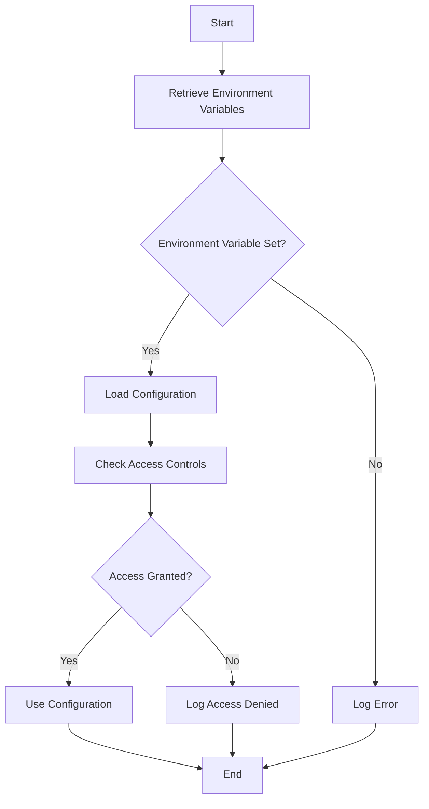

## 20.8 Secure Configuration Management

In today's digital landscape, secure configuration management is paramount for protecting sensitive information and ensuring the integrity of applications. This section delves into the best practices and strategies for managing configurations securely in Erlang applications. We will explore the risks associated with hardcoding credentials, the use of environment variables and secure vaults, and the importance of auditing and access controls.

### Understanding the Risks of Hardcoding Credentials

Hardcoding credentials or secrets within your codebase is a significant security risk. It exposes sensitive information to anyone with access to the code, including malicious actors. This practice can lead to unauthorized access, data breaches, and compliance violations.

#### Key Risks of Hardcoding:

- **Exposure to Version Control**: Hardcoded secrets can be inadvertently shared through version control systems, making them accessible to anyone with repository access.
- **Difficulty in Rotation**: Changing hardcoded credentials requires code modifications and redeployment, increasing the risk of errors and downtime.
- **Environment-Specific Challenges**: Hardcoded values do not adapt well to different environments (development, testing, production), leading to inconsistencies and potential security gaps.

### Secure Configuration Management Strategies

To mitigate the risks associated with hardcoding, it's essential to adopt secure configuration management practices. These strategies ensure that sensitive information is protected and configurations are managed efficiently across various environments.

#### Using Environment Variables

Environment variables are a widely used method for managing configuration settings securely. They allow you to externalize configuration data from your codebase, making it easier to manage and secure.

**Benefits of Environment Variables:**

- **Separation of Concerns**: Keeps configuration data separate from the application code, enhancing security and maintainability.
- **Flexibility**: Easily change configuration values without modifying the code, facilitating seamless transitions between environments.
- **Security**: Environment variables can be managed securely by the operating system, reducing the risk of exposure.

**Example: Using Environment Variables in Erlang**

```erlang
-module(config_example).
-export([get_db_password/0]).

get_db_password() ->
    case os:getenv("DB_PASSWORD") of
        undefined -> 
            error_logger:error_msg("DB_PASSWORD environment variable not set."),
            {error, "DB_PASSWORD not set"};
        Password -> 
            {ok, Password}
    end.
```

In this example, the `get_db_password/0` function retrieves the database password from an environment variable. If the variable is not set, it logs an error message.

#### Secure Vaults and Secrets Management

For more robust security, consider using secure vaults or secrets management tools. These tools provide a centralized, secure way to manage sensitive information, such as API keys, passwords, and certificates.

**Popular Tools for Secrets Management:**

- **HashiCorp Vault**: Offers secure storage, access control, and audit logging for secrets.
- **AWS Secrets Manager**: Provides secure storage and automatic rotation of secrets for AWS services.
- **Azure Key Vault**: Manages keys, secrets, and certificates securely in Azure.

**Integrating HashiCorp Vault with Erlang**

To integrate HashiCorp Vault with an Erlang application, you can use the `vault` Erlang client library. This library allows you to authenticate and retrieve secrets from Vault programmatically.

```erlang
-module(vault_example).
-export([get_secret/1]).

get_secret(SecretPath) ->
    {ok, Token} = vault:auth("my-vault-token"),
    case vault:read(SecretPath, Token) of
        {ok, SecretData} -> 
            {ok, maps:get("value", SecretData)};
        {error, Reason} -> 
            {error, Reason}
    end.
```

In this example, the `get_secret/1` function authenticates with Vault using a token and retrieves a secret from the specified path.

### Managing Configuration Across Environments

Managing configurations across different environments (development, testing, production) is crucial for maintaining consistency and security. Each environment may have unique configuration requirements, and it's essential to handle these variations effectively.

#### Strategies for Environment-Specific Configurations

1. **Environment-Specific Files**: Use separate configuration files for each environment. Load the appropriate file based on the environment the application is running in.

2. **Configuration Management Tools**: Utilize tools like Ansible, Chef, or Puppet to automate the deployment and management of configuration files across environments.

3. **Environment Variables**: Leverage environment variables to override default configuration values for specific environments.

**Example: Loading Environment-Specific Configurations**

```erlang
-module(env_config).
-export([load_config/0]).

load_config() ->
    Env = os:getenv("APP_ENV", "development"),
    ConfigFile = filename:join(["config", Env ++ ".config"]),
    case file:consult(ConfigFile) of
        {ok, Config} -> 
            {ok, Config};
        {error, Reason} -> 
            {error, Reason}
    end.
```

In this example, the `load_config/0` function loads a configuration file based on the `APP_ENV` environment variable. If the variable is not set, it defaults to the development configuration.

### Importance of Auditing and Access Controls

Auditing and access controls are critical components of secure configuration management. They help ensure that only authorized individuals have access to sensitive information and provide a trail of actions for accountability.

#### Implementing Auditing and Access Controls

- **Role-Based Access Control (RBAC)**: Define roles and permissions to restrict access to configuration data based on user roles.
- **Audit Logging**: Maintain logs of access and changes to configuration data for monitoring and compliance purposes.
- **Regular Reviews**: Conduct periodic reviews of access permissions and audit logs to identify and address potential security issues.

**Example: Implementing RBAC in Erlang**

```erlang
-module(rbac_example).
-export([check_access/2]).

check_access(UserRole, Resource) ->
    case {UserRole, Resource} of
        {"admin", _} -> 
            {ok, "Access granted"};
        {"user", "read"} -> 
            {ok, "Access granted"};
        _ -> 
            {error, "Access denied"}
    end.
```

In this example, the `check_access/2` function checks if a user role has access to a specific resource. Admins have access to all resources, while regular users have read-only access.

### Visualizing Secure Configuration Management

To better understand secure configuration management, let's visualize the process using a flowchart. This diagram illustrates the steps involved in managing configurations securely.



**Figure 1: Secure Configuration Management Flowchart**

This flowchart demonstrates the process of retrieving environment variables, checking access controls, and using the configuration if access is granted.

### Knowledge Check

Before we conclude, let's reinforce what we've learned with a few questions:

- Why is hardcoding credentials a security risk?
- How can environment variables enhance configuration security?
- What are the benefits of using a secure vault for secrets management?
- How can you manage configurations across different environments?
- Why are auditing and access controls important in configuration management?

### Embrace the Journey

Secure configuration management is a critical aspect of building robust and secure applications. By adopting best practices and leveraging tools like environment variables and secure vaults, you can protect sensitive information and ensure consistency across environments. Remember, this is just the beginning. As you continue your journey, keep exploring new tools and techniques to enhance your application's security.

### Quiz: Secure Configuration Management



### Why is hardcoding credentials a security risk?

- [x] It exposes sensitive information to anyone with access to the code.
- [ ] It makes the code run faster.
- [ ] It improves code readability.
- [ ] It simplifies deployment.

> **Explanation:** Hardcoding credentials exposes sensitive information, making it accessible to anyone with access to the codebase, which is a significant security risk.

### What is a benefit of using environment variables for configuration?

- [x] They separate configuration data from the application code.
- [ ] They make the code harder to read.
- [ ] They increase the application's memory usage.
- [ ] They require more complex deployment processes.

> **Explanation:** Environment variables separate configuration data from the application code, enhancing security and maintainability.

### Which tool is commonly used for secrets management?

- [x] HashiCorp Vault
- [ ] GitHub
- [ ] Docker
- [ ] Jenkins

> **Explanation:** HashiCorp Vault is a popular tool for managing secrets securely.

### How can you manage configurations across different environments?

- [x] Use environment-specific configuration files.
- [ ] Hardcode values for each environment.
- [ ] Use the same configuration for all environments.
- [ ] Avoid using configuration files.

> **Explanation:** Using environment-specific configuration files allows you to manage configurations tailored to each environment's needs.

### What is the purpose of audit logging in configuration management?

- [x] To maintain logs of access and changes for monitoring and compliance.
- [ ] To increase application performance.
- [ ] To simplify code structure.
- [ ] To reduce memory usage.

> **Explanation:** Audit logging helps maintain records of access and changes to configuration data, which is crucial for monitoring and compliance.

### What is a key feature of role-based access control (RBAC)?

- [x] It restricts access based on user roles.
- [ ] It allows unrestricted access to all users.
- [ ] It simplifies code deployment.
- [ ] It increases application speed.

> **Explanation:** RBAC restricts access to resources based on user roles, enhancing security.

### Why is it important to conduct regular reviews of access permissions?

- [x] To identify and address potential security issues.
- [ ] To increase application speed.
- [ ] To reduce code complexity.
- [ ] To simplify deployment processes.

> **Explanation:** Regular reviews help identify and address potential security issues by ensuring that access permissions are appropriate.

### What is a benefit of using secure vaults for secrets management?

- [x] They provide centralized, secure storage for sensitive information.
- [ ] They make the code harder to read.
- [ ] They increase application memory usage.
- [ ] They require more complex deployment processes.

> **Explanation:** Secure vaults provide centralized, secure storage for sensitive information, reducing the risk of exposure.

### What is the role of access controls in configuration management?

- [x] To ensure only authorized individuals have access to sensitive information.
- [ ] To increase application speed.
- [ ] To simplify code structure.
- [ ] To reduce memory usage.

> **Explanation:** Access controls ensure that only authorized individuals have access to sensitive information, enhancing security.

### True or False: Hardcoding credentials simplifies deployment.

- [ ] True
- [x] False

> **Explanation:** Hardcoding credentials does not simplify deployment; it increases security risks and complicates credential rotation.



By following these secure configuration management practices, you can significantly enhance the security and reliability of your Erlang applications. Keep experimenting, stay curious, and enjoy the journey of building secure and robust applications!
