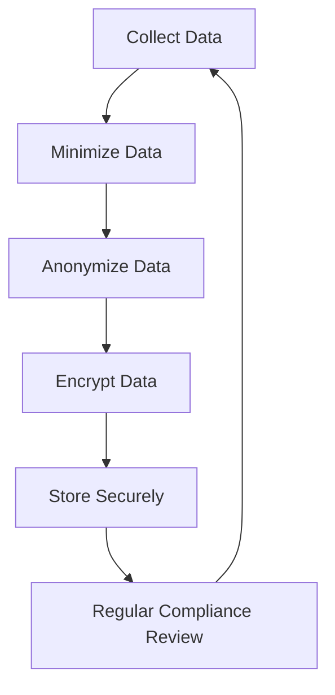

## 20.9 Handling Sensitive Information and Compliance Requirements

In today's digital landscape, handling sensitive information securely is paramount. Whether you're dealing with personal data, financial records, or health information, ensuring compliance with regulations like the General Data Protection Regulation (GDPR) and the Health Insurance Portability and Accountability Act (HIPAA) is crucial. In this section, we'll explore how to manage sensitive data in Erlang applications, focusing on data minimization, anonymization, encryption, and compliance strategies.

### Understanding Sensitive Data

Sensitive data refers to information that must be protected from unauthorized access to safeguard the privacy or security of an individual or organization. This includes:

- **Personal Information**: Names, addresses, phone numbers, and other identifiers.
- **Financial Data**: Credit card numbers, bank account details, and transaction records.
- **Health Information**: Medical records, prescriptions, and health insurance details.

#### Types of Sensitive Data

1. **Personally Identifiable Information (PII)**: Data that can be used to identify an individual, such as Social Security numbers, email addresses, and phone numbers.
2. **Protected Health Information (PHI)**: Health-related data protected under HIPAA, including medical histories and test results.
3. **Financial Information**: Includes credit card numbers, bank account details, and financial transaction records.

### Data Minimization and Anonymization

Data minimization and anonymization are key strategies for reducing the risk associated with handling sensitive information.

#### Data Minimization

Data minimization involves collecting only the data necessary for a specific purpose. This reduces the potential impact of a data breach and simplifies compliance efforts.

- **Principle**: Collect only what you need.
- **Implementation**: Regularly review data collection practices and eliminate unnecessary data.

#### Anonymization

Anonymization is the process of removing personally identifiable information from data sets, making it impossible to identify individuals.

- **Techniques**: Use hashing, tokenization, or aggregation to anonymize data.
- **Considerations**: Ensure that anonymized data cannot be re-identified.

### Compliance with Regulations

Compliance with data protection regulations is essential for organizations handling sensitive information. Let's explore some key regulations and how to comply with them.

#### General Data Protection Regulation (GDPR)

GDPR is a comprehensive data protection regulation in the European Union that governs the processing of personal data.

- **Key Requirements**:
  - Obtain explicit consent for data collection.
  - Implement data protection by design and by default.
  - Ensure the right to access, rectify, and erase data.
  - Report data breaches within 72 hours.

- **Erlang Implementation**:
  - Use Erlang's robust pattern matching to validate consent.
  - Implement access controls using Erlang processes.

#### Health Insurance Portability and Accountability Act (HIPAA)

HIPAA sets standards for protecting sensitive patient information in the United States.

- **Key Requirements**:
  - Ensure confidentiality, integrity, and availability of PHI.
  - Protect against unauthorized access.
  - Conduct regular risk assessments.

- **Erlang Implementation**:
  - Use Erlang's concurrency model to isolate sensitive data.
  - Implement secure communication channels using SSL/TLS.

### Encryption and Secure Storage

Encryption is a critical component of data security, ensuring that sensitive information remains confidential even if accessed by unauthorized parties.

#### Importance of Encryption

- **Data at Rest**: Encrypt data stored on disk to protect against physical theft or unauthorized access.
- **Data in Transit**: Use encryption protocols like SSL/TLS to secure data transmitted over networks.

#### Erlang Encryption Techniques

Erlang provides several libraries for implementing encryption:

- **crypto Module**: Use the `crypto` module for symmetric and asymmetric encryption.
- **ssl Module**: Secure communication channels with the `ssl` module.

```erlang
% Example: Encrypting data using the crypto module
Data = <<"Sensitive information">>,
Key = crypto:strong_rand_bytes(32),
EncryptedData = crypto:block_encrypt(aes_gcm, Key, <<>>, Data).

% Decrypting the data
DecryptedData = crypto:block_decrypt(aes_gcm, Key, <<>>, EncryptedData).
```

### Regular Compliance Reviews and Updates

Compliance is not a one-time task but an ongoing process. Regular reviews and updates are necessary to ensure continued adherence to regulations.

#### Guidelines for Compliance Reviews

1. **Conduct Regular Audits**: Regularly audit data handling practices to identify potential compliance gaps.
2. **Update Policies and Procedures**: Keep policies and procedures up to date with the latest regulatory requirements.
3. **Train Employees**: Provide regular training to employees on data protection and compliance best practices.

### Visualizing Data Protection Workflow

To better understand the workflow of handling sensitive information, let's visualize the process using a flowchart.



**Figure 1**: Data Protection Workflow

### Knowledge Check

Let's pause for a moment to reflect on what we've learned. Consider the following questions:

- What types of sensitive data are most relevant to your application?
- How can you implement data minimization and anonymization in your current projects?
- What steps can you take to ensure compliance with GDPR or HIPAA?

### Try It Yourself

Experiment with the provided encryption example. Try modifying the encryption algorithm or key size and observe the effects. Consider implementing a simple data minimization function in Erlang.

### Summary

In this section, we've explored the importance of handling sensitive information securely and ensuring compliance with regulations like GDPR and HIPAA. By implementing data minimization, anonymization, encryption, and regular compliance reviews, you can protect sensitive data and maintain trust with your users.

Remember, this is just the beginning. As you progress, you'll build more robust and secure applications. Keep experimenting, stay curious, and enjoy the journey!

## Quiz: Handling Sensitive Information and Compliance Requirements



### What is data minimization?

- [x] Collecting only the data necessary for a specific purpose.
- [ ] Collecting as much data as possible for future use.
- [ ] Removing all personal identifiers from data sets.
- [ ] Encrypting data to protect it from unauthorized access.

> **Explanation:** Data minimization involves collecting only the data necessary for a specific purpose, reducing the risk of data breaches and simplifying compliance efforts.

### Which regulation governs the processing of personal data in the European Union?

- [x] GDPR
- [ ] HIPAA
- [ ] PCI DSS
- [ ] CCPA

> **Explanation:** The General Data Protection Regulation (GDPR) governs the processing of personal data in the European Union.

### What is the purpose of data anonymization?

- [x] To remove personally identifiable information from data sets.
- [ ] To encrypt data for secure storage.
- [ ] To collect more data for analysis.
- [ ] To ensure data is only accessed by authorized users.

> **Explanation:** Data anonymization removes personally identifiable information from data sets, making it impossible to identify individuals.

### Which Erlang module is used for encryption?

- [x] crypto
- [ ] ssl
- [ ] httpc
- [ ] gen_server

> **Explanation:** The `crypto` module in Erlang is used for implementing encryption.

### What is a key requirement of HIPAA?

- [x] Ensuring confidentiality, integrity, and availability of PHI.
- [ ] Encrypting all financial transactions.
- [ ] Collecting consent for data collection.
- [ ] Reporting data breaches within 24 hours.

> **Explanation:** HIPAA requires ensuring the confidentiality, integrity, and availability of Protected Health Information (PHI).

### What is the purpose of regular compliance reviews?

- [x] To ensure continued adherence to regulations.
- [ ] To collect more data for analysis.
- [ ] To encrypt data for secure storage.
- [ ] To anonymize data sets.

> **Explanation:** Regular compliance reviews ensure continued adherence to regulations by identifying potential compliance gaps and updating policies.

### Which Erlang module is used for secure communication channels?

- [x] ssl
- [ ] crypto
- [ ] httpc
- [ ] gen_server

> **Explanation:** The `ssl` module in Erlang is used for securing communication channels with SSL/TLS.

### What is the first step in the data protection workflow?

- [x] Collect Data
- [ ] Encrypt Data
- [ ] Anonymize Data
- [ ] Store Securely

> **Explanation:** The first step in the data protection workflow is to collect data.

### What is the main goal of encryption?

- [x] To ensure data remains confidential even if accessed by unauthorized parties.
- [ ] To remove personally identifiable information from data sets.
- [ ] To collect only the data necessary for a specific purpose.
- [ ] To conduct regular audits of data handling practices.

> **Explanation:** The main goal of encryption is to ensure data remains confidential even if accessed by unauthorized parties.

### True or False: Compliance is a one-time task.

- [ ] True
- [x] False

> **Explanation:** Compliance is not a one-time task but an ongoing process that requires regular reviews and updates.


