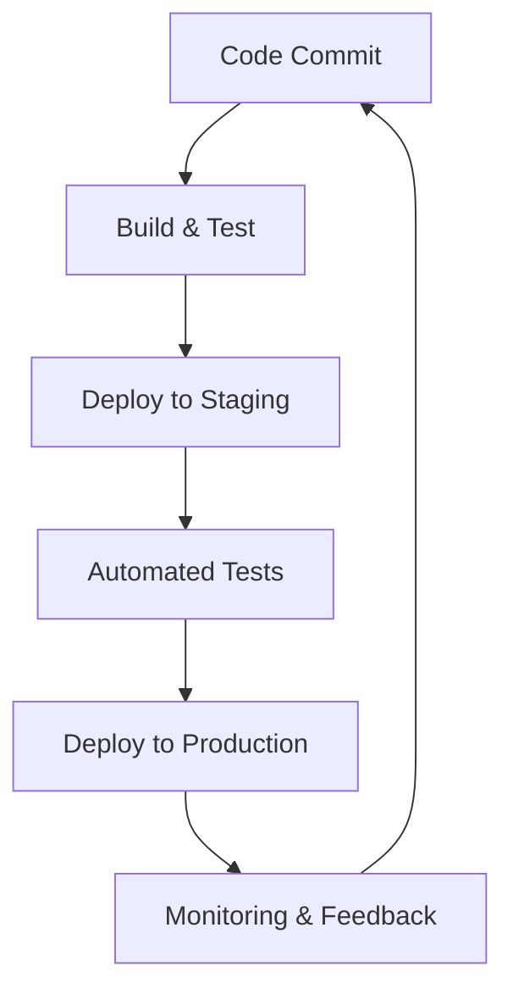

## 21.1 Introduction to DevOps in Erlang

In today's fast-paced software development landscape, the integration of development and operations, known as DevOps, has become a cornerstone for delivering robust and reliable software solutions. This section delves into the principles of DevOps and how they can be effectively applied to Erlang development, leveraging Erlang's unique features to enhance collaboration, automation, and continuous improvement.

### Understanding DevOps: Core Principles

DevOps is a cultural and professional movement that emphasizes collaboration between software developers and IT operations. Its core principles include:

- **Collaboration**: Breaking down silos between development and operations teams to foster a culture of shared responsibility.
- **Automation**: Streamlining processes through automation to reduce manual errors and increase efficiency.
- **Continuous Improvement**: Implementing iterative processes to enhance software quality and delivery speed.

These principles aim to create a seamless workflow that accelerates delivery and improves system reliability.

### Erlang's Alignment with DevOps Practices

Erlang, with its functional and concurrent programming model, naturally aligns with DevOps practices. Let's explore how Erlang's features support DevOps:

- **Concurrency and Fault Tolerance**: Erlang's lightweight processes and "let it crash" philosophy enable robust system design, which is crucial for maintaining uptime in a DevOps environment.
- **Hot Code Swapping**: Erlang's ability to update code without stopping the system supports continuous deployment, a key DevOps practice.
- **Distributed Systems**: Erlang's native support for distributed computing facilitates the deployment of scalable and resilient applications.

### Benefits of Adopting DevOps in Erlang Projects

Integrating DevOps into Erlang projects offers several benefits:

- **Faster Deployment**: Automation of build, test, and deployment processes reduces time-to-market.
- **Improved System Stability**: Continuous monitoring and feedback loops enhance system reliability.
- **Enhanced Collaboration**: Shared responsibility and open communication lead to better problem-solving and innovation.

### DevOps Practices in Erlang Development Environments

To implement DevOps in Erlang projects, consider the following practices:

1. **Continuous Integration and Continuous Deployment (CI/CD)**: Use tools like Jenkins or GitLab CI to automate testing and deployment pipelines.
   
   ```erlang
   % Example of a simple Erlang build script for CI/CD
   -module(build_script).
   -export([build/0]).

   build() ->
       % Compile the Erlang application
       erlc:compile("src/*.erl"),
       % Run tests
       eunit:test(my_app).
   ```

2. **Infrastructure as Code (IaC)**: Use tools like Ansible or Terraform to manage infrastructure, ensuring consistency across environments.

3. **Monitoring and Logging**: Implement monitoring solutions like Prometheus and Grafana to track system performance and logs for proactive issue resolution.

4. **Automated Testing**: Use EUnit and Common Test for unit and integration testing to ensure code quality.

5. **Collaboration Tools**: Utilize platforms like Slack or Microsoft Teams for communication and collaboration among team members.

### Encouraging a Culture of Shared Responsibility

A successful DevOps implementation requires a cultural shift towards shared responsibility and open communication. Encourage teams to:

- **Embrace Feedback**: Regularly review processes and outcomes to identify areas for improvement.
- **Foster Collaboration**: Create cross-functional teams that include members from both development and operations.
- **Promote Learning**: Encourage continuous learning and skill development to keep up with evolving technologies.

### Visualizing DevOps in Erlang

To better understand the integration of DevOps with Erlang, let's visualize a typical DevOps workflow using a Mermaid.js diagram:



**Diagram Description**: This diagram illustrates a continuous integration and deployment pipeline, highlighting the cyclical nature of DevOps processes. Each stage feeds into the next, creating a loop of continuous improvement.

### Try It Yourself

To deepen your understanding, try modifying the provided build script to include additional steps, such as code linting or deployment to a specific environment. Experiment with different CI/CD tools to find the best fit for your project.

### References and Further Reading

- [DevOps Handbook](https://www.amazon.com/DevOps-Handbook-World-Class-Reliability-Organizations/dp/1942788002)
- [Continuous Delivery: Reliable Software Releases through Build, Test, and Deployment Automation](https://www.amazon.com/Continuous-Delivery-Deployment-Automation-Addison-Wesley/dp/0321601912)
- [Erlang and OTP in Action](https://www.manning.com/books/erlang-and-otp-in-action)

### Knowledge Check

Before moving on, consider these questions to reinforce your understanding:

- How does Erlang's concurrency model support DevOps practices?
- What are the benefits of using Infrastructure as Code in Erlang projects?
- How can monitoring and logging improve system reliability in a DevOps environment?

### Embrace the Journey

Remember, adopting DevOps is a journey, not a destination. As you integrate these practices into your Erlang projects, you'll discover new ways to enhance collaboration, automation, and continuous improvement. Keep experimenting, stay curious, and enjoy the journey!

## Quiz: Introduction to DevOps in Erlang



### What is a core principle of DevOps?

- [x] Collaboration
- [ ] Isolation
- [ ] Competition
- [ ] Secrecy

> **Explanation:** Collaboration is a core principle of DevOps, emphasizing teamwork between development and operations.

### How does Erlang's "let it crash" philosophy align with DevOps?

- [x] It supports fault tolerance.
- [ ] It encourages frequent crashes.
- [ ] It discourages error handling.
- [ ] It limits system uptime.

> **Explanation:** The "let it crash" philosophy supports fault tolerance, a key aspect of maintaining system reliability in DevOps.

### Which tool is commonly used for CI/CD in Erlang projects?

- [x] Jenkins
- [ ] Photoshop
- [ ] Excel
- [ ] Word

> **Explanation:** Jenkins is a popular tool for implementing CI/CD pipelines in software projects, including Erlang.

### What does Infrastructure as Code (IaC) ensure?

- [x] Consistency across environments
- [ ] Manual configuration
- [ ] Random deployment
- [ ] Unpredictable results

> **Explanation:** IaC ensures consistency across environments by automating infrastructure management.

### What is the benefit of automated testing in DevOps?

- [x] Ensures code quality
- [ ] Increases manual errors
- [ ] Slows down deployment
- [ ] Reduces collaboration

> **Explanation:** Automated testing ensures code quality by catching errors early in the development process.

### What is a key benefit of adopting DevOps in Erlang projects?

- [x] Faster deployment
- [ ] Increased manual work
- [ ] Slower feedback loops
- [ ] Reduced collaboration

> **Explanation:** DevOps practices lead to faster deployment by automating processes and improving collaboration.

### How can monitoring improve system reliability?

- [x] By providing proactive issue resolution
- [ ] By ignoring system performance
- [ ] By delaying feedback
- [ ] By reducing visibility

> **Explanation:** Monitoring provides proactive issue resolution by tracking system performance and identifying potential problems.

### What does continuous improvement in DevOps involve?

- [x] Iterative processes
- [ ] Static processes
- [ ] Ignoring feedback
- [ ] Avoiding changes

> **Explanation:** Continuous improvement involves iterative processes to enhance software quality and delivery speed.

### What is a cultural shift required for successful DevOps implementation?

- [x] Shared responsibility
- [ ] Individual blame
- [ ] Isolated teams
- [ ] Secrecy

> **Explanation:** Shared responsibility is crucial for successful DevOps, promoting teamwork and collaboration.

### True or False: DevOps is only about tools and technology.

- [ ] True
- [x] False

> **Explanation:** DevOps is not just about tools and technology; it's a cultural shift that emphasizes collaboration and continuous improvement.


