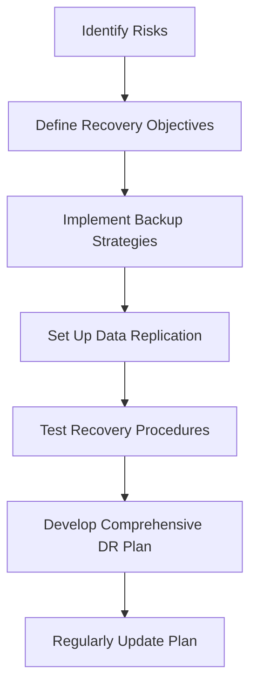

## 21.10 Disaster Recovery and Backup Strategies

In the world of software development, ensuring the availability and integrity of your applications and data is paramount. Disaster recovery and backup strategies are essential components of a robust DevOps and infrastructure automation plan. This section will guide you through the critical aspects of disaster recovery and backup strategies for Erlang applications, focusing on protecting your systems from data loss and downtime.

### Understanding Disaster Recovery

Disaster recovery (DR) refers to the process of restoring application functionality and data after a disruptive event, such as hardware failure, cyber-attacks, or natural disasters. A well-defined DR plan ensures that your Erlang applications can recover quickly and efficiently, minimizing downtime and data loss.

#### Importance of Disaster Recovery Planning

1. **Business Continuity**: Ensure that your applications remain operational, maintaining service availability and customer satisfaction.
2. **Data Integrity**: Protect against data loss, ensuring that critical information is preserved and recoverable.
3. **Compliance**: Meet regulatory requirements for data protection and disaster recovery.
4. **Risk Mitigation**: Identify potential risks and implement strategies to minimize their impact.

### Backup Strategies for Erlang Applications

Backups are a fundamental component of any disaster recovery plan. They provide a way to restore application data and state in the event of data loss or corruption.

#### Types of Backups

1. **Full Backups**: Capture the entire dataset, providing a complete snapshot of your application data.
2. **Incremental Backups**: Store only the changes made since the last backup, reducing storage requirements and backup time.
3. **Differential Backups**: Save changes made since the last full backup, offering a balance between full and incremental backups.

#### Setting Up Backups for Mnesia

Mnesia is a distributed database management system in Erlang, often used for storing application state and data. Setting up backups for Mnesia involves creating regular snapshots of your data.

```erlang
% Example: Creating a Mnesia backup
mnesia:backup("/path/to/backup/directory").
```

- **Schedule Regular Backups**: Use Erlang's built-in scheduling capabilities to automate backup processes.
- **Store Backups Securely**: Ensure that backups are stored in a secure location, separate from the primary data source.

#### Data Replication and Redundancy

Data replication involves creating copies of your data across multiple locations, providing redundancy and enhancing data availability.

1. **Synchronous Replication**: Ensure that data is written to multiple locations simultaneously, providing real-time redundancy.
2. **Asynchronous Replication**: Data is replicated to secondary locations with a delay, reducing the impact on primary system performance.

### Best Practices for Testing Recovery Procedures

Testing your disaster recovery procedures is crucial to ensure that they work as expected during an actual disaster.

1. **Conduct Regular DR Drills**: Simulate disaster scenarios to test the effectiveness of your recovery plans.
2. **Verify Backup Integrity**: Regularly check that your backups are complete and can be restored successfully.
3. **Document Recovery Procedures**: Maintain detailed documentation of your recovery processes, ensuring that they are accessible and up-to-date.

### Developing a Comprehensive Disaster Recovery Plan

A comprehensive disaster recovery plan outlines the steps to take before, during, and after a disaster to ensure a swift recovery.

1. **Risk Assessment**: Identify potential threats and their impact on your applications.
2. **Define Recovery Objectives**: Establish Recovery Time Objectives (RTO) and Recovery Point Objectives (RPO) to guide your recovery efforts.
3. **Implement Redundancy**: Use data replication and redundant systems to minimize downtime.
4. **Regularly Update the Plan**: Review and update your DR plan to account for changes in your application architecture and infrastructure.

### Code Example: Automating Backups with Erlang

Let's explore a simple Erlang script to automate Mnesia backups:

```erlang
-module(backup_manager).
-export([start_backup/0]).

start_backup() ->
    % Schedule a daily backup at midnight
    timer:apply_interval(24 * 60 * 60 * 1000, ?MODULE, perform_backup, []).

perform_backup() ->
    % Perform the backup
    case mnesia:backup("/path/to/backup/directory") of
        {ok, _} -> io:format("Backup completed successfully.~n");
        {error, Reason} -> io:format("Backup failed: ~p~n", [Reason])
    end.
```

- **Explanation**: This script uses Erlang's `timer` module to schedule a daily backup of Mnesia data. The `perform_backup/0` function handles the backup process, logging the result.

### Visualizing Disaster Recovery Workflow



**Figure 1**: Disaster Recovery Workflow for Erlang Applications

### Encouragement for Continuous Improvement

Remember, disaster recovery is an ongoing process. As your applications evolve, so should your DR strategies. Regularly review and update your plans to ensure they remain effective and aligned with your business goals.

### Further Reading

- [Erlang Mnesia Documentation](https://www.erlang.org/doc/man/mnesia.html)
- [Backup and Restore Strategies](https://www.backupstrategy.com)
- [Disaster Recovery Planning Guide](https://www.drplanningguide.com)

## Quiz: Disaster Recovery and Backup Strategies



### What is the primary goal of disaster recovery planning?

- [x] Ensure business continuity and data integrity
- [ ] Increase application performance
- [ ] Reduce development costs
- [ ] Simplify application architecture

> **Explanation:** Disaster recovery planning aims to ensure business continuity and data integrity by preparing for potential disruptions.

### Which type of backup captures the entire dataset?

- [x] Full Backup
- [ ] Incremental Backup
- [ ] Differential Backup
- [ ] Partial Backup

> **Explanation:** A full backup captures the entire dataset, providing a complete snapshot of the data.

### What is the purpose of data replication?

- [x] Enhance data availability and redundancy
- [ ] Improve application performance
- [ ] Reduce storage costs
- [ ] Simplify data management

> **Explanation:** Data replication enhances data availability and redundancy by creating copies of data across multiple locations.

### How often should disaster recovery procedures be tested?

- [x] Regularly
- [ ] Once a year
- [ ] Only after a disaster
- [ ] Never

> **Explanation:** Regular testing of disaster recovery procedures ensures their effectiveness and readiness for actual disasters.

### What is a key component of a comprehensive disaster recovery plan?

- [x] Risk Assessment
- [ ] Application Development
- [ ] Marketing Strategy
- [ ] User Interface Design

> **Explanation:** Risk assessment is a key component of a comprehensive disaster recovery plan, helping to identify potential threats.

### What is the role of Recovery Time Objectives (RTO) in disaster recovery?

- [x] Define acceptable downtime duration
- [ ] Determine data storage requirements
- [ ] Improve application performance
- [ ] Simplify codebase

> **Explanation:** Recovery Time Objectives (RTO) define the acceptable duration of downtime during a disaster recovery process.

### Which Erlang module is used to schedule tasks like backups?

- [x] timer
- [ ] mnesia
- [ ] io
- [ ] file

> **Explanation:** The `timer` module in Erlang is used to schedule tasks, such as automated backups.

### What is the benefit of asynchronous replication?

- [x] Reduces impact on primary system performance
- [ ] Provides real-time data redundancy
- [ ] Simplifies data management
- [ ] Increases storage costs

> **Explanation:** Asynchronous replication reduces the impact on primary system performance by replicating data with a delay.

### Why is it important to store backups in a secure location?

- [x] To protect against data loss and unauthorized access
- [ ] To increase application performance
- [ ] To reduce storage costs
- [ ] To simplify data management

> **Explanation:** Storing backups in a secure location protects against data loss and unauthorized access, ensuring data integrity.

### True or False: Disaster recovery is a one-time process.

- [ ] True
- [x] False

> **Explanation:** Disaster recovery is an ongoing process that requires regular updates and testing to remain effective.



Remember, this is just the beginning. As you progress, you'll build more resilient and robust Erlang applications. Keep experimenting, stay curious, and enjoy the journey!
