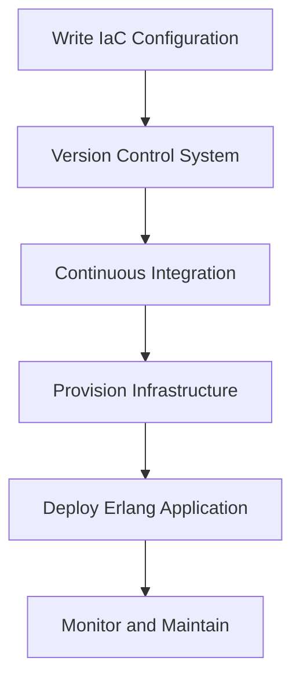

## 21.2 Infrastructure as Code with Erlang and External Tools

Infrastructure as Code (IaC) is a transformative approach to managing and provisioning computing resources through machine-readable configuration files, rather than physical hardware configuration or interactive configuration tools. This paradigm shift allows for more efficient, consistent, and scalable infrastructure management, reducing the risk of human error and enabling rapid deployment and iteration.

### Understanding Infrastructure as Code

Infrastructure as Code is a practice that involves managing and provisioning infrastructure through code, rather than through manual processes. This approach allows developers and operations teams to automate the setup, configuration, and management of infrastructure, making it easier to deploy applications consistently across different environments.

#### Advantages of Infrastructure as Code

1. **Consistency and Repeatability**: IaC ensures that the same configuration is applied every time, reducing discrepancies between environments.
2. **Version Control**: Infrastructure configurations can be versioned and tracked, just like application code, allowing for easy rollback and auditing.
3. **Automation**: Automating infrastructure provisioning reduces manual errors and speeds up deployment processes.
4. **Scalability**: IaC makes it easier to scale infrastructure up or down based on demand.
5. **Collaboration**: Teams can collaborate more effectively by using code to define infrastructure, enabling peer reviews and shared understanding.

### Erlang Applications and Infrastructure as Code

Erlang, known for its strengths in building concurrent and distributed systems, can greatly benefit from IaC. By using IaC, Erlang applications can be deployed in a consistent and automated manner across various environments, ensuring that the underlying infrastructure supports the application's requirements for reliability and scalability.

#### Benefits for Erlang Applications

- **Rapid Deployment**: Quickly deploy Erlang applications across multiple environments with consistent configurations.
- **Environment Parity**: Ensure that development, testing, and production environments are identical, reducing "it works on my machine" issues.
- **Disaster Recovery**: Easily recreate infrastructure in the event of a failure, minimizing downtime.
- **Resource Optimization**: Efficiently manage resources to meet the demands of Erlang's concurrent processes.

### Tools for Infrastructure as Code with Erlang

Several tools can be used to implement IaC for Erlang applications. These tools help automate the provisioning and management of infrastructure, ensuring that Erlang applications run smoothly and efficiently.

#### Ansible

[Ansible](https://www.ansible.com/) is an open-source automation tool that simplifies the process of configuration management, application deployment, and task automation. It uses a simple, human-readable language (YAML) to describe automation jobs, making it accessible to both developers and operations teams.

- **Key Features**:
  - Agentless architecture, requiring no additional software on target machines.
  - Idempotent operations, ensuring that tasks are applied consistently.
  - Extensive library of modules for managing various systems and services.

**Example: Using Ansible to Deploy an Erlang Application**

```yaml
---
- name: Deploy Erlang Application
  hosts: webservers
  become: yes

  tasks:
    - name: Install Erlang
      apt:
        name: erlang
        state: present

    - name: Deploy application code
      copy:
        src: /local/path/to/erlang_app
        dest: /var/www/erlang_app

    - name: Start Erlang application
      shell: erl -s erlang_app start
```

In this example, Ansible is used to install Erlang, deploy application code, and start the Erlang application on a group of web servers.

#### Terraform

[Terraform](https://www.terraform.io/) is an open-source tool for building, changing, and versioning infrastructure safely and efficiently. It uses a declarative configuration language to describe the desired state of infrastructure, allowing Terraform to manage dependencies and apply changes in the correct order.

- **Key Features**:
  - Infrastructure as Code: Define infrastructure in configuration files that describe the desired state.
  - Execution Plans: Preview changes before applying them to ensure accuracy.
  - Resource Graph: Visualize dependencies and relationships between resources.

**Example: Using Terraform to Provision Infrastructure for an Erlang Application**

```hcl
provider "aws" {
  region = "us-west-2"
}

resource "aws_instance" "erlang_server" {
  ami           = "ami-0c55b159cbfafe1f0"
  instance_type = "t2.micro"

  tags = {
    Name = "ErlangServer"
  }
}

resource "aws_security_group" "erlang_sg" {
  name        = "erlang_security_group"
  description = "Allow SSH and HTTP"

  ingress {
    from_port   = 22
    to_port     = 22
    protocol    = "tcp"
    cidr_blocks = ["0.0.0.0/0"]
  }

  ingress {
    from_port   = 80
    to_port     = 80
    protocol    = "tcp"
    cidr_blocks = ["0.0.0.0/0"]
  }
}
```

This Terraform configuration provisions an AWS EC2 instance to run an Erlang application, along with a security group to allow SSH and HTTP access.

#### Chef

[Chef](https://www.chef.io/) is a powerful automation platform that transforms infrastructure into code. It uses a domain-specific language (DSL) written in Ruby to define infrastructure configurations, known as "recipes."

- **Key Features**:
  - Chef Server: Centralized management of infrastructure configurations.
  - Chef Client: Runs on target machines to apply configurations.
  - Chef Workstation: Tools for developing and testing Chef configurations.

**Example: Using Chef to Configure an Erlang Environment**

```ruby
package 'erlang' do
  action :install
end

directory '/var/www/erlang_app' do
  owner 'root'
  group 'root'
  mode '0755'
  action :create
end

cookbook_file '/var/www/erlang_app/start.sh' do
  source 'start.sh'
  mode '0755'
end

execute 'start_erlang_app' do
  command 'sh /var/www/erlang_app/start.sh'
end
```

In this Chef recipe, we install Erlang, create a directory for the application, copy a startup script, and execute the script to start the Erlang application.

### Best Practices for Infrastructure as Code

1. **Version Control**: Store IaC configurations in version control systems like Git to track changes and collaborate effectively.
2. **Modularization**: Break down configurations into reusable modules to promote reusability and maintainability.
3. **Testing**: Implement automated testing for IaC configurations to catch errors early and ensure reliability.
4. **Documentation**: Document configurations and processes to facilitate onboarding and knowledge sharing.
5. **Security**: Secure sensitive information, such as API keys and passwords, using tools like HashiCorp Vault or AWS Secrets Manager.

### Visualizing Infrastructure as Code Workflow



**Diagram Description**: This flowchart illustrates the typical workflow for Infrastructure as Code, starting from writing configurations, storing them in a version control system, integrating with CI/CD pipelines, provisioning infrastructure, deploying applications, and ongoing monitoring and maintenance.

### Try It Yourself

Experiment with the provided code examples by modifying configurations to suit your specific needs. For instance, try changing the instance type in the Terraform example or adding additional tasks in the Ansible playbook to install other dependencies.

### Knowledge Check

- What are the key benefits of using Infrastructure as Code for Erlang applications?
- How does Ansible differ from Terraform in managing infrastructure?
- Why is version control important in Infrastructure as Code?

### Embrace the Journey

Remember, adopting Infrastructure as Code is a journey that involves continuous learning and improvement. As you integrate IaC practices into your workflow, you'll discover new efficiencies and capabilities that enhance your ability to manage and deploy Erlang applications. Keep experimenting, stay curious, and enjoy the process!

## Quiz: Infrastructure as Code with Erlang and External Tools



### What is a primary advantage of Infrastructure as Code?

- [x] Consistency and repeatability in infrastructure deployment
- [ ] Manual configuration of servers
- [ ] Increased hardware costs
- [ ] Reduced automation

> **Explanation:** Infrastructure as Code ensures that infrastructure is deployed consistently and repeatably, reducing errors and discrepancies.

### Which tool uses a declarative configuration language to manage infrastructure?

- [ ] Ansible
- [x] Terraform
- [ ] Chef
- [ ] Puppet

> **Explanation:** Terraform uses a declarative configuration language to define the desired state of infrastructure.

### What is the role of Ansible in Infrastructure as Code?

- [x] Automating configuration management and application deployment
- [ ] Managing hardware resources
- [ ] Providing a graphical interface for server management
- [ ] Monitoring network traffic

> **Explanation:** Ansible automates configuration management and application deployment using a simple, human-readable language.

### How does Chef define infrastructure configurations?

- [ ] Using YAML files
- [ ] Through a graphical user interface
- [x] With a domain-specific language written in Ruby
- [ ] By manually configuring each server

> **Explanation:** Chef uses a domain-specific language written in Ruby to define infrastructure configurations.

### Why is version control important in Infrastructure as Code?

- [x] It allows tracking changes and collaborating effectively
- [ ] It increases the complexity of configurations
- [ ] It reduces the need for documentation
- [ ] It prevents automation

> **Explanation:** Version control systems like Git help track changes, collaborate, and ensure consistency in IaC configurations.

### Which tool is agentless and uses YAML for configuration?

- [x] Ansible
- [ ] Terraform
- [ ] Chef
- [ ] Puppet

> **Explanation:** Ansible is agentless and uses YAML to describe automation jobs.

### What is a key feature of Terraform?

- [ ] Agent-based architecture
- [x] Execution plans to preview changes
- [ ] Manual server configuration
- [ ] GUI-based management

> **Explanation:** Terraform provides execution plans to preview changes before applying them, ensuring accuracy.

### How does Infrastructure as Code benefit Erlang applications?

- [x] By enabling rapid deployment and environment parity
- [ ] By increasing manual configuration
- [ ] By reducing automation capabilities
- [ ] By complicating the deployment process

> **Explanation:** IaC enables rapid deployment and ensures environment parity, benefiting Erlang applications.

### What is the purpose of modularization in IaC?

- [x] To promote reusability and maintainability
- [ ] To increase complexity
- [ ] To reduce automation
- [ ] To prevent collaboration

> **Explanation:** Modularization breaks down configurations into reusable modules, promoting reusability and maintainability.

### True or False: IaC allows for manual configuration of infrastructure.

- [ ] True
- [x] False

> **Explanation:** IaC automates infrastructure configuration, reducing the need for manual intervention.


