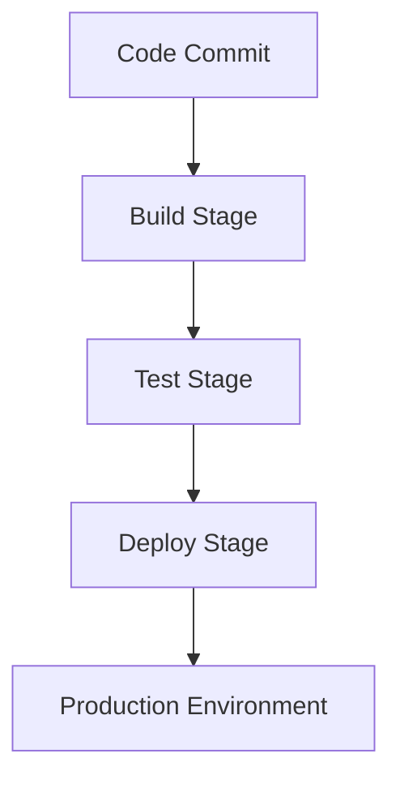

## 21.3 Automation Scripts and Build Pipelines

In the fast-paced world of software development, automation is a key enabler of efficiency and reliability. By automating repetitive tasks, developers can focus on more complex and creative aspects of their work. This section delves into the creation of automation scripts and build pipelines, specifically tailored for Erlang applications, to streamline the development, testing, and deployment processes.

### The Importance of Automation in DevOps

Automation is the backbone of modern DevOps practices. It ensures consistency, reduces human error, and accelerates the software delivery lifecycle. In the context of Erlang development, automation can significantly enhance productivity by:

- **Reducing Manual Effort**: Automating repetitive tasks such as code compilation, testing, and deployment frees up developers to focus on writing code.
- **Ensuring Consistency**: Automated processes ensure that tasks are performed the same way every time, reducing the risk of errors.
- **Speeding Up Delivery**: Automation enables faster feedback loops, allowing teams to deliver features and fixes more rapidly.
- **Facilitating Continuous Integration and Deployment**: Automation is essential for implementing CI/CD practices, which help maintain code quality and accelerate the release process.

### Using Automation Scripts for Repetitive Tasks

Automation scripts are a powerful tool for handling repetitive tasks in software development. In Erlang, these scripts can be used to automate tasks such as:

- **Code Compilation**: Automate the compilation of Erlang code using scripts that invoke the Erlang compiler (`erlc`) with the necessary options.
- **Running Tests**: Automate the execution of test suites using tools like EUnit or Common Test.
- **Code Formatting**: Use scripts to automatically format code with tools like `erlfmt` to maintain consistent coding standards.
- **Deployment**: Automate the deployment process to various environments, ensuring that the latest code is always running in production.

#### Example: Automating Code Compilation

Here's a simple example of an automation script for compiling Erlang code:

```bash
#!/bin/bash

# Define the source directory
SRC_DIR="src"

# Define the build directory
BUILD_DIR="build"

# Create the build directory if it doesn't exist
mkdir -p $BUILD_DIR

# Compile all .erl files in the source directory
for file in $SRC_DIR/*.erl; do
    erlc -o $BUILD_DIR $file
done

echo "Compilation complete. Compiled files are in the $BUILD_DIR directory."
```

This script automates the process of compiling all Erlang source files in a specified directory, placing the compiled files in a build directory.

### Setting Up Build Pipelines

Build pipelines are an essential component of modern software development, enabling the automation of building, testing, and deploying applications. Several tools can be used to set up build pipelines for Erlang applications, including Jenkins, GitLab CI/CD, and GitHub Actions.

#### Jenkins

[Jenkins](https://www.jenkins.io/) is a popular open-source automation server that supports building, deploying, and automating any project. It is highly extensible and can be integrated with various tools and services.

##### Setting Up a Jenkins Pipeline for Erlang

1. **Install Jenkins**: Begin by installing Jenkins on your server. Follow the [official installation guide](https://www.jenkins.io/doc/book/installing/) for your platform.

2. **Create a New Pipeline**: In Jenkins, create a new pipeline project. Configure the source code repository (e.g., Git) and specify the branch to build.

3. **Define the Pipeline Script**: Use a Jenkinsfile to define the pipeline stages. Here's an example Jenkinsfile for an Erlang project:

    ```groovy
    pipeline {
        agent any
        stages {
            stage('Checkout') {
                steps {
                    git 'https://github.com/your-repo/erlang-project.git'
                }
            }
            stage('Build') {
                steps {
                    sh './compile.sh'
                }
            }
            stage('Test') {
                steps {
                    sh './run_tests.sh'
                }
            }
            stage('Deploy') {
                steps {
                    sh './deploy.sh'
                }
            }
        }
    }
    ```

4. **Configure Build Triggers**: Set up triggers to automatically run the pipeline on code changes or at scheduled intervals.

5. **Monitor and Manage Builds**: Use Jenkins' dashboard to monitor build status, view logs, and manage build artifacts.

#### GitLab CI/CD

[GitLab CI/CD](https://docs.gitlab.com/ee/ci/) is a powerful tool integrated into GitLab that allows you to automate the build, test, and deployment processes.

##### Setting Up a GitLab CI/CD Pipeline

1. **Create a `.gitlab-ci.yml` File**: Define your CI/CD pipeline in a `.gitlab-ci.yml` file in the root of your repository.

    ```yaml
    stages:
      - build
      - test
      - deploy

    build:
      stage: build
      script:
        - ./compile.sh

    test:
      stage: test
      script:
        - ./run_tests.sh

    deploy:
      stage: deploy
      script:
        - ./deploy.sh
    ```

2. **Configure Runners**: Ensure you have GitLab runners configured to execute the pipeline jobs.

3. **Monitor Pipeline Execution**: Use GitLab's interface to monitor the status of your pipelines, view logs, and manage artifacts.

#### GitHub Actions

[GitHub Actions](https://github.com/features/actions) provides a way to automate workflows directly within GitHub repositories.

##### Setting Up a GitHub Actions Workflow

1. **Create a Workflow File**: Define your workflow in a `.github/workflows/main.yml` file.

    ```yaml
    name: Erlang CI

    on: [push, pull_request]

    jobs:
      build:
        runs-on: ubuntu-latest
        steps:
          - uses: actions/checkout@v2
          - name: Set up Erlang
            uses: erlef/setup-beam@v1
            with:
              otp-version: 24.x
          - name: Build
            run: ./compile.sh
          - name: Test
            run: ./run_tests.sh
          - name: Deploy
            run: ./deploy.sh
    ```

2. **Trigger Workflows**: Workflows can be triggered on various events such as pushes, pull requests, or on a schedule.

3. **Monitor Workflow Runs**: Use GitHub's Actions tab to view the status of your workflows, logs, and artifacts.

### Integrating Testing and Deployment Processes

Integrating testing and deployment processes into your build pipeline is crucial for maintaining code quality and ensuring reliable releases.

- **Testing**: Automate the execution of unit tests, integration tests, and end-to-end tests. Use tools like EUnit, Common Test, and PropEr for comprehensive test coverage.
- **Deployment**: Automate the deployment of applications to various environments (e.g., staging, production). Use scripts to handle environment-specific configurations and secrets.

### Benefits of Continuous Integration and Continuous Deployment

Continuous Integration (CI) and Continuous Deployment (CD) are practices that enable teams to deliver software more reliably and efficiently.

- **Continuous Integration**: CI involves automatically building and testing code changes to ensure that new commits do not break the existing codebase. This practice helps catch bugs early and maintain code quality.
- **Continuous Deployment**: CD extends CI by automatically deploying code changes to production environments. This practice enables rapid delivery of new features and fixes, reducing time-to-market.

### Visualizing a Build Pipeline

To better understand the flow of a build pipeline, let's visualize a typical CI/CD process using a Mermaid.js diagram:



**Diagram Description**: This diagram illustrates a simple CI/CD pipeline where code commits trigger a build stage, followed by testing, and finally deployment to the production environment.

### Try It Yourself

Experiment with the provided examples by modifying the scripts and pipeline configurations to suit your specific project needs. Consider adding additional stages, such as code quality checks or security scans, to enhance your pipeline.

### References and Further Reading

- [Jenkins Documentation](https://www.jenkins.io/doc/)
- [GitLab CI/CD Documentation](https://docs.gitlab.com/ee/ci/)
- [GitHub Actions Documentation](https://docs.github.com/en/actions)

### Knowledge Check

- What are the key benefits of automating repetitive tasks in software development?
- How can Jenkins be used to automate the build and deployment of Erlang applications?
- What is the purpose of a `.gitlab-ci.yml` file in GitLab CI/CD?
- How do GitHub Actions facilitate automation within GitHub repositories?

### Embrace the Journey

Remember, automation is a journey, not a destination. As you continue to refine your build pipelines and automation scripts, you'll discover new ways to enhance efficiency and reliability. Keep experimenting, stay curious, and enjoy the journey!

## Quiz: Automation Scripts and Build Pipelines



### What is the primary benefit of using automation scripts in software development?

- [x] Reducing manual effort and human error
- [ ] Increasing manual testing
- [ ] Slowing down the development process
- [ ] Eliminating the need for version control

> **Explanation:** Automation scripts reduce manual effort and human error by automating repetitive tasks, allowing developers to focus on more complex work.

### Which tool is NOT typically used for setting up build pipelines?

- [ ] Jenkins
- [ ] GitLab CI/CD
- [ ] GitHub Actions
- [x] Microsoft Word

> **Explanation:** Microsoft Word is not a tool used for setting up build pipelines. Jenkins, GitLab CI/CD, and GitHub Actions are commonly used for this purpose.

### In a Jenkins pipeline, what is the purpose of the 'stage' directive?

- [x] To define a distinct phase in the pipeline
- [ ] To specify the programming language
- [ ] To manage user permissions
- [ ] To create a backup of the repository

> **Explanation:** The 'stage' directive in Jenkins is used to define distinct phases in the pipeline, such as build, test, and deploy.

### What file format is used to define a GitLab CI/CD pipeline?

- [ ] .json
- [x] .yml
- [ ] .xml
- [ ] .ini

> **Explanation:** GitLab CI/CD pipelines are defined using a `.yml` file format, specifically in a file named `.gitlab-ci.yml`.

### Which of the following is a benefit of Continuous Integration?

- [x] Early detection of bugs
- [ ] Delayed feedback loops
- [ ] Manual deployment processes
- [ ] Increased code complexity

> **Explanation:** Continuous Integration helps in the early detection of bugs by automatically building and testing code changes, ensuring code quality.

### What is the role of GitHub Actions in a repository?

- [x] To automate workflows and tasks
- [ ] To manage user access
- [ ] To create pull requests
- [ ] To host static websites

> **Explanation:** GitHub Actions is used to automate workflows and tasks within a GitHub repository, such as building, testing, and deploying code.

### Which stage typically follows the 'Build' stage in a CI/CD pipeline?

- [x] Test
- [ ] Deploy
- [ ] Monitor
- [ ] Archive

> **Explanation:** The 'Test' stage typically follows the 'Build' stage in a CI/CD pipeline to ensure that the built code functions as expected.

### What is a common trigger for starting a CI/CD pipeline?

- [x] Code commit or push
- [ ] System reboot
- [ ] User login
- [ ] File download

> **Explanation:** A common trigger for starting a CI/CD pipeline is a code commit or push to the repository, which initiates the build and test processes.

### True or False: Continuous Deployment involves automatically deploying code changes to production environments.

- [x] True
- [ ] False

> **Explanation:** Continuous Deployment involves automatically deploying code changes to production environments, enabling rapid delivery of new features and fixes.

### What is the main advantage of using a build pipeline?

- [x] Streamlining the build, test, and deployment processes
- [ ] Increasing manual intervention
- [ ] Reducing code quality
- [ ] Slowing down the release cycle

> **Explanation:** The main advantage of using a build pipeline is to streamline the build, test, and deployment processes, ensuring efficient and reliable software delivery.


