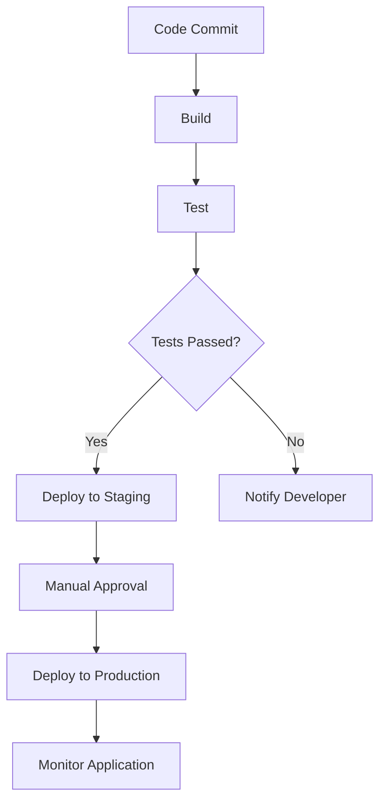

## 21.4 Continuous Integration and Continuous Deployment (CI/CD)

In the fast-paced world of software development, Continuous Integration (CI) and Continuous Deployment (CD) have become essential practices for delivering high-quality software efficiently. This section explores how CI/CD practices can be applied to Erlang projects, enabling rapid and reliable delivery of applications.

### Understanding Continuous Integration and Continuous Deployment

**Continuous Integration (CI)** is a development practice where developers integrate code into a shared repository frequently, ideally several times a day. Each integration is automatically verified by building the application and running tests to detect integration errors as quickly as possible.

**Continuous Deployment (CD)** extends CI by automatically deploying code changes to a production environment after passing the necessary tests. This ensures that the software is always in a deployable state, allowing for rapid releases and quick feedback loops.

### Automating the Build, Test, and Deployment Stages

CI/CD pipelines automate the process of building, testing, and deploying applications. This automation reduces manual errors, provides consistent results, and allows developers to focus on writing code rather than managing deployments.

#### Key Stages of a CI/CD Pipeline

1. **Source Code Management**: The pipeline begins with code committed to a version control system (e.g., Git). This triggers the CI/CD process.

2. **Build**: The application is compiled and built. In Erlang, this involves compiling `.erl` files into BEAM bytecode.

3. **Test**: Automated tests are run to ensure the code behaves as expected. This includes unit tests, integration tests, and sometimes end-to-end tests.

4. **Deploy**: If the tests pass, the application is deployed to a staging or production environment.

5. **Monitor**: Post-deployment, the application is monitored to ensure it runs smoothly.

### Configuring CI/CD Pipelines for Erlang Projects

To set up a CI/CD pipeline for an Erlang project, you need to define the steps and tools that will automate the build, test, and deployment processes. Here's a basic example using a popular CI/CD tool:

#### Example: Setting Up a CI/CD Pipeline with CircleCI

1. **Create a Configuration File**: In your Erlang project, create a `.circleci/config.yml` file to define your pipeline.

```yaml
version: 2.1

jobs:
  build:
    docker:
      - image: erlang:23
    steps:
      - checkout
      - run:
          name: Install Dependencies
          command: |
            apt-get update
            apt-get install -y rebar3
      - run:
          name: Compile Code
          command: rebar3 compile
      - run:
          name: Run Tests
          command: rebar3 eunit

workflows:
  version: 2
  build_and_test:
    jobs:
      - build
```

2. **Configure Triggers**: Set up triggers in CircleCI to start the pipeline whenever code is pushed to the repository.

3. **Monitor Pipeline**: Use CircleCI's dashboard to monitor the status of your builds and deployments.

### Tools Supporting CI/CD for Erlang

Several tools can help automate CI/CD processes for Erlang projects. Here are a few popular ones:

- **[CircleCI](https://circleci.com/)**: Offers powerful features for automating the build, test, and deployment stages. Its configuration is straightforward, and it supports Docker, making it ideal for Erlang projects.

- **[Travis CI](https://travis-ci.org/)**: A cloud-based CI/CD service that integrates with GitHub. It supports Erlang out of the box and is known for its simplicity and ease of use.

- **[Bamboo](https://www.atlassian.com/software/bamboo)**: An Atlassian product that provides continuous integration, deployment, and delivery. It offers robust integration with other Atlassian tools like Jira and Bitbucket.

### Best Practices for Maintaining Pipeline Integrity and Security

1. **Version Control**: Ensure all code, including configuration files, is under version control. This allows for easy rollback and auditing.

2. **Automated Testing**: Write comprehensive tests and automate them. This ensures that only code that passes all tests is deployed.

3. **Environment Parity**: Keep development, staging, and production environments as similar as possible to avoid environment-specific bugs.

4. **Security**: Use secure methods for handling sensitive information like API keys and passwords. Tools like HashiCorp Vault can help manage secrets.

5. **Monitoring and Logging**: Implement monitoring and logging to track the performance and health of applications post-deployment.

6. **Feedback Loops**: Set up alerts and notifications to inform developers of build failures or deployment issues promptly.

### Visualizing a CI/CD Pipeline

To better understand the flow of a CI/CD pipeline, let's visualize it using a Mermaid.js diagram.



**Diagram Description**: This flowchart represents a typical CI/CD pipeline. It starts with a code commit, followed by build and test stages. If tests pass, the code is deployed to a staging environment. After manual approval, it is deployed to production, where it is monitored.

### Try It Yourself

Experiment with the provided CircleCI configuration by modifying the build steps or adding new stages. For instance, try integrating a static code analysis tool like Dialyzer to catch type errors early in the pipeline.

### Knowledge Check

- What are the main stages of a CI/CD pipeline?
- How can you ensure the security of sensitive information in a CI/CD pipeline?
- Why is it important to maintain environment parity in CI/CD?

### Embrace the Journey

Remember, implementing CI/CD is a journey, not a destination. As you refine your pipeline, you'll discover new ways to improve efficiency and reliability. Keep experimenting, stay curious, and enjoy the process of continuous improvement!

## Quiz: Continuous Integration and Continuous Deployment (CI/CD)



### What is the primary goal of Continuous Integration (CI)?

- [x] To integrate code frequently and detect errors early
- [ ] To deploy code to production automatically
- [ ] To monitor application performance
- [ ] To manage version control

> **Explanation:** Continuous Integration focuses on integrating code changes frequently to detect errors early in the development process.

### Which tool is commonly used for CI/CD in Erlang projects?

- [x] CircleCI
- [ ] Jenkins
- [ ] GitLab CI
- [ ] Ansible

> **Explanation:** CircleCI is a popular tool for CI/CD in Erlang projects due to its support for Docker and ease of configuration.

### What is the role of automated tests in a CI/CD pipeline?

- [x] To ensure code behaves as expected before deployment
- [ ] To deploy code to production
- [ ] To manage version control
- [ ] To monitor application performance

> **Explanation:** Automated tests verify that the code behaves as expected, ensuring only tested code is deployed.

### Why is environment parity important in CI/CD?

- [x] To avoid environment-specific bugs
- [ ] To speed up the deployment process
- [ ] To reduce the number of tests
- [ ] To increase code coverage

> **Explanation:** Environment parity ensures that development, staging, and production environments are similar, reducing environment-specific bugs.

### Which practice helps maintain pipeline security?

- [x] Using secure methods for handling sensitive information
- [ ] Running fewer tests
- [x] Implementing monitoring and logging
- [ ] Skipping manual approvals

> **Explanation:** Secure handling of sensitive information and implementing monitoring and logging are crucial for maintaining pipeline security.

### What is the benefit of using version control in CI/CD?

- [x] Easy rollback and auditing
- [ ] Faster deployment
- [ ] Reduced testing time
- [ ] Increased code coverage

> **Explanation:** Version control allows for easy rollback and auditing of code changes, enhancing pipeline integrity.

### What should be done if tests fail in a CI/CD pipeline?

- [x] Notify the developer
- [ ] Deploy to production
- [x] Stop the deployment process
- [ ] Ignore the failure

> **Explanation:** If tests fail, the developer should be notified, and the deployment process should be stopped to prevent faulty code from being deployed.

### How can feedback loops improve a CI/CD pipeline?

- [x] By informing developers of build failures promptly
- [ ] By reducing the number of tests
- [ ] By increasing deployment speed
- [ ] By skipping manual approvals

> **Explanation:** Feedback loops inform developers of build failures promptly, allowing for quick resolution of issues.

### What is a common tool for managing secrets in a CI/CD pipeline?

- [x] HashiCorp Vault
- [ ] Git
- [ ] Docker
- [ ] Jenkins

> **Explanation:** HashiCorp Vault is commonly used for managing secrets securely in a CI/CD pipeline.

### True or False: Continuous Deployment automatically deploys code to production after passing tests.

- [x] True
- [ ] False

> **Explanation:** Continuous Deployment involves automatically deploying code to production after it passes all necessary tests.



By embracing CI/CD practices, you can streamline the development and deployment of Erlang applications, ensuring they are delivered quickly and reliably. Keep refining your pipeline, and you'll see improvements in both efficiency and quality.
