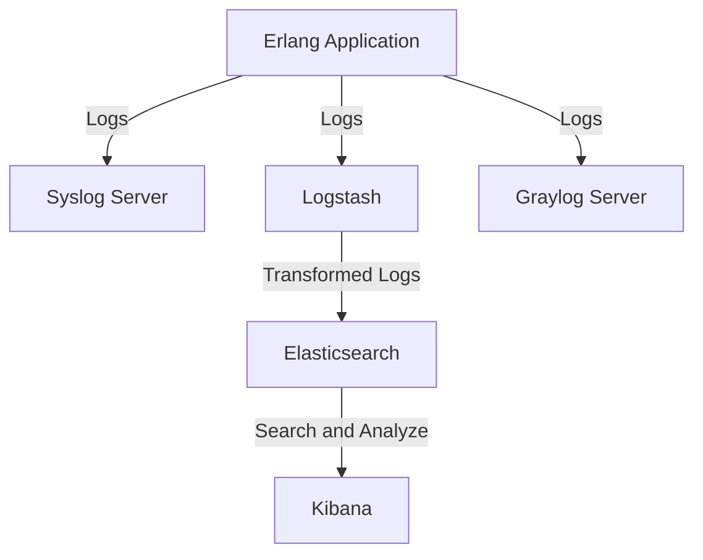

## 21.5 Monitoring and Logging Solutions (Syslog, ELK Stack)

In the world of software development, especially with Erlang's focus on building robust, concurrent systems, monitoring and logging are crucial for maintaining operational visibility and ensuring application health. This section delves into the tools and strategies you can employ to effectively monitor and log your Erlang applications, focusing on Syslog, the ELK Stack, and Graylog.

### Importance of Monitoring and Logging

Monitoring and logging are essential components of any production environment. They provide insights into application performance, help diagnose issues, and ensure that systems are running smoothly. Without proper monitoring and logging, identifying and resolving issues can become a daunting task, leading to prolonged downtimes and potential revenue loss.

**Key Benefits:**
- **Operational Visibility:** Gain insights into the application's behavior and performance.
- **Issue Diagnosis:** Quickly identify and resolve issues before they impact users.
- **Performance Optimization:** Monitor resource usage and optimize application performance.
- **Security Auditing:** Track access and changes to ensure compliance and security.

### Tools and Frameworks for Logging

#### Syslog

[Syslog](https://tools.ietf.org/html/rfc5424) is a standard for message logging that allows separation of the software that generates messages, the system that stores them, and the software that reports and analyzes them. It is widely used for logging system messages and can be integrated with Erlang applications to capture logs.

**Integration with Erlang:**

To integrate Syslog with an Erlang application, you can use the `syslog` library, which provides an interface to send log messages to a Syslog server.

```erlang
%% Example of sending a log message to Syslog
-module(my_syslog_logger).
-export([log_message/1]).

log_message(Msg) ->
    {ok, Sock} = gen_udp:open(0, [binary, {active, false}]),
    SyslogMsg = io_lib:format("<~p>1 ~s ~s ~s ~s - - ~s~n",
                              [14, "2024-11-23T12:34:56Z", "myapp", "myhost", "1234", Msg]),
    gen_udp:send(Sock, {127,0,0,1}, 514, SyslogMsg),
    gen_udp:close(Sock).
```

**Try It Yourself:** Modify the `log_message/1` function to include different severity levels and test sending messages to a local Syslog server.

#### ELK Stack (Elasticsearch, Logstash, Kibana)

The [ELK Stack](https://www.elastic.co/what-is/elk-stack) is a powerful set of tools for managing and analyzing logs. It consists of Elasticsearch for storage and search, Logstash for processing and transforming logs, and Kibana for visualization.

**Integration with Erlang:**

To send logs from an Erlang application to the ELK Stack, you can use Logstash as an intermediary to process and forward logs to Elasticsearch.

```erlang
%% Example of sending a log message to Logstash
-module(my_elk_logger).
-export([log_message/1]).

log_message(Msg) ->
    {ok, Sock} = gen_udp:open(0, [binary, {active, false}]),
    LogstashMsg = io_lib:format("{\"@timestamp\": \"~s\", \"message\": \"~s\"}",
                                ["2024-11-23T12:34:56Z", Msg]),
    gen_udp:send(Sock, {127,0,0,1}, 5044, LogstashMsg),
    gen_udp:close(Sock).
```

**Setting Up ELK:**

1. **Elasticsearch:** Install and configure Elasticsearch to store logs.
2. **Logstash:** Set up Logstash to receive logs from Erlang and forward them to Elasticsearch.
3. **Kibana:** Use Kibana to create dashboards and visualize log data.

**Try It Yourself:** Experiment with different Logstash filters to parse and transform log messages before they reach Elasticsearch.

#### Graylog

[Graylog](https://www.graylog.org/) is another popular logging solution that provides centralized log management and analysis. It offers a web-based interface for searching and visualizing logs.

**Integration with Erlang:**

Graylog can be integrated with Erlang applications using the GELF (Graylog Extended Log Format) protocol.

```erlang
%% Example of sending a log message to Graylog
-module(my_graylog_logger).
-export([log_message/1]).

log_message(Msg) ->
    {ok, Sock} = gen_udp:open(0, [binary, {active, false}]),
    GraylogMsg = io_lib:format("{\"version\": \"1.1\", \"host\": \"myhost\", \"short_message\": \"~s\", \"timestamp\": ~f, \"level\": 6}",
                               [Msg, erlang:system_time(second)]),
    gen_udp:send(Sock, {127,0,0,1}, 12201, GraylogMsg),
    gen_udp:close(Sock).
```

**Try It Yourself:** Customize the `log_message/1` function to include additional fields such as `facility` and `full_message`.

### Setting Up Alerts and Dashboards

Monitoring solutions like ELK and Graylog allow you to set up alerts and dashboards for real-time monitoring. Alerts can notify you of critical issues, while dashboards provide a visual overview of system health.

**Creating Alerts:**

- **Threshold Alerts:** Trigger alerts based on specific conditions, such as high CPU usage or error rates.
- **Anomaly Detection:** Use machine learning to detect unusual patterns in log data.

**Building Dashboards:**

- **Visualize Key Metrics:** Create visualizations for metrics like request rates, error counts, and response times.
- **Custom Dashboards:** Tailor dashboards to specific use cases, such as performance monitoring or security auditing.

### Best Practices for Log Management and Analysis

1. **Log Levels:** Use appropriate log levels (e.g., DEBUG, INFO, WARN, ERROR) to categorize log messages.
2. **Structured Logging:** Format logs in a structured format (e.g., JSON) for easier parsing and analysis.
3. **Log Rotation:** Implement log rotation to manage disk space and retain logs for a specified period.
4. **Centralized Logging:** Aggregate logs from multiple sources into a centralized system for unified analysis.
5. **Security Considerations:** Ensure logs do not contain sensitive information and are protected against unauthorized access.

### Visualizing Log Flow with Mermaid.js

To better understand how logs flow through a system, let's visualize the process using a Mermaid.js diagram.



**Diagram Description:** This diagram illustrates how logs are generated by an Erlang application and sent to various logging solutions like Syslog, ELK Stack, and Graylog for processing and analysis.

### Conclusion

Monitoring and logging are indispensable for maintaining the health and performance of Erlang applications. By leveraging tools like Syslog, ELK Stack, and Graylog, you can gain valuable insights into your systems, quickly diagnose issues, and ensure smooth operations. Remember, this is just the beginning. As you progress, you'll build more complex monitoring setups. Keep experimenting, stay curious, and enjoy the journey!

## Quiz: Monitoring and Logging Solutions (Syslog, ELK Stack)



### What is the primary purpose of monitoring and logging in Erlang applications?

- [x] To gain operational visibility and diagnose issues
- [ ] To increase application complexity
- [ ] To reduce application performance
- [ ] To eliminate the need for testing

> **Explanation:** Monitoring and logging provide insights into application behavior, helping to diagnose and resolve issues.

### Which tool is part of the ELK Stack for visualizing log data?

- [ ] Syslog
- [ ] Graylog
- [x] Kibana
- [ ] GELF

> **Explanation:** Kibana is the visualization tool in the ELK Stack, used for creating dashboards and analyzing log data.

### How can Erlang applications send logs to a Syslog server?

- [x] By using the `gen_udp` module to send messages
- [ ] By writing logs to a file
- [ ] By using the `httpc` module
- [ ] By sending logs over HTTP

> **Explanation:** Erlang applications can use the `gen_udp` module to send log messages to a Syslog server.

### What is the role of Logstash in the ELK Stack?

- [ ] To store log data
- [x] To process and transform log data
- [ ] To visualize log data
- [ ] To generate log data

> **Explanation:** Logstash processes and transforms log data before sending it to Elasticsearch for storage.

### Which protocol does Graylog use for log messages?

- [ ] HTTP
- [ ] Syslog
- [x] GELF
- [ ] SMTP

> **Explanation:** Graylog uses the GELF (Graylog Extended Log Format) protocol for log messages.

### What is a best practice for log management?

- [x] Use structured logging
- [ ] Store logs indefinitely
- [ ] Log sensitive information
- [ ] Use random log levels

> **Explanation:** Structured logging formats logs in a consistent manner, making them easier to parse and analyze.

### How can you set up alerts in a monitoring system?

- [x] By defining threshold conditions
- [ ] By ignoring log data
- [ ] By deleting old logs
- [ ] By disabling logging

> **Explanation:** Alerts can be set up by defining threshold conditions that trigger notifications when met.

### What is the benefit of centralized logging?

- [x] Unified analysis of logs from multiple sources
- [ ] Increased disk usage
- [ ] Reduced log visibility
- [ ] Slower log processing

> **Explanation:** Centralized logging aggregates logs from multiple sources, allowing for unified analysis and easier management.

### Which of the following is NOT a component of the ELK Stack?

- [ ] Elasticsearch
- [ ] Logstash
- [x] Graylog
- [ ] Kibana

> **Explanation:** Graylog is not part of the ELK Stack; it is a separate logging solution.

### True or False: Monitoring and logging can help optimize application performance.

- [x] True
- [ ] False

> **Explanation:** Monitoring and logging provide insights into resource usage and performance, helping to identify optimization opportunities.




