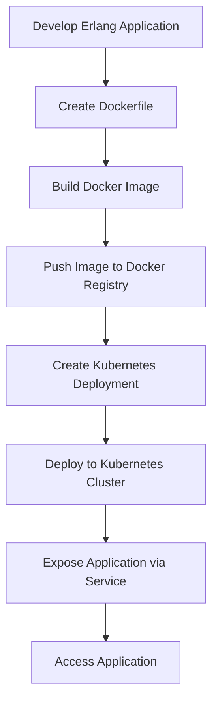

## 21.7 Containerization with Docker and Orchestration with Kubernetes

In today's fast-paced software development environment, containerization has become a cornerstone for deploying applications efficiently and consistently across various environments. This section will guide you through the process of containerizing Erlang applications using Docker and orchestrating them with Kubernetes. We'll explore the benefits of containerization, provide a step-by-step guide to creating Docker images, and discuss best practices for managing dependencies. Additionally, we'll introduce Kubernetes for orchestration and scaling, and provide examples of deploying Erlang containers to Kubernetes clusters. We'll also touch on other orchestration tools like Docker Swarm and Apache Mesos.

### Introduction to Containerization

Containerization is a lightweight form of virtualization that allows developers to package applications and their dependencies into a single, portable unit called a container. Containers are isolated from each other and the host system, ensuring that applications run consistently regardless of the environment.

#### Benefits of Containerization

1. **Portability**: Containers can run on any system that supports the container runtime, making it easy to move applications between development, testing, and production environments.
2. **Consistency**: By packaging all dependencies within the container, developers can ensure that the application behaves the same way in different environments.
3. **Scalability**: Containers can be easily replicated and scaled across multiple nodes, allowing applications to handle increased load.
4. **Resource Efficiency**: Containers share the host system's kernel, making them more lightweight and efficient compared to traditional virtual machines.

### Creating Docker Images for Erlang Applications

Docker is a popular platform for containerization that allows you to build, ship, and run applications in containers. Let's walk through the process of creating a Docker image for an Erlang application.

#### Step-by-Step Guide to Creating a Docker Image

1. **Install Docker**: Ensure Docker is installed on your system. You can download it from the [Docker website](https://www.docker.com/products/docker-desktop).

2. **Create a Dockerfile**: A Dockerfile is a script that contains a series of instructions to build a Docker image. Here's a simple example for an Erlang application:

    ```dockerfile
    # Use the official Erlang image as the base
    FROM erlang:latest

    # Set the working directory
    WORKDIR /app

    # Copy the current directory contents into the container at /app
    COPY . /app

    # Install any needed packages specified in rebar.config
    RUN rebar3 compile

    # Make port 8080 available to the world outside this container
    EXPOSE 8080

    # Run the application
    CMD ["erl", "-pa", "_build/default/lib/*/ebin", "-s", "my_app"]
    ```

3. **Build the Docker Image**: Use the `docker build` command to create the image.

    ```bash
    docker build -t my_erlang_app .
    ```

4. **Run the Docker Container**: Use the `docker run` command to start a container from the image.

    ```bash
    docker run -p 8080:8080 my_erlang_app
    ```

#### Best Practices for Writing Dockerfiles

- **Use Official Base Images**: Start with official Erlang images to ensure compatibility and security.
- **Minimize Layers**: Combine commands to reduce the number of layers in the image, which can improve performance.
- **Cache Dependencies**: Leverage Docker's caching mechanism by placing commands that change less frequently at the top of the Dockerfile.
- **Keep Images Small**: Remove unnecessary files and use multi-stage builds to keep the image size small.
- **Manage Secrets Securely**: Avoid hardcoding secrets in the Dockerfile. Use environment variables or Docker secrets for sensitive information.

### Introduction to Kubernetes

Kubernetes is an open-source platform for automating the deployment, scaling, and management of containerized applications. It provides a robust framework for running distributed systems resiliently.

#### Key Concepts in Kubernetes

- **Pods**: The smallest deployable units in Kubernetes, which can contain one or more containers.
- **Nodes**: Machines (virtual or physical) that run containerized applications.
- **Clusters**: A set of nodes managed by Kubernetes.
- **Services**: Abstractions that define a logical set of pods and a policy to access them.
- **Deployments**: Controllers that manage the deployment and scaling of pods.

### Deploying Erlang Containers to Kubernetes

Let's deploy our Erlang application to a Kubernetes cluster.

#### Step-by-Step Deployment Guide

1. **Install Kubernetes**: Set up a Kubernetes cluster using a tool like [Minikube](https://minikube.sigs.k8s.io/docs/start/) for local development or a cloud provider for production.

2. **Create a Deployment Configuration**: Define a deployment YAML file for the Erlang application.

    ```yaml
    apiVersion: apps/v1
    kind: Deployment
    metadata:
      name: erlang-app
    spec:
      replicas: 3
      selector:
        matchLabels:
          app: erlang-app
      template:
        metadata:
          labels:
            app: erlang-app
        spec:
          containers:
          - name: erlang-app
            image: my_erlang_app
            ports:
            - containerPort: 8080
    ```

3. **Apply the Configuration**: Use `kubectl` to apply the deployment configuration.

    ```bash
    kubectl apply -f deployment.yaml
    ```

4. **Expose the Application**: Create a service to expose the application to external traffic.

    ```yaml
    apiVersion: v1
    kind: Service
    metadata:
      name: erlang-service
    spec:
      type: LoadBalancer
      ports:
      - port: 80
        targetPort: 8080
      selector:
        app: erlang-app
    ```

5. **Access the Application**: Use the external IP provided by the service to access the application.

#### Best Practices for Kubernetes Deployment

- **Use ConfigMaps and Secrets**: Manage configuration and sensitive data using Kubernetes ConfigMaps and Secrets.
- **Implement Health Checks**: Define liveness and readiness probes to ensure the application is running correctly.
- **Monitor Resource Usage**: Set resource requests and limits to optimize resource usage and prevent overconsumption.
- **Automate Scaling**: Use Horizontal Pod Autoscalers to automatically scale the number of pods based on CPU utilization or other metrics.

### Other Orchestration Tools

While Kubernetes is the most popular orchestration tool, there are other options available:

- **Docker Swarm**: A native clustering and orchestration tool for Docker. It is simpler to set up and use compared to Kubernetes but offers fewer features.
- **Apache Mesos**: A distributed systems kernel that abstracts CPU, memory, storage, and other resources, allowing for efficient resource sharing across applications.

### Visualizing Containerization and Orchestration

Below is a diagram illustrating the process of deploying an Erlang application using Docker and Kubernetes.



**Diagram Description**: This flowchart outlines the steps involved in containerizing an Erlang application with Docker and deploying it to a Kubernetes cluster. It starts with developing the application, creating a Dockerfile, building and pushing the Docker image, and finally deploying and exposing the application in Kubernetes.

### Try It Yourself

Experiment with the Dockerfile and Kubernetes deployment configuration provided above. Try modifying the application code, rebuilding the Docker image, and redeploying it to see how changes are reflected. You can also explore adding environment variables, configuring health checks, and setting up autoscaling.

### Knowledge Check

- What are the benefits of containerization?
- How does Kubernetes manage containerized applications?
- What are the key components of a Kubernetes deployment?
- How can you manage configuration and secrets in Kubernetes?

### Summary

In this section, we've explored the process of containerizing Erlang applications using Docker and orchestrating them with Kubernetes. We've covered the benefits of containerization, provided a step-by-step guide to creating Docker images, and discussed best practices for managing dependencies. We've also introduced Kubernetes for orchestration and scaling, and provided examples of deploying Erlang containers to Kubernetes clusters. Remember, this is just the beginning. As you progress, you'll build more complex and scalable applications. Keep experimenting, stay curious, and enjoy the journey!

## Quiz: Containerization with Docker and Orchestration with Kubernetes



### What is the primary benefit of containerization?

- [x] Portability across different environments
- [ ] Increased application size
- [ ] Reduced application performance
- [ ] Dependency on specific hardware

> **Explanation:** Containerization allows applications to run consistently across different environments, making them highly portable.

### Which tool is used to create Docker images?

- [x] Docker
- [ ] Kubernetes
- [ ] Apache Mesos
- [ ] Docker Swarm

> **Explanation:** Docker is the tool used to create and manage Docker images and containers.

### What is the smallest deployable unit in Kubernetes?

- [x] Pod
- [ ] Node
- [ ] Cluster
- [ ] Service

> **Explanation:** In Kubernetes, a pod is the smallest deployable unit that can contain one or more containers.

### How can you expose a Kubernetes application to external traffic?

- [x] By creating a Service
- [ ] By creating a Pod
- [ ] By creating a Deployment
- [ ] By creating a ConfigMap

> **Explanation:** A Service in Kubernetes is used to expose applications to external traffic.

### Which of the following is a Kubernetes orchestration tool?

- [x] Kubernetes
- [ ] Docker
- [x] Apache Mesos
- [ ] Erlang

> **Explanation:** Kubernetes and Apache Mesos are orchestration tools, while Docker is a containerization platform.

### What is a ConfigMap used for in Kubernetes?

- [x] Managing configuration data
- [ ] Storing container images
- [ ] Monitoring resource usage
- [ ] Scaling applications

> **Explanation:** ConfigMaps are used to manage configuration data in Kubernetes.

### What is the purpose of a Dockerfile?

- [x] To define the steps to build a Docker image
- [ ] To run a Docker container
- [ ] To manage Kubernetes clusters
- [ ] To monitor application performance

> **Explanation:** A Dockerfile contains instructions to build a Docker image.

### What is the role of a Kubernetes Deployment?

- [x] To manage the deployment and scaling of pods
- [ ] To expose applications to external traffic
- [ ] To store configuration data
- [ ] To build Docker images

> **Explanation:** A Deployment in Kubernetes manages the deployment and scaling of pods.

### How can you automate scaling in Kubernetes?

- [x] By using Horizontal Pod Autoscalers
- [ ] By using ConfigMaps
- [ ] By using Dockerfiles
- [ ] By using Services

> **Explanation:** Horizontal Pod Autoscalers are used to automate scaling in Kubernetes.

### True or False: Docker Swarm is an orchestration tool for Kubernetes.

- [ ] True
- [x] False

> **Explanation:** Docker Swarm is a native clustering and orchestration tool for Docker, not Kubernetes.


