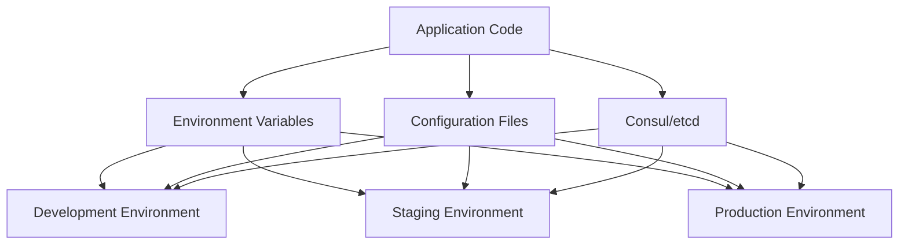

## 21.8 Configuration Management and Environment Variables

In the world of software development, configuration management is a critical aspect of ensuring that applications run smoothly across different environments. It involves managing the settings and parameters that dictate how an application behaves in various contexts, such as development, testing, and production. In this section, we will delve into the role of configuration management in deployment automation, explore methods for externalizing configuration from code, and provide practical examples using environment variables, configuration files, and tools like Consul and etcd. We will also highlight best practices for handling sensitive information and maintaining configuration consistency across environments.

### The Role of Configuration Management in Deployment Automation

Configuration management is the backbone of deployment automation. It ensures that applications are configured correctly and consistently across all environments. This consistency is crucial for avoiding unexpected behavior and ensuring that applications can be deployed and scaled efficiently.

#### Key Benefits of Configuration Management

1. **Consistency Across Environments**: By managing configurations centrally, you ensure that all environments (development, staging, production) are consistent, reducing the risk of environment-specific bugs.

2. **Scalability**: Automated configuration management allows for easy scaling of applications, as new instances can be configured automatically with the correct settings.

3. **Security**: Sensitive information, such as API keys and database credentials, can be managed securely, reducing the risk of exposure.

4. **Flexibility**: Configuration management allows for easy updates and changes to application settings without modifying the codebase.

### Externalizing Configuration from Code

Externalizing configuration refers to the practice of separating configuration data from the application code. This approach offers several advantages, including easier management of configurations, reduced risk of exposing sensitive information, and the ability to change configurations without redeploying the application.

#### Methods for Externalizing Configuration

1. **Environment Variables**: Environment variables are a simple and effective way to manage configuration settings. They are accessible to applications at runtime and can be set differently for each environment.

2. **Configuration Files**: Configuration files, such as `.config` or `.sys` files, provide a structured way to manage configurations. They can be version-controlled and easily updated.

3. **Configuration Management Tools**: Tools like Consul and etcd offer advanced features for managing configurations, such as distributed key-value stores and service discovery.

### Managing Configurations with Environment Variables

Environment variables are a popular choice for managing configurations due to their simplicity and flexibility. They allow you to define settings that can be accessed by your application at runtime, making it easy to change configurations without modifying the code.

#### Example: Using Environment Variables in Erlang

Let's consider a simple example of using environment variables in an Erlang application.

```erlang
-module(config_example).
-export([start/0]).

start() ->
    %% Retrieve environment variables
    DatabaseUrl = os:getenv("DATABASE_URL"),
    ApiKey = os:getenv("API_KEY"),

    %% Use the environment variables in your application
    io:format("Connecting to database at: ~s~n", [DatabaseUrl]),
    io:format("Using API key: ~s~n", [ApiKey]).
```

In this example, we use the `os:getenv/1` function to retrieve the values of the `DATABASE_URL` and `API_KEY` environment variables. These values can then be used within the application to connect to a database or authenticate with an external service.

### Managing Configurations with Configuration Files

Configuration files provide a more structured approach to managing configurations. They can be used to store complex configurations and are often used in conjunction with environment variables.

#### Example: Using Configuration Files in Erlang

Consider the following example of using a configuration file in an Erlang application.

```erlang
-module(config_file_example).
-export([start/0]).

start() ->
    %% Load configuration from file
    {ok, Config} = file:consult("app.config"),

    %% Extract configuration values
    DatabaseUrl = proplists:get_value(database_url, Config),
    ApiKey = proplists:get_value(api_key, Config),

    %% Use the configuration values in your application
    io:format("Connecting to database at: ~s~n", [DatabaseUrl]),
    io:format("Using API key: ~s~n", [ApiKey]).
```

In this example, we use the `file:consult/1` function to read the configuration from a file named `app.config`. The configuration values are then extracted using the `proplists:get_value/2` function.

### Managing Configurations with Consul and etcd

For more advanced configuration management, tools like Consul and etcd provide distributed key-value stores that can be used to manage configurations across multiple instances and environments.

#### Example: Using Consul for Configuration Management

Consul provides a powerful API for managing configurations. Here's a simple example of how you might use Consul in an Erlang application.

```erlang
-module(consul_example).
-export([start/0]).

start() ->
    %% Fetch configuration from Consul
    {ok, DatabaseUrl} = consul:get("config/database_url"),
    {ok, ApiKey} = consul:get("config/api_key"),

    %% Use the configuration values in your application
    io:format("Connecting to database at: ~s~n", [DatabaseUrl]),
    io:format("Using API key: ~s~n", [ApiKey]).
```

In this example, we assume the existence of a `consul` module that provides a `get/1` function for retrieving configuration values from Consul.

### Best Practices for Handling Sensitive Information

When managing configurations, it's important to handle sensitive information, such as passwords and API keys, securely. Here are some best practices to consider:

1. **Use Environment Variables**: Store sensitive information in environment variables rather than in code or configuration files.

2. **Encrypt Sensitive Data**: Use encryption to protect sensitive data stored in configuration files or databases.

3. **Access Control**: Restrict access to configuration management tools and files to authorized personnel only.

4. **Audit and Monitor**: Regularly audit and monitor access to sensitive configurations to detect unauthorized access.

### Maintaining Configuration Consistency Across Environments

Consistency in configuration across different environments is crucial for ensuring that applications behave predictably. Here are some strategies to maintain consistency:

1. **Version Control**: Use version control systems to manage configuration files and track changes.

2. **Automated Deployment**: Use automated deployment tools to ensure that configurations are applied consistently across environments.

3. **Environment-Specific Configurations**: Use environment-specific configuration files or directories to manage settings that differ between environments.

### Visualizing Configuration Management

To better understand the flow of configuration management, let's visualize the process using a Mermaid.js diagram.



**Diagram Description**: This diagram illustrates how application code interacts with different sources of configuration, such as environment variables, configuration files, and tools like Consul or etcd, across various environments.

### Try It Yourself

To solidify your understanding, try modifying the code examples provided in this section. Experiment with different ways of managing configurations, such as using different environment variables or configuration files. Consider setting up a simple Consul or etcd instance to explore their features.

### References and Further Reading

- [Consul Documentation](https://www.consul.io/docs)
- [etcd Documentation](https://etcd.io/docs)
- [Erlang os Module](http://erlang.org/doc/man/os.html)
- [Erlang file Module](http://erlang.org/doc/man/file.html)

### Knowledge Check

Before moving on, take a moment to reflect on what you've learned. Consider the following questions:

- How does configuration management contribute to deployment automation?
- What are the advantages of externalizing configuration from code?
- How can environment variables be used to manage configurations in Erlang?
- What are some best practices for handling sensitive information in configurations?

### Embrace the Journey

Remember, mastering configuration management is a journey. As you continue to explore and experiment with different approaches, you'll gain a deeper understanding of how to manage configurations effectively. Stay curious, keep learning, and enjoy the process!

## Quiz: Configuration Management and Environment Variables



### What is the primary benefit of using environment variables for configuration management?

- [x] They allow for easy changes without modifying the codebase.
- [ ] They are always more secure than configuration files.
- [ ] They are automatically encrypted.
- [ ] They can only be used in production environments.

> **Explanation:** Environment variables allow for easy changes to configuration settings without modifying the codebase, making them flexible and convenient for managing configurations across different environments.

### Which tool provides a distributed key-value store for configuration management?

- [x] Consul
- [ ] Git
- [ ] Docker
- [ ] Jenkins

> **Explanation:** Consul provides a distributed key-value store that can be used for configuration management, service discovery, and more.

### What is a key advantage of externalizing configuration from code?

- [x] It allows for configuration changes without redeploying the application.
- [ ] It makes the codebase larger and more complex.
- [ ] It requires less memory usage.
- [ ] It eliminates the need for version control.

> **Explanation:** Externalizing configuration from code allows for changes to be made to configurations without needing to redeploy the application, providing flexibility and ease of management.

### Which of the following is a best practice for handling sensitive information in configurations?

- [x] Use environment variables to store sensitive information.
- [ ] Store sensitive information directly in the codebase.
- [ ] Share sensitive information via email.
- [ ] Use public repositories for configuration files.

> **Explanation:** Using environment variables to store sensitive information is a best practice as it keeps sensitive data out of the codebase and configuration files, reducing the risk of exposure.

### How can configuration consistency be maintained across different environments?

- [x] Use automated deployment tools.
- [ ] Manually update each environment.
- [ ] Use different configuration files for each environment without version control.
- [ ] Avoid using any configuration management tools.

> **Explanation:** Automated deployment tools help ensure that configurations are applied consistently across different environments, reducing the risk of discrepancies and errors.

### What function is used in Erlang to retrieve environment variables?

- [x] os:getenv/1
- [ ] file:consult/1
- [ ] proplists:get_value/2
- [ ] consul:get/1

> **Explanation:** The `os:getenv/1` function is used in Erlang to retrieve the value of an environment variable.

### Which of the following is a benefit of using configuration files?

- [x] They provide a structured way to manage complex configurations.
- [ ] They are always more secure than environment variables.
- [ ] They cannot be version-controlled.
- [ ] They are only suitable for small applications.

> **Explanation:** Configuration files provide a structured way to manage complex configurations and can be version-controlled, making them suitable for a wide range of applications.

### What is the purpose of using tools like Consul or etcd in configuration management?

- [x] To manage configurations across multiple instances and environments.
- [ ] To replace the need for environment variables.
- [ ] To eliminate the need for configuration files.
- [ ] To increase the complexity of configuration management.

> **Explanation:** Tools like Consul and etcd are used to manage configurations across multiple instances and environments, providing features like distributed key-value stores and service discovery.

### Which of the following is NOT a benefit of configuration management?

- [ ] Consistency across environments
- [ ] Scalability
- [ ] Security
- [x] Increased manual intervention

> **Explanation:** Configuration management reduces the need for manual intervention by automating the management of configurations, ensuring consistency, scalability, and security.

### True or False: Configuration management is only necessary for production environments.

- [ ] True
- [x] False

> **Explanation:** Configuration management is necessary for all environments, including development, testing, and production, to ensure consistency and predictability in application behavior.


