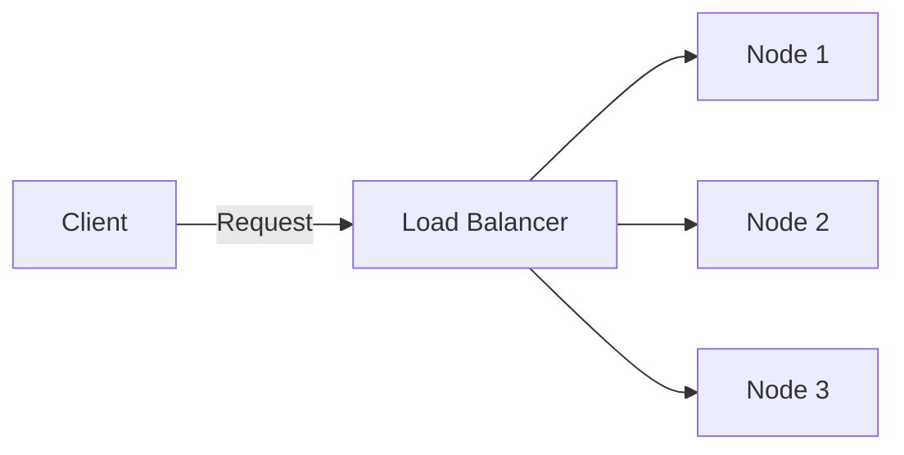
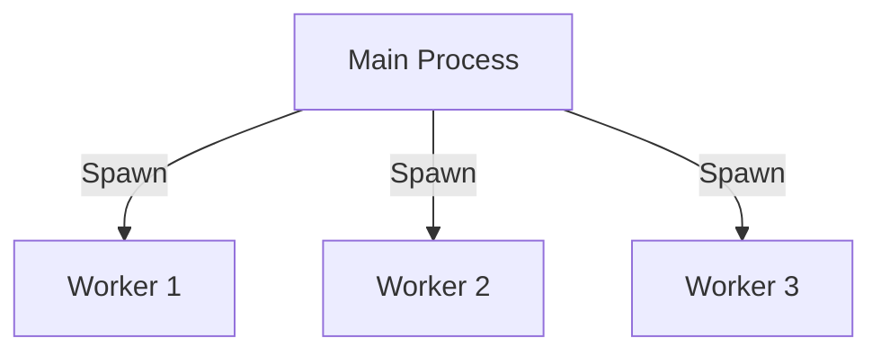

## 21.9 Scaling and Load Balancing

In today's fast-paced digital world, applications must be able to handle varying loads efficiently. This section delves into the concepts of scaling and load balancing in Erlang, providing you with the knowledge to ensure your applications perform optimally under different conditions.

### Introduction to Scaling

Scaling is the process of adjusting the capacity of your application to handle increased loads. There are two primary types of scaling:

- **Vertical Scaling**: Involves adding more resources (CPU, memory) to an existing server. This method is straightforward but has limitations, as there's a maximum capacity a single machine can handle.
- **Horizontal Scaling**: Involves adding more servers to distribute the load. This method is more flexible and can handle larger increases in demand.

### Erlang's Concurrency Model

Erlang's concurrency model is one of its standout features, making it particularly well-suited for building scalable applications. Erlang uses lightweight processes that are managed by the BEAM virtual machine. These processes are isolated, communicate via message passing, and can be distributed across multiple nodes, making Erlang ideal for both vertical and horizontal scaling.

#### Process-Level Concurrency

Erlang's ability to spawn thousands of lightweight processes allows for fine-grained concurrency. Each process can handle a small part of the workload, and since they are isolated, they can run independently without affecting each other. This model is particularly useful for applications that require high availability and fault tolerance.

```erlang
-module(scaling_example).
-export([start/0, worker/0]).

start() ->
    %% Spawning multiple worker processes
    [spawn(?MODULE, worker, []) || _ <- lists:seq(1, 1000)].

worker() ->
    receive
        {work, Task} ->
            %% Process the task
            io:format("Processing ~p~n", [Task]),
            worker();
        stop ->
            %% Terminate the process
            ok
    end.
```

In this example, we spawn 1000 worker processes, each capable of handling tasks independently. This demonstrates how Erlang's concurrency model can be leveraged for scaling.

### Scaling Strategies

#### Adding Nodes to Distributed Systems

Erlang's distributed nature allows you to add nodes to your system seamlessly. This horizontal scaling approach distributes the workload across multiple machines, enhancing both performance and reliability.

```erlang
%% Connect to another Erlang node
net_adm:ping('node@hostname').

%% Example of spawning a process on a remote node
spawn('node@hostname', fun() -> io:format("Hello from remote node!~n") end).
```

By connecting to other nodes, you can distribute processes and tasks across your network, effectively scaling your application horizontally.

### Load Balancing Techniques

Load balancing is crucial for distributing incoming requests across multiple servers to ensure no single server becomes a bottleneck.

#### Using Reverse Proxies

Reverse proxies like Nginx and HAProxy are popular tools for load balancing. They can distribute incoming traffic across multiple backend servers, providing a single point of entry for clients.

- **Nginx**: Known for its high performance and low resource consumption, Nginx can efficiently balance loads across multiple Erlang nodes.
- **HAProxy**: Offers advanced load balancing capabilities and is highly configurable, making it suitable for complex setups.

#### Erlang's Built-in Load Balancing Mechanisms

Erlang provides built-in mechanisms for load balancing, particularly through its distributed process management. The `pg2` module, for instance, allows you to create process groups and distribute work among them.

```erlang
%% Create a process group
pg2:create(my_group).

%% Join a process to the group
pg2:join(my_group, self()).

%% Send a message to a random process in the group
pg2:get_closest_pid(my_group) ! {work, Task}.
```

This code snippet demonstrates how to use the `pg2` module to distribute tasks among a group of processes, effectively balancing the load.

### Auto-Scaling in Cloud Environments

Auto-scaling is a feature offered by many cloud providers that automatically adjusts the number of active servers based on current demand. This ensures that your application can handle spikes in traffic without manual intervention.

- **AWS Auto Scaling**: Automatically adjusts the number of EC2 instances based on predefined conditions.
- **Google Cloud's Autoscaler**: Scales the number of VM instances in response to load metrics.
- **Azure Autoscale**: Provides automatic scaling for Azure services based on metrics and schedules.

By integrating Erlang applications with these cloud services, you can achieve a highly scalable and resilient system.

### Visualizing Scaling and Load Balancing

To better understand the concepts of scaling and load balancing, let's visualize them using Mermaid.js diagrams.

#### Horizontal Scaling with Multiple Nodes



**Figure 1**: This diagram illustrates horizontal scaling, where a load balancer distributes requests across multiple nodes.

#### Process-Level Concurrency



**Figure 2**: This diagram shows process-level concurrency in Erlang, with a main process spawning multiple worker processes.

### Key Takeaways

- **Vertical vs. Horizontal Scaling**: Understand the differences and when to use each.
- **Erlang's Concurrency Model**: Leverage lightweight processes for scalable applications.
- **Load Balancing**: Use reverse proxies and Erlang's built-in mechanisms to distribute load.
- **Auto-Scaling**: Integrate with cloud services for dynamic scaling.

### Embrace the Journey

Scaling and load balancing are critical components of building robust applications. As you continue to explore these concepts, remember that Erlang's unique features offer powerful tools for creating scalable and resilient systems. Keep experimenting, stay curious, and enjoy the journey!

## Quiz: Scaling and Load Balancing



### What is vertical scaling?

- [x] Adding more resources to an existing server
- [ ] Adding more servers to distribute the load
- [ ] Using reverse proxies for load balancing
- [ ] Implementing auto-scaling in cloud environments

> **Explanation:** Vertical scaling involves adding more resources (CPU, memory) to an existing server to handle increased loads.

### How does Erlang's concurrency model aid in scaling?

- [x] By using lightweight processes that can be distributed across nodes
- [ ] By requiring more hardware resources
- [ ] By using shared memory for communication
- [ ] By limiting the number of processes

> **Explanation:** Erlang's concurrency model uses lightweight processes that can be distributed across nodes, making it ideal for scaling applications.

### What is horizontal scaling?

- [ ] Adding more resources to an existing server
- [x] Adding more servers to distribute the load
- [ ] Using reverse proxies for load balancing
- [ ] Implementing auto-scaling in cloud environments

> **Explanation:** Horizontal scaling involves adding more servers to distribute the load, enhancing performance and reliability.

### Which tool is known for high performance and low resource consumption in load balancing?

- [x] Nginx
- [ ] HAProxy
- [ ] AWS Auto Scaling
- [ ] Google Cloud's Autoscaler

> **Explanation:** Nginx is known for its high performance and low resource consumption, making it an excellent choice for load balancing.

### What does the `pg2` module in Erlang provide?

- [x] Process group management for load balancing
- [ ] Auto-scaling capabilities
- [ ] Vertical scaling solutions
- [ ] Cloud integration features

> **Explanation:** The `pg2` module in Erlang provides process group management, which can be used for load balancing tasks among processes.

### What is the primary benefit of auto-scaling in cloud environments?

- [x] Automatically adjusts the number of servers based on demand
- [ ] Requires manual intervention for scaling
- [ ] Limits the number of processes
- [ ] Uses shared memory for communication

> **Explanation:** Auto-scaling automatically adjusts the number of servers based on demand, ensuring optimal performance without manual intervention.

### Which cloud service offers auto-scaling for EC2 instances?

- [x] AWS Auto Scaling
- [ ] Google Cloud's Autoscaler
- [ ] Azure Autoscale
- [ ] Nginx

> **Explanation:** AWS Auto Scaling offers auto-scaling for EC2 instances, adjusting the number of instances based on predefined conditions.

### What is the role of a load balancer in horizontal scaling?

- [x] Distributes incoming requests across multiple servers
- [ ] Adds more resources to an existing server
- [ ] Implements auto-scaling in cloud environments
- [ ] Manages process groups for load balancing

> **Explanation:** In horizontal scaling, a load balancer distributes incoming requests across multiple servers to ensure no single server becomes a bottleneck.

### Which of the following is a built-in Erlang mechanism for load balancing?

- [x] `pg2` module
- [ ] Nginx
- [ ] HAProxy
- [ ] AWS Auto Scaling

> **Explanation:** The `pg2` module is a built-in Erlang mechanism for load balancing, allowing for process group management.

### True or False: Horizontal scaling is more flexible than vertical scaling.

- [x] True
- [ ] False

> **Explanation:** Horizontal scaling is more flexible than vertical scaling because it involves adding more servers, which can handle larger increases in demand.


