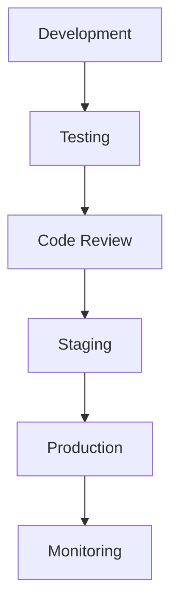

## 22.1 Preparing Applications for Production

Preparing Erlang applications for production is a critical phase in the software development lifecycle. This process ensures that applications are stable, secure, and performant, ready to handle real-world demands. In this section, we will explore the essential steps and best practices for deploying Erlang applications to production environments.

### Code Optimization and Performance Tuning

Optimizing code and tuning performance are vital to ensure your application runs efficiently in production. Here are some key strategies:

#### Profiling and Identifying Bottlenecks

Begin by profiling your application to identify performance bottlenecks. Use Erlang's built-in tools like `fprof`, `eprof`, and `percept` to analyze function call times and memory usage.

```erlang
% Example of using fprof for profiling
fprof:apply(Mod, Fun, Args).
fprof:analyse().
```

#### Optimizing Data Structures

Choose the right data structures for your application. Lists, tuples, and maps each have their strengths and weaknesses. For instance, use lists for sequential data and maps for key-value storage.

#### Efficient Pattern Matching

Pattern matching is a powerful feature in Erlang, but it can be a source of inefficiency if not used correctly. Ensure that pattern matching is done on the most specific patterns first to reduce unnecessary checks.

```erlang
% Example of efficient pattern matching
handle_message({ok, Data}) -> process_data(Data);
handle_message({error, Reason}) -> handle_error(Reason).
```

#### Tail Call Optimization

Leverage tail call optimization in recursive functions to prevent stack overflow and improve performance.

```erlang
% Example of tail call optimization
factorial(N) -> factorial(N, 1).

factorial(0, Acc) -> Acc;
factorial(N, Acc) -> factorial(N - 1, N * Acc).
```

### Thorough Testing Before Production

Testing is crucial to ensure that your application behaves as expected in production. Here are some testing strategies:

#### Unit and Integration Testing

Use EUnit for unit testing and Common Test for integration testing. Ensure that all critical paths in your application are covered by tests.

```erlang
% Example of a simple EUnit test
my_function_test_() ->
    ?assertEqual(Expected, my_module:my_function(Input)).
```

#### Property-Based Testing

Employ property-based testing with tools like PropEr or QuviQ QuickCheck to test the properties of your functions over a wide range of inputs.

#### Load and Stress Testing

Simulate real-world usage scenarios with load testing tools like Tsung to ensure your application can handle expected traffic levels.

### Security Hardening

Security is paramount in production environments. Follow these guidelines to harden your Erlang application:

#### Secure Coding Practices

Adopt secure coding practices to prevent vulnerabilities. Validate all inputs and sanitize outputs to protect against injection attacks.

#### Authentication and Authorization

Implement robust authentication and authorization mechanisms. Use Erlang's `ssl` module for secure communication and the `crypto` module for encryption.

```erlang
% Example of using the ssl module for secure communication
{ok, Socket} = ssl:connect("example.com", 443, []).
```

#### Regular Security Audits

Conduct regular security audits and penetration testing to identify and fix vulnerabilities.

### Dependency Management and Version Locking

Managing dependencies and ensuring version consistency is crucial for production stability.

#### Using Rebar3 for Dependency Management

Rebar3 is the standard build tool for Erlang. Use it to manage dependencies and ensure that all dependencies are locked to specific versions.

```erlang
% Example of a rebar.config file
{deps, [
    {cowboy, "2.8.0"},
    {jsx, "2.9.0"}
]}.
```

#### Version Locking

Lock dependency versions in your `rebar.lock` file to prevent unexpected changes when dependencies are updated.

### Code Review and Documentation

Code review and documentation are essential practices for maintaining code quality and ensuring knowledge sharing.

#### Conducting Code Reviews

Implement a code review process to catch potential issues early and ensure code quality. Use tools like GitHub or GitLab for collaborative reviews.

#### Comprehensive Documentation

Document your code and architecture thoroughly. Use EDoc for generating documentation from your code comments.

```erlang
% Example of EDoc comments
%% @doc
%% This function calculates the factorial of a number.
-spec factorial(integer()) -> integer().
```

### Try It Yourself

To solidify your understanding, try modifying the provided code examples. For instance, experiment with different data structures or implement additional security measures using the `crypto` module.

### Visualizing the Deployment Process

Below is a diagram illustrating the typical deployment process for an Erlang application:



**Diagram Description:** This flowchart represents the stages of deploying an Erlang application, from development through to production and monitoring.

### References and Further Reading

- [Erlang Efficiency Guide](https://erlang.org/doc/efficiency_guide/introduction.html)
- [Erlang Security Guide](https://erlang.org/doc/security_guide/introduction.html)
- [Rebar3 Documentation](https://rebar3.org/docs)

### Knowledge Check

- What are the benefits of using tail call optimization in Erlang?
- How can you ensure secure communication in an Erlang application?
- Why is it important to lock dependency versions in production?

### Embrace the Journey

Remember, preparing applications for production is just the beginning. As you continue to develop and deploy Erlang applications, you'll refine your skills and build more robust systems. Keep experimenting, stay curious, and enjoy the journey!

## Quiz: Preparing Applications for Production



### What is the primary purpose of profiling an Erlang application before production?

- [x] To identify performance bottlenecks
- [ ] To add new features
- [ ] To increase code complexity
- [ ] To reduce code readability

> **Explanation:** Profiling helps identify areas where the application may be inefficient, allowing developers to optimize performance.

### Which Erlang tool is commonly used for dependency management?

- [x] Rebar3
- [ ] Dialyzer
- [ ] EDoc
- [ ] Tsung

> **Explanation:** Rebar3 is the standard tool for managing dependencies and building Erlang projects.

### What is a key benefit of using tail call optimization in Erlang?

- [x] It prevents stack overflow in recursive functions
- [ ] It increases code readability
- [ ] It simplifies error handling
- [ ] It enhances security

> **Explanation:** Tail call optimization allows recursive functions to execute without growing the call stack, preventing stack overflow.

### Why is it important to conduct code reviews before deploying to production?

- [x] To catch potential issues early and ensure code quality
- [ ] To increase the number of lines of code
- [ ] To delay the deployment process
- [ ] To reduce team collaboration

> **Explanation:** Code reviews help identify bugs and improve code quality through collaborative feedback.

### What is the purpose of locking dependency versions in production?

- [x] To prevent unexpected changes when dependencies are updated
- [ ] To increase the number of dependencies
- [ ] To simplify the codebase
- [ ] To enhance security

> **Explanation:** Locking versions ensures that the same versions of dependencies are used across different environments, reducing the risk of unexpected behavior.

### Which module is used for secure communication in Erlang?

- [x] ssl
- [ ] crypto
- [ ] lists
- [ ] ets

> **Explanation:** The `ssl` module is used for establishing secure communication channels in Erlang applications.

### What is the role of EDoc in Erlang development?

- [x] To generate documentation from code comments
- [ ] To manage dependencies
- [ ] To perform load testing
- [ ] To optimize performance

> **Explanation:** EDoc is a tool for generating documentation from annotated Erlang source code.

### Why is load testing important before deploying an application to production?

- [x] To ensure the application can handle expected traffic levels
- [ ] To increase the number of users
- [ ] To simplify the codebase
- [ ] To enhance security

> **Explanation:** Load testing simulates real-world usage to verify that the application can handle the expected load without performance degradation.

### What is a common practice for ensuring secure coding in Erlang?

- [x] Validating all inputs and sanitizing outputs
- [ ] Increasing code complexity
- [ ] Reducing the number of tests
- [ ] Ignoring security audits

> **Explanation:** Validating inputs and sanitizing outputs help prevent vulnerabilities such as injection attacks.

### True or False: Regular security audits are unnecessary if the application is already in production.

- [ ] True
- [x] False

> **Explanation:** Regular security audits are essential to identify and fix vulnerabilities, even after the application is in production.


