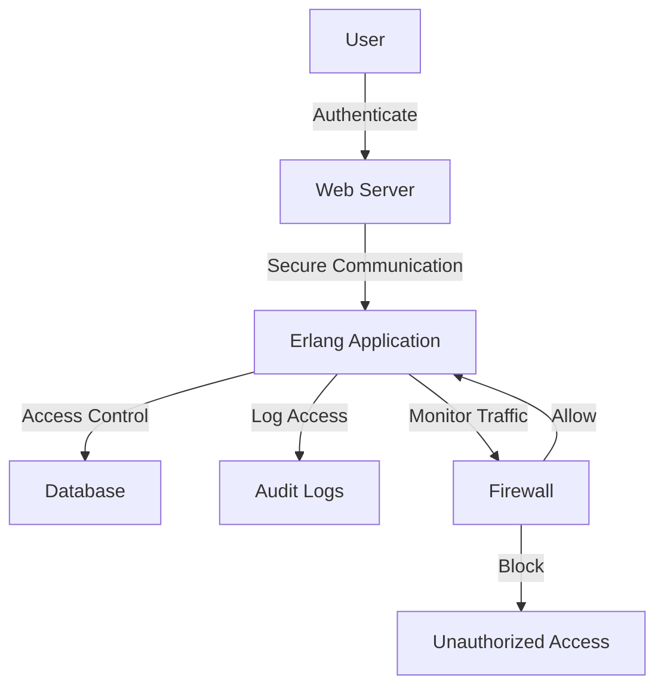

## 22.10 Security Considerations in Production Deployment

Deploying Erlang applications to production environments requires meticulous attention to security. This section provides a comprehensive guide to securing your Erlang applications, focusing on the runtime environment, secure communication, user authentication, system updates, and security audits.

### Securing the Runtime Environment

Securing the runtime environment is the first step in protecting your Erlang applications. This involves hardening the operating system, configuring firewalls, and ensuring that only necessary services are running.

#### OS Hardening

Operating system hardening involves configuring the OS to minimize vulnerabilities. Here are some key practices:

- **Disable Unnecessary Services**: Only enable services that are essential for your application. This reduces the attack surface.
- **Apply Security Patches**: Regularly update the OS with the latest security patches to protect against known vulnerabilities.
- **Configure User Permissions**: Use the principle of least privilege to ensure users have only the permissions they need.
- **Use SELinux or AppArmor**: Implement security modules like SELinux or AppArmor to enforce security policies.

#### Firewall Configuration

Firewalls are crucial for controlling incoming and outgoing network traffic. Here’s how to configure them effectively:

- **Define Rules**: Set up rules to allow only necessary traffic to and from your application.
- **Use Stateful Inspection**: Implement stateful inspection to track active connections and ensure that only legitimate traffic is allowed.
- **Log Traffic**: Enable logging to monitor traffic patterns and detect suspicious activity.

### Secure Communication

Secure communication is vital to protect data in transit. Implementing SSL/TLS ensures that data exchanged between clients and servers is encrypted.

#### SSL/TLS Implementation

SSL/TLS provides a secure channel for communication. Here’s how to implement it:

- **Obtain Certificates**: Acquire SSL/TLS certificates from a trusted Certificate Authority (CA).
- **Configure Erlang Applications**: Use Erlang’s `ssl` module to configure SSL/TLS in your applications. Here’s a basic example:

```erlang
% Start SSL application
ssl:start().

% Configure SSL options
Options = [
    {certfile, "path/to/cert.pem"},
    {keyfile, "path/to/key.pem"},
    {cacertfile, "path/to/ca.pem"},
    {verify, verify_peer},
    {fail_if_no_peer_cert, true}
].

% Start SSL listener
{ok, ListenSocket} = ssl:listen(Port, Options).
```

- **Enforce Strong Cipher Suites**: Configure your server to use strong cipher suites and disable weak ones.
- **Enable Perfect Forward Secrecy**: Use cipher suites that support Perfect Forward Secrecy (PFS) to protect past sessions from future compromises.

### User Authentication and Authorization

Proper user authentication and authorization are essential to ensure that only authorized users can access your application.

#### Authentication Strategies

- **Use Strong Password Policies**: Enforce strong password policies, including complexity requirements and expiration periods.
- **Implement Multi-Factor Authentication (MFA)**: Require users to provide additional verification factors beyond just a password.
- **Use OAuth or OpenID Connect**: Implement OAuth or OpenID Connect for secure and standardized authentication.

#### Authorization Best Practices

- **Role-Based Access Control (RBAC)**: Implement RBAC to manage user permissions based on roles.
- **Regularly Review Permissions**: Periodically review user permissions to ensure they are still appropriate.
- **Audit Access Logs**: Monitor and audit access logs to detect unauthorized access attempts.

### System Updates and Patching

Regularly updating and patching systems is crucial to protect against vulnerabilities.

#### Update Strategies

- **Automate Updates**: Use automation tools to regularly apply updates and patches.
- **Test Updates**: Test updates in a staging environment before applying them to production.
- **Monitor for Vulnerabilities**: Stay informed about new vulnerabilities and apply patches promptly.

### Security Audits and Vulnerability Assessments

Conducting regular security audits and vulnerability assessments helps identify and mitigate potential security risks.

#### Security Audits

- **Conduct Regular Audits**: Perform regular security audits to evaluate the effectiveness of your security measures.
- **Use Automated Tools**: Use automated tools to scan for vulnerabilities and misconfigurations.
- **Engage Third-Party Auditors**: Consider hiring third-party auditors for an unbiased assessment.

#### Vulnerability Assessments

- **Perform Penetration Testing**: Conduct penetration testing to simulate attacks and identify weaknesses.
- **Analyze Results**: Analyze the results of vulnerability assessments and prioritize remediation efforts.
- **Implement Continuous Monitoring**: Use continuous monitoring tools to detect and respond to threats in real-time.

### Visualizing Security Architecture

To better understand the security architecture of your Erlang application, consider the following diagram:



**Diagram Description**: This diagram illustrates the flow of secure communication and access control in an Erlang application. Users authenticate with the web server, which communicates securely with the Erlang application. The application enforces access control and logs access, while the firewall monitors traffic to block unauthorized access.

### Knowledge Check

- **Question**: What is the primary purpose of OS hardening?
  - **Answer**: To minimize vulnerabilities by configuring the operating system securely.

- **Question**: Why is SSL/TLS important for secure communication?
  - **Answer**: It encrypts data in transit, protecting it from interception.

- **Question**: What is the benefit of using Role-Based Access Control (RBAC)?
  - **Answer**: It simplifies permission management by assigning permissions based on roles.

### Summary

In this section, we explored essential security considerations for deploying Erlang applications in production environments. We discussed securing the runtime environment, implementing secure communication, managing user authentication and authorization, keeping systems updated, and conducting security audits. By following these guidelines, you can enhance the security of your Erlang applications and protect them from potential threats.

### Embrace the Journey

Remember, security is an ongoing process. As you deploy your Erlang applications, continue to refine your security practices, stay informed about new threats, and adapt to evolving security challenges. Keep experimenting, stay curious, and enjoy the journey of building secure and robust applications!

## Quiz: Security Considerations in Production Deployment



### What is the primary purpose of OS hardening?

- [x] To minimize vulnerabilities by configuring the operating system securely.
- [ ] To increase the speed of the operating system.
- [ ] To add more features to the operating system.
- [ ] To make the operating system more user-friendly.

> **Explanation:** OS hardening involves configuring the operating system to minimize vulnerabilities and enhance security.

### Why is SSL/TLS important for secure communication?

- [x] It encrypts data in transit, protecting it from interception.
- [ ] It speeds up data transmission.
- [ ] It compresses data to save bandwidth.
- [ ] It allows data to be sent in plain text.

> **Explanation:** SSL/TLS encrypts data in transit, ensuring that it cannot be intercepted or tampered with.

### What is the benefit of using Role-Based Access Control (RBAC)?

- [x] It simplifies permission management by assigning permissions based on roles.
- [ ] It allows users to access all resources without restrictions.
- [ ] It eliminates the need for authentication.
- [ ] It provides a single password for all users.

> **Explanation:** RBAC simplifies permission management by assigning permissions based on user roles, enhancing security and manageability.

### How can firewalls enhance security in production environments?

- [x] By controlling incoming and outgoing network traffic.
- [ ] By increasing the speed of network connections.
- [ ] By providing free internet access.
- [ ] By storing user passwords.

> **Explanation:** Firewalls enhance security by controlling network traffic, allowing only legitimate connections.

### What is the role of penetration testing in security?

- [x] To simulate attacks and identify weaknesses.
- [ ] To increase the speed of the application.
- [ ] To add new features to the application.
- [ ] To make the application more user-friendly.

> **Explanation:** Penetration testing involves simulating attacks to identify and address security weaknesses.

### Why is it important to regularly update and patch systems?

- [x] To protect against known vulnerabilities.
- [ ] To increase the speed of the system.
- [ ] To add new features to the system.
- [ ] To make the system more user-friendly.

> **Explanation:** Regular updates and patches protect systems from known vulnerabilities and enhance security.

### What is the purpose of using automated tools in security audits?

- [x] To scan for vulnerabilities and misconfigurations.
- [ ] To increase the speed of the audit process.
- [ ] To add new features to the application.
- [ ] To make the application more user-friendly.

> **Explanation:** Automated tools help identify vulnerabilities and misconfigurations, making security audits more effective.

### How does Perfect Forward Secrecy (PFS) enhance security?

- [x] By ensuring past sessions remain secure even if the private key is compromised.
- [ ] By increasing the speed of data transmission.
- [ ] By compressing data to save bandwidth.
- [ ] By allowing data to be sent in plain text.

> **Explanation:** PFS ensures that past sessions remain secure, even if the private key is compromised, by using unique session keys.

### What is the significance of monitoring access logs?

- [x] To detect unauthorized access attempts.
- [ ] To increase the speed of the application.
- [ ] To add new features to the application.
- [ ] To make the application more user-friendly.

> **Explanation:** Monitoring access logs helps detect unauthorized access attempts and enhances security.

### True or False: Security is a one-time process that does not require ongoing attention.

- [ ] True
- [x] False

> **Explanation:** Security is an ongoing process that requires continuous attention and adaptation to new threats.




